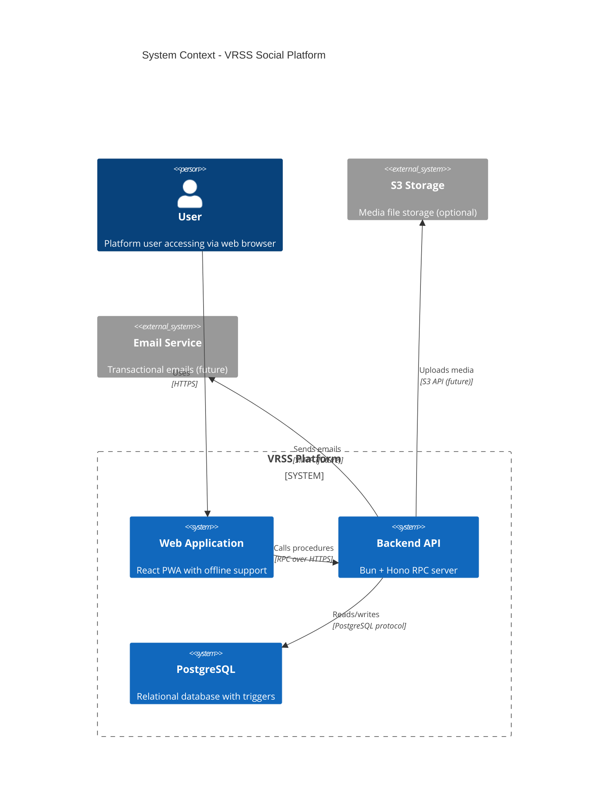
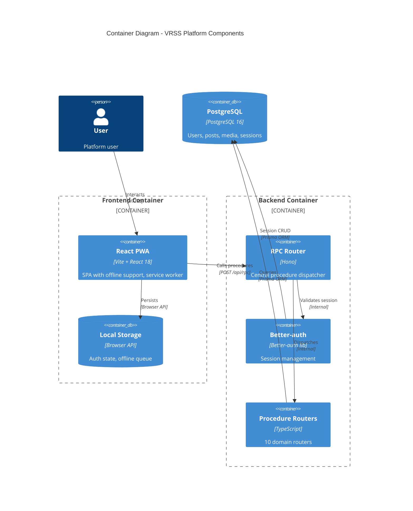
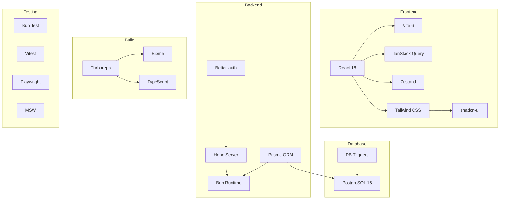
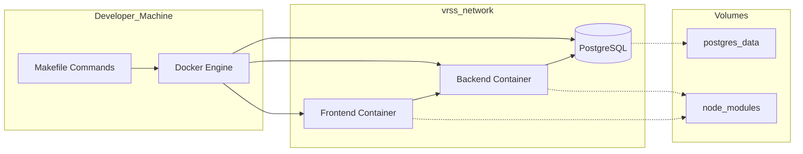
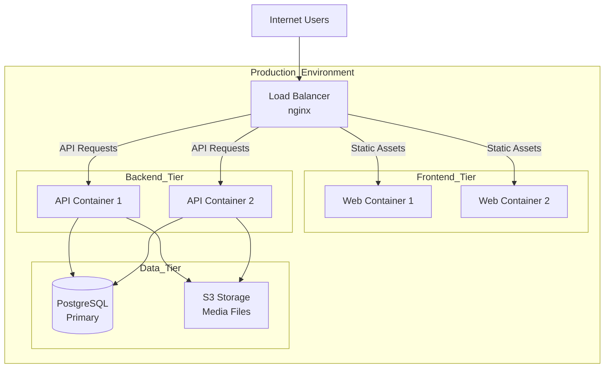

# VRSS Platform Architecture

**Last Updated**: 2025-10-21
**Status**: Phase 4 Complete, Phase 5 Next
**Target Audience**: New developers, architects, technical leads

---

## Table of Contents

- [Overview](#overview)
- [System Context](#system-context)
- [Container Architecture](#container-architecture)
- [Monorepo Structure](#monorepo-structure)
- [Technology Stack Summary](#technology-stack-summary)
- [Development Environment](#development-environment)
- [RPC Architecture](#rpc-architecture)
- [Key Architectural Decisions](#key-architectural-decisions)
- [Deployment View](#deployment-view)
- [References](#references)

---

## Overview

VRSS (Virtual Reality Social System) is a modern social media platform built as a Progressive Web Application (PWA). The platform emphasizes customizable profiles, algorithmic feeds, and user-centric content control.

**Architecture Philosophy**:
- Monorepo for unified development experience
- RPC-style API for simplified client-server communication
- Docker-first development for consistency
- Type-safe end-to-end with TypeScript
- Database-driven design with PostgreSQL triggers
- Session-based authentication with Better-auth

**Current Phase**: Phase 4 (Authentication UI) completed. All 928 tests passing (595 backend, 333 frontend).

---

## System Context



**Key External Dependencies**:
- **Browser**: Modern browsers with PWA support (Chrome, Firefox, Safari, Edge)
- **PostgreSQL 16**: Primary data store with advanced features (triggers, JSONB)
- **S3-Compatible Storage**: Optional for production media storage
- **Email Service**: Future feature for notifications and verification

---

## Container Architecture



**Container Responsibilities**:

| Container | Technology | Purpose | Port |
|-----------|-----------|---------|------|
| Frontend (PWA) | React + Vite | User interface, offline support, caching | 5050 |
| Backend (API) | Bun + Hono | Business logic, RPC routing, validation | 3030 |
| Database | PostgreSQL 16 | Persistent storage, triggers, constraints | 5432 |

---

## Monorepo Structure

VRSS uses a Turborepo-based monorepo with workspace packages managed by Bun.

```
vrss/
├── apps/
│   ├── api/                    # Backend API (Bun + Hono + Prisma)
│   │   ├── src/
│   │   │   ├── index.ts        # Server entry point
│   │   │   ├── rpc/            # RPC router and procedure handlers
│   │   │   ├── lib/            # Shared utilities (auth, db, storage)
│   │   │   └── middleware/     # Request middleware (auth, cors)
│   │   ├── prisma/
│   │   │   ├── schema.prisma   # Database schema (28 models)
│   │   │   ├── migrations/     # Database migrations (versioned)
│   │   │   └── seed.ts         # Test data seeding
│   │   └── package.json
│   │
│   └── web/                    # Frontend PWA (React + Vite)
│       ├── src/
│       │   ├── features/       # Feature-based modules (auth, etc.)
│       │   ├── lib/            # Shared libraries (api, store, ui)
│       │   ├── components/     # Shared UI components (shadcn-ui)
│       │   └── main.tsx        # App entry point
│       └── package.json
│
├── packages/
│   ├── api-contracts/          # Shared types between API and Web
│   ├── typescript-config/      # Shared TypeScript configurations
│   └── eslint-config/          # Shared ESLint rules (deprecated)
│
├── e2e/                        # Playwright E2E tests (disabled in CI)
├── docs/                       # Documentation (this file)
├── docker-compose.yml          # Development environment
├── Makefile                    # Developer workflow commands
├── turbo.json                  # Turborepo configuration
└── package.json                # Root workspace configuration
```

**Workspace Organization**:
- **apps/**: Deployable applications (API server, Web app)
- **packages/**: Shared libraries consumed by apps
- **e2e/**: End-to-end tests covering full user flows

**Key Files**:
- `turbo.json`: Build pipeline configuration (dependencies, caching)
- `biome.json`: Linting and formatting rules
- `docker-compose.yml`: Local development services
- `Makefile`: Unified command interface

---

## Technology Stack Summary

**See [TECH_STACK.md](./TECH_STACK.md) for detailed rationale.**



**Layer Breakdown**:
- **Runtime**: Bun (backend), Modern browsers (frontend)
- **Frameworks**: Hono (API), React (UI), Vite (build)
- **Data Layer**: Prisma ORM, PostgreSQL 16, Better-auth
- **State Management**: Zustand (client state), TanStack Query (server state)
- **Styling**: Tailwind CSS, shadcn-ui components
- **Build System**: Turborepo (orchestration), Biome (lint/format)
- **Testing**: Bun test (backend), Vitest (frontend), Playwright (E2E)

---

## Development Environment

VRSS supports two development modes: **Docker** (recommended) and **Local**.

### Docker Development (Recommended)



**Workflow**:
```
make start      → Start all containers
make logs       → View combined logs
make test       → Run all tests in containers
make db-migrate → Run database migrations
make stop       → Stop all containers
```

**Benefits**:
- Consistent environment across team
- No local dependency management
- Isolated database and services
- Hot reload for API and Web

### Local Development

**Prerequisites**:
- Bun >= 1.0.0
- PostgreSQL 16
- Node.js >= 20 (for tooling)

**Workflow**:
```
bun install              → Install dependencies
bun run build            → Build all packages
bun run dev              → Start dev servers (parallel)
bun run test             → Run all tests
```

**See [INFRASTRUCTURE.md](./INFRASTRUCTURE.md) for detailed setup.**

---

## RPC Architecture

VRSS uses an RPC (Remote Procedure Call) pattern instead of traditional REST for API communication.

### Why RPC Over REST?

| Aspect | RPC | REST |
|--------|-----|------|
| Endpoints | Single endpoint (`POST /api/rpc`) | Multiple endpoints (`GET /users/:id`, `POST /posts`, etc.) |
| Discoverability | Procedure registry | Resource-based URLs |
| Versioning | Procedure names (`user.getProfile.v2`) | URL paths (`/v2/users`) |
| Client Complexity | Simple (one fetch function) | Complex (many fetch functions) |
| Type Safety | Full end-to-end types | Partial (per endpoint) |
| Code Generation | Single RPC client | Multiple endpoint clients |

**Design Decision**: RPC simplifies client-server communication for internal use cases where discoverability is not needed (no public API consumers).

### RPC Request Format

All API calls use `POST /api/rpc` with this envelope:

```typescript
// Request format
{
  procedure: string      // e.g., "auth.login", "post.create"
  input: object          // Procedure-specific input (validated with Zod)
  context?: {            // Optional request context
    correlationId?: string
  }
}

// Success response
{
  success: true
  data: object           // Procedure-specific output
  metadata: {
    timestamp: number
    requestId: string
  }
}

// Error response
{
  success: false
  error: {
    code: number         // Error code (1000-1999 range)
    message: string
    details?: object
  }
  metadata: {
    timestamp: number
    requestId: string
  }
}
```

### Procedure Organization

Procedures are organized into 10 domain routers:

| Router | Procedures | Examples |
|--------|-----------|----------|
| auth | 6 | `auth.register`, `auth.login`, `auth.logout` |
| user | 8 | `user.getProfile`, `user.updateProfile`, `user.getSettings` |
| post | 12 | `post.create`, `post.getById`, `post.delete` |
| social | 6 | `social.follow`, `social.unfollow`, `social.getFriends` |
| feed | 4 | `feed.getHome`, `feed.getDiscover`, `feed.getCustom` |
| media | 5 | `media.upload`, `media.delete`, `media.getUrl` |
| message | 7 | `message.send`, `message.getConversation`, `message.markRead` |
| notification | 5 | `notification.getAll`, `notification.markRead`, `notification.subscribe` |
| discovery | 4 | `discovery.searchUsers`, `discovery.searchPosts`, `discovery.getTrending` |
| settings | 6 | `settings.updatePrivacy`, `settings.updatePreferences`, `settings.getAll` |

**Total**: ~63 procedures across 10 routers

### Authentication & Authorization

**Public Procedures** (no auth required):
- `auth.*` (all auth procedures)
- `user.getProfile` (view public profiles)
- `post.getById` (view public posts)
- `discovery.searchUsers`, `discovery.searchPosts` (public search)

**Protected Procedures** (auth required):
- All other procedures require valid session

**Auth Flow**:
1. Request arrives at RPC router
2. `authMiddleware` validates session cookie (Better-auth)
3. User and session attached to context
4. Procedure checks if public or requires auth
5. If protected and no session → 401 Unauthorized

**See [AUTHENTICATION.md](./AUTHENTICATION.md) for details.**

### Error Codes

Standardized error codes in 1000-1999 range:

| Range | Category | HTTP Status |
|-------|----------|-------------|
| 1000-1099 | Authentication errors | 401 |
| 1100-1199 | Authorization errors | 403 |
| 1200-1299 | Validation errors | 400 |
| 1300-1399 | Not found errors | 404 |
| 1400-1499 | Conflict errors | 409 |
| 1500-1599 | Rate limiting | 429 |
| 1600-1699 | Storage errors | 400 |
| 1900-1999 | Server errors | 500 |

**See [API.md](./API.md) for complete error code reference.**

---

## Key Architectural Decisions

### ADR-001: Monorepo with Turborepo

**Decision**: Use monorepo structure with Turborepo for build orchestration.

**Rationale**:
- Shared types between API and Web via `@vrss/api-contracts`
- Atomic commits across API and Web changes
- Unified linting, formatting, and type checking
- Faster CI with Turborepo caching

**Trade-offs**:
- Larger repository size
- More complex initial setup
- Requires understanding of workspace dependencies

---

### ADR-002: RPC Pattern Over REST

**Decision**: Use RPC-style API with single endpoint (`POST /api/rpc`).

**Rationale**:
- Simpler client code (one fetch function)
- Better type safety with shared contracts
- Easier versioning (procedure names)
- No public API consumers (internal only)

**Trade-offs**:
- Not RESTful (less discoverable)
- Requires custom documentation
- Non-standard for external integrations

---

### ADR-003: Better-auth for Authentication

**Decision**: Use Better-auth library instead of custom JWT auth.

**Rationale**:
- Battle-tested session management
- Built-in username plugin (primary identifier)
- Secure cookie handling (httpOnly, sameSite)
- Database-backed sessions (no JWT vulnerabilities)
- Email verification support (disabled for MVP)

**Trade-offs**:
- Additional database tables (Account, Session, VerificationToken)
- Learning curve for Better-auth patterns
- Less control over auth flow

**Migration**: Migrated from custom auth in Phase 2 (commits c3fbfad, 2090aa3).

---

### ADR-004: Username as Primary Identifier

**Decision**: Use username (not email) as primary identifier for users.

**Rationale**:
- Social media conventions (Twitter, Instagram)
- Better UX for @mentions and profiles
- Email used for authentication only
- Username is case-insensitive for lookups, case-preserving for display

**Implementation**:
- `User.username` is unique, indexed, case-insensitive
- `User.displayUsername` stores original casing
- Better-auth username plugin (3-30 chars, alphanumeric + underscore)

---

### ADR-005: Docker-First Development

**Decision**: Primary development workflow uses Docker with Makefile orchestration.

**Rationale**:
- Consistent environment across team
- No "works on my machine" issues
- Simplified onboarding (just install Docker)
- Production-like environment locally

**Trade-offs**:
- Slower than native for some operations
- Requires Docker knowledge
- Volume mounting can be slow on macOS

**Alternative**: Local development supported for those preferring native speed.

---

### ADR-006: Database Triggers for Counters

**Decision**: Use PostgreSQL triggers to automatically update counters (posts, followers, etc.).

**Rationale**:
- Prevents counter drift (no manual updates)
- Atomic updates (no race conditions)
- Consistent across all access patterns
- Performance (database-level)

**Implementation**:
- `trg_update_friendship_counts`: Auto-update follower/following counts
- `trg_update_post_counters`: Auto-update like/comment/repost counts
- `trg_calculate_storage_usage`: Auto-calculate media storage usage

**Trade-offs**:
- Hidden logic (not visible in application code)
- Requires migration for changes
- Debugging can be harder

**See [DATABASE.md](./DATABASE.md) for trigger documentation.**

---

### ADR-007: Zustand for State, TanStack Query for Server Data

**Decision**: Use Zustand for client state, TanStack Query for server state.

**Rationale**:
- Clear separation of concerns (client vs server state)
- TanStack Query handles caching, invalidation, optimistic updates
- Zustand is simple, minimal boilerplate
- Both integrate well with React

**State Organization**:
- `authStore` (Zustand): User session, token, auth status
- `uiStore` (Zustand): UI state (modals, sidebars, theme)
- `offlineStore` (Zustand): Offline queue for failed requests
- TanStack Query: All server data (posts, profiles, feeds)

**See [FRONTEND.md](./FRONTEND.md) for details.**

---

## Deployment View



**Production Architecture** (Future):
- **Load Balancer**: nginx for SSL termination, static asset serving
- **Frontend**: Multiple Web containers for high availability
- **Backend**: Horizontally scaled API containers
- **Database**: PostgreSQL with read replicas (future)
- **Storage**: S3-compatible object storage for media

**Current State**: Development environment only (Docker Compose).

**See [INFRASTRUCTURE.md](./INFRASTRUCTURE.md) for deployment details.**

---

## References

**Related Documentation**:
- [TECH_STACK.md](./TECH_STACK.md) - Complete technology inventory and rationale
- [INFRASTRUCTURE.md](./INFRASTRUCTURE.md) - Docker, Makefile, CI/CD setup
- [API.md](./API.md) - RPC API reference and contracts
- [AUTHENTICATION.md](./AUTHENTICATION.md) - Better-auth integration and flows
- [DATABASE.md](./DATABASE.md) - Prisma schema, migrations, triggers
- [FRONTEND.md](./FRONTEND.md) - React architecture and patterns
- [TESTING.md](./TESTING.md) - Testing strategy and patterns

**External Resources**:
- [Turborepo Documentation](https://turbo.build/repo/docs)
- [Hono Documentation](https://hono.dev/)
- [Better-auth Documentation](https://www.better-auth.com/)
- [Prisma Documentation](https://www.prisma.io/docs)
- [TanStack Query Documentation](https://tanstack.com/query/latest)

**Repository**: Phase 4 complete (Authentication UI). Next: Phase 5.1 (Core Features - Posts).
