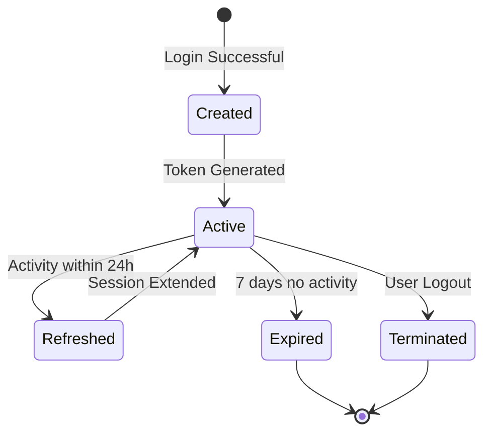
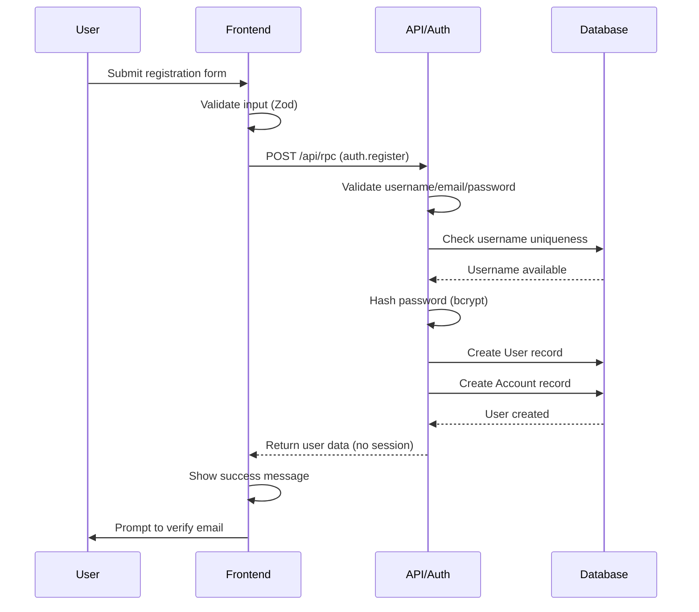
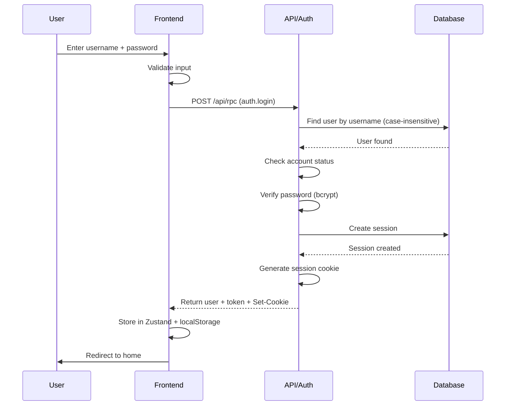
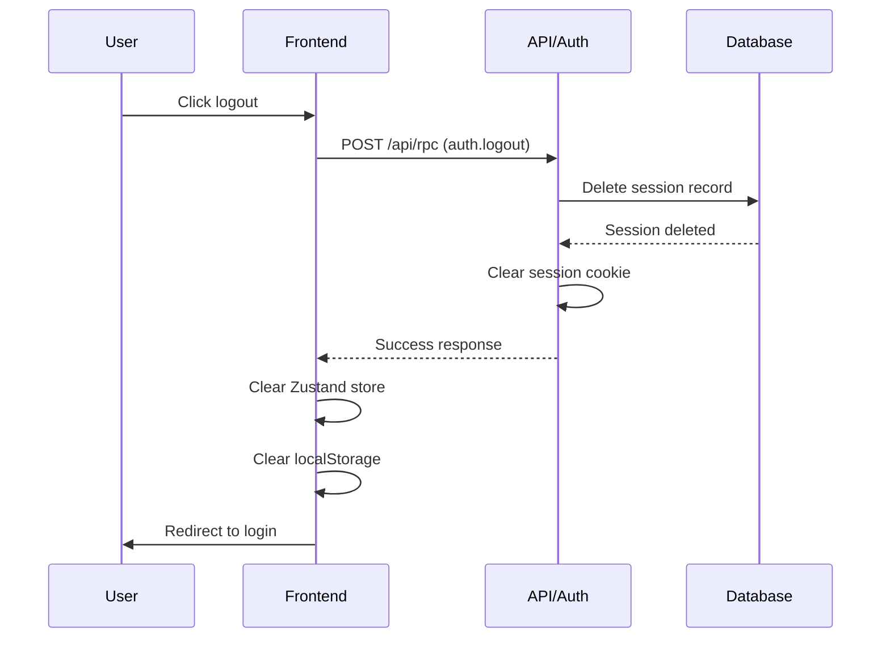
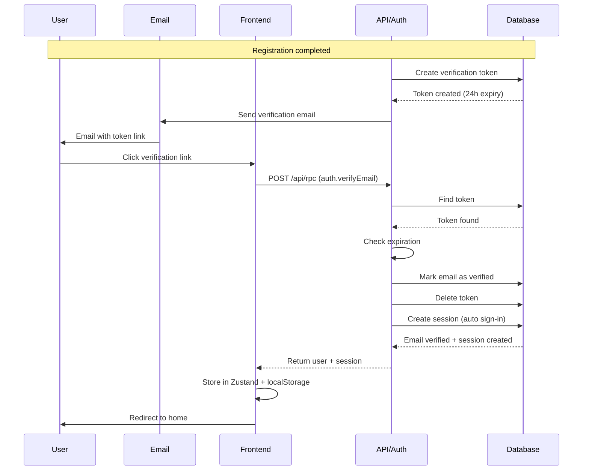

# Authentication Documentation

Comprehensive guide to the VRSS authentication system, built on Better-auth with username-based login.

## Table of Contents

- [Overview](#overview)
- [Better-Auth Integration](#better-auth-integration)
- [Session Management](#session-management)
- [Authentication Flows](#authentication-flows)
- [Username System](#username-system)
- [Password Requirements](#password-requirements)
- [Email Verification](#email-verification)
- [Security Measures](#security-measures)
- [Frontend Auth State](#frontend-auth-state)
- [Session Validation](#session-validation)
- [Implementation Details](#implementation-details)

---

## Overview

The VRSS platform uses **Better-auth**, a modern authentication library, with a username-based login system. This approach prioritizes user privacy and simplicity while maintaining enterprise-grade security.

### Key Design Decisions

- **Username as Primary Identifier**: Users log in with username (not email), enhancing privacy
- **Session-Based Authentication**: 7-day cookie sessions with sliding window refresh
- **Email Verification**: Implemented but disabled for MVP (can be enabled for production)
- **Password Security**: Strong requirements with bcrypt hashing
- **Frontend Persistence**: Zustand store with localStorage for auth state

### Why Better-Auth?

Better-auth was chosen for:
- **Modern Architecture**: Built for TypeScript and modern frameworks
- **Plugin System**: Username plugin enables username-based authentication
- **Prisma Integration**: Native adapter for PostgreSQL with Prisma
- **Security First**: Implements best practices out of the box
- **Flexibility**: Easy to customize while maintaining security

---

## Better-Auth Integration

### Configuration

Better-auth is configured in `/apps/api/src/lib/auth.ts`:

```typescript
// Pseudocode - actual implementation uses better-auth library
const auth = betterAuth({
  database: prismaAdapter(prisma, { provider: "postgresql" }),

  emailAndPassword: {
    enabled: true,
    requireEmailVerification: false, // Disabled for MVP
    minPasswordLength: 12,
    maxPasswordLength: 128
  },

  session: {
    expiresIn: 7 days,
    updateAge: 24 hours,
    cookieCache: { enabled: true, maxAge: 5 minutes }
  },

  plugins: [
    username({
      minUsernameLength: 3,
      maxUsernameLength: 30
    })
  ]
})
```

### Database Schema Extensions

Better-auth automatically manages three tables:

1. **Account** - Stores authentication credentials
   - `id` (BigInt): Primary key
   - `userId` (BigInt): Foreign key to User
   - `password` (String): Bcrypt hashed password
   - `createdAt`, `updatedAt`: Timestamps

2. **Session** - Active user sessions
   - `id` (BigInt): Primary key
   - `userId` (BigInt): Foreign key to User
   - `token` (String): Session token (32-byte random, base64url)
   - `expiresAt` (DateTime): Session expiration
   - `userAgent`, `ipAddress`: Client information
   - `lastActivityAt` (DateTime): Last request timestamp

3. **VerificationToken** - Email verification tokens
   - `id` (BigInt): Primary key
   - `userId` (BigInt): Foreign key to User
   - `token` (String): Verification token
   - `expiresAt` (DateTime): Token expiration (24 hours)

---

## Session Management

### Session Lifecycle



### Session Configuration

- **Duration**: 7 days (604,800 seconds)
- **Sliding Window**: 24 hours (session extends if used within 24h of last activity)
- **Cookie Cache**: 5 minutes (reduces database queries)
- **Storage**: HTTP-only cookies (not accessible to JavaScript)
- **Token Format**: 32 random bytes, base64url encoded

### Session Cookies

Cookies are configured based on environment:

- **Development**:
  - `SameSite`: Lax
  - `Secure`: false
  - `HttpOnly`: true
  - `Prefix`: vrss

- **Production**:
  - `SameSite`: Lax
  - `Secure`: true (HTTPS only)
  - `HttpOnly`: true
  - `Prefix`: vrss

---

## Authentication Flows

### Registration Flow



**Key Steps**:
1. Frontend validates form (React Hook Form + Zod)
2. Username uniqueness checked (case-insensitive)
3. Password hashed with bcrypt (cost factor 10)
4. User and Account records created atomically
5. Email verification token generated (if enabled)
6. User must verify email before login (if required)

### Login Flow



**Key Steps**:
1. Username lookup is case-insensitive
2. Account status checked (active/suspended/deleted)
3. Password verified against bcrypt hash in Account table
4. Session created with 7-day expiration
5. Session cookie set with HttpOnly flag
6. Frontend stores user data and token
7. User redirected to protected route

**Important**: Login uses **username**, not email. This is a core design decision.

### Logout Flow



**Key Steps**:
1. Session deleted from database
2. Session cookie cleared (Set-Cookie with Max-Age=0)
3. Frontend state cleared (Zustand + localStorage)
4. User redirected to login page

### Email Verification Flow



**Key Steps**:
1. Verification token generated on registration
2. Token expires after 24 hours
3. Email sent with verification link
4. User clicks link, token validated
5. Email marked as verified in User table
6. Token deleted (single use)
7. Session auto-created (auto sign-in enabled)

**MVP Status**: Email verification is **implemented but disabled**. Set `requireEmailVerification: true` in auth config to enable.

---

## Username System

### Requirements

- **Length**: 3-30 characters
- **Characters**: Alphanumeric + underscore only (`[a-zA-Z0-9_]`)
- **Case Handling**: Case-insensitive (stored as-is, matched case-insensitively)
- **Uniqueness**: Enforced at database level with case-insensitive constraint

### Validation

```typescript
// Pseudocode - Zod schema
const usernameSchema = z.string()
  .min(3, "Username must be at least 3 characters")
  .max(30, "Username must be at most 30 characters")
  .regex(/^[a-zA-Z0-9_]+$/, "Username can only contain letters, numbers, and underscores")
```

### Username vs Email

| Aspect | Username | Email |
|--------|----------|-------|
| **Login Identifier** | ✅ Yes | ❌ No |
| **Public Display** | ✅ Yes | ❌ No |
| **Required** | ✅ Yes | ✅ Yes |
| **Uniqueness** | ✅ Case-insensitive | ✅ Exact match |
| **Verification** | ❌ No | ⚠️ Optional (disabled) |

**Critical**: Users log in with **username**, not email. Email is collected but not used for authentication.

---

## Password Requirements

### Strength Requirements

Passwords must meet all criteria:

- **Minimum Length**: 12 characters
- **Maximum Length**: 128 characters
- **Uppercase Letter**: At least one (A-Z)
- **Lowercase Letter**: At least one (a-z)
- **Number**: At least one (0-9)
- **Special Character**: At least one (!@#$%^&*()_+-=[]{};\:"|,.\\<>\/?)

### Validation

```typescript
// Pseudocode - Zod schema with refinements
const passwordSchema = z.string()
  .min(12, "Password must be at least 12 characters")
  .max(128, "Password must be at most 128 characters")
  .refine(password => /[A-Z]/.test(password), "Must contain uppercase letter")
  .refine(password => /[a-z]/.test(password), "Must contain lowercase letter")
  .refine(password => /[0-9]/.test(password), "Must contain number")
  .refine(password => /[!@#$%^&*()_+\-=\[\]{};':"\\|,.<>\/?]/.test(password), "Must contain special character")
```

### Password Storage

- **Hashing Algorithm**: Bcrypt
- **Cost Factor**: 10 (production), 10 (tests)
- **Storage Location**: `Account.password` (Better-auth table)
- **Legacy Field**: `User.passwordHash` is optional (pre-Better-auth migration)

**Important**: Better-auth stores passwords in the `Account` table, not `User.passwordHash`.

### Password Strength Indicator

The frontend provides real-time password strength feedback:

```typescript
// Pseudocode - strength calculation
function calculateStrength(password) {
  let score = 0
  if (length >= 12) score++
  if (hasUppercase) score++
  if (hasLowercase) score++
  if (hasNumber) score++
  if (hasSpecial) score++
  if (length >= 16) score++

  return score // 0-6 scale
}
```

Visual indicators:
- **Weak** (0-2): Red
- **Medium** (3-4): Yellow
- **Strong** (5-6): Green

---

## Email Verification

### Current State (MVP)

Email verification is **implemented but disabled**:

```typescript
// In auth.ts
emailAndPassword: {
  requireEmailVerification: false // MVP setting
}
```

### Why Disabled?

For MVP simplicity:
- Faster user onboarding
- No email infrastructure required initially
- Can be enabled with single config change

### Enabling Email Verification

To enable for production:

1. Set `requireEmailVerification: true` in auth config
2. Implement email service in `/apps/api/src/lib/email.ts`
3. Configure email provider (SendGrid, Mailgun, etc.)
4. Update frontend to show verification prompt

### Verification Token Lifecycle

When enabled:

- **Generation**: On user registration
- **Expiration**: 24 hours
- **Delivery**: Email with verification link
- **Validation**: Single use, then deleted
- **Auto Sign-In**: Session created on successful verification

---

## Security Measures

### CSRF Protection

- **Same-Site Cookies**: `SameSite=Lax` prevents cross-site requests
- **HTTP-Only Cookies**: Not accessible to JavaScript (XSS protection)
- **Secure Flag**: HTTPS-only in production

### Password Security

- **Bcrypt Hashing**: Industry-standard, resistant to rainbow tables
- **Cost Factor**: 10 (balances security and performance)
- **No Plain Text**: Passwords never logged or stored unhashed
- **Validation**: Strong requirements enforced at client and server

### Session Security

- **Random Tokens**: 32 cryptographically random bytes
- **Database-Backed**: All sessions stored in database
- **Expiration**: Automatic cleanup of expired sessions
- **IP/User Agent Tracking**: Logged for security auditing

### Rate Limiting

Future consideration (not yet implemented):
- Login attempt throttling
- Registration rate limiting
- Token generation limits

### Account Protection

- **Status Checking**: Suspended/deleted accounts cannot log in
- **Email Uniqueness**: One account per email address
- **Username Uniqueness**: Case-insensitive to prevent impersonation

---

## Frontend Auth State

### Zustand Store

Authentication state managed in `/apps/web/src/lib/store/authStore.ts`:

```typescript
// Pseudocode - Zustand store interface
interface AuthState {
  user: User | null
  token: string | null
  isAuthenticated: boolean
  isLoading: boolean

  // Actions
  setUser(user, token): void
  logout(): void
  updateUser(updates): void
}
```

### LocalStorage Persistence

Auth state persists across browser sessions:

```typescript
// Pseudocode - persistence configuration
persist(storeConfig, {
  name: "vrss-auth",
  storage: localStorage,
  partialize: (state) => ({
    user: state.user,
    token: state.token,
    isAuthenticated: state.isAuthenticated
  })
})
```

**Persisted Fields**:
- `user` - User object (id, username, email, avatarUrl)
- `token` - Session token
- `isAuthenticated` - Boolean flag

**Excluded Fields**:
- `isLoading` - Transient UI state

### Usage in Components

```typescript
// Pseudocode - using auth store
const { user, isAuthenticated, logout } = useAuthStore()

if (!isAuthenticated) {
  return <Navigate to="/login" />
}

return (
  <div>
    <p>Welcome, {user.username}</p>
    <button onClick={logout}>Logout</button>
  </div>
)
```

---

## Session Validation

### Auth Middleware

Session validation happens in RPC middleware:

```typescript
// Pseudocode - auth middleware flow
async function authMiddleware(context) {
  // 1. Extract token from cookie or Authorization header
  const token = extractToken(context.request)

  // 2. Query session from database
  const session = await db.session.findFirst({
    where: { token, expiresAt: { gt: now() } },
    include: { user: true }
  })

  // 3. Check session validity
  if (!session) {
    throw AuthError("Invalid or expired session")
  }

  // 4. Check user status
  if (session.user.status !== "active") {
    throw AuthError("Account suspended or deleted")
  }

  // 5. Update last activity (if > 24h since last update)
  if (shouldRefresh(session)) {
    await db.session.update({
      where: { id: session.id },
      data: { lastActivityAt: now() }
    })
  }

  // 6. Attach user and session to context
  context.user = session.user
  context.session = session
}
```

### Token Sources

Middleware accepts tokens from:

1. **Cookie** (preferred): `vrss_session` cookie
2. **Authorization Header**: `Bearer <token>`

### Protected Procedures

RPC procedures can require authentication:

```typescript
// Pseudocode - protected procedure
const protectedProcedure = {
  async handler(context) {
    if (!context.user) {
      throw new RPCError(1030, "Unauthorized")
    }

    // User is authenticated
    const userId = context.user.id
    // ... procedure logic
  }
}
```

### Public Procedures

Some procedures are public (no auth required):

- `auth.register` - User registration
- `auth.login` - User login
- `auth.verifyEmail` - Email verification
- `auth.resendVerification` - Resend verification email

---

## Implementation Details

### Error Codes

Authentication errors use the 1000-1099 range:

| Code | Error | Description |
|------|-------|-------------|
| 1010 | `AUTH_EMAIL_NOT_VERIFIED` | Email not verified (when enabled) |
| 1011 | `AUTH_INVALID_CREDENTIALS` | Wrong username or password |
| 1012 | `AUTH_ACCOUNT_SUSPENDED` | Account suspended by admin |
| 1013 | `AUTH_ACCOUNT_DELETED` | Account marked as deleted |
| 1014 | `AUTH_RATE_LIMITED` | Too many attempts |
| 1020 | `AUTH_TOKEN_EXPIRED` | Verification token expired |
| 1021 | `AUTH_TOKEN_INVALID` | Invalid verification token |
| 1022 | `AUTH_TOKEN_ALREADY_USED` | Token already consumed |
| 1030 | `AUTH_UNAUTHORIZED` | No valid session |
| 1031 | `AUTH_SESSION_EXPIRED` | Session expired |
| 1401 | `AUTH_USERNAME_TAKEN` | Username already exists |
| 1402 | `AUTH_EMAIL_TAKEN` | Email already registered |

### Files Overview

**Backend**:
- `/apps/api/src/lib/auth.ts` - Better-auth configuration
- `/apps/api/src/rpc/routers/auth.ts` - Auth RPC procedures
- `/apps/api/src/middleware/auth.ts` - Session validation middleware

**Frontend**:
- `/apps/web/src/lib/store/authStore.ts` - Auth state management
- `/apps/web/src/features/auth/components/LoginForm.tsx` - Login UI
- `/apps/web/src/features/auth/components/RegisterForm.tsx` - Registration UI
- `/apps/web/src/features/auth/components/AuthGuard.tsx` - Protected route wrapper
- `/apps/web/src/features/auth/components/PasswordStrength.tsx` - Password validation UI
- `/apps/web/src/features/auth/components/EmailVerification.tsx` - Verification UI

**Tests**:
- `/apps/api/test/auth/registration.test.ts` - Registration tests
- `/apps/api/test/auth/login.test.ts` - Login tests
- `/apps/api/test/auth/logout.test.ts` - Logout tests
- `/apps/api/test/auth/email-verification.test.ts` - Verification tests
- `/apps/api/test/auth/better-auth-setup.test.ts` - Integration tests

### Cross-References

- **Data Model**: See `/docs/DATA_MODEL.md` for User, Account, Session schemas
- **API Documentation**: See `/docs/API.md` for auth RPC procedures
- **Testing**: See `/docs/TESTING.md` for auth test patterns
- **Architecture**: See `/docs/ARCHITECTURE.md` for overall system architecture

---

## Summary

The VRSS authentication system provides:

✅ **Username-based login** (primary identifier)
✅ **Better-auth integration** (modern, secure)
✅ **Session management** (7-day expiry, sliding window)
✅ **Strong password requirements** (12+ chars, complexity)
✅ **Email verification** (implemented, disabled for MVP)
✅ **Frontend persistence** (Zustand + localStorage)
✅ **Security hardening** (bcrypt, HttpOnly cookies, CSRF protection)
✅ **Comprehensive testing** (595 backend tests, 333 frontend tests)

For questions or issues, refer to the test suites for usage examples or open an issue on GitHub.
