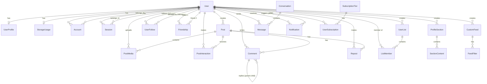

# Data Model Documentation

**VRSS Social Platform - Complete Data Model Reference**

This document serves as the authoritative reference for the VRSS platform's data model. It describes all 28 Prisma models, their relationships, validation rules, and database-level behaviors.

---

## Table of Contents

1. [Overview](#overview)
2. [Primary Identifiers](#primary-identifiers)
3. [Complete Entity Relationship Diagram](#complete-entity-relationship-diagram)
4. [Database Enums](#database-enums)
5. [Phase 1: Foundation Models](#phase-1-foundation-models)
6. [Phase 2: Content & Social Models](#phase-2-content--social-models)
7. [Phase 3: Profile & Feed Models](#phase-3-profile--feed-models)
8. [Phase 4: Communication Models](#phase-4-communication-models)
9. [Type Transformations](#type-transformations)
10. [Database Triggers](#database-triggers)
11. [Validation Rules](#validation-rules)

---

## Overview

The VRSS data model consists of **28 Prisma models** organized across 4 implementation phases:

- **Phase 1 (Foundation)**: 7 models - Users, profiles, authentication, storage
- **Phase 2 (Content & Social)**: 9 models - Posts, media, follows, friendships, interactions
- **Phase 3 (Profile & Feed)**: 6 models - Custom sections, feeds, filters, lists
- **Phase 4 (Communication)**: 6 models - Messages, conversations, notifications, subscriptions

**Technology Stack:**
- Database: PostgreSQL 16
- ORM: Prisma Client
- ID Strategy: BigInt (auto-increment) → String (in API)
- Soft Deletes: deletedAt timestamps (User, Post, Comment, Message)
- JSONB: Used for flexible configs (profiles, feeds, algorithms)

---

## Primary Identifiers

### Username is the PRIMARY Identifier

**CRITICAL**: The VRSS platform uses **username** as the primary user identifier, NOT email.

**Username Requirements:**
- Length: 3-30 characters
- Allowed characters: Alphanumeric + underscore (a-z, A-Z, 0-9, _)
- Case handling: Case-insensitive storage and lookup
- Uniqueness: Enforced at database level with case-insensitive constraint
- Display: Original casing preserved in displayUsername field

**Email is SECONDARY:**
- Used only for authentication and verification
- Not exposed in public API responses
- Required for registration but not for user identification

**Login Flow:**
- Users log in with **username** (not email)
- Better-auth username plugin maps username to email internally
- API returns username in all user objects

---

## Complete Entity Relationship Diagram



---

## Database Enums

### UserStatus
```
active      - Normal user account
suspended   - Account suspended by admin
deleted     - Soft deleted account
```

### ProfileVisibility
```
public      - Anyone can view
followers   - Only followers can view
private     - Only owner can view
```

### PostType
```
text_short    - Short text post (API type: "text")
text_long     - Long text post
image         - Single image (API type: "image")
image_gallery - Multiple images
gif           - Animated GIF
video_short   - Short video (API type: "video")
video_long    - Long video
song          - Audio track (API type: "song")
album         - Audio album
```

### PostStatus
```
draft      - Not published yet
published  - Live post
scheduled  - Scheduled for future
deleted    - Soft deleted
```

### MediaType
```
image     - Image file
gif       - Animated GIF
video     - Video file
audio     - Audio file
document  - Document file
```

### InteractionType
```
like      - Like interaction
bookmark  - Bookmark interaction
share     - Share interaction
```

### SectionType
```
feed           - Post feed section
gallery        - Media gallery section
links          - Links section
static_text    - Static text section
static_image   - Static image section
video          - Video section
reposts        - Reposts section
friends        - Friends section
followers      - Followers section
following      - Following section
list           - User list section
```

### FilterType
```
post_type    - Filter by post type
author       - Filter by author
tag          - Filter by tag
date_range   - Filter by date range
engagement   - Filter by engagement
```

### FilterOperator
```
equals        - Exact match
not_equals    - Not equal
contains      - Contains text
greater_than  - Numeric greater than
less_than     - Numeric less than
in_range      - Within range
```

### NotificationType
```
follow          - New follower
like            - Post liked
comment         - New comment
repost          - Post reposted
mention         - User mentioned
message         - New message
friend_request  - Friend request (mutual follow)
system          - System notification
```

### SubscriptionStatus
```
active     - Active subscription
canceled   - Canceled subscription
expired    - Expired subscription
suspended  - Suspended subscription
```

---

## Phase 1: Foundation Models

### User (7 models total)

**User** - Core user account
```
id: BigInt (auto-increment, primary key)
username: String (unique, case-insensitive, 3-30 chars, alphanumeric + underscore)
name: String (display name, for better-auth compatibility)
displayUsername: String? (original username casing)
email: String (unique, max 255 chars)
emailVerified: Boolean (default: false)
passwordHash: String? (optional - better-auth uses Account.password)
status: UserStatus (default: active)
createdAt: DateTime (auto)
updatedAt: DateTime (auto)
lastLoginAt: DateTime? (updated on login)
deletedAt: DateTime? (soft delete timestamp)

Relations:
- profile: UserProfile (one-to-one)
- storageUsage: StorageUsage (one-to-one)
- accounts: Account[] (better-auth)
- sessions: Session[] (better-auth)
- posts: Post[]
- postMedia: PostMedia[]
- followers: UserFollow[] (as following)
- following: UserFollow[] (as follower)
- friendships1: Friendship[] (as user1)
- friendships2: Friendship[] (as user2)
- postInteractions: PostInteraction[]
- comments: Comment[]
- reposts: Repost[]
- profileSections: ProfileSection[]
- customFeeds: CustomFeed[]
- userLists: UserList[]
- listMemberships: ListMember[]
- messages: Message[]
- notifications: Notification[]
- notificationsAsActor: Notification[]
- subscriptions: UserSubscription[]

Indexes:
- email
- status
```

**UserProfile** - User profile information
```
id: BigInt (primary key)
userId: BigInt (unique, foreign key → User)
displayName: String? (max 100 chars)
bio: String? (text)
age: Int?
location: String? (max 100 chars)
website: String? (max 500 chars)
visibility: ProfileVisibility (default: public)
backgroundConfig: JSON (JSONB, default: {})
musicConfig: JSON? (JSONB, nullable)
styleConfig: JSON (JSONB, default: {})
layoutConfig: JSON (JSONB, default: {"sections": []})
createdAt: DateTime (auto)
updatedAt: DateTime (auto)

Relations:
- user: User (one-to-one)

Indexes:
- visibility
```

**StorageUsage** - Storage quota tracking
```
id: BigInt (primary key)
userId: BigInt (unique, foreign key → User)
usedBytes: BigInt (default: 0)
quotaBytes: BigInt (default: 52428800 = 50MB)
imagesBytes: BigInt (default: 0)
videosBytes: BigInt (default: 0)
audioBytes: BigInt (default: 0)
otherBytes: BigInt (default: 0)
lastCalculatedAt: DateTime (default: now)
createdAt: DateTime (auto)
updatedAt: DateTime (auto)

Relations:
- user: User (one-to-one)

Note: Updated automatically by database triggers
```

**Account** - Better-auth account management
```
id: BigInt (primary key)
userId: BigInt (foreign key → User)
accountId: String (unique, max 255 chars)
providerId: String (max 50 chars, e.g., "credential")
accessToken: String? (text)
refreshToken: String? (text)
idToken: String? (text)
expiresAt: DateTime?
password: String? (hashed password for email/password auth, max 255 chars)
createdAt: DateTime (auto)
updatedAt: DateTime (auto)

Relations:
- user: User (many-to-one)

Indexes:
- userId

Note: Better-auth stores passwords here, NOT in User.passwordHash
```

**Session** - Better-auth session management
```
id: BigInt (primary key)
userId: BigInt (foreign key → User)
token: String (unique, max 255 chars)
expiresAt: DateTime (7-day expiry)
ipAddress: String? (max 45 chars)
userAgent: String? (text)
lastActivityAt: DateTime (default: now)
createdAt: DateTime (auto)
updatedAt: DateTime (auto)

Relations:
- user: User (many-to-one)

Indexes:
- userId
- token
- expiresAt
```

**VerificationToken** - Email verification tokens
```
id: BigInt (primary key)
identifier: String (max 255 chars, e.g., email)
token: String (unique, max 255 chars)
expires: DateTime
createdAt: DateTime (auto)

Unique Constraint:
- [identifier, token]

Indexes:
- token

Note: Used by better-auth for email verification (disabled for MVP)
```

**SubscriptionTier** - Subscription tiers configuration
```
id: BigInt (primary key)
name: String (unique, max 50 chars)
description: String? (text)
storageBytes: BigInt (quota for this tier)
priceMonthlyCents: Int (price in cents)
isActive: Boolean (default: true)
createdAt: DateTime (auto)
updatedAt: DateTime (auto)

Relations:
- subscriptions: UserSubscription[]
```

---

## Phase 2: Content & Social Models

### Posts & Media (4 models)

**Post** - User-generated content
```
id: BigInt (primary key)
userId: BigInt (foreign key → User)
type: PostType (text_short, image, video_short, song, etc.)
status: PostStatus (default: published)
visibility: ProfileVisibility (default: public)
title: String? (max 200 chars)
content: String? (text)
contentHtml: String? (text, rendered HTML)
mediaUrls: JSON? (JSONB array, stores media IDs)
thumbnailUrl: String? (max 500 chars)
likesCount: Int (default: 0, denormalized)
commentsCount: Int (default: 0, denormalized)
repostsCount: Int (default: 0, denormalized)
viewsCount: Int (default: 0, denormalized)
publishedAt: DateTime? (when published)
scheduledFor: DateTime? (for scheduled posts)
createdAt: DateTime (auto)
updatedAt: DateTime (auto)
deletedAt: DateTime? (soft delete)

Relations:
- user: User (many-to-one)
- media: PostMedia[]
- interactions: PostInteraction[]
- comments: Comment[]
- reposts: Repost[]

Indexes:
- [userId, createdAt DESC, status]
- [type, createdAt DESC]
- [likesCount DESC, createdAt DESC]

Note: Counters updated by database triggers
```

**PostMedia** - Media files attached to posts
```
id: BigInt (primary key)
postId: BigInt? (foreign key → Post, nullable for unattached media)
userId: BigInt (foreign key → User)
type: MediaType (image, gif, video, audio, document)
fileUrl: String (max 500 chars, S3 URL)
fileSizeBytes: BigInt (file size)
mimeType: String (max 100 chars)
width: Int? (for images/videos)
height: Int? (for images/videos)
durationSeconds: Int? (for videos/audio)
thumbnailUrl: String? (max 500 chars)
displayOrder: Int (default: 0, for galleries)
createdAt: DateTime (auto)

Relations:
- post: Post? (many-to-one, nullable)
- user: User (many-to-one)

Indexes:
- [postId, displayOrder]

Note: Triggers update StorageUsage on insert/delete
```

**PendingUpload** - Temporary upload metadata
```
id: String (UUID, primary key)
userId: BigInt (foreign key → User)
s3Key: String (max 500 chars, S3 object key)
filename: String (max 255 chars)
contentType: String (max 100 chars, MIME type)
size: BigInt (file size)
expiresAt: DateTime (15-minute expiry)
createdAt: DateTime (auto)

Indexes:
- [userId, expiresAt]

Note: Cleaned up after completeUpload or expiry
```

**Comment** - Comments on posts
```
id: BigInt (primary key)
postId: BigInt (foreign key → Post)
userId: BigInt (foreign key → User)
parentCommentId: BigInt? (foreign key → Comment, for nested replies)
content: String (text)
contentHtml: String? (text, rendered HTML)
likesCount: Int (default: 0, denormalized)
repliesCount: Int (default: 0, denormalized)
createdAt: DateTime (auto)
updatedAt: DateTime (auto)
deletedAt: DateTime? (soft delete)

Relations:
- post: Post (many-to-one)
- user: User (many-to-one)
- parentComment: Comment? (self-referential)
- replies: Comment[] (self-referential)

Indexes:
- [postId, createdAt DESC]
- [parentCommentId, createdAt DESC]

Note: Post.commentsCount updated by trigger
```

### Social Relationships (5 models)

**UserFollow** - Follow relationships
```
id: BigInt (primary key)
followerId: BigInt (foreign key → User, who follows)
followingId: BigInt (foreign key → User, who is followed)
createdAt: DateTime (auto)

Relations:
- follower: User (many-to-one)
- following: User (many-to-one)

Unique Constraint:
- [followerId, followingId]

Indexes:
- [followerId, createdAt DESC]
- [followingId, createdAt DESC]

Note: Trigger creates Friendship if mutual
```

**Friendship** - Mutual follow relationships
```
id: BigInt (primary key)
userId1: BigInt (foreign key → User, lower ID)
userId2: BigInt (foreign key → User, higher ID)
createdAt: DateTime (auto)

Relations:
- user1: User (many-to-one)
- user2: User (many-to-one)

Unique Constraint:
- [userId1, userId2]

Indexes:
- [userId1, createdAt DESC]
- [userId2, createdAt DESC]

Note: Created automatically by trigger when mutual follow detected
      userId1 < userId2 always (ordered IDs)
```

**PostInteraction** - Likes, bookmarks, shares
```
id: BigInt (primary key)
userId: BigInt (foreign key → User)
postId: BigInt (foreign key → Post)
type: InteractionType (like, bookmark, share)
createdAt: DateTime (auto)

Relations:
- user: User (many-to-one)
- post: Post (many-to-one)

Unique Constraint:
- [userId, postId, type]

Indexes:
- [postId, type, createdAt DESC]

Note: Triggers update Post.likesCount for type=like
```

**Repost** - Post reposts/shares
```
id: BigInt (primary key)
userId: BigInt (foreign key → User)
postId: BigInt (foreign key → Post)
comment: String? (text, optional comment)
createdAt: DateTime (auto)

Relations:
- user: User (many-to-one)
- post: Post (many-to-one)

Unique Constraint:
- [userId, postId]

Indexes:
- [userId, createdAt DESC]
```

---

## Phase 3: Profile & Feed Models

### Profile Customization (2 models)

**ProfileSection** - Customizable profile sections
```
id: BigInt (primary key)
userId: BigInt (foreign key → User)
type: SectionType (feed, gallery, links, static_text, etc.)
title: String (max 100 chars)
description: String? (text)
config: JSON (JSONB, default: {})
displayOrder: Int (default: 0)
isVisible: Boolean (default: true)
createdAt: DateTime (auto)
updatedAt: DateTime (auto)

Relations:
- user: User (many-to-one)
- content: SectionContent[]

Indexes:
- [userId, displayOrder]
```

**SectionContent** - Content items in profile sections
```
id: BigInt (primary key)
sectionId: BigInt (foreign key → ProfileSection)
contentType: String (max 50 chars)
title: String? (max 200 chars)
content: String? (text)
url: String? (max 500 chars)
displayOrder: Int (default: 0)
createdAt: DateTime (auto)
updatedAt: DateTime (auto)

Relations:
- section: ProfileSection (many-to-one)

Indexes:
- [sectionId, displayOrder]
```

### Custom Feeds (2 models)

**CustomFeed** - User-created feeds with custom algorithms
```
id: BigInt (primary key)
userId: BigInt (foreign key → User)
name: String (max 100 chars)
description: String? (text)
algorithmConfig: JSON (JSONB, feed algorithm configuration)
isDefault: Boolean (default: false)
displayOrder: Int (default: 0)
createdAt: DateTime (auto)
updatedAt: DateTime (auto)

Relations:
- user: User (many-to-one)
- filters: FeedFilter[]

Unique Constraint:
- [userId, name]

Indexes:
- [userId, displayOrder]
```

**FeedFilter** - Filters for custom feeds
```
id: BigInt (primary key)
feedId: BigInt (foreign key → CustomFeed)
type: FilterType (post_type, author, tag, date_range, engagement)
operator: FilterOperator (equals, not_equals, contains, etc.)
value: JSON (JSONB, filter value)
groupId: Int (default: 0, for logical grouping)
logicalOperator: String (default: "AND", max 10 chars)
displayOrder: Int (default: 0)
createdAt: DateTime (auto)

Relations:
- feed: CustomFeed (many-to-one)

Indexes:
- [feedId, groupId, displayOrder]
- [type, feedId]
```

### User Lists (2 models)

**UserList** - Custom user lists
```
id: BigInt (primary key)
userId: BigInt (foreign key → User)
name: String (max 100 chars)
description: String? (text)
isPublic: Boolean (default: true)
createdAt: DateTime (auto)
updatedAt: DateTime (auto)

Relations:
- user: User (many-to-one)
- members: ListMember[]

Unique Constraint:
- [userId, name]

Indexes:
- userId
```

**ListMember** - Members of user lists
```
id: BigInt (primary key)
listId: BigInt (foreign key → UserList)
memberUserId: BigInt (foreign key → User)
addedAt: DateTime (auto)

Relations:
- list: UserList (many-to-one)
- memberUser: User (many-to-one)

Unique Constraint:
- [listId, memberUserId]

Indexes:
- listId
```

---

## Phase 4: Communication Models

### Messaging (2 models)

**Conversation** - Direct message conversations
```
id: BigInt (primary key)
participantIds: BigInt[] (array, ordered [lower, higher])
lastMessageAt: DateTime (default: now)
createdAt: DateTime (auto)

Relations:
- messages: Message[]

Note: participantIds stored as ordered array for efficient lookup
      PostgreSQL array type used for participant_ids
```

**Message** - Direct messages
```
id: BigInt (primary key)
conversationId: BigInt (foreign key → Conversation)
senderId: BigInt (foreign key → User)
content: String (text)
readBy: BigInt[] (array, default: [])
createdAt: DateTime (auto)
updatedAt: DateTime (auto)
deletedAt: DateTime? (soft delete)

Relations:
- conversation: Conversation (many-to-one)
- sender: User (many-to-one)

Indexes:
- [conversationId, createdAt DESC]

Note: readBy array updated when users mark messages as read
      PostgreSQL array type used for read_by
```

### Notifications (1 model)

**Notification** - User notifications
```
id: BigInt (primary key)
userId: BigInt (foreign key → User, recipient)
type: NotificationType (follow, like, comment, etc.)
actorId: BigInt? (foreign key → User, who triggered)
postId: BigInt? (related post)
commentId: BigInt? (related comment)
title: String (max 200 chars)
content: String? (text)
actionUrl: String? (max 500 chars)
isRead: Boolean (default: false)
readAt: DateTime?
createdAt: DateTime (auto)

Relations:
- user: User (many-to-one)
- actor: User? (many-to-one)

Indexes:
- [userId, createdAt DESC]
- [userId, isRead]
```

### Subscriptions (1 model)

**UserSubscription** - User subscription management
```
id: BigInt (primary key)
userId: BigInt (foreign key → User)
tierId: BigInt (foreign key → SubscriptionTier)
status: SubscriptionStatus (default: active)
stripeSubscriptionId: String? (max 255 chars)
stripeCustomerId: String? (max 255 chars)
currentPeriodStart: DateTime
currentPeriodEnd: DateTime
canceledAt: DateTime?
createdAt: DateTime (auto)
updatedAt: DateTime (auto)

Relations:
- user: User (many-to-one)
- tier: SubscriptionTier (many-to-one)

Indexes:
- userId
- status
```

---

## Type Transformations

### BigInt ↔ String Conversion

**Database (Prisma):**
- All IDs are `BigInt` (auto-increment)
- JavaScript BigInt: `9007199254740991n`

**API (JSON):**
- All IDs converted to `String`
- Prevents JavaScript number precision loss
- Safe for JSON serialization

**Transformation Points:**
1. **API Response**: `id.toString()` before returning
2. **API Input**: `BigInt(idString)` when querying
3. **Foreign Keys**: Always convert before DB operations

**Example:**
```
Database: id = 1234567890123456789n (BigInt)
API:      id = "1234567890123456789" (String)
```

### Post Type Mapping (API ↔ Database)

**API uses simplified types (4 types):**
- `text` - Text-only posts
- `image` - Image posts
- `video` - Video posts
- `song` - Audio posts

**Database uses granular types (9 types):**
- `text_short`, `text_long` - Different text lengths
- `image`, `image_gallery`, `gif` - Image variations
- `video_short`, `video_long` - Video variations
- `song`, `album` - Audio variations

**Mapping Function (apps/api/src/rpc/routers/post.ts:64-72):**
```
API Type    → Database Type
-------------------------------
"text"      → "text_short"
"image"     → "image"
"video"     → "video_short"
"song"      → "song"
```

**Rationale:**
- API simplicity for frontend
- Database granularity for features
- One-way mapping (DB → API returns granular type)

### JSONB Fields

**User Profile Configs:**
- `backgroundConfig`: Background images, colors, patterns
- `musicConfig`: Profile music settings
- `styleConfig`: Fonts, colors, themes, privacy settings
- `layoutConfig`: Section layout and order

**Feed Algorithm Config:**
- `algorithmConfig`: Feed sorting, filtering, and ranking logic
- Stored as structured JSON with type safety in TypeScript

**Post Media URLs:**
- `mediaUrls`: Array of media IDs stored as JSONB
- Allows flexible media attachments without schema changes

---

## Database Triggers

### Trigger 1: Friendship Creation

**File:** `apps/api/prisma/migrations/20251016194500_add_friendship_trigger/migration.sql`

**Purpose:** Automatically create Friendship when mutual follow detected

**Function:** `create_friendship_on_mutual_follow()`

**Trigger:** `trigger_create_friendship` on `user_follows` AFTER INSERT

**Logic:**
1. When UserFollow inserted (A follows B)
2. Check if reverse follow exists (B follows A)
3. If yes (mutual follow), insert Friendship
4. Use LEAST/GREATEST to order IDs (userId1 < userId2)
5. ON CONFLICT DO NOTHING (idempotent)

**Example:**
```
1. User 5 follows User 10 → UserFollow created
2. User 10 follows User 5 → UserFollow created
3. Trigger detects mutual follow
4. Friendship (userId1=5, userId2=10) created automatically
```

### Trigger 2: Post Interaction Counters

**File:** `apps/api/prisma/migrations/20251017000000_add_post_interaction_triggers/migration.sql`

**Purpose:** Automatically update post engagement counters

**Functions:**
1. `increment_post_likes_count()` - Add 1 to Post.likesCount
2. `decrement_post_likes_count()` - Subtract 1 from Post.likesCount (min 0)
3. `increment_post_comments_count()` - Add 1 to Post.commentsCount
4. `decrement_post_comments_count()` - Subtract 1 from Post.commentsCount (min 0)

**Triggers:**
1. `trigger_increment_likes_count` - AFTER INSERT on `post_interactions` WHERE type='like'
2. `trigger_decrement_likes_count` - AFTER DELETE on `post_interactions` WHERE type='like'
3. `trigger_increment_comments_count` - AFTER INSERT on `comments`
4. `trigger_decrement_comments_count` - AFTER DELETE on `comments`

**Benefits:**
- Eliminates need for manual counter updates in application code
- Ensures atomic counter updates with interaction changes
- Uses GREATEST(0, ...) to prevent negative counts

### Trigger 3: Storage Usage Tracking

**File:** `apps/api/prisma/migrations/20251017000001_add_storage_triggers/migration.sql`

**Purpose:** Automatically update user storage usage when media uploaded/deleted

**Functions:**
1. `update_storage_on_media_insert()` - Increment storage counters
2. `update_storage_on_media_delete()` - Decrement storage counters

**Triggers:**
1. `trigger_update_storage_insert` - AFTER INSERT on `post_media`
2. `trigger_update_storage_delete` - AFTER DELETE on `post_media`

**Updates:**
- `usedBytes`: Total storage used
- `imagesBytes`: Image storage (when type='image')
- `videosBytes`: Video storage (when type='video')
- `audioBytes`: Audio storage (when type='audio')
- `otherBytes`: Other file storage
- `updated_at`: Timestamp for cache invalidation

**Example:**
```
User uploads 5MB image:
- usedBytes += 5242880
- imagesBytes += 5242880
- updated_at = NOW()

User deletes 3MB video:
- usedBytes = GREATEST(0, usedBytes - 3145728)
- videosBytes = GREATEST(0, videosBytes - 3145728)
- updated_at = NOW()
```

---

## Validation Rules

### Username Validation

**Pattern:** `/^[a-zA-Z0-9_]+$/`
- Min length: 3 characters
- Max length: 30 characters
- Allowed: Letters (a-z, A-Z), numbers (0-9), underscore (_)
- Disallowed: Spaces, special characters, emojis
- Case handling: Case-insensitive uniqueness, preserves display case

**Database Constraint:**
- Unique index with case-insensitive mode
- Enforced at DB level for data integrity

**Examples:**
- Valid: `john_doe`, `user123`, `alice_in_wonderland_2024`
- Invalid: `ab` (too short), `user name` (space), `user@123` (special char)

### Email Validation

**Pattern:** Standard email regex (RFC 5322)
- Max length: 255 characters
- Must be valid email format
- Case-insensitive storage (lowercase)

**Database Constraint:**
- Unique index

### Password Validation

**Requirements (enforced in API):**
- Min length: 12 characters
- Max length: 128 characters
- Must contain:
  - At least 1 uppercase letter (A-Z)
  - At least 1 lowercase letter (a-z)
  - At least 1 number (0-9)
  - At least 1 special character (!@#$%^&*()_+-=[]{}:;"\\|,.<>/?)

**Hashing:**
- Algorithm: bcrypt (via better-auth)
- Cost factor: 12
- Stored in: `Account.password` (NOT `User.passwordHash`)

### Storage Quotas

**Default Quota:** 50MB (52,428,800 bytes)

**File Size Limits (by type):**
- Images: 10MB max
- Videos: 100MB max
- Audio: 20MB max
- Documents: 10MB max

**Enforcement:**
1. Check before upload (media.initiateUpload)
2. Atomic update with FOR UPDATE lock (prevent race conditions)
3. Trigger updates usage after successful upload

### Unique Constraints

**Single-field uniqueness:**
- User.username (case-insensitive)
- User.email
- Account.accountId
- Session.token
- VerificationToken.token
- SubscriptionTier.name

**Composite uniqueness:**
- UserFollow [followerId, followingId]
- Friendship [userId1, userId2]
- PostInteraction [userId, postId, type]
- Repost [userId, postId]
- CustomFeed [userId, name]
- UserList [userId, name]
- ListMember [listId, memberUserId]
- VerificationToken [identifier, token]

### Cascade Delete Patterns

**CASCADE deletes (child deleted when parent deleted):**
- User deleted → All UserProfile, StorageUsage, Account, Session deleted
- User deleted → All Post, PostMedia, Comment, Message deleted
- Post deleted → All PostMedia, PostInteraction, Comment, Repost deleted
- Comment deleted → All child Comment (replies) deleted
- ProfileSection deleted → All SectionContent deleted
- CustomFeed deleted → All FeedFilter deleted
- UserList deleted → All ListMember deleted
- Conversation deleted → All Message deleted

**Soft delete approach:**
- User: Sets `deletedAt` timestamp
- Post: Sets `deletedAt` timestamp
- Comment: Sets `deletedAt` timestamp
- Message: Sets `deletedAt` timestamp

**Why soft delete?**
- Data recovery for 30 days
- Preserve referential integrity
- Audit trail for moderation

### Indexes

**37 indexes total** - Optimized for common query patterns

**Single-column indexes:**
- User: email, status
- UserProfile: visibility
- Session: userId, token, expiresAt
- Account: userId
- VerificationToken: token
- UserFollow: followerId, followingId
- Friendship: userId1, userId2
- Post: userId, type
- PostMedia: postId
- PendingUpload: userId
- Comment: postId, parentCommentId
- Repost: userId
- PostInteraction: postId
- ProfileSection: userId
- SectionContent: sectionId
- CustomFeed: userId
- FeedFilter: feedId, type
- UserList: userId
- ListMember: listId
- Message: conversationId
- Notification: userId
- UserSubscription: userId, status

**Composite indexes (with sort order):**
- User: None
- Post: [userId, createdAt DESC, status], [type, createdAt DESC], [likesCount DESC, createdAt DESC]
- UserFollow: [followerId, createdAt DESC], [followingId, createdAt DESC]
- Friendship: [userId1, createdAt DESC], [userId2, createdAt DESC]
- PostInteraction: [postId, type, createdAt DESC]
- Comment: [postId, createdAt DESC], [parentCommentId, createdAt DESC]
- Repost: [userId, createdAt DESC]
- ProfileSection: [userId, displayOrder]
- SectionContent: [sectionId, displayOrder]
- CustomFeed: [userId, displayOrder]
- FeedFilter: [feedId, groupId, displayOrder]
- PendingUpload: [userId, expiresAt]
- Message: [conversationId, createdAt DESC]
- Notification: [userId, createdAt DESC], [userId, isRead]

**Index naming convention:**
- `idx_<table>_<column(s)>`
- Example: `idx_posts_user_created` for [userId, createdAt DESC]

---

## Cross-References

**Related Documentation:**
- [API.md](./API.md) - API procedures and RPC architecture
- [DATABASE.md](./DATABASE.md) - Prisma schema, migrations, and database features
- [AUTHENTICATION.md](./AUTHENTICATION.md) - Better-auth integration and session management

**Schema Location:**
- Primary schema: `apps/api/prisma/schema.prisma`
- Migrations: `apps/api/prisma/migrations/`

**Type Definitions:**
- API contracts: `packages/api-contracts/src/`
- Prisma types: Auto-generated in `node_modules/.prisma/client/`

---

**Document Version:** 1.0
**Last Updated:** 2025-10-21
**Phase Status:** Phase 4.4 Complete (Authentication UI)
