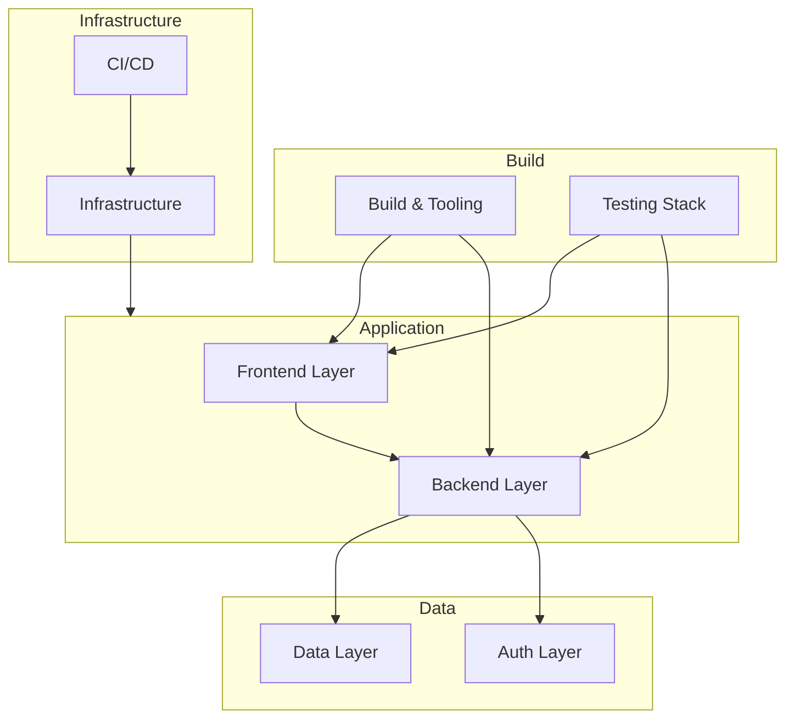

# VRSS Technology Stack

**Last Updated**: 2025-10-21
**Status**: Phase 4 Complete
**Target Audience**: New developers, technical decision makers

---

## Table of Contents

- [Overview](#overview)
- [Technology Layers](#technology-layers)
- [Runtime Layer](#runtime-layer)
- [Backend Stack](#backend-stack)
- [Frontend Stack](#frontend-stack)
- [Data Layer](#data-layer)
- [Build & Tooling](#build--tooling)
- [Testing Stack](#testing-stack)
- [Infrastructure](#infrastructure)
- [Development Tools](#development-tools)
- [Future Considerations](#future-considerations)

---

## Overview

VRSS uses a modern JavaScript/TypeScript stack optimized for developer experience, type safety, and performance. The stack is unified by TypeScript across frontend and backend, with Bun as the primary runtime.

**Guiding Principles**:
- **Type Safety First**: End-to-end TypeScript with strict mode
- **Developer Experience**: Fast tooling (Bun, Vite), hot reload, instant feedback
- **Modern Standards**: Latest stable versions, ESM modules, cutting-edge features
- **Minimal Dependencies**: Prefer platform APIs and battle-tested libraries
- **Performance**: Fast runtime (Bun), efficient bundling (Vite), optimized queries (Prisma)

---

## Technology Layers

**Technology Selection Criteria**:
1. **Maturity**: Production-ready, active maintenance, strong community
2. **TypeScript Support**: First-class TypeScript integration
3. **Performance**: Fast runtime, efficient builds, optimized bundles
4. **DX**: Developer experience (hot reload, error messages, debugging)
5. **Team Expertise**: Familiarity with similar tools (React, Node.js)

---

## Runtime Layer

### Bun (Backend Runtime)

**Version**: 1.1.0+
**Purpose**: JavaScript/TypeScript runtime for backend API

**Why Bun Over Node.js**:

| Feature | Bun | Node.js |
|---------|-----|---------|
| TypeScript | Native support (no tsx/ts-node) | Requires loaders |
| Speed | 3-4x faster startup | Baseline |
| Package Manager | Built-in (faster than npm/pnpm) | Separate tool |
| Testing | Built-in test runner | Requires Jest/Vitest |
| Compatibility | Node.js APIs compatible | N/A |
| Maturity | v1.0+ (stable) | Battle-tested |

**Trade-offs**:
- ✅ Faster development iteration (instant startup, hot reload)
- ✅ Simplified tooling (no separate test runner, package manager)
- ✅ Native TypeScript (no compilation step for dev)
- ❌ Newer ecosystem (fewer production examples)
- ❌ Some Node.js packages may have compatibility issues

**Decision Rationale**: Bun's speed and developer experience benefits outweigh ecosystem maturity concerns for MVP. Production-ready as of v1.0+.

---

### Browser Runtime (Frontend)

**Target**: Modern browsers (Chrome 90+, Firefox 88+, Safari 14+, Edge 90+)

**Required Features**:
- ES2020+ support
- Service Workers (PWA offline support)
- Local Storage (auth persistence)
- Fetch API (RPC calls)
- Web Workers (future: background processing)

**Progressive Enhancement**: App works without JavaScript for basic content viewing (future).

---

## Backend Stack

### Hono (HTTP Server Framework)

**Version**: 4.6.14+
**Purpose**: Lightweight HTTP framework for API routes

**Why Hono Over Express/Fastify**:

| Feature | Hono | Express | Fastify |
|---------|------|---------|---------|
| Runtime | Bun, Node, Deno, Edge | Node only | Node only |
| TypeScript | First-class | Third-party types | Good |
| Performance | Ultra-fast (Bun optimized) | Slow | Fast |
| Size | 13KB | 209KB | 78KB |
| Modern APIs | Web Standard APIs | Node APIs | Node APIs |
| Middleware | Composable | Classic | Plugins |

**Key Features**:
- Built for Bun and edge runtimes
- Type-safe routing and context
- Minimal overhead (perfect for RPC pattern)
- Web Standard Request/Response APIs

**Decision Rationale**: Hono's lightweight design and Bun optimization align with RPC architecture (single endpoint). Express/Fastify are overkill for our use case.

---

### Prisma (ORM)

**Version**: 6.1.0+
**Purpose**: Type-safe database ORM and migration tool

**Why Prisma Over TypeORM/Drizzle**:

| Feature | Prisma | TypeORM | Drizzle |
|---------|--------|---------|---------|
| Type Safety | Generated types (strict) | Decorators (loose) | TypeScript-first |
| DX | Excellent (Prisma Studio) | Good | Good |
| Migrations | Declarative (schema diff) | Imperative (manual) | SQL-based |
| Performance | Good (query optimization) | Variable | Excellent |
| Maturity | Battle-tested | Very mature | Newer |
| Bun Support | Excellent | Good | Excellent |

**Key Features**:
- Schema-first design (single source of truth)
- Automatic migration generation
- Prisma Studio (GUI for data exploration)
- Type-safe query builder
- Connection pooling and query optimization

**Decision Rationale**: Prisma's migration workflow and type safety are essential for rapid MVP iteration. Performance is acceptable for current scale.

**Future Consideration**: Drizzle for performance-critical queries if needed.

---

### Better-auth (Authentication)

**Version**: 1.3.27+
**Purpose**: Session-based authentication library

**Why Better-auth Over Passport/NextAuth/Lucia**:

| Feature | Better-auth | Passport | NextAuth | Lucia |
|---------|-------------|----------|----------|-------|
| Session Type | Database-backed | Custom | JWT or DB | Database |
| TypeScript | Excellent | Third-party | Good | Excellent |
| Framework | Agnostic | Express | Next.js | Agnostic |
| Plugins | Username, OAuth, etc. | Strategies | Providers | Extensions |
| Security | Built-in CSRF, secure cookies | Manual | Built-in | Manual |
| Complexity | Low | Medium | High | Low |

**Key Features**:
- Username plugin (primary identifier)
- Database-backed sessions (no JWT vulnerabilities)
- Secure cookie handling (httpOnly, sameSite, secure)
- Email verification support (disabled for MVP)
- CSRF protection built-in

**Decision Rationale**: Better-auth provides batteries-included auth without framework lock-in. NextAuth is Next.js-specific, Passport requires too much boilerplate, Lucia is similar but less mature.

**Migration Note**: Migrated from custom JWT auth in Phase 2 for better security and maintainability.

---

### Zod (Schema Validation)

**Version**: 3.24.1+
**Purpose**: Runtime type validation for API inputs

**Why Zod Over Yup/Joi/AJV**:

| Feature | Zod | Yup | Joi | AJV |
|---------|-----|-----|-----|-----|
| TypeScript | Type inference (excellent) | Good | None | Schema-based |
| DX | Excellent error messages | Good | Good | Poor |
| Performance | Fast | Slower | Slower | Fastest |
| Composability | Excellent | Good | Good | Limited |
| Bundle Size | 56KB | 45KB | 213KB | 120KB |

**Key Features**:
- Type inference (schema defines both runtime and compile-time types)
- Composable schemas (reusable primitives)
- Custom error messages
- Transform and refinement support

**Decision Rationale**: Zod's TypeScript inference eliminates type duplication. Used extensively in RPC procedure inputs and React Hook Form validation.

---

## Frontend Stack

### React (UI Framework)

**Version**: 18.3.1+
**Purpose**: Component-based UI framework

**Why React Over Vue/Svelte/Angular**:

| Feature | React | Vue | Svelte | Angular |
|---------|-------|-----|--------|---------|
| Ecosystem | Largest | Large | Growing | Large |
| Team Familiarity | High | Medium | Low | Medium |
| TypeScript | Good | Good | Good | Excellent |
| Performance | Fast | Fast | Faster | Fast |
| Learning Curve | Medium | Low | Low | High |
| Job Market | Strongest | Strong | Growing | Strong |

**Key Features**:
- Server Components (future for SSR)
- Concurrent rendering
- Suspense for data fetching
- Large ecosystem (React Router, TanStack Query, etc.)

**Decision Rationale**: React's ecosystem maturity and team familiarity make it the pragmatic choice. Svelte's performance benefits don't justify retraining for MVP.

---

### Vite (Build Tool)

**Version**: 6.0.7+
**Purpose**: Frontend build tool and dev server

**Why Vite Over Webpack/Parcel**:

| Feature | Vite | Webpack | Parcel |
|---------|------|---------|--------|
| Dev Speed | Instant HMR | Slow rebuild | Fast |
| Prod Build | Rollup (fast) | Slower | Fast |
| Config | Simple | Complex | Zero-config |
| Plugin Ecosystem | Growing | Huge | Small |
| ESM Support | Native | Requires config | Good |

**Key Features**:
- ESM-based dev server (no bundling in dev)
- Instant Hot Module Replacement (HMR)
- Rollup for optimized production builds
- Plugin ecosystem (PWA, React, etc.)

**Decision Rationale**: Vite's dev server speed dramatically improves DX. Webpack's complexity is unnecessary for modern ESM projects.

---

### TanStack Query (Server State Management)

**Version**: 5.62.13+
**Purpose**: Async state management, caching, and data fetching

**Why TanStack Query Over Redux/SWR**:

| Feature | TanStack Query | Redux Toolkit | SWR |
|---------|----------------|---------------|-----|
| Purpose | Server state | Client + server | Server state |
| Boilerplate | Minimal | Medium | Minimal |
| Caching | Built-in | Manual | Built-in |
| Optimistic Updates | Yes | Manual | Yes |
| DevTools | Excellent | Good | Basic |
| Complexity | Low | Medium | Low |

**Key Features**:
- Automatic caching and invalidation
- Optimistic updates (instant UI feedback)
- Background refetching (stale-while-revalidate)
- Pagination and infinite scroll support
- Request deduplication

**Decision Rationale**: TanStack Query specializes in server state (API data), eliminating 80% of Redux boilerplate. Zustand handles simple client state.

---

### Zustand (Client State Management)

**Version**: 5.0.2+
**Purpose**: Lightweight client state (UI state, auth, offline queue)

**Why Zustand Over Redux/Jotai/Recoil**:

| Feature | Zustand | Redux | Jotai | Recoil |
|---------|---------|-------|-------|--------|
| Boilerplate | Minimal | High | Low | Low |
| Learning Curve | Easy | Steep | Easy | Easy |
| Bundle Size | 3KB | 50KB | 5KB | 79KB |
| DevTools | Good | Excellent | Basic | Good |
| Persistence | Built-in | Middleware | Manual | Manual |

**Key Features**:
- Simple API (no providers, actions, reducers)
- Built-in persistence (localStorage integration)
- TypeScript support
- React 18 compatible (concurrent mode)

**Decision Rationale**: Zustand's simplicity is perfect for client-only state (auth, UI toggles, offline queue). Redux is overkill.

**State Organization**:
- `authStore`: User session, token, authentication status
- `uiStore`: Modal states, sidebar visibility, theme
- `offlineStore`: Queued actions for offline support

---

### shadcn-ui (Component Library)

**Version**: Latest (copy-paste components)
**Purpose**: Accessible, customizable UI components

**Why shadcn-ui Over MUI/Ant Design/Chakra**:

| Feature | shadcn-ui | Material-UI | Ant Design | Chakra UI |
|---------|-----------|-------------|------------|-----------|
| Install | Copy-paste | npm package | npm package | npm package |
| Customization | Full control | Theme overrides | Theme overrides | Theme system |
| Bundle Size | Your code only | Large | Large | Medium |
| Accessibility | Radix UI (excellent) | Good | Good | Good |
| Styling | Tailwind | Emotion | Less | Emotion |

**Key Features**:
- Radix UI primitives (accessible, unstyled)
- Tailwind CSS styling (no CSS-in-JS runtime)
- Copy-paste components (own your code)
- TypeScript and Zod integration

**Decision Rationale**: shadcn-ui avoids vendor lock-in (own the code) and runtime CSS-in-JS overhead. Perfect for Tailwind projects.

---

### Tailwind CSS (Styling)

**Version**: 3.4.18+
**Purpose**: Utility-first CSS framework

**Why Tailwind Over CSS Modules/Styled-Components/Emotion**:

| Feature | Tailwind | CSS Modules | Styled-Components |
|---------|----------|-------------|-------------------|
| Bundle Size | Tree-shaken (small) | Depends on usage | Runtime overhead |
| DX | Inline styles | Separate files | Inline styles |
| Consistency | Design system | Manual | Manual |
| Performance | Static CSS | Static CSS | Runtime CSS-in-JS |

**Key Features**:
- Purge unused styles (tiny production bundles)
- Design tokens (spacing, colors, typography)
- Responsive design utilities
- Dark mode support (class-based)

**Decision Rationale**: Tailwind's utility classes speed up UI development and ensure consistency. No runtime cost like CSS-in-JS.

---

### React Hook Form (Form Management)

**Version**: 7.65.0+
**Purpose**: Form state management and validation

**Why React Hook Form Over Formik**:

| Feature | React Hook Form | Formik |
|---------|----------------|--------|
| Performance | Uncontrolled inputs (fast) | Controlled (slower) |
| Re-renders | Minimal | Frequent |
| Bundle Size | 45KB | 60KB |
| Validation | Resolver pattern (Zod) | Built-in + Yup |
| DX | Good | Excellent |

**Key Features**:
- Uncontrolled inputs (better performance)
- Zod resolver integration (type-safe validation)
- Field-level validation
- Error handling

**Decision Rationale**: React Hook Form's performance is better for large forms. Zod integration eliminates duplicate validation schemas.

---

## Data Layer

### PostgreSQL (Database)

**Version**: 16-alpine
**Purpose**: Primary relational database

**Why PostgreSQL Over MySQL/MongoDB**:

| Feature | PostgreSQL | MySQL | MongoDB |
|---------|-----------|-------|---------|
| Data Model | Relational | Relational | Document |
| ACID | Full | Full | Eventual |
| JSON Support | JSONB (indexed) | JSON (not indexed) | Native |
| Triggers | Advanced | Basic | Change streams |
| Full-text Search | Built-in | Basic | Text index |
| Maturity | Excellent | Excellent | Good |

**Key Features**:
- JSONB for flexible schemas (configs, metadata)
- Advanced triggers (auto-update counters)
- Full-text search (post content, usernames)
- Arrays (media URLs, tags)
- Row-level security (future)

**Decision Rationale**: PostgreSQL's advanced features (triggers, JSONB, arrays) enable complex social features. MySQL lacks JSONB indexing, MongoDB lacks ACID guarantees.

**PostgreSQL-Specific Features Used**:
- Database triggers (3 triggers for counters and storage)
- JSONB columns (flexible configs)
- Array columns (media lists)
- Case-insensitive indexes (usernames)
- Timestamps with timezone

---

## Build & Tooling

### Turborepo (Monorepo Build System)

**Version**: 2.3.0+
**Purpose**: Monorepo task orchestration and caching

**Why Turborepo Over Nx/Lerna**:

| Feature | Turborepo | Nx | Lerna |
|---------|-----------|----|----|
| Speed | Fastest (remote caching) | Fast | Slow |
| Config | Simple (turbo.json) | Complex | Simple |
| DX | Excellent | Good | Basic |
| Remote Caching | Built-in (Vercel) | Built-in (Nx Cloud) | None |
| Maintenance | Active (Vercel) | Active (Nrwl) | Minimal |

**Key Features**:
- Task dependency graph (build order)
- Local and remote caching (skip unchanged tasks)
- Parallel execution (fast builds)
- Watch mode (dev server orchestration)

**Decision Rationale**: Turborepo's simplicity and speed are ideal for small monorepos. Nx is overkill for 2 apps and 3 packages.

**Turbo Tasks**:
- `build`: Build all packages (respects dependencies)
- `dev`: Start all dev servers in parallel
- `test`: Run all test suites
- `lint`, `type-check`: Code quality checks

---

### Biome (Linter & Formatter)

**Version**: 1.9.4+
**Purpose**: Unified linting and formatting (replaces ESLint + Prettier)

**Why Biome Over ESLint + Prettier**:

| Feature | Biome | ESLint + Prettier |
|---------|-------|-------------------|
| Speed | 25x faster | Baseline |
| Tools | Lint + format (one tool) | Two tools |
| Config | Single file | Two files |
| Rules | Growing | Comprehensive |
| Maturity | Newer (v1.0+) | Battle-tested |

**Key Features**:
- Rust-based (ultra-fast)
- Single configuration file (biome.json)
- Auto-fix and format-on-save
- Import sorting built-in

**Decision Rationale**: Biome's speed and unified tooling simplify CI and local development. ESLint + Prettier plugin conflicts are eliminated.

**Trade-offs**:
- ✅ 25x faster linting and formatting
- ✅ Simpler configuration (one file)
- ❌ Fewer rules than ESLint (but growing)
- ❌ Smaller plugin ecosystem

**Configuration**: 2-space indentation, 100 character width, double quotes, semicolons (see biome.json).

---

### TypeScript (Type System)

**Version**: 5.7.0+
**Purpose**: Static type checking for JavaScript

**TypeScript Configuration**:
- Strict mode enabled (no implicit any, null checks)
- Path aliases (`@/` maps to `src/`)
- ESM modules (no CommonJS)
- Target: ES2020 (modern browsers)

**Shared Configs**:
- `@vrss/typescript-config`: Base tsconfig for all workspaces
- Strict settings: `strict: true`, `noUncheckedIndexedAccess: true`

**Decision Rationale**: TypeScript catches bugs at compile-time and enables better IDE support. Strict mode is essential for large codebases.

---

## Testing Stack

### Bun Test (Backend Testing)

**Version**: Built-in to Bun 1.1.0+
**Purpose**: Unit and integration tests for API

**Why Bun Test Over Jest/Vitest**:

| Feature | Bun Test | Jest | Vitest |
|---------|----------|------|--------|
| Speed | Fastest (native) | Slow | Fast |
| Setup | Zero config | Manual | Minimal |
| TypeScript | Native | Requires ts-jest | Native |
| Watch Mode | Built-in | Built-in | Built-in |
| Mocking | Built-in | Built-in | Built-in |

**Key Features**:
- Native TypeScript support (no compilation)
- Built-in mocking and spying
- Snapshot testing
- Watch mode for TDD

**Test Stats**: 595 passing tests in apps/api

---

### Vitest (Frontend Testing)

**Version**: 3.2.4+
**Purpose**: Unit tests for React components

**Why Vitest Over Jest**:

| Feature | Vitest | Jest |
|---------|--------|------|
| Speed | Fast (Vite-powered) | Slow |
| Config | Uses vite.config.ts | Separate config |
| ESM Support | Native | Requires transform |
| Watch Mode | Instant HMR | Slow rebuild |

**Key Features**:
- Vite-powered (reuses build config)
- Instant test re-runs (HMR)
- Testing Library integration
- UI mode (visual test runner)

**Test Stats**: 333 passing tests in apps/web

---

### MSW (Mock Service Worker)

**Version**: 2.11.5+
**Purpose**: API mocking for frontend tests

**Why MSW Over Nock/fetch-mock**:

| Feature | MSW | Nock | fetch-mock |
|---------|-----|------|------------|
| Approach | Service Worker | HTTP intercept | Fetch override |
| Realism | High (real network) | Medium | Low |
| Browser + Node | Yes | Node only | Browser only |
| DX | Excellent | Good | Basic |

**Key Features**:
- Intercepts requests at network level (realistic)
- Works in browser and Node.js (tests + storybook)
- Type-safe handlers with TypeScript
- Easy debugging (network tab shows requests)

**Decision Rationale**: MSW provides realistic API mocking that works in tests and browser. Storybook integration is a bonus.

---

### Playwright (E2E Testing)

**Version**: Latest
**Purpose**: End-to-end browser testing

**Status**: Implemented but disabled in CI (manual QA for MVP)

**Why Playwright Over Cypress/Selenium**:

| Feature | Playwright | Cypress | Selenium |
|---------|-----------|---------|----------|
| Browsers | Chromium, Firefox, WebKit | Chromium, Firefox | All |
| Speed | Fastest | Fast | Slow |
| Auto-wait | Yes | Yes | No |
| Multi-tab | Yes | No | Yes |
| Network Interception | Yes | Yes | Limited |

**Decision Rationale**: Playwright is faster and supports WebKit (Safari). Disabled in CI to speed up pipeline (manual testing sufficient for MVP).

---

## Infrastructure

### Docker (Containerization)

**Version**: Latest stable
**Purpose**: Development environment and future production deployment

**Why Docker Over Local Development**:

| Aspect | Docker | Local |
|--------|--------|-------|
| Consistency | Same env for all devs | Varies by machine |
| Setup Time | `make start` | Install Bun, PostgreSQL, etc. |
| Isolation | Isolated services | Shared ports |
| Production Parity | High | Low |

**Docker Services**:
- `db`: PostgreSQL 16 (5432)
- `backend`: API server (3030)
- `frontend`: Web dev server (5050)

**Orchestration**: docker-compose.yml with service dependencies and health checks.

---

### Make (Task Runner)

**Version**: GNU Make 3.81+
**Purpose**: Unified CLI for common tasks

**Why Make Over npm scripts**:

| Feature | Make | npm scripts |
|---------|------|------------|
| Portability | Unix standard | Node.js required |
| Complexity | Handles multi-step | Limited |
| Help System | Built-in (`make help`) | Manual |
| Parallelism | Built-in | Requires tools |

**Common Commands**:
- `make start`: Start all Docker services
- `make test`: Run tests in containers
- `make logs`: View logs
- `make db-migrate`: Run database migrations

**See [INFRASTRUCTURE.md](./INFRASTRUCTURE.md) for all commands.**

---

### GitHub Actions (CI/CD)

**Purpose**: Automated testing and builds

**Pipeline Jobs**:
1. **Lint & Type Check**: Biome lint + TypeScript type check
2. **Test Backend**: Run 595 API tests with PostgreSQL
3. **Test Frontend**: Run 333 React tests
4. **Build**: Build all packages (apps/api, apps/web, packages/*)

**Optimizations**:
- Dependency caching (Bun install cache)
- Turborepo remote caching (future)
- Parallel job execution
- E2E tests disabled (manual QA for MVP)

---

## Development Tools

**Code Editor**: VS Code recommended with extensions:
- Biome (lint/format)
- Prisma (schema syntax highlighting)
- Tailwind CSS IntelliSense
- TypeScript and JavaScript Language Features

**Database GUI**: Prisma Studio (`bun run db:studio` in apps/api)

**API Testing**: Built-in RPC client (apps/web) or curl/Postman

**Version Control**: Git with conventional commits

---

## Future Considerations

**Technologies Under Consideration**:

| Technology | Purpose | Status |
|-----------|---------|--------|
| Drizzle ORM | Replace Prisma for better performance | Evaluating |
| tRPC | Type-safe RPC (alternative to custom) | Considering |
| Redis | Caching and session store | Planned for scale |
| S3 / CloudFlare R2 | Media storage | Planned for production |
| Sentry | Error tracking | Planned |
| PostHog | Analytics | Planned |
| WebSockets | Real-time features (chat, notifications) | Phase 6 |

**Migration Path**:
- Phase 5-6: Continue with current stack
- Phase 7: Evaluate Drizzle migration if performance issues
- Post-MVP: Add Redis, S3, monitoring

---

## Version Matrix

**Production Dependencies**:

| Package | Version | Purpose |
|---------|---------|---------|
| bun | 1.1.0+ | Runtime |
| react | 18.3.1 | UI framework |
| hono | 4.6.14 | HTTP server |
| prisma | 6.1.0 | ORM |
| better-auth | 1.3.27 | Authentication |
| @tanstack/react-query | 5.62.13 | Server state |
| zustand | 5.0.2 | Client state |
| zod | 3.24.1 | Validation |
| vite | 6.0.7 | Build tool |
| tailwindcss | 3.4.18 | CSS framework |

**Development Dependencies**:

| Package | Version | Purpose |
|---------|---------|---------|
| typescript | 5.7.0 | Type checking |
| @biomejs/biome | 1.9.4 | Lint/format |
| turbo | 2.3.0 | Monorepo |
| vitest | 3.2.4 | Testing |
| msw | 2.11.5 | API mocking |

**Infrastructure**:

| Tool | Version | Purpose |
|------|---------|---------|
| postgresql | 16-alpine | Database |
| docker | Latest | Containers |
| docker-compose | Latest | Orchestration |
| github-actions | N/A | CI/CD |

---

## References

**Official Documentation**:
- [Bun Documentation](https://bun.sh/docs)
- [Hono Documentation](https://hono.dev/)
- [Prisma Documentation](https://www.prisma.io/docs)
- [Better-auth Documentation](https://www.better-auth.com/)
- [React Documentation](https://react.dev/)
- [Vite Documentation](https://vitejs.dev/)
- [TanStack Query Documentation](https://tanstack.com/query/latest)
- [Zustand Documentation](https://zustand-demo.pmnd.rs/)
- [Tailwind CSS Documentation](https://tailwindcss.com/docs)
- [Turborepo Documentation](https://turbo.build/repo/docs)
- [Biome Documentation](https://biomejs.dev/)

**Related Docs**:
- [ARCHITECTURE.md](./ARCHITECTURE.md) - System architecture overview
- [INFRASTRUCTURE.md](./INFRASTRUCTURE.md) - Development environment setup
- [API.md](./API.md) - API documentation
- [FRONTEND.md](./FRONTEND.md) - Frontend architecture
- [DATABASE.md](./DATABASE.md) - Database schema and migrations
