# VRSS RPC API Architecture Diagrams

## System Architecture Overview

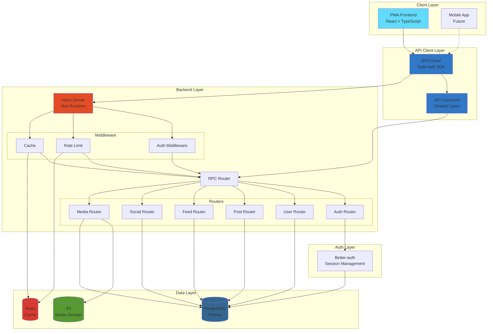

---

## RPC Request Flow

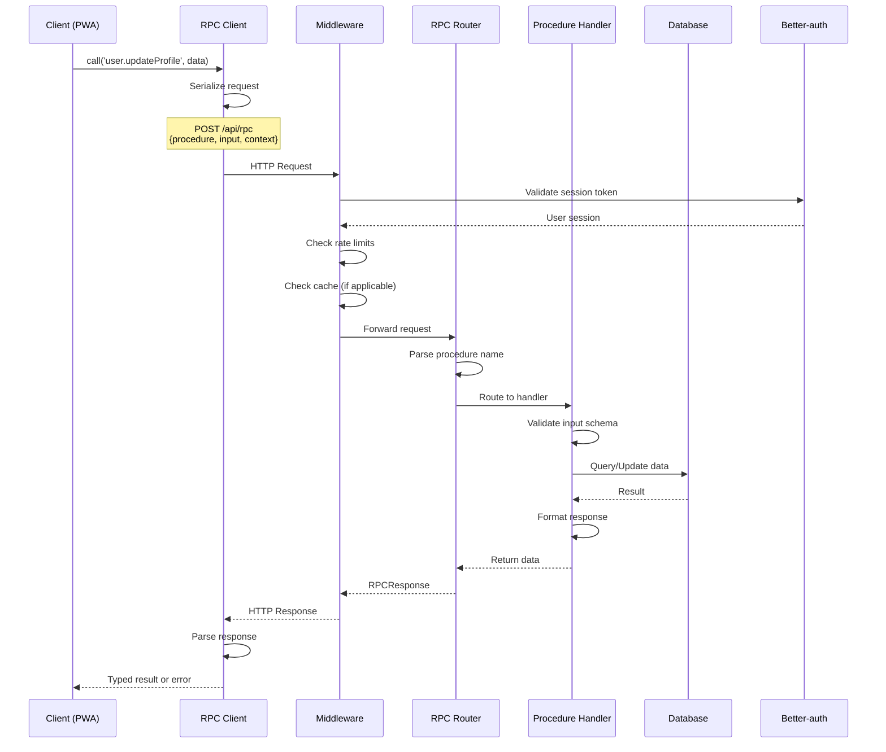

---

## Authentication Flow

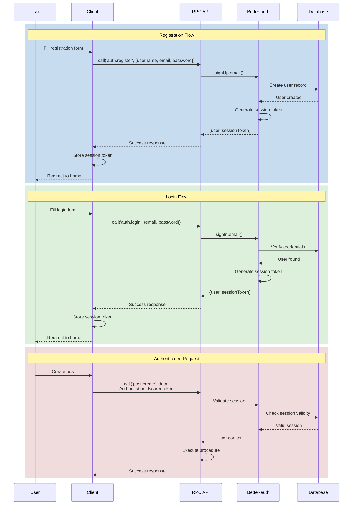

---

## File Upload Flow

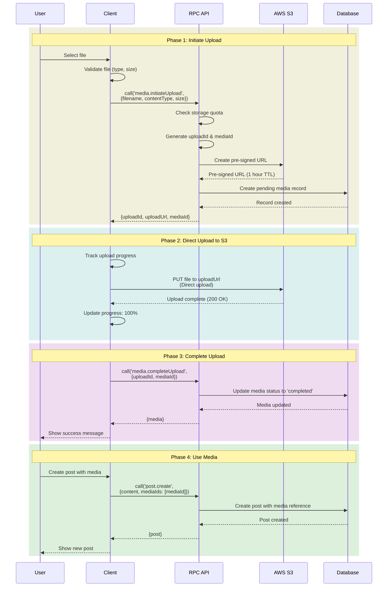

---

## Custom Feed Algorithm Flow

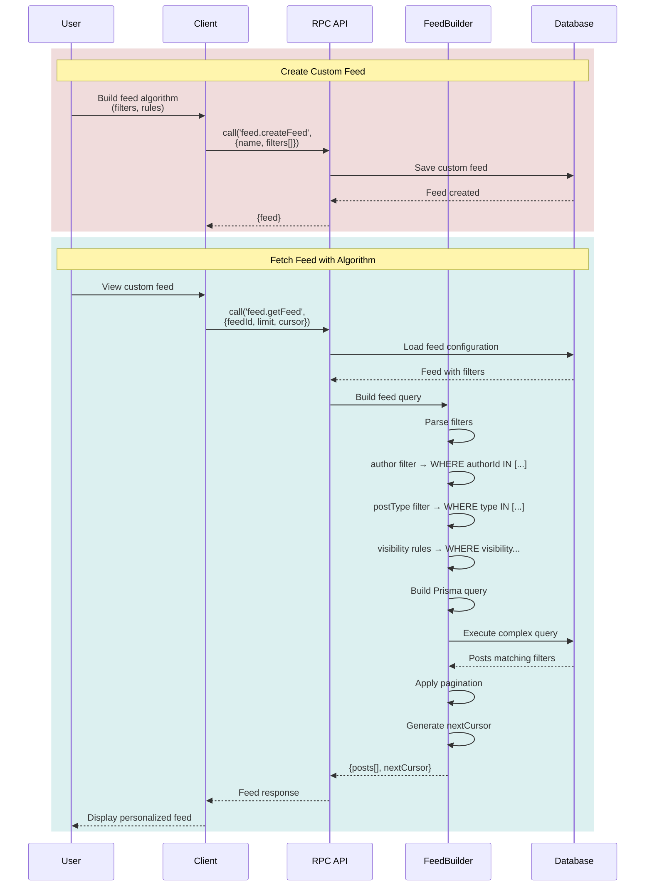

---

## Error Handling Flow

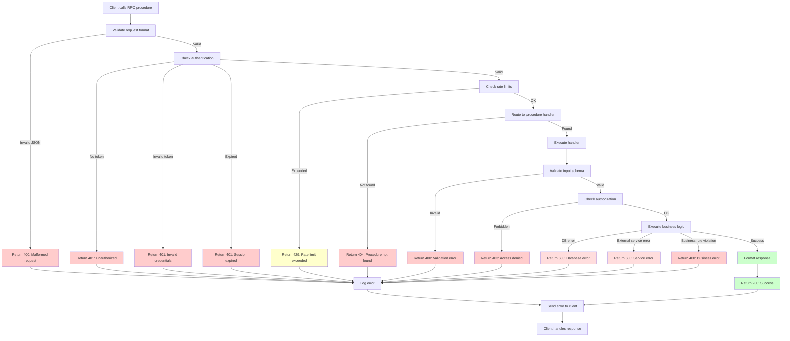

---

## Type Safety Flow

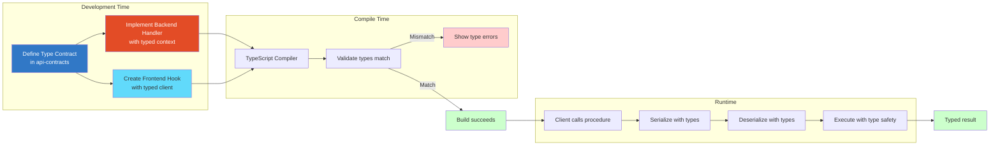

---

## Procedure Routing Diagram

```mermaid
flowchart TD
    Request[POST /api/rpc<br/>{procedure: 'user.updateProfile'}]

    Request --> Parse[Parse procedure name]
    Parse --> Split[Split by namespace<br/>namespace: 'user'<br/>operation: 'updateProfile']

    Split --> Router{RPC Router}

    Router -->|auth.*| AuthRouter[Auth Router]
    Router -->|user.*| UserRouter[User Router]
    Router -->|post.*| PostRouter[Post Router]
    Router -->|feed.*| FeedRouter[Feed Router]
    Router -->|social.*| SocialRouter[Social Router]
    Router -->|message.*| MessageRouter[Message Router]
    Router -->|notification.*| NotificationRouter[Notification Router]
    Router -->|media.*| MediaRouter[Media Router]
    Router -->|settings.*| SettingsRouter[Settings Router]
    Router -->|Unknown| NotFound[404: Procedure not found]

    UserRouter --> Handler[user.updateProfile handler]
    Handler --> Context[ProcedureContext<br/>{input, user, requestId}]
    Context --> Execute[Execute handler logic]
    Execute --> Response[Return typed response]

    style Request fill:#61dafb
    style Router fill:#e34c26,color:#fff
    style Handler fill:#3178c6,color:#fff
    style Response fill:#ccffcc
    style NotFound fill:#ffcccc
```

---

## Database Schema Relationships

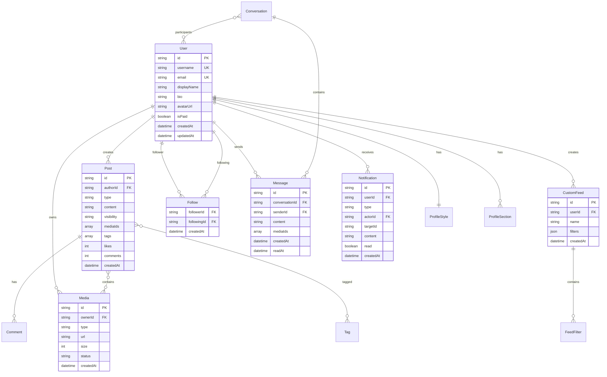

---

## Rate Limiting Architecture

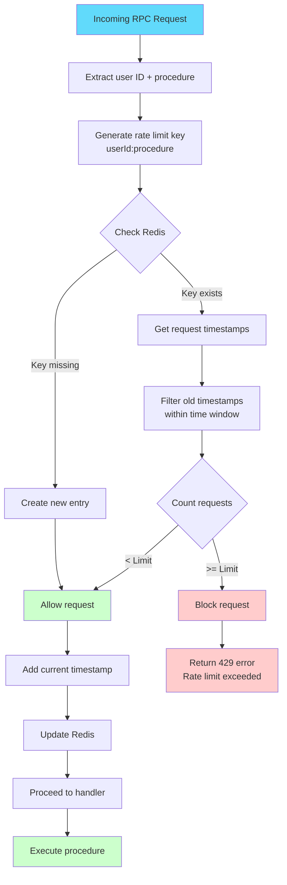

---

## Caching Strategy

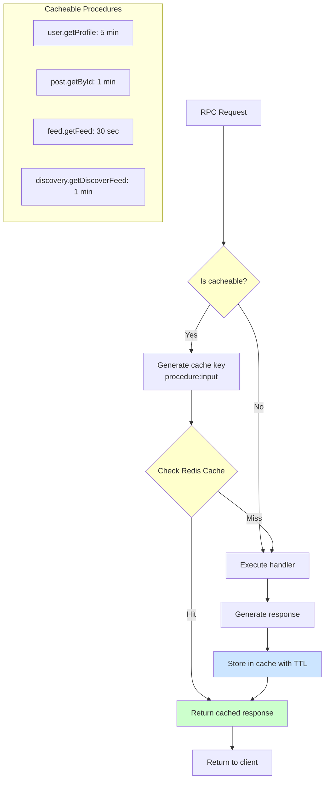

---

## Deployment Architecture

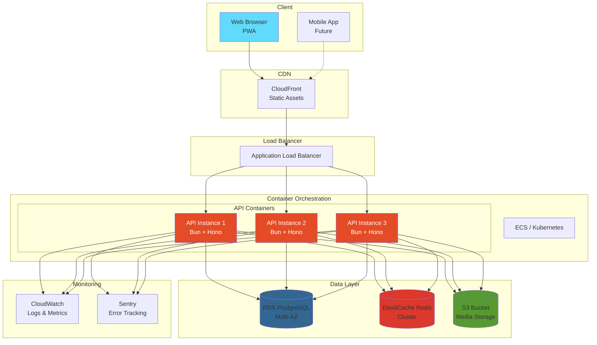

---

## Monitoring & Observability

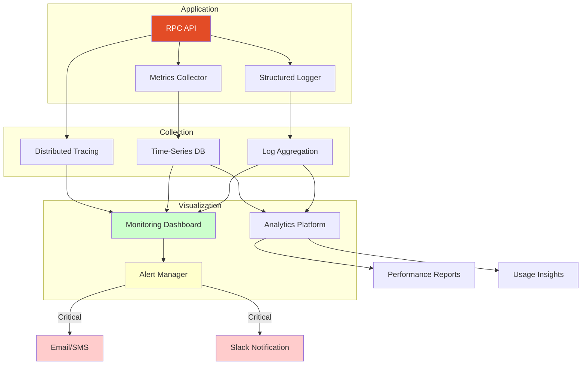

---

These diagrams provide a visual representation of the VRSS RPC API architecture, covering:

1. **System Architecture**: High-level overview of all components
2. **RPC Request Flow**: Detailed sequence of an RPC call
3. **Authentication Flow**: Complete auth lifecycle
4. **File Upload Flow**: Three-phase upload process
5. **Custom Feed Algorithm**: Feed generation logic
6. **Error Handling**: Comprehensive error flow
7. **Type Safety**: Compile-time and runtime type checking
8. **Procedure Routing**: How procedures are dispatched
9. **Database Schema**: Entity relationships
10. **Rate Limiting**: Request throttling mechanism
11. **Caching Strategy**: Response caching logic
12. **Deployment Architecture**: Production infrastructure
13. **Monitoring**: Observability setup

These diagrams complement the written documentation and provide quick visual references for understanding the system architecture.
