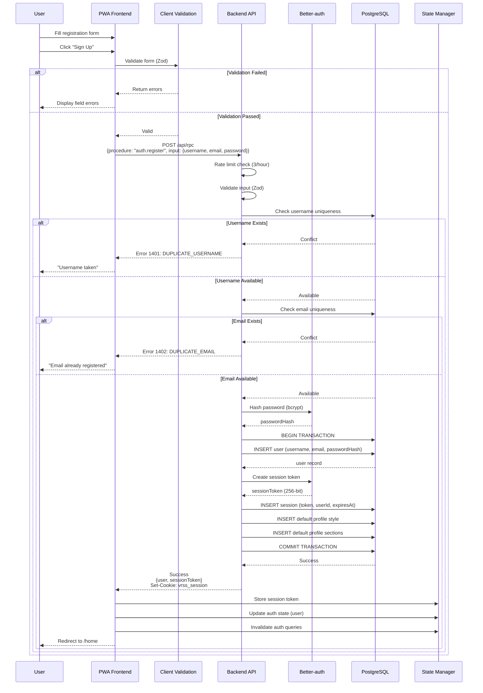
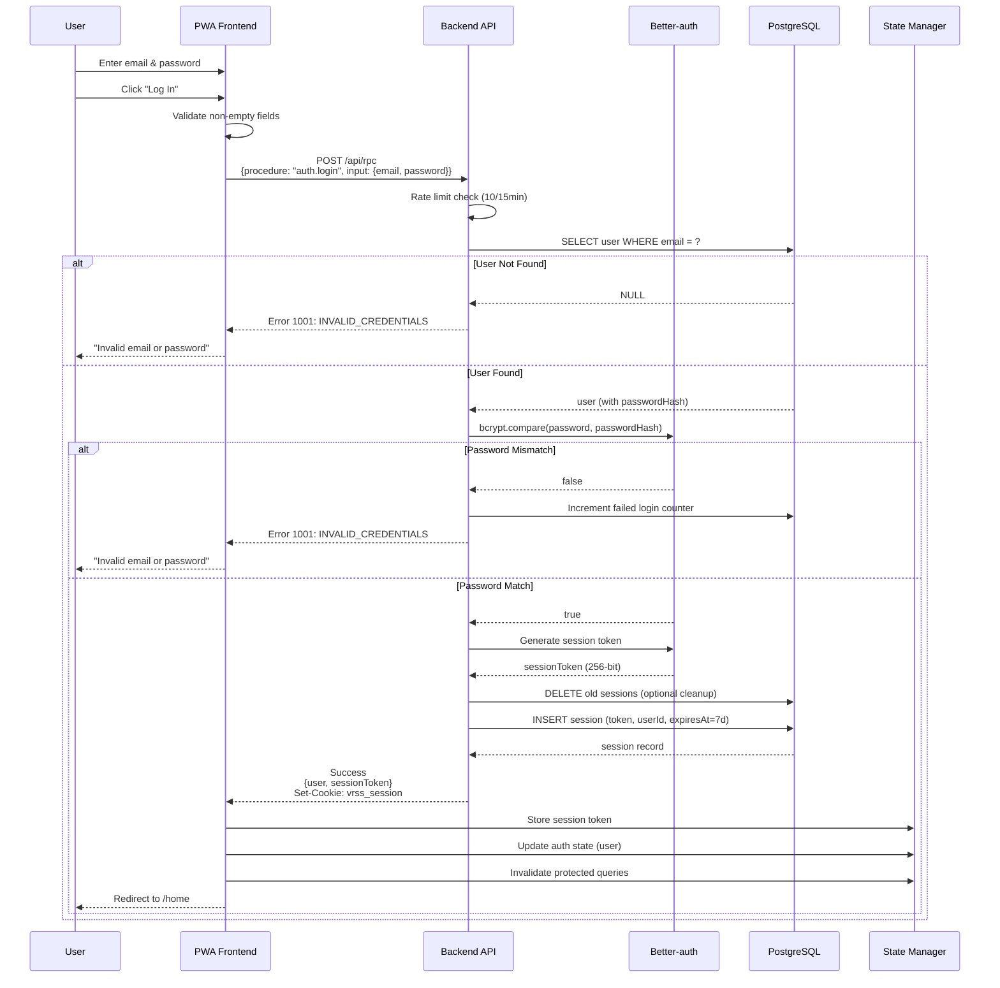
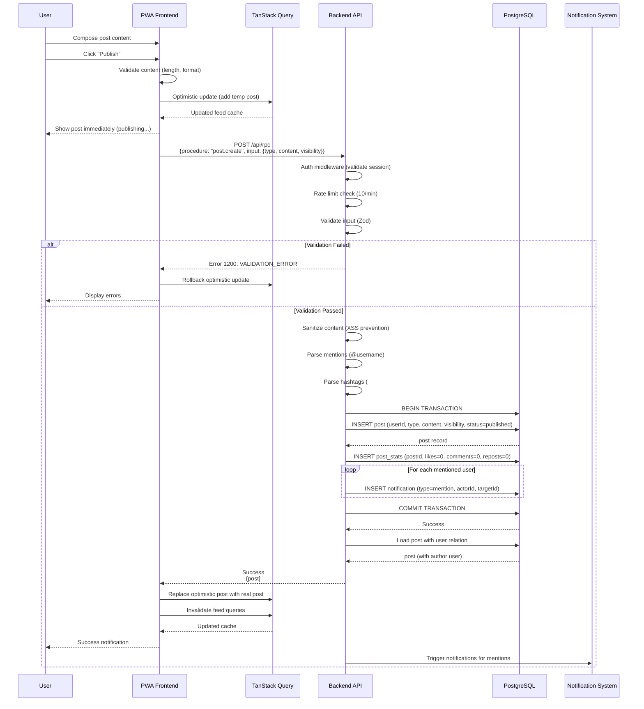
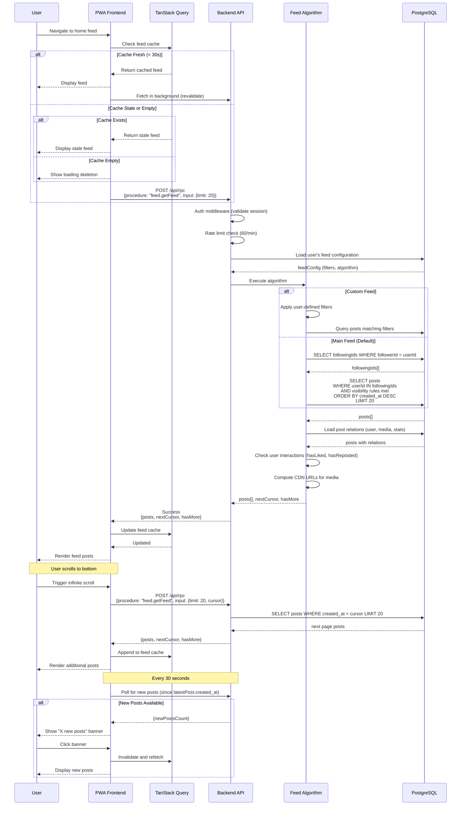
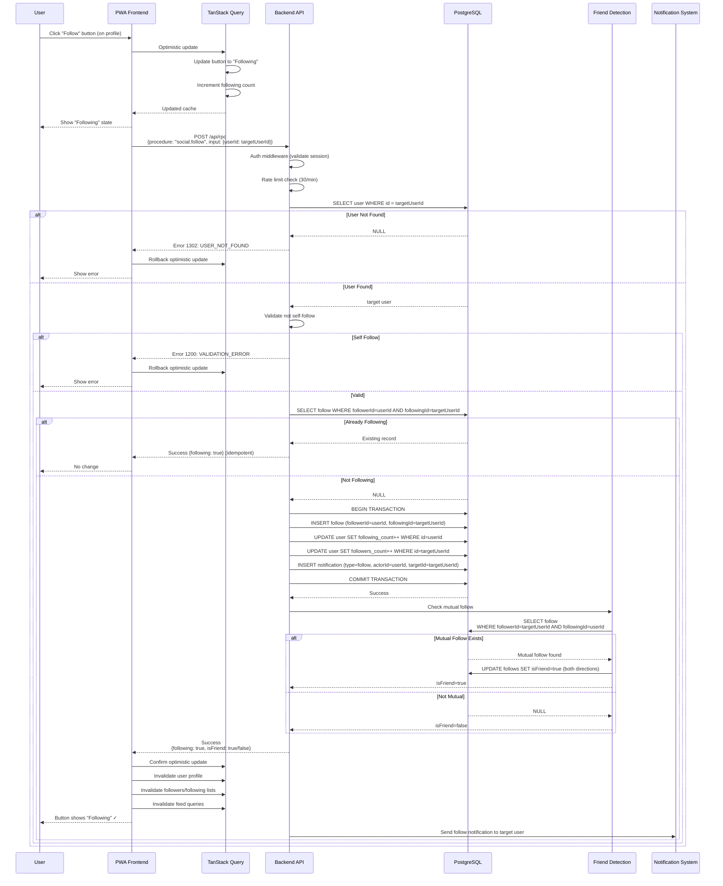
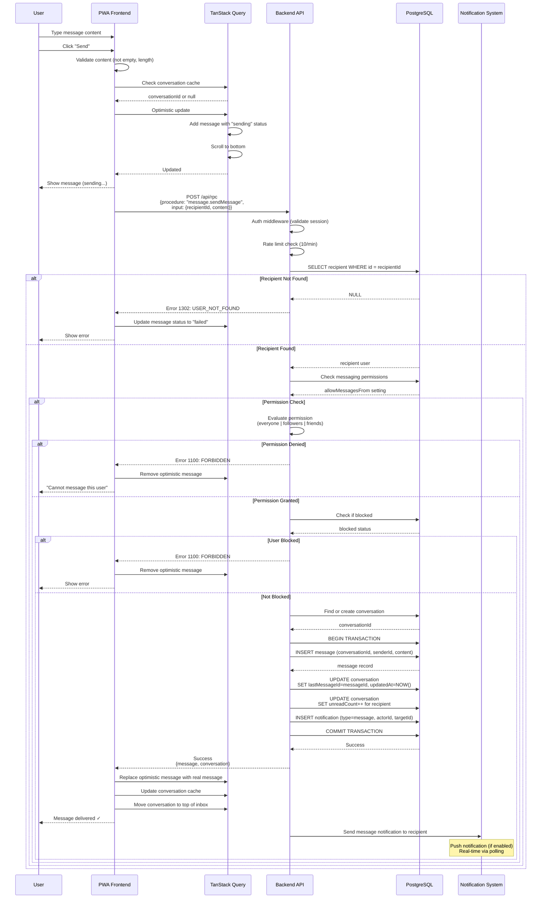
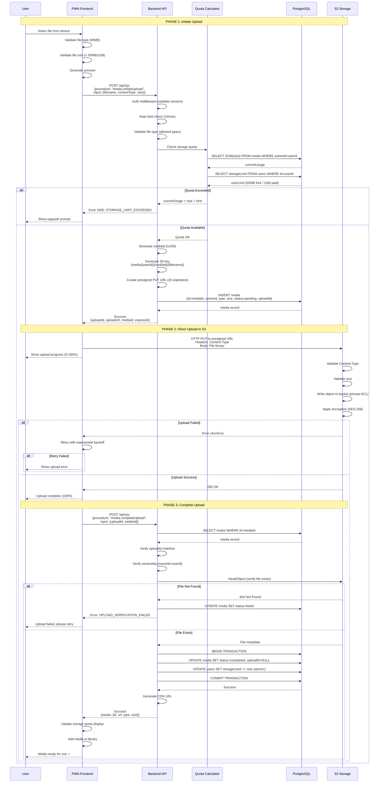

# VRSS Runtime View Documentation

**Version**: 1.0
**Date**: 2025-10-16
**Status**: Design Phase

## Table of Contents

1. [Overview](#overview)
2. [Primary User Flows](#primary-user-flows)
3. [Sequence Diagrams](#sequence-diagrams)
4. [Error Handling Strategies](#error-handling-strategies)
5. [Complex Logic Documentation](#complex-logic-documentation)

---

## Overview

This document describes the runtime behavior of the VRSS social platform MVP. It focuses on documenting how the system executes during operation, showing the dynamic interactions between components for key user journeys.

### Architecture Context

- **Pattern**: Monolith with containerized applications
- **API Style**: RPC-based (POST /api/rpc single endpoint)
- **Frontend**: React PWA with offline-first capabilities
- **Backend**: Bun runtime + Hono framework
- **Database**: PostgreSQL with Prisma ORM
- **Authentication**: Better-auth (session-based)
- **Storage**: S3-compatible (MinIO local / AWS S3 production)

### Document Scope

This runtime view covers:
- **7 primary user workflows** with step-by-step execution
- **Mermaid sequence diagrams** for each workflow
- **Error handling patterns** by error category
- **Complex algorithmic logic** (feed execution, quota calculation, friend detection)

**Reference Documents:**
- `/docs/INTEGRATION_POINTS.md` - Integration patterns and data flows
- `/docs/api-architecture.md` - RPC procedures and contracts
- `/docs/SECURITY_DESIGN.md` - Authentication and authorization
- `/docs/frontend-architecture.md` - Frontend patterns and state management

---

## Primary User Flows

### Flow 1: User Registration

**Description**: New user creates an account with username, email, and password.

**Prerequisites**: None (public endpoint)

**Steps**:

1. **User Input**: User fills registration form with username, email, and password
2. **Client Validation**: Frontend validates input format (Zod schema)
   - Username: 3-30 characters, alphanumeric + underscore
   - Email: Valid email format
   - Password: Minimum 12 characters, complexity requirements
3. **RPC Call**: Frontend calls `auth.register` procedure
4. **Transport**: HTTP POST to `/api/rpc` with JSON payload
5. **Middleware Chain**:
   - CORS validation
   - Rate limit check (3 registrations per hour per IP)
   - RPC router dispatches to auth handler
6. **Backend Validation**:
   - Re-validate input (server-side Zod schema)
   - Check username uniqueness (database query)
   - Check email uniqueness (database query)
7. **Better-auth Integration**:
   - Hash password using bcrypt (10 rounds)
   - Create user record in database
   - Create session token (256-bit cryptographic random)
   - Store session in database (7-day expiration)
8. **Database Transaction**:
   - Insert user record (username, email, passwordHash, timestamps)
   - Insert session record (token, userId, expiresAt)
   - Insert default profile style and sections
   - Commit transaction
9. **Response Generation**:
   - Construct success response with user object and session token
   - Set session cookie (HttpOnly, Secure, SameSite=Lax)
10. **Client State Update**:
    - Store session token in local storage (backup)
    - Update global auth state (Zustand store)
    - Invalidate auth queries (TanStack Query)
11. **Navigation**: Redirect to onboarding or home page

**Success Criteria**: User account created, session established, redirected to app

**Failure Modes**:
- Validation errors → Display field-specific errors
- Duplicate username/email → Display conflict error
- Rate limit exceeded → Display retry message
- Server error → Display generic error, log for investigation

---

### Flow 2: User Login

**Description**: Existing user authenticates with email and password.

**Prerequisites**: User account exists

**Steps**:

1. **User Input**: User enters email and password
2. **Client Validation**: Frontend validates non-empty fields
3. **RPC Call**: Frontend calls `auth.login` procedure
4. **Transport**: HTTP POST to `/api/rpc` with credentials
5. **Middleware Chain**:
   - CORS validation
   - Rate limit check (10 login attempts per 15 minutes per IP)
   - RPC router dispatches to auth handler
6. **Backend Processing**:
   - Find user by email (database query)
   - If user not found → throw INVALID_CREDENTIALS error
7. **Password Verification**:
   - Compare submitted password with stored hash (bcrypt compare)
   - If mismatch → throw INVALID_CREDENTIALS error
   - Update failed login counter (security monitoring)
8. **Session Creation**:
   - Generate new session token (256-bit random)
   - Delete old sessions (optional cleanup)
   - Create new session record in database
   - Set expiresAt (7 days from now)
9. **Response Generation**:
   - Construct success response with user object and session token
   - Set session cookie (HttpOnly, Secure, SameSite=Lax)
10. **Client State Update**:
    - Store session token in local storage
    - Update global auth state
    - Invalidate and refetch protected queries
11. **Navigation**: Redirect to home feed

**Success Criteria**: User authenticated, session established, redirected to home

**Failure Modes**:
- Invalid credentials → Display error, increment attempt counter
- Account locked → Display locked message
- Rate limit exceeded → Display retry after message
- Server error → Display generic error

---

### Flow 3: Create Post

**Description**: Authenticated user publishes a new post (text, image, video, or song).

**Prerequisites**: User authenticated

**Steps**:

1. **User Input**: User composes post content
   - Select post type (text_short, text_long, image, video, song)
   - Enter content (text)
   - Optionally attach media (if image/video/song)
   - Select visibility (public, followers, private)
2. **Media Upload** (if applicable):
   - See separate "Upload Media" flow
   - Receive mediaId(s) for attachment
3. **Client Validation**:
   - Content not empty
   - Content length appropriate for type (text_short: 500 chars, text_long: 5000 chars)
   - Media IDs valid (if present)
4. **Optimistic Update**:
   - Add temporary post to feed cache (TanStack Query)
   - Display post immediately with "publishing" indicator
5. **RPC Call**: Frontend calls `post.create` procedure
6. **Transport**: HTTP POST to `/api/rpc` with post data
7. **Middleware Chain**:
   - CORS validation
   - Auth middleware validates session
   - Rate limit check (10 posts per minute)
   - RPC router dispatches to post handler
8. **Backend Validation**:
   - User authenticated (from context)
   - Email verified (if required)
   - Input validation (Zod schema)
   - Media ownership verification (if media attached)
9. **Content Sanitization**:
   - Sanitize HTML/XSS from content
   - Parse and validate URLs
   - Extract mentions (@username)
   - Extract hashtags (#tag)
10. **Database Transaction**:
    - Insert post record (userId, type, content, mediaIds, visibility, status=published)
    - Update post stats (likes=0, comments=0, reposts=0)
    - Create notification records for mentioned users
    - Commit transaction
11. **Response Generation**:
    - Return post object with user relation
    - Include computed URLs for media
12. **Client Cache Update**:
    - Replace optimistic post with real post
    - Update feed cache keys
    - Invalidate relevant feed queries
13. **UI Feedback**: Display success notification

**Success Criteria**: Post created, visible in user's feed and profile

**Failure Modes**:
- Validation error → Restore draft, display errors
- Media not found → Display error, allow removal
- Rate limit → Display limit message, queue for later
- Server error → Rollback optimistic update, show error

---

### Flow 4: View Feed

**Description**: User views their personalized home feed with posts from followed users.

**Prerequisites**: User authenticated

**Steps**:

1. **Page Load**: User navigates to home feed
2. **Cache Check**: TanStack Query checks for cached feed data
   - If fresh (< 30 seconds) → Display cached data, fetch in background
   - If stale → Display cached data, fetch immediately
   - If empty → Show loading skeleton, fetch
3. **RPC Call**: Frontend calls `feed.getFeed` procedure
4. **Transport**: HTTP POST to `/api/rpc` with feed parameters
   - feedId: Optional custom feed ID (default: main timeline)
   - limit: 20 posts per page
   - cursor: Pagination cursor (undefined for first page)
5. **Middleware Chain**:
   - CORS validation
   - Auth middleware validates session
   - Rate limit check (60 requests per minute)
   - RPC router dispatches to feed handler
6. **Feed Algorithm Execution** (see Complex Logic section):
   - Load user's feed configuration (filters, custom algorithm)
   - If custom feed: Apply user-defined filters
   - If main feed: Execute default algorithm
7. **Default Feed Algorithm**:
   - Query posts from followed users (userId IN followingIds)
   - Filter by visibility rules (public OR (followers AND isFollowing) OR (private AND isFriend))
   - Apply post type filters (if configured)
   - Order by: created_at DESC (reverse chronological)
   - Pagination: cursor-based (WHERE created_at < cursor LIMIT 20)
8. **Post Hydration**:
   - Load post relations (author user, media URLs, stats)
   - Check user interactions (hasLiked, hasReposted)
   - Compute CDN URLs for media
9. **Response Generation**:
   - Return posts array with full relations
   - Return nextCursor for pagination (last post's created_at)
   - Return hasMore boolean
10. **Client Rendering**:
    - Merge new posts with cached posts
    - Update infinite query cache
    - Render feed items
11. **Infinite Scroll**: When user scrolls near bottom
    - Load next page using nextCursor
    - Append to existing feed
12. **Real-time Updates** (polling):
    - Poll for new posts every 30 seconds
    - Check for posts created_at > latestPost.created_at
    - Display "New posts available" banner
    - User clicks to refresh feed

**Success Criteria**: User sees personalized feed of recent posts from followed users

**Failure Modes**:
- Network error → Display cached data + offline banner
- Empty feed → Display onboarding prompts (follow suggestions)
- Server error → Display error state + retry button

---

### Flow 5: Follow User

**Description**: User follows another user to see their posts in feed.

**Prerequisites**: User authenticated, target user exists

**Steps**:

1. **User Action**: User clicks "Follow" button on profile or user card
2. **Optimistic Update**:
   - Update button to "Following" state
   - Increment following count locally
3. **RPC Call**: Frontend calls `social.follow` procedure
4. **Transport**: HTTP POST to `/api/rpc` with target userId
5. **Middleware Chain**:
   - CORS validation
   - Auth middleware validates session
   - Rate limit check (30 follows per minute)
   - RPC router dispatches to social handler
6. **Backend Validation**:
   - User authenticated
   - Target user exists
   - Not already following (idempotent check)
   - Not self-follow (userId !== targetUserId)
7. **Database Transaction**:
   - Insert follow record (followerId=userId, followingId=targetUserId)
   - Increment following count for current user
   - Increment followers count for target user
   - Create notification for target user (type=follow)
   - Commit transaction
8. **Friend Detection** (see Complex Logic section):
   - Check if mutual follow exists (target follows back)
   - If yes: Update friendship status (isFriend=true for both)
9. **Response Generation**:
   - Return following=true status
   - Return isFriend status (if mutual)
10. **Client Cache Update**:
    - Update user profile cache
    - Invalidate followers/following lists
    - Invalidate feed queries (new content available)
11. **UI Feedback**: Button shows "Following" with checkmark

**Success Criteria**: Follow relationship created, target's posts appear in feed

**Failure Modes**:
- Already following → No-op, return success
- Target not found → Rollback optimistic, show error
- Rate limit → Rollback, show limit message
- Server error → Rollback optimistic update

---

### Flow 6: Send Direct Message

**Description**: User sends a private message to another user.

**Prerequisites**: User authenticated, messaging permissions valid

**Steps**:

1. **User Input**: User types message content
   - Text content (1-5000 characters)
   - Optional media attachments
2. **Client Validation**:
   - Content not empty
   - Recipient exists
   - Not blocked by recipient
3. **Conversation Check**:
   - Check if conversation exists (query local cache)
   - If not: Create temporary conversation ID
4. **Optimistic Update**:
   - Add message to conversation with "sending" status
   - Scroll to bottom of messages
5. **RPC Call**: Frontend calls `message.sendMessage` procedure
6. **Transport**: HTTP POST to `/api/rpc` with message data
   - recipientId: Target user ID
   - content: Message text
   - mediaIds: Optional media attachments
7. **Middleware Chain**:
   - CORS validation
   - Auth middleware validates session
   - Rate limit check (10 messages per minute)
   - RPC router dispatches to message handler
8. **Backend Validation**:
   - User authenticated
   - Recipient exists
   - Messaging permissions check:
     - Recipient allows messages from: everyone | followers | friends
     - Verify sender meets criteria
   - Not blocked by recipient
9. **Conversation Management**:
   - Find or create conversation between users
   - Conversation participants: [senderId, recipientId] (sorted)
10. **Database Transaction**:
    - Insert message record (conversationId, senderId, content, mediaIds)
    - Update conversation.lastMessageId
    - Update conversation.updatedAt
    - Increment unreadCount for recipient
    - Create notification for recipient (type=message)
    - Commit transaction
11. **Response Generation**:
    - Return message object with conversation
    - Return updated conversation
12. **Client Cache Update**:
    - Replace optimistic message with real message
    - Update conversation lastMessage
    - Move conversation to top of inbox
13. **Recipient Notification**:
    - Push notification (if enabled)
    - Real-time update via polling (next poll cycle)

**Success Criteria**: Message sent, delivered to recipient's inbox

**Failure Modes**:
- Permission denied → Display "Cannot message this user"
- Recipient blocked → Display error
- Rate limit → Queue message for retry
- Server error → Keep in "sending" state, retry

---

### Flow 7: Upload Media (Two-Phase Pattern)

**Description**: User uploads image, video, or audio file to S3 storage.

**Prerequisites**: User authenticated, storage quota available

**Steps**:

#### Phase 1: Initiate Upload

1. **User Action**: User selects file from device
2. **Client Validation**:
   - File type check (MIME type validation)
   - File size check (< 50MB free, < 1GB paid)
   - Client-side preview generation
3. **RPC Call**: Frontend calls `media.initiateUpload` procedure
4. **Transport**: HTTP POST to `/api/rpc` with file metadata
   - filename: Original file name
   - contentType: MIME type (image/jpeg, video/mp4, etc.)
   - size: File size in bytes
5. **Middleware Chain**:
   - CORS validation
   - Auth middleware validates session
   - Rate limit check (10 uploads per minute)
   - RPC router dispatches to media handler
6. **Backend Validation**:
   - User authenticated
   - File type allowed (image/*, video/*, audio/*)
   - Content type matches allowed types
7. **Storage Quota Check** (see Complex Logic section):
   - Query current storage usage: SUM(media.size WHERE ownerId=userId)
   - Get user storage limit (50MB free, 1GB paid)
   - Check: currentUsage + fileSize <= limit
   - If exceeded: throw STORAGE_LIMIT_EXCEEDED error
8. **S3 Preparation**:
   - Generate unique mediaId (UUID)
   - Generate S3 key: `media/{userId}/{mediaId}/{filename}`
   - Create presigned PUT URL (1 hour expiration)
   - Set allowed content type and size headers
9. **Database Operation**:
   - Create pending media record
   - Status: "pending"
   - Store uploadId for verification
10. **Response Generation**:
    - Return uploadId (for tracking)
    - Return uploadUrl (presigned S3 URL)
    - Return mediaId (for reference)
    - Return expiresAt (1 hour from now)

#### Phase 2: Direct Upload to S3

11. **Client Upload**:
    - HTTP PUT to presigned URL
    - Headers: Content-Type matching file
    - Body: Raw file binary data
    - Monitor upload progress
12. **S3 Processing**:
    - Validate Content-Type header
    - Validate size constraints
    - Write object to bucket (private ACL)
    - Apply server-side encryption (AES-256)
    - Return 200 OK on success
13. **Client Progress**:
    - Display upload progress bar
    - Handle upload errors (retry with backoff)

#### Phase 3: Complete Upload

14. **RPC Call**: Frontend calls `media.completeUpload` procedure
15. **Transport**: HTTP POST to `/api/rpc` with completion data
    - uploadId: From phase 1
    - mediaId: From phase 1
16. **Backend Verification**:
    - Find media record by mediaId
    - Verify uploadId matches
    - Verify ownership (media.ownerId === userId)
17. **S3 Verification**:
    - Call S3 HeadObject to confirm file exists
    - Verify file size matches expected
    - If not found: throw UPLOAD_VERIFICATION_FAILED error
18. **Database Transaction**:
    - Update media status: "pending" → "completed"
    - Clear uploadId (no longer needed)
    - Update user storage quota: storageUsed += fileSize (atomic)
    - Commit transaction
19. **Response Generation**:
    - Return media object with CDN URL
    - Return updated storage usage
20. **Client Cache Update**:
    - Add media to user's media library
    - Update storage quota display
    - Enable media for use in posts/profile

**Success Criteria**: File uploaded to S3, media record created, quota updated

**Failure Modes**:
- Quota exceeded (phase 1) → Display upgrade prompt
- Upload timeout (phase 2) → Retry with new presigned URL
- Network failure (phase 2) → Retry with exponential backoff
- Verification failed (phase 3) → Delete pending record, allow retry
- Server error → Clean up pending records, show error

---

## Sequence Diagrams

### Diagram 1: User Registration Flow



---

### Diagram 2: User Login Flow



---

### Diagram 3: Create Post Flow



---

### Diagram 4: View Feed Flow



---

### Diagram 5: Follow User Flow



---

### Diagram 6: Send Direct Message Flow



---

### Diagram 7: Upload Media (Two-Phase) Flow



---

## Error Handling Strategies

### Error Categories and Handling Patterns

#### 1. Validation Errors (1200-1299)

**Description**: Client input fails validation rules

**Error Codes**:
- 1200: VALIDATION_ERROR (generic)
- 1201: INVALID_INPUT
- 1202: MISSING_REQUIRED_FIELD
- 1203: INVALID_FORMAT

**Backend Handling**:
```typescript
// Validation with Zod
const inputSchema = z.object({
  username: z.string().min(3).max(30),
  email: z.string().email(),
  password: z.string().min(12),
});

try {
  const validated = inputSchema.parse(input);
} catch (error) {
  throw new RPCError(
    ErrorCode.VALIDATION_ERROR,
    'Input validation failed',
    { fieldErrors: error.errors }
  );
}
```

**Frontend Handling**:
```typescript
// Display field-specific errors
if (error instanceof ClientRPCError && error.isValidationError()) {
  const fieldErrors = error.details?.fieldErrors || {};

  setFormErrors({
    username: fieldErrors.username?.[0],
    email: fieldErrors.email?.[0],
    password: fieldErrors.password?.[0],
  });

  // Keep user's input (don't clear form)
  // Don't retry automatically
}
```

**User Experience**:
- Display red error messages below each field
- Keep user's input intact
- Highlight invalid fields with red border
- No automatic retry (user must fix and resubmit)

---

#### 2. Authentication Errors (1000-1099)

**Description**: User session invalid or credentials wrong

**Error Codes**:
- 1000: UNAUTHORIZED (no session)
- 1001: INVALID_CREDENTIALS (login failed)
- 1002: SESSION_EXPIRED
- 1003: INVALID_TOKEN

**Backend Handling**:
```typescript
// Auth middleware
export async function authMiddleware(c: Context, next: Next) {
  const token = c.req.cookie('vrss_session');

  if (!token) {
    // Public procedures allowed
    if (PUBLIC_PROCEDURES.has(procedure)) {
      return next();
    }

    // Protected procedure requires auth
    throw new RPCError(
      ErrorCode.UNAUTHORIZED,
      'Authentication required'
    );
  }

  const session = await auth.validateSession(token);
  if (!session || session.expiresAt < Date.now()) {
    throw new RPCError(
      ErrorCode.SESSION_EXPIRED,
      'Your session has expired. Please log in again.'
    );
  }

  c.set('user', session.user);
  await next();
}
```

**Frontend Handling**:
```typescript
// Global error handler
if (error instanceof ClientRPCError && error.isAuthError()) {
  // Clear local auth state
  authStore.clearSession();

  // Clear all cached queries
  queryClient.clear();

  // Save current URL for redirect after login
  const returnUrl = window.location.pathname;
  localStorage.setItem('returnUrl', returnUrl);

  // Redirect to login page
  navigate('/login', {
    state: {
      message: error.code === 1002
        ? 'Your session has expired. Please log in again.'
        : 'Please log in to continue.'
    }
  });

  // No retry
}
```

**User Experience**:
- Automatic redirect to login page
- Display friendly message ("Session expired")
- Return to original page after successful login
- No data loss (draft saved if possible)

---

#### 3. Authorization Errors (1100-1199)

**Description**: User lacks permission for requested action

**Error Codes**:
- 1100: FORBIDDEN (generic)
- 1101: INSUFFICIENT_PERMISSIONS

**Backend Handling**:
```typescript
// Check ownership before update
export async function updatePost(ctx: ProcedureContext<UpdatePostInput>) {
  const post = await db.post.findUnique({
    where: { id: ctx.input.postId }
  });

  if (!post) {
    throw new RPCError(ErrorCode.POST_NOT_FOUND, 'Post not found');
  }

  if (post.userId !== ctx.user.id) {
    throw new RPCError(
      ErrorCode.FORBIDDEN,
      'You do not have permission to edit this post'
    );
  }

  // Proceed with update
}
```

**Frontend Handling**:
```typescript
// Display error in context
if (error instanceof ClientRPCError && error.code === 1100) {
  // Don't redirect, stay on current page
  toast.error(error.message, {
    duration: 5000,
    description: 'This action is not allowed for your account.',
  });

  // Rollback optimistic updates
  queryClient.invalidateQueries(['posts']);

  // No retry
}
```

**User Experience**:
- Display error toast/modal
- Explain why action is forbidden
- Suggest alternative actions if applicable
- Stay on current page (don't navigate away)

---

#### 4. Resource Not Found Errors (1300-1399)

**Description**: Requested resource doesn't exist

**Error Codes**:
- 1300: NOT_FOUND (generic)
- 1301: RESOURCE_NOT_FOUND
- 1302: USER_NOT_FOUND
- 1303: POST_NOT_FOUND

**Backend Handling**:
```typescript
export async function getPost(ctx: ProcedureContext<GetPostInput>) {
  const post = await db.post.findUnique({
    where: { id: ctx.input.postId },
    include: { user: true },
  });

  if (!post) {
    throw new RPCError(
      ErrorCode.POST_NOT_FOUND,
      `Post with ID '${ctx.input.postId}' not found`,
      { postId: ctx.input.postId }
    );
  }

  return { post };
}
```

**Frontend Handling**:
```typescript
// Display 404 UI
if (error instanceof ClientRPCError && error.isNotFoundError()) {
  // Show friendly 404 component
  setPageState('notFound');

  // Log for analytics
  analytics.track('resource_not_found', {
    resource: error.details?.postId,
    errorCode: error.code,
  });

  // No retry
}
```

**User Experience**:
- Display "Not Found" page with context
- Suggest related content
- Provide navigation back to safe pages
- No automatic retry

---

#### 5. Conflict Errors (1400-1499)

**Description**: Resource already exists or state conflict

**Error Codes**:
- 1400: CONFLICT (generic)
- 1401: DUPLICATE_USERNAME
- 1402: DUPLICATE_EMAIL
- 1403: ALREADY_FOLLOWING

**Backend Handling**:
```typescript
export async function register(ctx: ProcedureContext<RegisterInput>) {
  // Check username uniqueness
  const existingUsername = await db.user.findUnique({
    where: { username: ctx.input.username },
  });

  if (existingUsername) {
    throw new RPCError(
      ErrorCode.DUPLICATE_USERNAME,
      'This username is already taken',
      { field: 'username', value: ctx.input.username }
    );
  }

  // Check email uniqueness
  const existingEmail = await db.user.findUnique({
    where: { email: ctx.input.email },
  });

  if (existingEmail) {
    throw new RPCError(
      ErrorCode.DUPLICATE_EMAIL,
      'This email is already registered',
      { field: 'email', value: ctx.input.email }
    );
  }

  // Proceed with registration
}
```

**Frontend Handling**:
```typescript
// Display field-specific conflict
if (error instanceof ClientRPCError) {
  if (error.code === 1401) {
    setFieldError('username', 'This username is taken. Try another.');
    suggestAlternatives(ctx.input.username); // e.g., username123
  }

  if (error.code === 1402) {
    setFieldError('email', 'This email is already registered. Try logging in.');
    showLoginLink();
  }

  // Keep form data, allow user to fix
  // No retry
}
```

**User Experience**:
- Highlight conflicting field
- Suggest alternatives (username variations)
- Provide helpful links (login if email exists)
- Keep other form data intact

---

#### 6. Rate Limit Errors (1500-1599)

**Description**: User exceeded allowed request rate

**Error Codes**:
- 1500: RATE_LIMIT_EXCEEDED
- 1501: TOO_MANY_REQUESTS

**Backend Handling**:
```typescript
// Rate limiter middleware
export function rateLimiter(config: RateLimitConfig) {
  const limits = new Map<string, number[]>();

  return async (c: Context, next: Next) => {
    const key = `${c.get('user')?.id || c.req.header('x-forwarded-for')}:${procedure}`;
    const now = Date.now();
    const windowStart = now - config.windowMs;

    let timestamps = limits.get(key) || [];
    timestamps = timestamps.filter(ts => ts > windowStart);

    if (timestamps.length >= config.maxRequests) {
      const oldestTimestamp = timestamps[0];
      const retryAfter = Math.ceil((oldestTimestamp + config.windowMs - now) / 1000);

      c.header('Retry-After', retryAfter.toString());

      throw new RPCError(
        ErrorCode.RATE_LIMIT_EXCEEDED,
        `Too many requests. Please wait ${retryAfter} seconds.`,
        { retryAfter, limit: config.maxRequests, window: config.windowMs }
      );
    }

    timestamps.push(now);
    limits.set(key, timestamps);

    await next();
  };
}
```

**Frontend Handling**:
```typescript
// Respect Retry-After header
if (error instanceof ClientRPCError && error.code === 1500) {
  const retryAfter = error.details?.retryAfter || 60;

  // Show countdown timer
  toast.error(`Rate limit exceeded. Please wait ${retryAfter} seconds.`, {
    duration: retryAfter * 1000,
  });

  // Disable submit button with countdown
  setCountdown(retryAfter);
  const interval = setInterval(() => {
    setCountdown(prev => {
      if (prev <= 1) {
        clearInterval(interval);
        return 0;
      }
      return prev - 1;
    });
  }, 1000);

  // Optional: Queue for automatic retry
  if (shouldAutoRetry) {
    setTimeout(() => retry(), retryAfter * 1000);
  }
}
```

**User Experience**:
- Display countdown timer
- Disable action button until allowed
- Explain rate limit reason
- Optional: Auto-retry when allowed

---

#### 7. Storage Errors (1600-1699)

**Description**: Storage quota exceeded or file issues

**Error Codes**:
- 1600: STORAGE_LIMIT_EXCEEDED
- 1601: INVALID_FILE_TYPE
- 1602: FILE_TOO_LARGE

**Backend Handling**:
```typescript
export async function initiateUpload(ctx: ProcedureContext<InitiateUploadInput>) {
  // Validate file type
  const allowedTypes = ['image/jpeg', 'image/png', 'video/mp4', /* ... */];
  if (!allowedTypes.includes(ctx.input.contentType)) {
    throw new RPCError(
      ErrorCode.INVALID_FILE_TYPE,
      `File type '${ctx.input.contentType}' is not allowed`,
      { allowedTypes }
    );
  }

  // Check quota (see Complex Logic section)
  const usage = await calculateStorageUsage(ctx.user.id);
  const limit = ctx.user.isPaid ? 1GB : 50MB;

  if (usage + ctx.input.size > limit) {
    throw new RPCError(
      ErrorCode.STORAGE_LIMIT_EXCEEDED,
      'Storage quota exceeded',
      {
        used: usage,
        limit,
        requested: ctx.input.size,
        available: limit - usage
      }
    );
  }

  // Proceed with upload
}
```

**Frontend Handling**:
```typescript
// Display upgrade prompt
if (error instanceof ClientRPCError && error.code === 1600) {
  const { used, limit, available } = error.details;

  // Show upgrade modal
  showModal('StorageUpgradeModal', {
    currentUsage: formatBytes(used),
    currentLimit: formatBytes(limit),
    paidLimit: formatBytes(1GB),
    onUpgrade: () => navigate('/settings/upgrade'),
  });

  // No retry (user must upgrade or delete files)
}

if (error.code === 1601) {
  toast.error('Invalid file type', {
    description: `Allowed types: ${error.details.allowedTypes.join(', ')}`,
  });
}
```

**User Experience**:
- Storage exceeded: Show upgrade modal with pricing
- Invalid type: List allowed types clearly
- File too large: Display size limit
- Provide storage management link

---

#### 8. Server Errors (1900-1999)

**Description**: Internal server errors or external service failures

**Error Codes**:
- 1900: INTERNAL_SERVER_ERROR
- 1901: DATABASE_ERROR
- 1902: EXTERNAL_SERVICE_ERROR

**Backend Handling**:
```typescript
// Global error handler
try {
  // Business logic
} catch (error) {
  // Log error with context
  logger.error('Unexpected error in procedure', error, {
    procedure,
    userId: ctx.user?.id,
    requestId: ctx.requestId,
    input: ctx.input,
  });

  // Don't expose internal details to client
  if (error instanceof RPCError) {
    throw error;
  }

  // Generic error response
  throw new RPCError(
    ErrorCode.INTERNAL_SERVER_ERROR,
    process.env.NODE_ENV === 'development'
      ? error.message
      : 'An unexpected error occurred. Please try again.',
    process.env.NODE_ENV === 'development'
      ? { originalError: error.message, stack: error.stack }
      : undefined
  );
}
```

**Frontend Handling**:
```typescript
// Retry with exponential backoff
if (error instanceof ClientRPCError && error.code >= 1900) {
  // Retry strategy
  const maxRetries = 3;
  const baseDelay = 1000; // 1 second

  for (let attempt = 1; attempt <= maxRetries; attempt++) {
    try {
      const delay = baseDelay * Math.pow(2, attempt - 1);
      await sleep(delay);

      const result = await retry();
      return result;
    } catch (retryError) {
      if (attempt === maxRetries) {
        // All retries failed
        toast.error('Unable to complete request', {
          description: 'Please try again later or contact support.',
          action: {
            label: 'Report Issue',
            onClick: () => navigate('/support'),
          },
        });

        // Log to error tracking (Sentry, etc.)
        captureException(retryError, {
          context: { procedure, input, attempts: maxRetries },
        });
      }
    }
  }
}
```

**User Experience**:
- Automatic retry with exponential backoff (3 attempts)
- Display generic error message (don't expose internals)
- Provide "Report Issue" action
- Log to error tracking for investigation

---

#### 9. Network Errors

**Description**: Client-side network failures (no response from server)

**Frontend Handling**:
```typescript
// Detect network errors
try {
  const result = await apiClient.call(procedure, input);
} catch (error) {
  if (error instanceof TypeError && error.message === 'Failed to fetch') {
    // Network error (offline, DNS failure, etc.)

    // Check if truly offline
    if (!navigator.onLine) {
      toast.error('You are offline', {
        description: 'Your changes will sync when you reconnect.',
      });

      // Queue for background sync (PWA)
      if ('serviceWorker' in navigator && 'sync' in registration) {
        await registration.sync.register('sync-posts');
      }
    } else {
      // Server unreachable
      toast.error('Cannot connect to server', {
        description: 'Please check your connection and try again.',
        action: {
          label: 'Retry',
          onClick: () => retry(),
        },
      });
    }

    // Display offline UI
    setOfflineMode(true);

    // Rely on cached data
    const cachedData = queryClient.getQueryData(queryKey);
    if (cachedData) {
      return cachedData;
    }
  }
}
```

**User Experience**:
- Detect offline state (navigator.onLine)
- Display offline banner
- Use cached data when available
- Queue writes for background sync
- Show "Retry" action when back online

---

### Error Handling Best Practices

1. **Always validate on both client and server**
   - Client: Fast feedback, prevent unnecessary requests
   - Server: Security, data integrity

2. **Use type-safe error codes**
   - Enum ensures consistency
   - Client can handle errors programmatically

3. **Provide actionable error messages**
   - Tell users what went wrong AND how to fix it
   - Include retry actions, upgrade prompts, navigation links

4. **Log errors appropriately**
   - Server: Log all errors with context (user, procedure, input)
   - Client: Log unexpected errors to tracking service
   - Never log sensitive data (passwords, tokens)

5. **Graceful degradation**
   - Use cached data when possible
   - Offline support for critical features
   - Queue writes for background sync

6. **Idempotent operations**
   - Safe to retry (follow, like, etc.)
   - Use unique request IDs to detect duplicates

7. **User experience first**
   - Don't show technical error messages to users
   - Provide clear next steps
   - Save user's work when possible

---

## Complex Logic Documentation

### 1. Feed Algorithm Execution

**Purpose**: Generate personalized feed of posts for authenticated user

**Algorithm Type**: Configurable (default: reverse chronological from following)

#### Default Timeline Algorithm

**Input**:
- `userId`: Current user ID
- `feedId`: Optional custom feed ID (default: main timeline)
- `limit`: Posts per page (default: 20, max: 100)
- `cursor`: Pagination cursor (timestamp of last post)

**Steps**:

1. **Load Feed Configuration**
   ```typescript
   const feedConfig = await db.feedConfiguration.findUnique({
     where: { id: feedId || `${userId}-default` },
     include: { filters: true },
   });
   ```

2. **Get Following List**
   ```typescript
   const following = await db.follow.findMany({
     where: { followerId: userId },
     select: { followingId: true },
   });
   const followingIds = following.map(f => f.followingId);
   ```

3. **Build Base Query**
   ```typescript
   const baseWhere = {
     userId: { in: followingIds },
     status: 'published',
     ...(cursor && { createdAt: { lt: new Date(cursor) } }),
   };
   ```

4. **Apply Visibility Rules**
   ```typescript
   const visibilityWhere = {
     OR: [
       { visibility: 'public' },
       {
         visibility: 'followers',
         user: {
           followers: { some: { followerId: userId } }
         },
       },
       {
         visibility: 'private',
         user: {
           friends: { some: { friendId: userId, status: 'accepted' } },
         },
       },
     ],
   };
   ```

5. **Apply Custom Filters** (if custom feed)
   ```typescript
   for (const filter of feedConfig.filters) {
     switch (filter.type) {
       case 'author':
         if (filter.operator === 'include') {
           baseWhere.userId = { in: filter.value };
         } else {
           baseWhere.userId = { notIn: filter.value };
         }
         break;

       case 'postType':
         if (filter.operator === 'include') {
           baseWhere.type = { in: filter.value };
         } else {
           baseWhere.type = { notIn: filter.value };
         }
         break;

       case 'tag':
         if (filter.operator === 'include') {
           baseWhere.tags = { hasSome: filter.value };
         }
         break;

       case 'dateRange':
         baseWhere.createdAt = {
           gte: filter.value.start,
           lte: filter.value.end,
         };
         break;
     }
   }
   ```

6. **Execute Query**
   ```typescript
   const posts = await db.post.findMany({
     where: {
       ...baseWhere,
       ...visibilityWhere,
     },
     include: {
       user: {
         select: {
           id: true,
           username: true,
           displayName: true,
           avatarUrl: true,
         },
       },
       media: true,
       _count: {
         select: {
           likes: true,
           comments: true,
           reposts: true,
         },
       },
     },
     orderBy: { createdAt: 'desc' },
     take: limit,
   });
   ```

7. **Check User Interactions**
   ```typescript
   const postIds = posts.map(p => p.id);

   const userLikes = await db.like.findMany({
     where: { userId, postId: { in: postIds } },
     select: { postId: true },
   });
   const likedPostIds = new Set(userLikes.map(l => l.postId));

   const userReposts = await db.repost.findMany({
     where: { userId, postId: { in: postIds } },
     select: { postId: true },
   });
   const repostedPostIds = new Set(userReposts.map(r => r.postId));
   ```

8. **Hydrate Posts**
   ```typescript
   const hydratedPosts = posts.map(post => ({
     ...post,
     hasLiked: likedPostIds.has(post.id),
     hasReposted: repostedPostIds.has(post.id),
     mediaUrls: post.media.map(m => generateCDNUrl(m.url)),
     stats: {
       likes: post._count.likes,
       comments: post._count.comments,
       reposts: post._count.reposts,
     },
   }));
   ```

9. **Generate Pagination Cursor**
   ```typescript
   const nextCursor = posts.length === limit
     ? posts[posts.length - 1].createdAt.toISOString()
     : undefined;

   const hasMore = posts.length === limit;
   ```

10. **Return Result**
    ```typescript
    return {
      posts: hydratedPosts,
      nextCursor,
      hasMore,
    };
    ```

**Performance Considerations**:
- Index on `(userId, createdAt DESC)` for efficient following queries
- Index on `(createdAt DESC)` for cursor pagination
- Limit included relations to prevent N+1 queries
- Cache following list (rarely changes)
- Use database-level aggregations for counts

**Scalability**:
- Current: Single query with joins (< 10K users)
- Phase 2: Separate count queries, Redis caching (10K-100K users)
- Phase 3: Pre-computed feeds, feed service (100K-1M users)

---

### 2. Storage Quota Calculation

**Purpose**: Calculate and enforce user storage limits for media uploads

**Quota Tiers**:
- Free: 50MB
- Paid: 1GB

#### Quota Calculation Function

**Input**:
- `userId`: User ID to check quota for

**Output**:
- `used`: Current storage usage in bytes
- `limit`: Storage limit in bytes
- `available`: Remaining storage in bytes
- `percentage`: Usage as percentage (0-100)

**Algorithm**:

```typescript
async function calculateStorageQuota(userId: string): Promise<StorageQuota> {
  // 1. Get user's subscription tier
  const user = await db.user.findUnique({
    where: { id: userId },
    select: {
      id: true,
      isPaid: true,
      // Alternative: subscription tier
      // subscriptionTier: true,
    },
  });

  if (!user) {
    throw new RPCError(ErrorCode.USER_NOT_FOUND, 'User not found');
  }

  // 2. Determine storage limit based on tier
  const LIMITS = {
    FREE: 50 * 1024 * 1024,      // 50MB in bytes
    PAID: 1024 * 1024 * 1024,    // 1GB in bytes
  };

  const limit = user.isPaid ? LIMITS.PAID : LIMITS.FREE;

  // 3. Calculate current usage (sum of all completed media sizes)
  const usage = await db.media.aggregate({
    where: {
      ownerId: userId,
      status: 'completed',  // Only count completed uploads
    },
    _sum: {
      size: true,
    },
  });

  const used = usage._sum.size || 0;

  // 4. Calculate available storage
  const available = Math.max(0, limit - used);

  // 5. Calculate percentage used
  const percentage = (used / limit) * 100;

  // 6. Return quota information
  return {
    used,
    limit,
    available,
    percentage: Math.round(percentage * 100) / 100, // Round to 2 decimals
  };
}
```

#### Quota Enforcement

**Pre-Upload Check**:
```typescript
async function checkQuotaBeforeUpload(
  userId: string,
  fileSize: number
): Promise<void> {
  const quota = await calculateStorageQuota(userId);

  if (quota.used + fileSize > quota.limit) {
    throw new RPCError(
      ErrorCode.STORAGE_LIMIT_EXCEEDED,
      'Storage quota exceeded',
      {
        used: quota.used,
        limit: quota.limit,
        available: quota.available,
        requested: fileSize,
        exceededBy: (quota.used + fileSize) - quota.limit,
      }
    );
  }
}
```

**Atomic Quota Update**:
```typescript
async function updateQuotaAfterUpload(
  userId: string,
  mediaId: string,
  fileSize: number
): Promise<void> {
  // Use database transaction for atomicity
  await db.$transaction(async (tx) => {
    // 1. Update media status to completed
    await tx.media.update({
      where: { id: mediaId },
      data: { status: 'completed' },
    });

    // 2. Increment user's storage usage (atomic)
    await tx.user.update({
      where: { id: userId },
      data: {
        storageUsed: {
          increment: fileSize,
        },
      },
    });
  });
}
```

**Quota Cleanup** (failed uploads):
```typescript
async function cleanupFailedUpload(
  userId: string,
  mediaId: string
): Promise<void> {
  // Delete pending media record that was never completed
  await db.media.delete({
    where: {
      id: mediaId,
      ownerId: userId,
      status: 'pending',
    },
  });

  // Note: No quota update needed (never incremented)
}
```

#### Caching Strategy

**Cache quota for performance**:
```typescript
import { Redis } from 'ioredis';

const redis = new Redis(process.env.REDIS_URL);

async function getCachedQuota(userId: string): Promise<StorageQuota | null> {
  const cached = await redis.get(`quota:${userId}`);
  if (cached) {
    return JSON.parse(cached);
  }
  return null;
}

async function setCachedQuota(
  userId: string,
  quota: StorageQuota
): Promise<void> {
  await redis.setex(
    `quota:${userId}`,
    300, // 5 minute TTL
    JSON.stringify(quota)
  );
}

async function invalidateQuotaCache(userId: string): Promise<void> {
  await redis.del(`quota:${userId}`);
}
```

**Usage with cache**:
```typescript
async function getStorageQuotaWithCache(userId: string): Promise<StorageQuota> {
  // Try cache first
  const cached = await getCachedQuota(userId);
  if (cached) {
    return cached;
  }

  // Calculate if not cached
  const quota = await calculateStorageQuota(userId);

  // Store in cache
  await setCachedQuota(userId, quota);

  return quota;
}
```

**Performance Metrics**:
- Without cache: ~50ms (database aggregation)
- With cache: ~5ms (Redis lookup)
- Cache hit rate target: > 90%

---

### 3. Friend Detection Algorithm

**Purpose**: Automatically detect mutual follows and establish friend relationships

**Trigger**: When a new follow relationship is created

**Algorithm**:

```typescript
async function detectAndCreateFriendship(
  followerId: string,
  followingId: string
): Promise<{ isFriend: boolean; friendshipId?: string }> {
  // 1. Check if mutual follow exists
  const mutualFollow = await db.follow.findUnique({
    where: {
      followerId_followingId: {
        followerId: followingId,  // Reverse: target follows back
        followingId: followerId,
      },
    },
  });

  if (!mutualFollow) {
    // Not mutual, no friendship
    return { isFriend: false };
  }

  // 2. Mutual follow exists, create friendship
  // Check if friendship already exists (idempotent)
  const existingFriendship = await db.friendship.findFirst({
    where: {
      OR: [
        { userId: followerId, friendId: followingId },
        { userId: followingId, friendId: followerId },
      ],
    },
  });

  if (existingFriendship) {
    // Friendship already exists
    return {
      isFriend: true,
      friendshipId: existingFriendship.id
    };
  }

  // 3. Create new friendship record (bidirectional)
  const friendship = await db.$transaction(async (tx) => {
    // Create friendship for user A -> user B
    const friendship1 = await tx.friendship.create({
      data: {
        userId: followerId,
        friendId: followingId,
        status: 'accepted', // Auto-accepted (mutual follow)
        createdAt: new Date(),
      },
    });

    // Create friendship for user B -> user A
    await tx.friendship.create({
      data: {
        userId: followingId,
        friendId: followerId,
        status: 'accepted',
        createdAt: new Date(),
      },
    });

    // Update follow records to mark as friends
    await tx.follow.updateMany({
      where: {
        OR: [
          { followerId, followingId },
          { followerId: followingId, followingId: followerId },
        ],
      },
      data: {
        isFriend: true,
      },
    });

    // Increment friend counts for both users
    await tx.user.update({
      where: { id: followerId },
      data: { friendsCount: { increment: 1 } },
    });

    await tx.user.update({
      where: { id: followingId },
      data: { friendsCount: { increment: 1 } },
    });

    return friendship1;
  });

  // 4. Create notification for both users
  await Promise.all([
    db.notification.create({
      data: {
        userId: followerId,
        type: 'friendship',
        actorId: followingId,
        content: 'You are now friends!',
      },
    }),
    db.notification.create({
      data: {
        userId: followingId,
        type: 'friendship',
        actorId: followerId,
        content: 'You are now friends!',
      },
    }),
  ]);

  return {
    isFriend: true,
    friendshipId: friendship.id
  };
}
```

#### Unfriend Detection (when unfollow)

**Trigger**: When a follow relationship is deleted

```typescript
async function handleUnfollowFriendship(
  followerId: string,
  followingId: string
): Promise<void> {
  // 1. Check if they were friends
  const friendship = await db.friendship.findFirst({
    where: {
      OR: [
        { userId: followerId, friendId: followingId },
        { userId: followingId, friendId: followerId },
      ],
      status: 'accepted',
    },
  });

  if (!friendship) {
    // Not friends, no action needed
    return;
  }

  // 2. Delete friendship (no longer mutual)
  await db.$transaction(async (tx) => {
    // Delete both friendship records
    await tx.friendship.deleteMany({
      where: {
        OR: [
          { userId: followerId, friendId: followingId },
          { userId: followingId, friendId: followerId },
        ],
      },
    });

    // Update follow record (if still following from other direction)
    await tx.follow.updateMany({
      where: {
        followerId: followingId,
        followingId: followerId,
      },
      data: {
        isFriend: false,
      },
    });

    // Decrement friend counts
    await tx.user.update({
      where: { id: followerId },
      data: { friendsCount: { decrement: 1 } },
    });

    await tx.user.update({
      where: { id: followingId },
      data: { friendsCount: { decrement: 1 } },
    });
  });
}
```

#### Friendship Benefits

**Content Visibility**:
- Friends can see "private" visibility posts
- Enhanced privacy control

**Messaging Permissions**:
- If user sets `allowMessagesFrom: 'friends'`, only friends can message

**Feed Priority** (future enhancement):
- Friend posts could be weighted higher in algorithm
- Separate "Friends Feed" option

---

### 4. Custom Feed Algorithm Builder

**Purpose**: Allow users to create custom feeds using visual filter builder

**Filter Types**:

1. **Author Filter**
   - Include/Exclude specific users
   - Example: "Show only posts from @alice and @bob"

2. **Post Type Filter**
   - Include/Exclude post types (text, image, video, song)
   - Example: "Show only images and videos"

3. **Tag Filter**
   - Include posts with specific hashtags
   - Example: "Show posts tagged #photography"

4. **Date Range Filter**
   - Posts within date range
   - Example: "Show posts from last 7 days"

**Filter Combination Logic**:

```typescript
interface FeedFilter {
  id: string;
  type: 'author' | 'postType' | 'tag' | 'dateRange';
  operator: 'include' | 'exclude';
  value: any;
}

interface CustomFeedConfig {
  id: string;
  name: string;
  filters: FeedFilter[];
  combineWith: 'AND' | 'OR'; // How to combine multiple filters
}
```

**Execution**:

```typescript
async function executeCustomFeed(
  userId: string,
  feedConfig: CustomFeedConfig,
  limit: number = 20,
  cursor?: string
): Promise<{ posts: Post[]; nextCursor?: string }> {
  let baseWhere: any = {
    status: 'published',
    ...(cursor && { createdAt: { lt: new Date(cursor) } }),
  };

  // Apply visibility rules (always)
  const visibilityWhere = buildVisibilityWhere(userId);

  // Apply filters based on combineWith mode
  if (feedConfig.combineWith === 'AND') {
    // All filters must match
    for (const filter of feedConfig.filters) {
      baseWhere = applyFilter(baseWhere, filter);
    }
  } else {
    // Any filter can match (OR)
    const orClauses = feedConfig.filters.map(filter =>
      applyFilter({}, filter)
    );
    baseWhere.OR = orClauses;
  }

  // Execute query
  const posts = await db.post.findMany({
    where: {
      ...baseWhere,
      ...visibilityWhere,
    },
    include: postIncludes,
    orderBy: { createdAt: 'desc' },
    take: limit,
  });

  // Generate cursor
  const nextCursor = posts.length === limit
    ? posts[posts.length - 1].createdAt.toISOString()
    : undefined;

  return { posts, nextCursor };
}

function applyFilter(where: any, filter: FeedFilter): any {
  switch (filter.type) {
    case 'author':
      return {
        ...where,
        userId: filter.operator === 'include'
          ? { in: filter.value }
          : { notIn: filter.value },
      };

    case 'postType':
      return {
        ...where,
        type: filter.operator === 'include'
          ? { in: filter.value }
          : { notIn: filter.value },
      };

    case 'tag':
      // Assuming tags is a string array
      return {
        ...where,
        tags: filter.operator === 'include'
          ? { hasSome: filter.value }
          : { none: filter.value },
      };

    case 'dateRange':
      return {
        ...where,
        createdAt: {
          gte: new Date(filter.value.start),
          lte: new Date(filter.value.end),
        },
      };

    default:
      return where;
  }
}
```

**UI Builder** (logical blocks):

```typescript
// Example: User creates feed in UI
const feedBuilder = {
  name: 'Photography Feed',
  filters: [
    {
      type: 'postType',
      operator: 'include',
      value: ['image'],
    },
    {
      type: 'tag',
      operator: 'include',
      value: ['photography', 'photo', 'camera'],
    },
  ],
  combineWith: 'AND', // Must be image AND have photography tag
};

// Save feed
await apiClient.call('feed.createFeed', feedBuilder);
```

---

## Document Control

- **Created**: 2025-10-16
- **Last Updated**: 2025-10-16
- **Version**: 1.0
- **Status**: Complete - Design Phase
- **Next Review**: After MVP implementation begins

---

## Summary

This Runtime View documents the dynamic behavior of the VRSS social platform MVP through:

✅ **7 Primary User Flows**: Registration, Login, Create Post, View Feed, Follow User, Send Message, Upload Media
✅ **7 Mermaid Sequence Diagrams**: Visual representation of component interactions
✅ **9 Error Handling Strategies**: Comprehensive error handling by category with code examples
✅ **4 Complex Logic Algorithms**: Feed execution, storage quota calculation, friend detection, custom feed builder

**Key Patterns**:
- RPC-based communication (POST /api/rpc single endpoint)
- Session-based authentication with Better-auth
- Optimistic updates with cache invalidation
- Two-phase upload pattern for large files
- Cursor-based pagination for feeds
- Automatic friend detection on mutual follows
- Comprehensive error handling with retry strategies

**Performance Targets**:
- API response time: < 200ms (P95)
- Feed load time: < 500ms (P95)
- Media upload: Direct to S3 (no backend proxy)
- Database queries: Indexed for efficiency
- Cache hit rate: > 90% for frequent queries

**Reference Documents**:
- `/docs/INTEGRATION_POINTS.md` - Integration patterns
- `/docs/api-architecture.md` - RPC procedures
- `/docs/SECURITY_DESIGN.md` - Authentication flows
- `/docs/frontend-architecture.md` - State management
