# VRSS Social Platform - PostgreSQL Database Implementation Strategy

**Version**: 1.0
**Status**: Implementation Ready
**Last Updated**: 2025-10-16
**Related Documents**:
- Database Schema: @docs/specs/001-vrss-social-platform/DATABASE_SCHEMA.md
- Data Storage: @docs/specs/001-vrss-social-platform/DATA_STORAGE_DOCUMENTATION.md
- SDD: @docs/specs/001-vrss-social-platform/SDD.md

---

## Executive Summary

This document provides a phased implementation strategy for the VRSS PostgreSQL database, covering **19 tables**, **30+ indexes**, **8 database triggers**, and **seed data** for MVP development. The strategy follows Prisma ORM best practices and ensures zero-downtime migration paths for future production deployment.

**Key Deliverables:**
1. **4 Migration Phases** - Logical table grouping respecting foreign key dependencies
2. **3-Tier Index Strategy** - Critical vs. optimization vs. nice-to-have indexes
3. **Trigger Implementation** - Automated counter updates and storage tracking
4. **Comprehensive Seeding** - Development data with 20 test users and 100+ posts
5. **Validation Framework** - JSONB schema validation and constraint testing
6. **Testing Approach** - Testcontainers for integration tests

**Timeline Estimate**: 5-7 days for complete implementation

---

## Table of Contents

1. [Migration Phase Strategy](#migration-phase-strategy)
2. [Index Implementation Strategy](#index-implementation-strategy)
3. [Database Trigger Strategy](#database-trigger-strategy)
4. [Seeding Strategy](#seeding-strategy)
5. [JSONB Validation Strategy](#jsonb-validation-strategy)
6. [Testing Strategy](#testing-strategy)
7. [Prisma Schema Implementation](#prisma-schema-implementation)
8. [Migration Commands & Workflow](#migration-commands--workflow)

---

## Migration Phase Strategy

### Overview

Migrations are organized into **4 phases** based on foreign key dependencies and logical feature grouping. This ensures:
- **No dependency errors** - Parent tables created before children
- **Testability** - Each phase can be validated independently
- **Rollback safety** - Phases can be rolled back without breaking dependencies
- **Feature alignment** - Tables grouped by PRD features

### Dependency Graph

```mermaid
graph TB
    subgraph Phase 1 - Foundation
        Users[users]
        UserProfiles[user_profiles]
        SubscriptionTiers[subscription_tiers]
        StorageUsage[storage_usage]
    end

    subgraph Phase 2 - Content & Social
        Posts[posts]
        PostMedia[post_media]
        UserFollows[user_follows]
        Friendships[friendships]
        PostInteractions[post_interactions]
        Comments[comments]
        Reposts[reposts]
    end

    subgraph Phase 3 - Features
        ProfileSections[profile_sections]
        SectionContent[section_content]
        CustomFeeds[custom_feeds]
        FeedFilters[feed_filters]
        UserLists[user_lists]
        ListMembers[list_members]
    end

    subgraph Phase 4 - Communication
        Conversations[conversations]
        Messages[messages]
        Notifications[notifications]
        UserSubscriptions[user_subscriptions]
    end

    Users --> UserProfiles
    Users --> StorageUsage
    Users --> Posts
    Users --> UserFollows
    Users --> Friendships
    Users --> PostInteractions
    Users --> Comments
    Users --> Reposts
    Users --> ProfileSections
    Users --> CustomFeeds
    Users --> Conversations
    Users --> Messages
    Users --> Notifications
    Users --> UserSubscriptions
    Users --> UserLists

    Posts --> PostMedia
    Posts --> Comments
    Posts --> PostInteractions
    Posts --> Reposts

    ProfileSections --> SectionContent
    CustomFeeds --> FeedFilters
    UserLists --> ListMembers
    Conversations --> Messages

    SubscriptionTiers --> UserSubscriptions
```



---

## Phase 1: Foundation Tables (Core Identity)

**Purpose**: Establish user identity, authentication, and storage infrastructure

**Tables** (4):
1. `users` - Core user accounts
2. `user_profiles` - Extended profile data
3. `subscription_tiers` - Tier definitions (seed data)
4. `storage_usage` - Per-user quota tracking

**Dependencies**: None (foundation layer)

**Migration File**: `001_foundation.sql`

### Implementation Order

```sql
-- Step 1: Create ENUMs
CREATE TYPE subscription_status AS ENUM ('active', 'canceled', 'expired', 'suspended');

-- Step 2: Create users table (no dependencies)
CREATE TABLE users (
    id                  BIGSERIAL PRIMARY KEY,
    username            VARCHAR(30) NOT NULL UNIQUE,
    email               VARCHAR(255) NOT NULL UNIQUE,
    email_verified      BOOLEAN NOT NULL DEFAULT FALSE,
    password_hash       VARCHAR(255) NOT NULL,
    status              VARCHAR(20) NOT NULL DEFAULT 'active',
    created_at          TIMESTAMPTZ NOT NULL DEFAULT NOW(),
    updated_at          TIMESTAMPTZ NOT NULL DEFAULT NOW(),
    last_login_at       TIMESTAMPTZ,
    deleted_at          TIMESTAMPTZ,

    CONSTRAINT users_username_length CHECK (LENGTH(username) BETWEEN 3 AND 30),
    CONSTRAINT users_username_format CHECK (username ~ '^[a-zA-Z0-9_]+$'),
    CONSTRAINT users_status_valid CHECK (status IN ('active', 'suspended', 'deleted'))
);

-- Step 3: Create subscription_tiers (no dependencies, seed data)
CREATE TABLE subscription_tiers (
    id                  BIGSERIAL PRIMARY KEY,
    name                VARCHAR(50) NOT NULL UNIQUE,
    description         TEXT,
    storage_bytes       BIGINT NOT NULL,
    price_monthly_cents INTEGER NOT NULL,
    is_active           BOOLEAN NOT NULL DEFAULT TRUE,
    created_at          TIMESTAMPTZ NOT NULL DEFAULT NOW(),
    updated_at          TIMESTAMPTZ NOT NULL DEFAULT NOW(),

    CONSTRAINT subscription_tiers_storage_positive CHECK (storage_bytes > 0),
    CONSTRAINT subscription_tiers_price_positive CHECK (price_monthly_cents >= 0)
);

-- Step 4: Create user_profiles (depends on users)
CREATE TABLE user_profiles (
    id                  BIGSERIAL PRIMARY KEY,
    user_id             BIGINT NOT NULL UNIQUE REFERENCES users(id) ON DELETE CASCADE,
    display_name        VARCHAR(100),
    bio                 TEXT,
    age                 INTEGER,
    location            VARCHAR(100),
    website             VARCHAR(500),
    visibility          VARCHAR(20) NOT NULL DEFAULT 'public',
    background_config   JSONB NOT NULL DEFAULT '{}',
    music_config        JSONB,
    style_config        JSONB NOT NULL DEFAULT '{}',
    layout_config       JSONB NOT NULL DEFAULT '{"sections": []}',
    created_at          TIMESTAMPTZ NOT NULL DEFAULT NOW(),
    updated_at          TIMESTAMPTZ NOT NULL DEFAULT NOW(),

    CONSTRAINT user_profiles_visibility_valid CHECK (visibility IN ('public', 'followers', 'private')),
    CONSTRAINT user_profiles_age_valid CHECK (age IS NULL OR (age >= 13 AND age <= 120))
);

-- Step 5: Create storage_usage (depends on users)
CREATE TABLE storage_usage (
    id                  BIGSERIAL PRIMARY KEY,
    user_id             BIGINT NOT NULL UNIQUE REFERENCES users(id) ON DELETE CASCADE,
    used_bytes          BIGINT NOT NULL DEFAULT 0,
    quota_bytes         BIGINT NOT NULL DEFAULT 52428800,  -- 50MB default
    images_bytes        BIGINT NOT NULL DEFAULT 0,
    videos_bytes        BIGINT NOT NULL DEFAULT 0,
    audio_bytes         BIGINT NOT NULL DEFAULT 0,
    other_bytes         BIGINT NOT NULL DEFAULT 0,
    last_calculated_at  TIMESTAMPTZ NOT NULL DEFAULT NOW(),
    created_at          TIMESTAMPTZ NOT NULL DEFAULT NOW(),
    updated_at          TIMESTAMPTZ NOT NULL DEFAULT NOW(),

    CONSTRAINT storage_usage_positive CHECK (used_bytes >= 0),
    CONSTRAINT storage_usage_quota_positive CHECK (quota_bytes > 0)
);
```

### Phase 1 Indexes (Critical Only)

```sql
-- Users table indexes
CREATE INDEX idx_users_email ON users(email);
CREATE INDEX idx_users_status ON users(status) WHERE status = 'active';

-- User profiles - no additional indexes needed (user_id is UNIQUE)

-- Storage usage - no additional indexes needed (user_id is UNIQUE)
```

### Phase 1 Triggers

```sql
-- Auto-update updated_at timestamp
CREATE OR REPLACE FUNCTION update_updated_at_column()
RETURNS TRIGGER AS $$
BEGIN
    NEW.updated_at = NOW();
    RETURN NEW;
END;
$$ LANGUAGE plpgsql;

CREATE TRIGGER update_users_updated_at
    BEFORE UPDATE ON users
    FOR EACH ROW
    EXECUTE FUNCTION update_updated_at_column();

CREATE TRIGGER update_user_profiles_updated_at
    BEFORE UPDATE ON user_profiles
    FOR EACH ROW
    EXECUTE FUNCTION update_updated_at_column();

CREATE TRIGGER update_storage_usage_updated_at
    BEFORE UPDATE ON storage_usage
    FOR EACH ROW
    EXECUTE FUNCTION update_updated_at_column();
```

### Phase 1 Validation

```bash
# Run Phase 1 migration
bunx prisma migrate dev --name foundation

# Validation queries
psql $DATABASE_URL -c "SELECT tablename FROM pg_tables WHERE schemaname='public' ORDER BY tablename;"
# Expected: users, user_profiles, subscription_tiers, storage_usage

# Test foreign key constraints
psql $DATABASE_URL -c "INSERT INTO users (username, email, password_hash) VALUES ('test', 'test@test.com', 'hash');"
psql $DATABASE_URL -c "INSERT INTO user_profiles (user_id, display_name) VALUES (1, 'Test User');"
# Should succeed

psql $DATABASE_URL -c "INSERT INTO user_profiles (user_id, display_name) VALUES (999, 'Invalid');"
# Should FAIL with FK constraint error
```

**Success Criteria**:
- ✅ 4 tables created
- ✅ 3 indexes created
- ✅ 3 triggers created
- ✅ Foreign key constraints working
- ✅ CHECK constraints validated

---

## Phase 2: Content & Social Tables (Core Features)

**Purpose**: Enable core social platform functionality (posts, follows, interactions)

**Tables** (7):
1. `posts` - All user content
2. `post_media` - Media file metadata
3. `user_follows` - Follower relationships
4. `friendships` - Friend relationships
5. `post_interactions` - Likes, bookmarks
6. `comments` - Post comments
7. `reposts` - Reposts

**Dependencies**: `users`, `posts`

**Migration File**: `002_content_social.sql`

### Implementation Order

```sql
-- Step 1: Create post-related ENUMs
CREATE TYPE post_type AS ENUM (
    'text_short', 'text_long', 'image', 'image_gallery',
    'gif', 'video_short', 'video_long', 'song', 'album'
);

CREATE TYPE post_status AS ENUM ('draft', 'published', 'scheduled', 'deleted');
CREATE TYPE media_type AS ENUM ('image', 'gif', 'video', 'audio', 'document');
CREATE TYPE interaction_type AS ENUM ('like', 'bookmark', 'share');

-- Step 2: Create posts (depends on users)
CREATE TABLE posts (
    id                  BIGSERIAL PRIMARY KEY,
    user_id             BIGINT NOT NULL REFERENCES users(id) ON DELETE CASCADE,
    type                post_type NOT NULL,
    status              post_status NOT NULL DEFAULT 'published',
    title               VARCHAR(200),
    content             TEXT,
    content_html        TEXT,
    media_urls          JSONB,
    thumbnail_url       VARCHAR(500),
    likes_count         INTEGER NOT NULL DEFAULT 0,
    comments_count      INTEGER NOT NULL DEFAULT 0,
    reposts_count       INTEGER NOT NULL DEFAULT 0,
    views_count         INTEGER NOT NULL DEFAULT 0,
    published_at        TIMESTAMPTZ,
    scheduled_for       TIMESTAMPTZ,
    created_at          TIMESTAMPTZ NOT NULL DEFAULT NOW(),
    updated_at          TIMESTAMPTZ NOT NULL DEFAULT NOW(),
    deleted_at          TIMESTAMPTZ,

    CONSTRAINT posts_title_length CHECK (title IS NULL OR LENGTH(title) <= 200)
);

-- Step 3: Create post_media (depends on posts AND users)
CREATE TABLE post_media (
    id                  BIGSERIAL PRIMARY KEY,
    post_id             BIGINT NOT NULL REFERENCES posts(id) ON DELETE CASCADE,
    user_id             BIGINT NOT NULL REFERENCES users(id) ON DELETE CASCADE,
    type                media_type NOT NULL,
    file_url            VARCHAR(500) NOT NULL,
    file_size_bytes     BIGINT NOT NULL,
    mime_type           VARCHAR(100) NOT NULL,
    width               INTEGER,
    height              INTEGER,
    duration_seconds    INTEGER,
    thumbnail_url       VARCHAR(500),
    display_order       INTEGER NOT NULL DEFAULT 0,
    created_at          TIMESTAMPTZ NOT NULL DEFAULT NOW(),

    CONSTRAINT post_media_file_size_positive CHECK (file_size_bytes > 0)
);

-- Step 4: Create social relationship tables (depend on users)
CREATE TABLE user_follows (
    id                  BIGSERIAL PRIMARY KEY,
    follower_id         BIGINT NOT NULL REFERENCES users(id) ON DELETE CASCADE,
    following_id        BIGINT NOT NULL REFERENCES users(id) ON DELETE CASCADE,
    created_at          TIMESTAMPTZ NOT NULL DEFAULT NOW(),

    CONSTRAINT user_follows_no_self_follow CHECK (follower_id != following_id),
    CONSTRAINT user_follows_unique UNIQUE (follower_id, following_id)
);

CREATE TABLE friendships (
    id                  BIGSERIAL PRIMARY KEY,
    user_id_1           BIGINT NOT NULL REFERENCES users(id) ON DELETE CASCADE,
    user_id_2           BIGINT NOT NULL REFERENCES users(id) ON DELETE CASCADE,
    created_at          TIMESTAMPTZ NOT NULL DEFAULT NOW(),

    CONSTRAINT friendships_no_self CHECK (user_id_1 != user_id_2),
    CONSTRAINT friendships_ordered CHECK (user_id_1 < user_id_2),
    CONSTRAINT friendships_unique UNIQUE (user_id_1, user_id_2)
);

-- Step 5: Create interaction tables (depend on users AND posts)
CREATE TABLE post_interactions (
    id                  BIGSERIAL PRIMARY KEY,
    user_id             BIGINT NOT NULL REFERENCES users(id) ON DELETE CASCADE,
    post_id             BIGINT NOT NULL REFERENCES posts(id) ON DELETE CASCADE,
    type                interaction_type NOT NULL,
    created_at          TIMESTAMPTZ NOT NULL DEFAULT NOW(),

    CONSTRAINT post_interactions_unique UNIQUE (user_id, post_id, type)
);

CREATE TABLE comments (
    id                  BIGSERIAL PRIMARY KEY,
    post_id             BIGINT NOT NULL REFERENCES posts(id) ON DELETE CASCADE,
    user_id             BIGINT NOT NULL REFERENCES users(id) ON DELETE CASCADE,
    parent_comment_id   BIGINT REFERENCES comments(id) ON DELETE CASCADE,
    content             TEXT NOT NULL,
    content_html        TEXT,
    likes_count         INTEGER NOT NULL DEFAULT 0,
    replies_count       INTEGER NOT NULL DEFAULT 0,
    created_at          TIMESTAMPTZ NOT NULL DEFAULT NOW(),
    updated_at          TIMESTAMPTZ NOT NULL DEFAULT NOW(),
    deleted_at          TIMESTAMPTZ,

    CONSTRAINT comments_content_not_empty CHECK (LENGTH(TRIM(content)) > 0)
);

CREATE TABLE reposts (
    id                  BIGSERIAL PRIMARY KEY,
    user_id             BIGINT NOT NULL REFERENCES users(id) ON DELETE CASCADE,
    post_id             BIGINT NOT NULL REFERENCES posts(id) ON DELETE CASCADE,
    comment             TEXT,
    created_at          TIMESTAMPTZ NOT NULL DEFAULT NOW(),

    CONSTRAINT reposts_unique UNIQUE (user_id, post_id)
);
```

### Phase 2 Indexes (Critical for Feed Performance)

```sql
-- Posts indexes (MOST CRITICAL FOR MVP)
CREATE INDEX idx_posts_user_created
    ON posts(user_id, created_at DESC, status)
    WHERE deleted_at IS NULL;

CREATE INDEX idx_posts_type_created
    ON posts(type, created_at DESC)
    WHERE status = 'published' AND deleted_at IS NULL;

CREATE INDEX idx_posts_engagement_created
    ON posts(likes_count DESC, created_at DESC)
    WHERE status = 'published' AND deleted_at IS NULL;

CREATE INDEX idx_posts_user_status
    ON posts(user_id, status, created_at DESC);

-- Post media indexes
CREATE INDEX idx_post_media_post
    ON post_media(post_id, display_order);

CREATE INDEX idx_post_media_user_size
    ON post_media(user_id, created_at DESC);

-- Social graph indexes (CRITICAL)
CREATE INDEX idx_user_follows_follower
    ON user_follows(follower_id, created_at DESC);

CREATE INDEX idx_user_follows_following
    ON user_follows(following_id, created_at DESC);

CREATE INDEX idx_user_follows_both
    ON user_follows(follower_id, following_id);

CREATE INDEX idx_friendships_user1
    ON friendships(user_id_1, created_at DESC);

CREATE INDEX idx_friendships_user2
    ON friendships(user_id_2, created_at DESC);

-- Interaction indexes
CREATE INDEX idx_post_interactions_user_post
    ON post_interactions(user_id, post_id, type);

CREATE INDEX idx_post_interactions_post_type
    ON post_interactions(post_id, type, created_at DESC);

-- Comment indexes
CREATE INDEX idx_comments_post_created
    ON comments(post_id, created_at DESC)
    WHERE deleted_at IS NULL;

CREATE INDEX idx_comments_parent
    ON comments(parent_comment_id, created_at DESC)
    WHERE parent_comment_id IS NOT NULL AND deleted_at IS NULL;

-- Repost indexes
CREATE INDEX idx_reposts_user
    ON reposts(user_id, created_at DESC);

CREATE INDEX idx_reposts_post
    ON reposts(post_id, created_at DESC);
```

### Phase 2 Triggers (Counter Updates)

```sql
-- Trigger: Update post likes count
CREATE OR REPLACE FUNCTION update_post_likes_count()
RETURNS TRIGGER AS $$
BEGIN
    IF TG_OP = 'INSERT' AND NEW.type = 'like' THEN
        UPDATE posts SET likes_count = likes_count + 1 WHERE id = NEW.post_id;
    ELSIF TG_OP = 'DELETE' AND OLD.type = 'like' THEN
        UPDATE posts SET likes_count = GREATEST(likes_count - 1, 0) WHERE id = OLD.post_id;
    END IF;
    RETURN NULL;
END;
$$ LANGUAGE plpgsql;

CREATE TRIGGER trigger_update_post_likes_count
AFTER INSERT OR DELETE ON post_interactions
FOR EACH ROW
EXECUTE FUNCTION update_post_likes_count();

-- Trigger: Update post comments count
CREATE OR REPLACE FUNCTION update_post_comments_count()
RETURNS TRIGGER AS $$
BEGIN
    IF TG_OP = 'INSERT' THEN
        UPDATE posts SET comments_count = comments_count + 1 WHERE id = NEW.post_id;
    ELSIF TG_OP = 'DELETE' THEN
        UPDATE posts SET comments_count = GREATEST(comments_count - 1, 0) WHERE id = OLD.post_id;
    END IF;
    RETURN NULL;
END;
$$ LANGUAGE plpgsql;

CREATE TRIGGER trigger_update_post_comments_count
AFTER INSERT OR DELETE ON comments
FOR EACH ROW
EXECUTE FUNCTION update_post_comments_count();

-- Trigger: Auto-create friendship on mutual follow
CREATE OR REPLACE FUNCTION create_friendship_on_mutual_follow()
RETURNS TRIGGER AS $$
BEGIN
    IF EXISTS (
        SELECT 1 FROM user_follows
        WHERE follower_id = NEW.following_id
        AND following_id = NEW.follower_id
    ) THEN
        INSERT INTO friendships (user_id_1, user_id_2)
        VALUES (
            LEAST(NEW.follower_id, NEW.following_id),
            GREATEST(NEW.follower_id, NEW.following_id)
        )
        ON CONFLICT (user_id_1, user_id_2) DO NOTHING;
    END IF;
    RETURN NEW;
END;
$$ LANGUAGE plpgsql;

CREATE TRIGGER trigger_create_friendship
AFTER INSERT ON user_follows
FOR EACH ROW
EXECUTE FUNCTION create_friendship_on_mutual_follow();

-- Trigger: Storage tracking on media insert
CREATE OR REPLACE FUNCTION update_storage_on_media_insert()
RETURNS TRIGGER AS $$
BEGIN
    INSERT INTO storage_usage (user_id, used_bytes, images_bytes, videos_bytes, audio_bytes, other_bytes)
    VALUES (
        NEW.user_id,
        NEW.file_size_bytes,
        CASE WHEN NEW.type = 'image' THEN NEW.file_size_bytes ELSE 0 END,
        CASE WHEN NEW.type = 'video' THEN NEW.file_size_bytes ELSE 0 END,
        CASE WHEN NEW.type = 'audio' THEN NEW.file_size_bytes ELSE 0 END,
        CASE WHEN NEW.type NOT IN ('image', 'video', 'audio') THEN NEW.file_size_bytes ELSE 0 END
    )
    ON CONFLICT (user_id) DO UPDATE
    SET
        used_bytes = storage_usage.used_bytes + NEW.file_size_bytes,
        images_bytes = storage_usage.images_bytes + CASE WHEN NEW.type = 'image' THEN NEW.file_size_bytes ELSE 0 END,
        videos_bytes = storage_usage.videos_bytes + CASE WHEN NEW.type = 'video' THEN NEW.file_size_bytes ELSE 0 END,
        audio_bytes = storage_usage.audio_bytes + CASE WHEN NEW.type = 'audio' THEN NEW.file_size_bytes ELSE 0 END,
        other_bytes = storage_usage.other_bytes + CASE WHEN NEW.type NOT IN ('image', 'video', 'audio') THEN NEW.file_size_bytes ELSE 0 END,
        updated_at = NOW();

    RETURN NEW;
END;
$$ LANGUAGE plpgsql;

CREATE TRIGGER trigger_update_storage_insert
AFTER INSERT ON post_media
FOR EACH ROW
EXECUTE FUNCTION update_storage_on_media_insert();

-- Trigger: Storage tracking on media delete
CREATE OR REPLACE FUNCTION update_storage_on_media_delete()
RETURNS TRIGGER AS $$
BEGIN
    UPDATE storage_usage
    SET
        used_bytes = GREATEST(used_bytes - OLD.file_size_bytes, 0),
        images_bytes = GREATEST(images_bytes - CASE WHEN OLD.type = 'image' THEN OLD.file_size_bytes ELSE 0 END, 0),
        videos_bytes = GREATEST(videos_bytes - CASE WHEN OLD.type = 'video' THEN OLD.file_size_bytes ELSE 0 END, 0),
        audio_bytes = GREATEST(audio_bytes - CASE WHEN OLD.type = 'audio' THEN OLD.file_size_bytes ELSE 0 END, 0),
        other_bytes = GREATEST(other_bytes - CASE WHEN OLD.type NOT IN ('image', 'video', 'audio') THEN OLD.file_size_bytes ELSE 0 END, 0),
        updated_at = NOW()
    WHERE user_id = OLD.user_id;

    RETURN OLD;
END;
$$ LANGUAGE plpgsql;

CREATE TRIGGER trigger_update_storage_delete
AFTER DELETE ON post_media
FOR EACH ROW
EXECUTE FUNCTION update_storage_on_media_delete();
```

### Phase 2 Validation

```bash
# Test post creation with media
psql $DATABASE_URL <<EOF
INSERT INTO posts (user_id, type, status, content, published_at)
VALUES (1, 'text_short', 'published', 'Test post', NOW());

INSERT INTO post_media (post_id, user_id, type, file_url, file_size_bytes, mime_type)
VALUES (1, 1, 'image', 's3://test.jpg', 1024000, 'image/jpeg');
EOF

# Verify storage_usage updated
psql $DATABASE_URL -c "SELECT used_bytes, images_bytes FROM storage_usage WHERE user_id = 1;"
# Expected: used_bytes = 1024000, images_bytes = 1024000

# Test follow and friendship creation
psql $DATABASE_URL <<EOF
INSERT INTO user_follows (follower_id, following_id) VALUES (1, 2);
INSERT INTO user_follows (follower_id, following_id) VALUES (2, 1);
EOF

# Verify friendship created
psql $DATABASE_URL -c "SELECT * FROM friendships WHERE user_id_1 = 1 AND user_id_2 = 2;"
# Expected: 1 row returned

# Test like counter
psql $DATABASE_URL <<EOF
INSERT INTO post_interactions (user_id, post_id, type) VALUES (2, 1, 'like');
EOF

psql $DATABASE_URL -c "SELECT likes_count FROM posts WHERE id = 1;"
# Expected: likes_count = 1
```

**Success Criteria**:
- ✅ 7 tables created
- ✅ 16 indexes created
- ✅ 6 triggers created
- ✅ Counter updates working (likes_count, comments_count)
- ✅ Friendship auto-creation working
- ✅ Storage tracking working

---

## Phase 3: Feature Tables (Profile & Feed Customization)

**Purpose**: Enable profile customization and custom feed algorithms

**Tables** (6):
1. `profile_sections` - User-defined sections
2. `section_content` - Content within sections
3. `custom_feeds` - User-created feeds
4. `feed_filters` - Feed algorithm filters
5. `user_lists` - User-created lists
6. `list_members` - List membership

**Dependencies**: `users`, `profile_sections`, `custom_feeds`, `user_lists`

**Migration File**: `003_features.sql`

### Implementation (Condensed)

```sql
-- ENUMs
CREATE TYPE section_type AS ENUM (
    'feed', 'gallery', 'links', 'static_text', 'static_image',
    'video', 'reposts', 'friends', 'followers', 'following', 'list'
);

CREATE TYPE filter_type AS ENUM ('post_type', 'author', 'tag', 'date_range', 'engagement');
CREATE TYPE filter_operator AS ENUM ('equals', 'not_equals', 'contains', 'greater_than', 'less_than', 'in_range');

-- Tables: profile_sections, section_content, custom_feeds, feed_filters, user_lists, list_members
-- (Full SQL in DATABASE_SCHEMA.md)
```

### Phase 3 Indexes

```sql
CREATE INDEX idx_profile_sections_user_order
    ON profile_sections(user_id, display_order)
    WHERE is_visible = TRUE;

CREATE INDEX idx_section_content_section_order
    ON section_content(section_id, display_order);

CREATE INDEX idx_custom_feeds_user
    ON custom_feeds(user_id, display_order);

CREATE INDEX idx_feed_filters_feed
    ON feed_filters(feed_id, group_id, display_order);

CREATE INDEX idx_feed_filters_type
    ON feed_filters(type, feed_id);
```

---

## Phase 4: Communication Tables (Messages & Notifications)

**Purpose**: Enable real-time communication and notifications

**Tables** (3):
1. `conversations` - Message threads
2. `messages` - Individual messages
3. `notifications` - User notifications
4. `user_subscriptions` - Subscription records

**Dependencies**: `users`, `conversations`, `posts`, `comments`, `subscription_tiers`

**Migration File**: `004_communication.sql`

### Key Features

- **Array-based participants** for group DM support
- **GIN indexes** on arrays for fast lookups
- **Soft deletes** for messages
- **Notification type system**

### Phase 4 Indexes

```sql
-- Conversations (GIN for array search)
CREATE INDEX idx_conversations_participants
    ON conversations USING GIN(participant_ids);

-- Messages
CREATE INDEX idx_messages_conversation_created
    ON messages(conversation_id, created_at DESC)
    WHERE deleted_at IS NULL;

CREATE INDEX idx_messages_unread
    ON messages USING GIN(read_by)
    WHERE deleted_at IS NULL;

-- Notifications
CREATE INDEX idx_notifications_user_unread
    ON notifications(user_id, created_at DESC)
    WHERE is_read = FALSE;

CREATE INDEX idx_notifications_user_created
    ON notifications(user_id, created_at DESC);
```

---

## Index Implementation Strategy

### 3-Tier Index Strategy

**Tier 1: Critical (Must Have for MVP Launch)**

Priority: Implement **immediately** in Phase 1-2 migrations

| Index Name | Table | Columns | Why Critical |
|------------|-------|---------|--------------|
| `idx_posts_user_created` | posts | (user_id, created_at DESC, status) | **Feed generation** - 100% of feed queries use this |
| `idx_posts_type_created` | posts | (type, created_at DESC) | **Custom feeds** - Filter by post type |
| `idx_user_follows_follower` | user_follows | (follower_id, created_at DESC) | **Feed generation** - Subquery for followed users |
| `idx_user_follows_following` | user_follows | (following_id, created_at DESC) | **Profile followers/following** lists |
| `idx_friendships_user1` | friendships | (user_id_1, created_at DESC) | **Friend lookups** - 50% of queries |
| `idx_friendships_user2` | friendships | (user_id_2, created_at DESC) | **Friend lookups** - other 50% |
| `idx_comments_post_created` | comments | (post_id, created_at DESC) WHERE deleted_at IS NULL | **Comment threads** - Every post detail view |
| `idx_notifications_user_unread` | notifications | (user_id, created_at DESC) WHERE is_read = FALSE | **Unread count** - Every page load |

**Impact**: Without these, feed generation >500ms, with these <50ms

**Tier 2: Optimization (Implement After Testing Shows Need)**

Priority: Add **if monitoring shows slow queries**

| Index Name | Table | Columns | Why Useful |
|------------|-------|---------|------------|
| `idx_posts_engagement_created` | posts | (likes_count DESC, created_at DESC) | **Discovery page** - Popular posts |
| `idx_post_interactions_user_post` | post_interactions | (user_id, post_id, type) | **Like status check** - "Did user X like post Y?" |
| `idx_post_media_user_size` | post_media | (user_id, created_at DESC) | **Storage recalculation** - Weekly cron job |
| `idx_custom_feeds_user` | custom_feeds | (user_id, display_order) | **Feed switcher** - User's feed list |
| `idx_profile_sections_user_order` | profile_sections | (user_id, display_order) WHERE is_visible | **Profile rendering** - Load sections |

**Impact**: 20-50% query time reduction, not blocking

**Tier 3: Nice-to-Have (Future Optimization)**

Priority: Add **only if user feedback or monitoring indicates value**

| Index Name | Table | Columns | Why Future |
|------------|-------|---------|------------|
| `idx_posts_media_urls_gin` | posts | media_urls (GIN) | JSONB queries (rare for MVP) |
| `idx_user_profiles_style_config_gin` | user_profiles | style_config (GIN) | Advanced profile search (future) |
| `idx_feed_filters_type` | feed_filters | (type, feed_id) | Complex feed queries (edge case) |

**Impact**: <10% query time reduction, very specific use cases

### Index Creation Strategy

```sql
-- ALWAYS create indexes AFTER data is inserted (during seed phase)
-- PostgreSQL can parallelize index creation on existing data

-- Example: Create indexes for Phase 2 AFTER seeding
CREATE INDEX CONCURRENTLY idx_posts_user_created
    ON posts(user_id, created_at DESC, status)
    WHERE deleted_at IS NULL;
-- CONCURRENTLY allows table access during index creation
```

### Index Monitoring

```sql
-- Query to check index usage (run weekly)
SELECT
    schemaname,
    tablename,
    indexname,
    idx_scan AS index_scans,
    idx_tup_read AS tuples_read,
    idx_tup_fetch AS tuples_fetched
FROM pg_stat_user_indexes
WHERE schemaname = 'public'
ORDER BY idx_scan ASC;

-- Unused indexes (0 scans) can be dropped
```

---

## Database Trigger Strategy

### Trigger Categories

**Category 1: Timestamp Triggers (Auto-Update)**

**Purpose**: Automatically update `updated_at` columns

```sql
CREATE OR REPLACE FUNCTION update_updated_at_column()
RETURNS TRIGGER AS $$
BEGIN
    NEW.updated_at = NOW();
    RETURN NEW;
END;
$$ LANGUAGE plpgsql;

-- Apply to all tables with updated_at
CREATE TRIGGER update_users_updated_at
    BEFORE UPDATE ON users FOR EACH ROW
    EXECUTE FUNCTION update_updated_at_column();
-- Repeat for: user_profiles, posts, comments, profile_sections, custom_feeds, messages, storage_usage, etc.
```

**Testing**:
```sql
-- Test updated_at trigger
UPDATE users SET username = 'newname' WHERE id = 1;
SELECT updated_at FROM users WHERE id = 1;
-- Should be recent timestamp (within 1 second)
```

**Category 2: Counter Triggers (Denormalized Counts)**

**Purpose**: Maintain `likes_count`, `comments_count`, `reposts_count`, `replies_count`

**Implementation**: See Phase 2 trigger implementations above

**Testing**:
```sql
-- Test likes_count trigger
INSERT INTO post_interactions (user_id, post_id, type) VALUES (1, 1, 'like');
SELECT likes_count FROM posts WHERE id = 1;
-- Should increment by 1

DELETE FROM post_interactions WHERE user_id = 1 AND post_id = 1;
SELECT likes_count FROM posts WHERE id = 1;
-- Should decrement by 1 (but not below 0)
```

**Known Issue**: Race conditions with concurrent operations
**Mitigation**:
1. Use `GREATEST(count - 1, 0)` to prevent negative counts
2. Run nightly reconciliation job:

```sql
-- Reconciliation query (run nightly via cron)
UPDATE posts p
SET likes_count = (
    SELECT COUNT(*) FROM post_interactions
    WHERE post_id = p.id AND type = 'like'
)
WHERE likes_count != (
    SELECT COUNT(*) FROM post_interactions
    WHERE post_id = p.id AND type = 'like'
);
```

**Category 3: Business Logic Triggers (Auto-Actions)**

**Purpose**: Automatic friendship creation, storage tracking

**1. Friendship Creation**

```sql
-- See Phase 2 implementation above
-- Automatically creates friendship row when mutual follow detected
```

**Testing**:
```sql
-- Test mutual follow → friendship
INSERT INTO user_follows (follower_id, following_id) VALUES (1, 2);
SELECT * FROM friendships; -- Should be empty

INSERT INTO user_follows (follower_id, following_id) VALUES (2, 1);
SELECT * FROM friendships WHERE user_id_1 = 1 AND user_id_2 = 2; -- Should exist

-- Test unfollow → friendship persists
DELETE FROM user_follows WHERE follower_id = 1 AND following_id = 2;
SELECT * FROM friendships WHERE user_id_1 = 1 AND user_id_2 = 2; -- Should still exist (design decision)
```

**2. Storage Quota Tracking**

```sql
-- See Phase 2 implementation above
-- Automatically updates storage_usage on post_media INSERT/DELETE
```

**Testing**:
```sql
-- Test storage increment
SELECT used_bytes FROM storage_usage WHERE user_id = 1; -- e.g., 0

INSERT INTO post_media (post_id, user_id, type, file_url, file_size_bytes, mime_type)
VALUES (1, 1, 'image', 's3://test.jpg', 5000000, 'image/jpeg');

SELECT used_bytes, images_bytes FROM storage_usage WHERE user_id = 1;
-- Should be: used_bytes = 5000000, images_bytes = 5000000

-- Test storage decrement
DELETE FROM post_media WHERE user_id = 1 AND post_id = 1;
SELECT used_bytes FROM storage_usage WHERE user_id = 1; -- Should be 0 again
```

### Trigger Implementation Checklist

```yaml
Phase 1 Triggers:
  - [x] update_updated_at_column (users, user_profiles, storage_usage)

Phase 2 Triggers:
  - [x] update_post_likes_count (on post_interactions INSERT/DELETE)
  - [x] update_post_comments_count (on comments INSERT/DELETE)
  - [x] create_friendship_on_mutual_follow (on user_follows INSERT)
  - [x] update_storage_on_media_insert (on post_media INSERT)
  - [x] update_storage_on_media_delete (on post_media DELETE)

Phase 3 Triggers:
  - None (feature tables don't require triggers)

Phase 4 Triggers:
  - [x] update_updated_at_column (messages)
  - Optional: Auto-mark messages as read (if implementing read receipts)
```

---

## Seeding Strategy

### Seed Data Categories

**Category 1: Reference Data (Always Seed)**

**Purpose**: Data required for application to function

```sql
-- Subscription tiers (MUST exist for signup)
INSERT INTO subscription_tiers (name, description, storage_bytes, price_monthly_cents, is_active)
VALUES
    ('Free', '50MB storage - Perfect for getting started', 52428800, 0, TRUE),
    ('Basic', '1GB storage - For casual creators', 1073741824, 499, TRUE),
    ('Pro', '5GB storage - For serious creators', 5368709120, 999, TRUE),
    ('Premium', '10GB storage - For power users', 10737418240, 1499, TRUE)
ON CONFLICT (name) DO NOTHING;
```

**Category 2: Development Data (Seed for Dev/Test Only)**

**Purpose**: Realistic data for testing features

```yaml
Test Users:
  - 20 users with varied profiles
  - 5 "popular" users with many followers
  - 3 "new" users with minimal activity
  - 2 "suspended" users (for moderation testing)

User Profiles:
  - 10 with custom backgrounds (colors, images)
  - 5 with profile music configured
  - 15 with bio and display_name
  - Mix of visibility settings (public, followers, private)

Posts:
  - 100+ posts across all types
  - Text posts: 40 (20 short, 20 long)
  - Image posts: 30 (20 single, 10 galleries)
  - Video posts: 20 (15 short, 5 long)
  - Song posts: 10 (5 single, 5 albums)
  - Distribution: 60% from popular users, 40% from regular users

Social Relationships:
  - 50 follow relationships (varied networks)
  - 10 mutual follows (friendships)
  - Realistic distribution (some users with 100+ followers, some with 2-3)

Interactions:
  - 200+ likes distributed across posts
  - 100+ comments (mix of top-level and nested)
  - 20+ reposts
  - Popular posts have 20+ likes, new posts have 0-5

Media Files:
  - 50 post_media records (images, videos, audio)
  - Varied file sizes: 100KB - 10MB
  - Storage usage: 2 users near quota limit

Custom Feeds:
  - 10 feeds with different filter combinations
  - Examples: "Only Videos", "Friends Only", "Popular Last Week"

Profile Sections:
  - 15 users with custom profile layouts
  - Mix of feed sections, galleries, link sections
```

### Seed Data Implementation

**File**: `apps/api/prisma/seed.ts`

```typescript
import { PrismaClient } from '@prisma/client';
import { faker } from '@faker-js/faker';
import bcrypt from 'bcryptjs';

const prisma = new PrismaClient();

async function main() {
  console.log('Starting database seed...');

  // 1. Seed subscription tiers
  await seedSubscriptionTiers();

  // 2. Seed users and profiles
  const users = await seedUsers(20);

  // 3. Seed follows and friendships
  await seedSocialGraph(users);

  // 4. Seed posts and media
  await seedPosts(users, 100);

  // 5. Seed interactions
  await seedInteractions(users);

  // 6. Seed custom feeds
  await seedCustomFeeds(users);

  // 7. Seed conversations and messages
  await seedMessages(users);

  console.log('Database seed complete!');
}

async function seedUsers(count: number) {
  const users = [];
  const password = await bcrypt.hash('password123', 10);

  for (let i = 0; i < count; i++) {
    const username = faker.internet.userName().toLowerCase().slice(0, 20);
    const user = await prisma.user.create({
      data: {
        username,
        email: faker.internet.email(),
        email_verified: true,
        password_hash: password,
        status: i < 18 ? 'active' : 'suspended',
        profile: {
          create: {
            display_name: faker.person.fullName(),
            bio: faker.lorem.sentence(),
            age: faker.number.int({ min: 18, max: 50 }),
            location: faker.location.city(),
            visibility: faker.helpers.arrayElement(['public', 'public', 'public', 'followers', 'private']),
            background_config: {
              type: 'color',
              value: faker.internet.color(),
            },
            style_config: {
              primaryColor: faker.internet.color(),
              font: 'Inter',
            },
          },
        },
        storage_usage: {
          create: {
            quota_bytes: 52428800, // 50MB
            used_bytes: 0,
          },
        },
      },
    });
    users.push(user);
  }

  console.log(`✅ Created ${users.length} users`);
  return users;
}

async function seedPosts(users: any[], count: number) {
  const postTypes = ['text_short', 'text_long', 'image', 'video_short', 'song'];

  for (let i = 0; i < count; i++) {
    const user = faker.helpers.arrayElement(users);
    const type = faker.helpers.arrayElement(postTypes);

    await prisma.post.create({
      data: {
        user_id: user.id,
        type,
        status: 'published',
        title: type.includes('text') ? null : faker.lorem.sentence(),
        content: type.includes('text') ? faker.lorem.paragraphs(type === 'text_long' ? 5 : 1) : null,
        published_at: faker.date.past(),
        created_at: faker.date.past(),
      },
    });
  }

  console.log(`✅ Created ${count} posts`);
}

async function seedSocialGraph(users: any[]) {
  let followCount = 0;

  for (const user of users) {
    const numFollows = faker.number.int({ min: 2, max: 10 });
    const targets = faker.helpers.arrayElements(
      users.filter(u => u.id !== user.id),
      numFollows
    );

    for (const target of targets) {
      try {
        await prisma.userFollow.create({
          data: {
            follower_id: user.id,
            following_id: target.id,
          },
        });
        followCount++;
      } catch (e) {
        // Ignore duplicates
      }
    }
  }

  console.log(`✅ Created ${followCount} follow relationships`);
}

async function seedInteractions(users: any[]) {
  const posts = await prisma.post.findMany({ take: 50 });

  for (const post of posts) {
    const numLikes = faker.number.int({ min: 0, max: 15 });
    const likers = faker.helpers.arrayElements(users, numLikes);

    for (const liker of likers) {
      try {
        await prisma.postInteraction.create({
          data: {
            user_id: liker.id,
            post_id: post.id,
            type: 'like',
          },
        });
      } catch (e) {
        // Ignore duplicates
      }
    }

    // Comments
    const numComments = faker.number.int({ min: 0, max: 5 });
    for (let i = 0; i < numComments; i++) {
      const commenter = faker.helpers.arrayElement(users);
      await prisma.comment.create({
        data: {
          post_id: post.id,
          user_id: commenter.id,
          content: faker.lorem.sentence(),
        },
      });
    }
  }

  console.log(`✅ Created interactions (likes, comments)`);
}

async function seedCustomFeeds(users: any[]) {
  const sampleUsers = users.slice(0, 5);

  for (const user of sampleUsers) {
    await prisma.customFeed.create({
      data: {
        user_id: user.id,
        name: 'Only Videos',
        description: 'Feed showing only video posts',
        algorithm_config: {
          filters: [{ type: 'post_type', operator: 'equals', value: 'video_short' }],
          logic: 'AND',
          sort: 'recent',
        },
        is_default: false,
      },
    });

    await prisma.customFeed.create({
      data: {
        user_id: user.id,
        name: 'Popular This Week',
        description: 'Trending posts from the last 7 days',
        algorithm_config: {
          filters: [
            { type: 'date_range', operator: 'in_range', value: { days: 7 } },
            { type: 'engagement', operator: 'greater_than', value: { min: 10 } },
          ],
          logic: 'AND',
          sort: 'popular',
        },
      },
    });
  }

  console.log(`✅ Created custom feeds`);
}

async function seedMessages(users: any[]) {
  const conversations = [];

  // Create 10 conversations
  for (let i = 0; i < 10; i++) {
    const participants = faker.helpers.arrayElements(users, 2);
    const conv = await prisma.conversation.create({
      data: {
        participant_ids: participants.map(u => u.id),
      },
    });
    conversations.push({ conv, participants });
  }

  // Add messages to conversations
  for (const { conv, participants } of conversations) {
    const numMessages = faker.number.int({ min: 3, max: 10 });

    for (let i = 0; i < numMessages; i++) {
      const sender = faker.helpers.arrayElement(participants);
      await prisma.message.create({
        data: {
          conversation_id: conv.id,
          sender_id: sender.id,
          content: faker.lorem.sentence(),
          created_at: faker.date.recent(),
        },
      });
    }
  }

  console.log(`✅ Created conversations and messages`);
}

main()
  .catch((e) => {
    console.error(e);
    process.exit(1);
  })
  .finally(async () => {
    await prisma.$disconnect();
  });
```

### Running Seeds

```bash
# Install faker for realistic test data
cd apps/api
bun add -D @faker-js/faker

# Run seed
bunx prisma db seed

# Seed configuration in package.json
{
  "prisma": {
    "seed": "bun prisma/seed.ts"
  }
}

# Reset database and re-seed
bunx prisma migrate reset --skip-generate
# This will:
# 1. Drop database
# 2. Recreate database
# 3. Run all migrations
# 4. Run seed script
```

---

## JSONB Validation Strategy

### Problem

JSONB columns (`background_config`, `music_config`, `style_config`, `algorithm_config`) are flexible but lack schema validation at the database level.

### Solution: Application-Level Validation with Zod

**File**: `apps/api/src/lib/validators/jsonb-schemas.ts`

```typescript
import { z } from 'zod';

// Background config schema
export const backgroundConfigSchema = z.object({
  type: z.enum(['color', 'image', 'video']),
  value: z.string(), // hex color or URL
  position: z.enum(['center', 'top', 'bottom', 'cover']).optional(),
});

export type BackgroundConfig = z.infer<typeof backgroundConfigSchema>;

// Music config schema
export const musicConfigSchema = z.object({
  url: z.string().url(),
  autoplay: z.boolean().default(false),
  volume: z.number().min(0).max(100).default(50),
}).nullable();

export type MusicConfig = z.infer<typeof musicConfigSchema>;

// Style config schema
export const styleConfigSchema = z.object({
  font: z.string().optional(),
  primaryColor: z.string().regex(/^#[0-9A-Fa-f]{6}$/).optional(),
  secondaryColor: z.string().regex(/^#[0-9A-Fa-f]{6}$/).optional(),
  accentColor: z.string().regex(/^#[0-9A-Fa-f]{6}$/).optional(),
  customCSS: z.string().max(5000).optional(), // Limit custom CSS
});

export type StyleConfig = z.infer<typeof styleConfigSchema>;

// Layout config schema
export const layoutConfigSchema = z.object({
  sections: z.array(
    z.object({
      id: z.string(),
      type: z.enum(['feed', 'gallery', 'links', 'static_text', 'static_image', 'video']),
      order: z.number(),
      config: z.record(z.any()).optional(),
    })
  ).default([]),
});

export type LayoutConfig = z.infer<typeof layoutConfigSchema>;

// Algorithm config schema (for custom feeds)
export const algorithmConfigSchema = z.object({
  filters: z.array(
    z.object({
      type: z.enum(['post_type', 'author', 'tag', 'date_range', 'engagement']),
      operator: z.enum(['equals', 'not_equals', 'contains', 'greater_than', 'less_than', 'in_range']),
      value: z.any(),
      groupId: z.number().optional(),
      logicalOperator: z.enum(['AND', 'OR', 'NOT']).optional(),
    })
  ),
  logic: z.enum(['AND', 'OR']),
  sort: z.enum(['recent', 'popular', 'engagement']),
  limit: z.number().optional(),
});

export type AlgorithmConfig = z.infer<typeof algorithmConfigSchema>;
```

### Usage in RPC Procedures

```typescript
import { backgroundConfigSchema, styleConfigSchema } from '@/lib/validators/jsonb-schemas';

// Example: Update profile background
export const updateProfileBackground = rpc
  .input(z.object({
    userId: z.bigint(),
    backgroundConfig: backgroundConfigSchema,
  }))
  .mutation(async ({ input, ctx }) => {
    // Zod validates backgroundConfig structure before database insert
    return await ctx.prisma.userProfile.update({
      where: { user_id: input.userId },
      data: {
        background_config: input.backgroundConfig, // Already validated
      },
    });
  });
```

### Database-Level Validation (Optional)

For critical JSONB fields, add PostgreSQL CHECK constraints:

```sql
-- Example: Validate background_config has required keys
ALTER TABLE user_profiles
ADD CONSTRAINT user_profiles_background_config_valid
CHECK (
    background_config ? 'type' AND
    background_config ? 'value' AND
    background_config->>'type' IN ('color', 'image', 'video')
);

-- Example: Validate style_config primaryColor is hex
ALTER TABLE user_profiles
ADD CONSTRAINT user_profiles_style_color_valid
CHECK (
    style_config->>'primaryColor' IS NULL OR
    style_config->>'primaryColor' ~ '^#[0-9A-Fa-f]{6}$'
);
```

**Trade-off**: Database constraints are less flexible than Zod schemas. Recommend Zod validation only for MVP, add DB constraints if JSONB data corruption becomes an issue.

---

## Testing Strategy

### Test Infrastructure: Testcontainers

**Setup**: Use Testcontainers to spin up isolated PostgreSQL instances for integration tests

**File**: `apps/api/tests/setup.ts`

```typescript
import { GenericContainer, StartedTestContainer } from 'testcontainers';
import { PrismaClient } from '@prisma/client';
import { execSync } from 'child_process';

let container: StartedTestContainer;
let prisma: PrismaClient;

export async function setupTestDatabase() {
  // Start PostgreSQL container
  container = await new GenericContainer('postgres:16')
    .withEnvironment({
      POSTGRES_USER: 'testuser',
      POSTGRES_PASSWORD: 'testpass',
      POSTGRES_DB: 'vrss_test',
    })
    .withExposedPorts(5432)
    .start();

  const host = container.getHost();
  const port = container.getMappedPort(5432);
  const databaseUrl = `postgresql://testuser:testpass@${host}:${port}/vrss_test`;

  process.env.DATABASE_URL = databaseUrl;

  // Run migrations
  execSync('bunx prisma migrate deploy', { stdio: 'inherit' });

  // Initialize Prisma client
  prisma = new PrismaClient({
    datasources: {
      db: { url: databaseUrl },
    },
  });

  return prisma;
}

export async function teardownTestDatabase() {
  await prisma.$disconnect();
  await container.stop();
}

export function getPrismaClient() {
  return prisma;
}
```

### Test Categories

**1. Schema Validation Tests**

```typescript
import { describe, test, expect, beforeAll, afterAll } from 'bun:test';
import { setupTestDatabase, teardownTestDatabase, getPrismaClient } from './setup';

describe('Database Schema Validation', () => {
  beforeAll(async () => {
    await setupTestDatabase();
  });

  afterAll(async () => {
    await teardownTestDatabase();
  });

  test('should enforce username constraints', async () => {
    const prisma = getPrismaClient();

    // Test: Username too short
    await expect(
      prisma.user.create({
        data: {
          username: 'ab',
          email: 'test@test.com',
          password_hash: 'hash',
        },
      })
    ).rejects.toThrow(); // CHECK constraint violation

    // Test: Username with invalid characters
    await expect(
      prisma.user.create({
        data: {
          username: 'user@name',
          email: 'test2@test.com',
          password_hash: 'hash',
        },
      })
    ).rejects.toThrow(); // CHECK constraint violation

    // Test: Valid username
    const user = await prisma.user.create({
      data: {
        username: 'validuser123',
        email: 'test3@test.com',
        password_hash: 'hash',
      },
    });
    expect(user.id).toBeGreaterThan(0);
  });

  test('should enforce unique constraints', async () => {
    const prisma = getPrismaClient();

    await prisma.user.create({
      data: {
        username: 'uniqueuser',
        email: 'unique@test.com',
        password_hash: 'hash',
      },
    });

    // Duplicate username
    await expect(
      prisma.user.create({
        data: {
          username: 'uniqueuser',
          email: 'different@test.com',
          password_hash: 'hash',
        },
      })
    ).rejects.toThrow(); // UNIQUE constraint violation
  });

  test('should cascade delete user_profile when user deleted', async () => {
    const prisma = getPrismaClient();

    const user = await prisma.user.create({
      data: {
        username: 'deletetest',
        email: 'delete@test.com',
        password_hash: 'hash',
        profile: {
          create: {
            display_name: 'Delete Test',
          },
        },
      },
    });

    // Verify profile exists
    const profileBefore = await prisma.userProfile.findUnique({
      where: { user_id: user.id },
    });
    expect(profileBefore).not.toBeNull();

    // Delete user
    await prisma.user.delete({ where: { id: user.id } });

    // Verify profile cascade deleted
    const profileAfter = await prisma.userProfile.findUnique({
      where: { user_id: user.id },
    });
    expect(profileAfter).toBeNull();
  });
});
```

**2. Trigger Tests**

```typescript
describe('Database Triggers', () => {
  test('should auto-update post likes_count on interaction', async () => {
    const prisma = getPrismaClient();

    const user = await prisma.user.create({
      data: { username: 'liker', email: 'liker@test.com', password_hash: 'hash' },
    });

    const post = await prisma.post.create({
      data: {
        user_id: user.id,
        type: 'text_short',
        status: 'published',
        content: 'Test post',
        published_at: new Date(),
      },
    });

    expect(post.likes_count).toBe(0);

    // Like the post
    await prisma.postInteraction.create({
      data: {
        user_id: user.id,
        post_id: post.id,
        type: 'like',
      },
    });

    // Verify counter updated
    const updatedPost = await prisma.post.findUnique({ where: { id: post.id } });
    expect(updatedPost?.likes_count).toBe(1);

    // Unlike
    await prisma.postInteraction.deleteMany({
      where: { user_id: user.id, post_id: post.id, type: 'like' },
    });

    const unlikedPost = await prisma.post.findUnique({ where: { id: post.id } });
    expect(unlikedPost?.likes_count).toBe(0);
  });

  test('should auto-create friendship on mutual follow', async () => {
    const prisma = getPrismaClient();

    const user1 = await prisma.user.create({
      data: { username: 'user1', email: 'user1@test.com', password_hash: 'hash' },
    });

    const user2 = await prisma.user.create({
      data: { username: 'user2', email: 'user2@test.com', password_hash: 'hash' },
    });

    // User1 follows User2
    await prisma.userFollow.create({
      data: { follower_id: user1.id, following_id: user2.id },
    });

    // No friendship yet
    let friendship = await prisma.friendship.findFirst({
      where: {
        OR: [
          { user_id_1: user1.id, user_id_2: user2.id },
          { user_id_1: user2.id, user_id_2: user1.id },
        ],
      },
    });
    expect(friendship).toBeNull();

    // User2 follows User1 (mutual follow)
    await prisma.userFollow.create({
      data: { follower_id: user2.id, following_id: user1.id },
    });

    // Friendship should now exist
    friendship = await prisma.friendship.findFirst({
      where: {
        user_id_1: Math.min(user1.id, user2.id),
        user_id_2: Math.max(user1.id, user2.id),
      },
    });
    expect(friendship).not.toBeNull();
  });

  test('should update storage_usage on media insert', async () => {
    const prisma = getPrismaClient();

    const user = await prisma.user.create({
      data: {
        username: 'mediauser',
        email: 'media@test.com',
        password_hash: 'hash',
        storage_usage: {
          create: { quota_bytes: 52428800 },
        },
      },
    });

    const post = await prisma.post.create({
      data: {
        user_id: user.id,
        type: 'image',
        status: 'published',
        published_at: new Date(),
      },
    });

    // Insert media
    await prisma.postMedia.create({
      data: {
        post_id: post.id,
        user_id: user.id,
        type: 'image',
        file_url: 's3://test.jpg',
        file_size_bytes: 2000000, // 2MB
        mime_type: 'image/jpeg',
      },
    });

    // Verify storage updated
    const storage = await prisma.storageUsage.findUnique({
      where: { user_id: user.id },
    });
    expect(storage?.used_bytes).toBe(2000000);
    expect(storage?.images_bytes).toBe(2000000);
  });
});
```

**3. Index Performance Tests**

```typescript
describe('Index Performance', () => {
  test('should use idx_posts_user_created for feed query', async () => {
    const prisma = getPrismaClient();

    // Create test data
    const user = await prisma.user.create({
      data: { username: 'feeduser', email: 'feed@test.com', password_hash: 'hash' },
    });

    // Create 100 posts
    for (let i = 0; i < 100; i++) {
      await prisma.post.create({
        data: {
          user_id: user.id,
          type: 'text_short',
          status: 'published',
          content: `Post ${i}`,
          published_at: new Date(),
        },
      });
    }

    // Run EXPLAIN to verify index usage
    const result = await prisma.$queryRaw`
      EXPLAIN (FORMAT JSON)
      SELECT * FROM posts
      WHERE user_id = ${user.id}
        AND status = 'published'
        AND deleted_at IS NULL
      ORDER BY created_at DESC
      LIMIT 20;
    `;

    const plan = JSON.stringify(result);
    expect(plan).toContain('idx_posts_user_created'); // Verify index used
    expect(plan).not.toContain('Seq Scan'); // No full table scan
  });
});
```

### Running Tests

```bash
# Run all database tests
cd apps/api
bun test tests/database/

# Run with coverage
bun test --coverage

# Watch mode
bun test --watch tests/database/
```

---

## Prisma Schema Implementation

### Prisma Schema File Structure

**File**: `apps/api/prisma/schema.prisma`

```prisma
// This is your Prisma schema file
// Documentation: https://pris.ly/d/prisma-schema

generator client {
  provider = "prisma-client-js"
}

datasource db {
  provider = "postgresql"
  url      = env("DATABASE_URL")
}

// ============================================
// ENUMS
// ============================================

enum PostType {
  text_short
  text_long
  image
  image_gallery
  gif
  video_short
  video_long
  song
  album
}

enum PostStatus {
  draft
  published
  scheduled
  deleted
}

enum MediaType {
  image
  gif
  video
  audio
  document
}

enum InteractionType {
  like
  bookmark
  share
}

enum SectionType {
  feed
  gallery
  links
  static_text
  static_image
  video
  reposts
  friends
  followers
  following
  list
}

enum NotificationType {
  follow
  like
  comment
  repost
  mention
  message
  friend_request
  system
}

enum SubscriptionStatus {
  active
  canceled
  expired
  suspended
}

// ============================================
// MODELS (Phase 1: Foundation)
// ============================================

model User {
  id              BigInt    @id @default(autoincrement())
  username        String    @unique @db.VarChar(30)
  email           String    @unique @db.VarChar(255)
  emailVerified   Boolean   @default(false) @map("email_verified")
  passwordHash    String    @map("password_hash") @db.VarChar(255)
  status          String    @default("active") @db.VarChar(20)

  createdAt       DateTime  @default(now()) @map("created_at") @db.Timestamptz(6)
  updatedAt       DateTime  @updatedAt @map("updated_at") @db.Timestamptz(6)
  lastLoginAt     DateTime? @map("last_login_at") @db.Timestamptz(6)
  deletedAt       DateTime? @map("deleted_at") @db.Timestamptz(6)

  // Relations
  profile         UserProfile?
  posts           Post[]
  following       UserFollow[]   @relation("UserFollowing")
  followers       UserFollow[]   @relation("UserFollowers")
  friendships1    Friendship[]   @relation("Friendship1")
  friendships2    Friendship[]   @relation("Friendship2")
  postInteractions PostInteraction[]
  comments        Comment[]
  reposts         Repost[]
  profileSections ProfileSection[]
  customFeeds     CustomFeed[]
  storageUsage    StorageUsage?
  subscriptions   UserSubscription[]
  userLists       UserList[]
  sentMessages    Message[]      @relation("MessageSender")
  notifications   Notification[]

  @@map("users")
}

model UserProfile {
  id                BigInt   @id @default(autoincrement())
  userId            BigInt   @unique @map("user_id")

  displayName       String?  @map("display_name") @db.VarChar(100)
  bio               String?  @db.Text
  age               Int?
  location          String?  @db.VarChar(100)
  website           String?  @db.VarChar(500)
  visibility        String   @default("public") @db.VarChar(20)

  backgroundConfig  Json     @default("{}") @map("background_config")
  musicConfig       Json?    @map("music_config")
  styleConfig       Json     @default("{}") @map("style_config")
  layoutConfig      Json     @default("{\"sections\": []}") @map("layout_config")

  createdAt         DateTime @default(now()) @map("created_at") @db.Timestamptz(6)
  updatedAt         DateTime @updatedAt @map("updated_at") @db.Timestamptz(6)

  user              User     @relation(fields: [userId], references: [id], onDelete: Cascade)

  @@map("user_profiles")
}

model SubscriptionTier {
  id                BigInt   @id @default(autoincrement())
  name              String   @unique @db.VarChar(50)
  description       String?  @db.Text
  storageBytes      BigInt   @map("storage_bytes")
  priceMonthlyCents Int      @map("price_monthly_cents")
  isActive          Boolean  @default(true) @map("is_active")

  createdAt         DateTime @default(now()) @map("created_at") @db.Timestamptz(6)
  updatedAt         DateTime @updatedAt @map("updated_at") @db.Timestamptz(6)

  subscriptions     UserSubscription[]

  @@map("subscription_tiers")
}

model StorageUsage {
  id                BigInt   @id @default(autoincrement())
  userId            BigInt   @unique @map("user_id")

  usedBytes         BigInt   @default(0) @map("used_bytes")
  quotaBytes        BigInt   @default(52428800) @map("quota_bytes")
  imagesBytes       BigInt   @default(0) @map("images_bytes")
  videosBytes       BigInt   @default(0) @map("videos_bytes")
  audioBytes        BigInt   @default(0) @map("audio_bytes")
  otherBytes        BigInt   @default(0) @map("other_bytes")

  lastCalculatedAt  DateTime @default(now()) @map("last_calculated_at") @db.Timestamptz(6)
  createdAt         DateTime @default(now()) @map("created_at") @db.Timestamptz(6)
  updatedAt         DateTime @updatedAt @map("updated_at") @db.Timestamptz(6)

  user              User     @relation(fields: [userId], references: [id], onDelete: Cascade)

  @@map("storage_usage")
}

// ============================================
// MODELS (Phase 2: Content & Social)
// ============================================

model Post {
  id              BigInt      @id @default(autoincrement())
  userId          BigInt      @map("user_id")

  type            PostType
  status          PostStatus  @default(published)
  title           String?     @db.VarChar(200)
  content         String?     @db.Text
  contentHtml     String?     @map("content_html") @db.Text

  mediaUrls       Json?       @map("media_urls")
  thumbnailUrl    String?     @map("thumbnail_url") @db.VarChar(500)

  likesCount      Int         @default(0) @map("likes_count")
  commentsCount   Int         @default(0) @map("comments_count")
  repostsCount    Int         @default(0) @map("reposts_count")
  viewsCount      Int         @default(0) @map("views_count")

  publishedAt     DateTime?   @map("published_at") @db.Timestamptz(6)
  scheduledFor    DateTime?   @map("scheduled_for") @db.Timestamptz(6)

  createdAt       DateTime    @default(now()) @map("created_at") @db.Timestamptz(6)
  updatedAt       DateTime    @updatedAt @map("updated_at") @db.Timestamptz(6)
  deletedAt       DateTime?   @map("deleted_at") @db.Timestamptz(6)

  author          User        @relation(fields: [userId], references: [id], onDelete: Cascade)
  media           PostMedia[]
  interactions    PostInteraction[]
  comments        Comment[]
  reposts         Repost[]
  notifications   Notification[]

  @@map("posts")
}

model PostMedia {
  id              BigInt      @id @default(autoincrement())
  postId          BigInt      @map("post_id")
  userId          BigInt      @map("user_id")

  type            MediaType
  fileUrl         String      @map("file_url") @db.VarChar(500)
  fileSizeBytes   BigInt      @map("file_size_bytes")
  mimeType        String      @map("mime_type") @db.VarChar(100)

  width           Int?
  height          Int?
  durationSeconds Int?        @map("duration_seconds")
  thumbnailUrl    String?     @map("thumbnail_url") @db.VarChar(500)

  displayOrder    Int         @default(0) @map("display_order")

  createdAt       DateTime    @default(now()) @map("created_at") @db.Timestamptz(6)

  post            Post        @relation(fields: [postId], references: [id], onDelete: Cascade)
  user            User        @relation(fields: [userId], references: [id], onDelete: Cascade)

  @@map("post_media")
}

// ... (Continue with remaining models: UserFollow, Friendship, PostInteraction, Comment, Repost, etc.)
// Full schema available in DATABASE_SCHEMA.md

// ============================================
// INDEXES (See Index Strategy section)
// ============================================

// Note: Indexes are created via SQL migrations, not Prisma schema
// Reason: Prisma doesn't support all PostgreSQL index features (partial indexes, WHERE clauses, GIN indexes)
```

### Generating Prisma Client

```bash
# Generate Prisma Client from schema
bunx prisma generate

# Prisma Client is now available:
import { PrismaClient } from '@prisma/client';
const prisma = new PrismaClient();

# Use Prisma Studio (database GUI)
bunx prisma studio
```

---

## Migration Commands & Workflow

### Development Workflow

```bash
# 1. Create new migration (after editing schema.prisma)
bunx prisma migrate dev --name <migration_name>
# Examples:
bunx prisma migrate dev --name foundation
bunx prisma migrate dev --name content_social
bunx prisma migrate dev --name features
bunx prisma migrate dev --name communication

# This will:
# - Generate SQL migration file in prisma/migrations/
# - Apply migration to development database
# - Regenerate Prisma Client

# 2. View migration SQL before applying
cat prisma/migrations/<timestamp>_<migration_name>/migration.sql

# 3. Reset database (drops and recreates)
bunx prisma migrate reset
# Use cases:
# - Testing migrations from scratch
# - Starting over with clean slate
# - After seed data corruption

# 4. Seed database
bunx prisma db seed
# Runs prisma/seed.ts script

# 5. Open Prisma Studio (GUI)
bunx prisma studio
# Opens at http://localhost:5555
```

### Production Workflow

```bash
# 1. Apply pending migrations (in CI/CD or production)
bunx prisma migrate deploy
# This:
# - Applies ALL pending migrations
# - Does NOT generate Prisma Client (done in build step)
# - Does NOT seed database

# 2. Check migration status
bunx prisma migrate status
# Shows:
# - Applied migrations
# - Pending migrations
# - Migrations not in database

# 3. Resolve migration issues
bunx prisma migrate resolve --applied <migration_name>
# Mark migration as applied (if manually fixed)

bunx prisma migrate resolve --rolled-back <migration_name>
# Mark migration as rolled back
```

### Common Workflows

**Workflow 1: Add New Table**

```bash
# 1. Add model to schema.prisma
# 2. Create migration
bunx prisma migrate dev --name add_new_table

# 3. Verify migration SQL
cat prisma/migrations/<timestamp>_add_new_table/migration.sql

# 4. Test in dev database
bunx prisma studio

# 5. Commit migration files
git add prisma/migrations/<timestamp>_add_new_table/
git commit -m "Add new_table migration"
```

**Workflow 2: Modify Existing Table**

```bash
# 1. Modify model in schema.prisma
# 2. Create migration
bunx prisma migrate dev --name modify_existing_table

# 3. IMPORTANT: Review migration SQL for data loss
cat prisma/migrations/<timestamp>_modify_existing_table/migration.sql

# 4. If migration drops data, manually edit SQL to preserve it
nano prisma/migrations/<timestamp>_modify_existing_table/migration.sql

# 5. Apply and test
bunx prisma migrate dev
```

**Workflow 3: Manual SQL Migration (for complex operations)**

```bash
# 1. Create empty migration
bunx prisma migrate dev --create-only --name custom_indexes

# 2. Edit migration SQL manually
nano prisma/migrations/<timestamp>_custom_indexes/migration.sql

# Add custom SQL (e.g., indexes, triggers, functions)

# 3. Apply migration
bunx prisma migrate dev

# 4. Mark schema as up-to-date (if Prisma detects drift)
bunx prisma db pull
# This will update schema.prisma to match database
```

**Workflow 4: Rollback Migration (Emergency)**

```bash
# 1. Identify last good migration
bunx prisma migrate status

# 2. Create rollback migration
# Manually create migration SQL that undoes changes

# Example: Rollback add_column migration
bunx prisma migrate dev --create-only --name rollback_add_column

# Edit migration SQL:
# ALTER TABLE users DROP COLUMN new_column;

# 3. Apply rollback
bunx prisma migrate dev
```

### Migration File Structure

```
prisma/
├── schema.prisma              # Source of truth for schema
├── migrations/
│   ├── migration_lock.toml    # Database provider lock
│   ├── 20251016120000_foundation/
│   │   └── migration.sql      # Phase 1 SQL
│   ├── 20251016140000_content_social/
│   │   └── migration.sql      # Phase 2 SQL
│   ├── 20251017100000_features/
│   │   └── migration.sql      # Phase 3 SQL
│   └── 20251017150000_communication/
│       └── migration.sql      # Phase 4 SQL
└── seed.ts                    # Seed script
```

---

## Implementation Timeline

### Estimated Timeline (5-7 Days)

**Day 1: Phase 1 (Foundation) + Triggers**
- Create `001_foundation.sql` migration
- Implement Phase 1 indexes
- Implement timestamp triggers
- Write Phase 1 validation tests
- **Deliverable**: Users, profiles, storage tables functional

**Day 2: Phase 2 (Content & Social) - Part 1**
- Create `002_content_social.sql` migration
- Implement posts, post_media tables
- Implement social relationship tables
- Add Phase 2 indexes (critical feed indexes)
- **Deliverable**: Post creation and social graph functional

**Day 3: Phase 2 (Content & Social) - Part 2**
- Implement counter triggers (likes, comments)
- Implement friendship trigger
- Implement storage tracking triggers
- Write trigger tests
- **Deliverable**: All Phase 2 triggers working

**Day 4: Phase 3 (Features) + Phase 4 (Communication)**
- Create `003_features.sql` migration (profile sections, custom feeds, lists)
- Create `004_communication.sql` migration (messages, notifications)
- Implement all remaining indexes
- **Deliverable**: All 19 tables created

**Day 5: Seeding & Validation**
- Implement comprehensive seed script (`seed.ts`)
- Generate 20 test users, 100+ posts, interactions
- Create custom feeds, profile sections
- Run full validation suite
- **Deliverable**: Realistic development database

**Day 6: Testing & Documentation**
- Set up Testcontainers integration tests
- Write schema validation tests
- Write trigger tests
- Write index performance tests
- **Deliverable**: 80%+ test coverage on database layer

**Day 7: Buffer & Optimization**
- Fix any test failures
- Optimize slow queries (EXPLAIN ANALYZE)
- Document gotchas and known issues
- Review with team
- **Deliverable**: Production-ready database implementation

---

## Success Criteria Checklist

### Phase 1 Completion
- [ ] 4 foundation tables created (users, user_profiles, subscription_tiers, storage_usage)
- [ ] 3 timestamp triggers working
- [ ] Foreign key constraints validated
- [ ] Seed data for subscription tiers
- [ ] 5+ test users with profiles

### Phase 2 Completion
- [ ] 7 content/social tables created (posts, post_media, user_follows, friendships, post_interactions, comments, reposts)
- [ ] 16 critical indexes created (feed, social graph, interactions)
- [ ] 6 triggers working (likes counter, comments counter, friendship creation, storage tracking)
- [ ] Feed query <50ms for 20 posts
- [ ] 100+ test posts created
- [ ] 50+ follow relationships
- [ ] 200+ interactions (likes, comments)

### Phase 3 Completion
- [ ] 6 feature tables created (profile sections, custom feeds, lists)
- [ ] 5 indexes created
- [ ] 10+ custom feeds in seed data
- [ ] 15+ profile sections in seed data

### Phase 4 Completion
- [ ] 3 communication tables created (conversations, messages, notifications)
- [ ] 4 indexes created (GIN indexes for arrays)
- [ ] 10+ conversations with messages
- [ ] Notification system functional

### Testing Completion
- [ ] Testcontainers setup working
- [ ] 20+ schema validation tests passing
- [ ] 10+ trigger tests passing
- [ ] 5+ index performance tests passing
- [ ] 80%+ code coverage on database layer

### Overall Success
- [ ] All 19 tables created
- [ ] 30+ indexes created
- [ ] 8+ triggers working
- [ ] Comprehensive seed data (20 users, 100+ posts, 50+ follows, 200+ interactions)
- [ ] JSONB validation with Zod
- [ ] Zero migration errors
- [ ] All foreign key constraints working
- [ ] Feed generation <50ms
- [ ] Storage tracking accurate
- [ ] Friendship auto-creation working
- [ ] Counter denormalization accurate

---

## Known Issues & Gotchas

### Issue 1: Prisma Doesn't Support All PostgreSQL Index Features

**Problem**: Prisma schema can't define partial indexes (WHERE clauses), GIN indexes, or index concurrency

**Workaround**: Create indexes via raw SQL in migration files

```sql
-- In migration file (not schema.prisma)
CREATE INDEX CONCURRENTLY idx_posts_user_created
    ON posts(user_id, created_at DESC, status)
    WHERE deleted_at IS NULL;
```

### Issue 2: JSONB Schema Drift

**Problem**: JSONB columns have no database-level validation, can accumulate invalid data

**Mitigation**:
1. Always validate JSONB with Zod before database insert
2. Run periodic validation queries to detect drift:

```sql
-- Find user_profiles with invalid background_config
SELECT id, user_id, background_config
FROM user_profiles
WHERE NOT (
    background_config ? 'type' AND
    background_config ? 'value'
);
```

### Issue 3: Trigger Counter Drift

**Problem**: Concurrent operations can cause denormalized counters to drift

**Mitigation**: Run nightly reconciliation job (see Trigger Strategy section)

### Issue 4: Storage Quota Race Conditions

**Problem**: Concurrent uploads can exceed quota if not locked properly

**Solution**: Use `FOR UPDATE` lock in quota check query:

```sql
SELECT (quota_bytes - used_bytes) AS available
FROM storage_usage
WHERE user_id = $1
FOR UPDATE;  -- Locks row until transaction commits
```

### Issue 5: Migration Order in Monorepo

**Problem**: Frontend imports Prisma types before backend migration runs

**Solution**: Always run migrations BEFORE starting frontend:

```bash
# In docker-compose.yml or startup script
docker-compose up db              # Start database first
bunx prisma migrate deploy        # Apply migrations
docker-compose up api web         # Start API and frontend
```

---

## Appendix: Quick Reference

### Migration Command Cheatsheet

```bash
# Create migration (dev)
bunx prisma migrate dev --name <name>

# Apply migrations (prod)
bunx prisma migrate deploy

# Reset database
bunx prisma migrate reset

# Check migration status
bunx prisma migrate status

# Generate Prisma Client
bunx prisma generate

# Seed database
bunx prisma db seed

# Open Prisma Studio
bunx prisma studio
```

### Test Command Cheatsheet

```bash
# Run all database tests
bun test tests/database/

# Run specific test file
bun test tests/database/triggers.test.ts

# Watch mode
bun test --watch

# Coverage
bun test --coverage
```

### PSQL Direct Access

```bash
# Connect to database
psql $DATABASE_URL

# Common queries
\dt                         # List tables
\d users                    # Describe users table
\di                         # List indexes
SELECT * FROM users LIMIT 5;
EXPLAIN ANALYZE SELECT ...  # Query plan
```

---

## Summary

This implementation strategy provides a **production-ready roadmap** for deploying the VRSS PostgreSQL database with **19 tables**, **30+ indexes**, **8 triggers**, and **comprehensive testing**.

**Key Takeaways**:
1. **4 Migration Phases** - Logical grouping respecting dependencies
2. **3-Tier Index Strategy** - Critical, optimization, nice-to-have
3. **Trigger Automation** - Counters and storage tracking automated
4. **Realistic Seeding** - 20 users, 100+ posts, complete social graph
5. **Zod JSONB Validation** - Application-level schema enforcement
6. **Testcontainers Testing** - Isolated integration tests

**Next Steps**:
1. Implement Phase 1 migration (Day 1)
2. Run validation tests
3. Proceed to Phase 2
4. Deploy to development environment
5. Load test with realistic data volumes

---

**End of Database Implementation Strategy**
