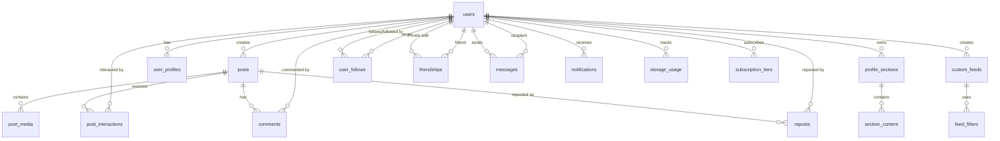

# VRSS Social Platform - PostgreSQL Database Schema Design

**Version**: 1.0
**Status**: Draft
**Last Updated**: 2025-10-16

## Table of Contents
1. [Executive Summary](#executive-summary)
2. [Schema Overview](#schema-overview)
3. [Core Tables](#core-tables)
4. [Relationships and Foreign Keys](#relationships-and-foreign-keys)
5. [Indexes Strategy](#indexes-strategy)
6. [Migration Strategy](#migration-strategy)
7. [Design Decisions and Rationale](#design-decisions-and-rationale)
8. [Performance Considerations](#performance-considerations)
9. [Data Integrity and Constraints](#data-integrity-and-constraints)
10. [Storage Management](#storage-management)
11. [Appendix: SQL DDL Scripts](#appendix-sql-ddl-scripts)

---

## Executive Summary

This document defines the PostgreSQL database schema for the VRSS social platform MVP, supporting all core features while maintaining scalability, performance, and data integrity. The design emphasizes:

- **Normalized data structure** for data integrity while balancing denormalization for query performance
- **Flexible profile customization** using JSONB for style configurations
- **Efficient feed generation** through optimized indexes and query patterns
- **Social graph queries** supporting friend and follower relationships
- **Storage quota tracking** with atomic updates
- **Extensible schema** for future feature additions

**Key Statistics** (Estimated MVP Scale):
- Target Users: 10K-100K
- Posts: ~500K (5 posts/user/month × 12 months)
- Relationships: ~1M edges (10-20 connections/user)
- Storage: 50MB free tier, 1GB+ paid tiers
- Database Size: ~10-50GB (including media metadata)

---

## Schema Overview

### Entity Relationship Diagram



### Database Naming Conventions

- **Tables**: Plural snake_case (e.g., `users`, `custom_feeds`)
- **Columns**: snake_case (e.g., `user_id`, `created_at`)
- **Primary Keys**: `id` (BIGSERIAL for scalability)
- **Foreign Keys**: `{table}_id` (e.g., `user_id`, `post_id`)
- **Indexes**: `idx_{table}_{columns}` (e.g., `idx_posts_user_created`)
- **Constraints**: `{table}_{column}_{type}` (e.g., `users_email_unique`)
- **Enums**: Uppercase snake_case (e.g., `POST_TYPE`, `SECTION_TYPE`)

---

## Core Tables

### 1. Users & Authentication

#### `users`
Core user account and authentication data.

```sql
CREATE TABLE users (
    id                  BIGSERIAL PRIMARY KEY,
    username            VARCHAR(30) NOT NULL UNIQUE,
    email               VARCHAR(255) NOT NULL UNIQUE,
    email_verified      BOOLEAN NOT NULL DEFAULT FALSE,
    password_hash       VARCHAR(255) NOT NULL,

    -- Account status
    status              VARCHAR(20) NOT NULL DEFAULT 'active',
        -- Values: 'active', 'suspended', 'deleted'

    -- Timestamps
    created_at          TIMESTAMPTZ NOT NULL DEFAULT NOW(),
    updated_at          TIMESTAMPTZ NOT NULL DEFAULT NOW(),
    last_login_at       TIMESTAMPTZ,
    deleted_at          TIMESTAMPTZ,

    -- Constraints
    CONSTRAINT users_username_length CHECK (LENGTH(username) BETWEEN 3 AND 30),
    CONSTRAINT users_username_format CHECK (username ~ '^[a-zA-Z0-9_]+$'),
    CONSTRAINT users_status_valid CHECK (status IN ('active', 'suspended', 'deleted'))
);

COMMENT ON TABLE users IS 'Core user accounts and authentication';
COMMENT ON COLUMN users.username IS 'Unique username, 3-30 alphanumeric + underscore';
COMMENT ON COLUMN users.email IS 'Unique email address for login and notifications';
COMMENT ON COLUMN users.status IS 'Account status: active, suspended, or soft-deleted';
```

#### `user_profiles`
Extended user profile information and customization.

```sql
CREATE TABLE user_profiles (
    id                  BIGSERIAL PRIMARY KEY,
    user_id             BIGINT NOT NULL UNIQUE REFERENCES users(id) ON DELETE CASCADE,

    -- Basic profile info
    display_name        VARCHAR(100),
    bio                 TEXT,
    age                 INTEGER,
    location            VARCHAR(100),
    website             VARCHAR(500),

    -- Profile visibility
    visibility          VARCHAR(20) NOT NULL DEFAULT 'public',
        -- Values: 'public', 'followers', 'private'

    -- Profile customization (JSONB for flexibility)
    background_config   JSONB NOT NULL DEFAULT '{}',
        -- { type: 'color|image|video', value: '#hex|url', position: 'center|top|...' }

    music_config        JSONB,
        -- { url: 'spotify/youtube/etc', autoplay: boolean, volume: 0-100 }

    style_config        JSONB NOT NULL DEFAULT '{}',
        -- { font: 'font-name', primaryColor: '#hex', secondaryColor: '#hex', ... }

    layout_config       JSONB NOT NULL DEFAULT '{"sections": []}',
        -- { sections: [{id, type, order, config}, ...] }

    -- Timestamps
    created_at          TIMESTAMPTZ NOT NULL DEFAULT NOW(),
    updated_at          TIMESTAMPTZ NOT NULL DEFAULT NOW(),

    -- Constraints
    CONSTRAINT user_profiles_visibility_valid CHECK (visibility IN ('public', 'followers', 'private')),
    CONSTRAINT user_profiles_age_valid CHECK (age IS NULL OR (age >= 13 AND age <= 120))
);

COMMENT ON TABLE user_profiles IS 'Extended user profile data and customization settings';
COMMENT ON COLUMN user_profiles.background_config IS 'JSONB config for profile background (color/image/music)';
COMMENT ON COLUMN user_profiles.style_config IS 'JSONB config for fonts, colors, and styling';
COMMENT ON COLUMN user_profiles.layout_config IS 'JSONB config for profile section layout';
```

#### `sessions`

Tracks active user sessions with security metadata.

```sql
CREATE TABLE sessions (
    id                  BIGSERIAL PRIMARY KEY,
    user_id             BIGINT NOT NULL REFERENCES users(id) ON DELETE CASCADE,
    token               VARCHAR(255) NOT NULL UNIQUE,
    expires_at          TIMESTAMPTZ(6) NOT NULL,
    ip_address          VARCHAR(45),
    user_agent          TEXT,
    last_activity_at    TIMESTAMPTZ(6) NOT NULL DEFAULT NOW(),
    created_at          TIMESTAMPTZ(6) NOT NULL DEFAULT NOW(),
    updated_at          TIMESTAMPTZ(6) NOT NULL DEFAULT NOW()
);

CREATE INDEX idx_sessions_user ON sessions(user_id);
CREATE INDEX idx_sessions_token ON sessions(token);
CREATE INDEX idx_sessions_expires_at ON sessions(expires_at);

COMMENT ON TABLE sessions IS 'User authentication sessions (managed by better-auth)';
COMMENT ON COLUMN sessions.token IS 'Session token (hashed, not raw JWT)';
COMMENT ON COLUMN sessions.expires_at IS 'Session expiration (7 days from creation)';
COMMENT ON COLUMN sessions.last_activity_at IS 'Last request timestamp for idle timeout';
```

**Session Cleanup:**
```sql
-- Delete expired sessions (run daily via cron)
DELETE FROM sessions WHERE expires_at < NOW();
```

#### `verification_tokens`

Stores email verification tokens for new user registration.

```sql
CREATE TABLE verification_tokens (
    id                  BIGSERIAL PRIMARY KEY,
    identifier          VARCHAR(255) NOT NULL,
    token               VARCHAR(255) NOT NULL UNIQUE,
    expires             TIMESTAMPTZ(6) NOT NULL,
    created_at          TIMESTAMPTZ(6) NOT NULL DEFAULT NOW()
);

CREATE UNIQUE INDEX verification_token_unique ON verification_tokens(identifier, token);
CREATE INDEX idx_verification_tokens_token ON verification_tokens(token);

COMMENT ON TABLE verification_tokens IS 'Email verification tokens (managed by better-auth)';
COMMENT ON COLUMN verification_tokens.identifier IS 'Email address being verified';
COMMENT ON COLUMN verification_tokens.token IS 'Random token (UUID v4, 1-hour expiry)';
```

**Token Cleanup:**
```sql
-- Delete expired tokens (run hourly via cron)
DELETE FROM verification_tokens WHERE expires < NOW();
```

---

### 2. Posts & Content

#### `posts`
Core post/content table supporting multiple content types.

```sql
CREATE TYPE post_type AS ENUM ('text_short', 'text_long', 'image', 'image_gallery', 'gif', 'video_short', 'video_long', 'song', 'album');
CREATE TYPE post_status AS ENUM ('draft', 'published', 'scheduled', 'deleted');

CREATE TABLE posts (
    id                  BIGSERIAL PRIMARY KEY,
    user_id             BIGINT NOT NULL REFERENCES users(id) ON DELETE CASCADE,

    -- Post metadata
    type                post_type NOT NULL,
    status              post_status NOT NULL DEFAULT 'published',
    visibility          profile_visibility NOT NULL DEFAULT 'public',
        -- Values: 'public', 'followers', 'private' (reuses enum from user_profiles)
        -- 'public': Visible to everyone
        -- 'followers': Visible only to followers
        -- 'private': Visible only to post author

    -- Content
    title               VARCHAR(200),
    content             TEXT,
    content_html        TEXT,  -- Sanitized HTML version for rich text

    -- Media references (actual files in S3)
    media_urls          JSONB,  -- Array of media URLs for galleries/albums
    thumbnail_url       VARCHAR(500),

    -- Engagement counters (denormalized for performance)
    likes_count         INTEGER NOT NULL DEFAULT 0,
    comments_count      INTEGER NOT NULL DEFAULT 0,
    reposts_count       INTEGER NOT NULL DEFAULT 0,
    views_count         INTEGER NOT NULL DEFAULT 0,

    -- Publishing
    published_at        TIMESTAMPTZ,
    scheduled_for       TIMESTAMPTZ,

    -- Timestamps
    created_at          TIMESTAMPTZ NOT NULL DEFAULT NOW(),
    updated_at          TIMESTAMPTZ NOT NULL DEFAULT NOW(),
    deleted_at          TIMESTAMPTZ,

    -- Constraints
    CONSTRAINT posts_title_length CHECK (title IS NULL OR LENGTH(title) <= 200),
    CONSTRAINT posts_content_required CHECK (
        (type IN ('text_short', 'text_long') AND content IS NOT NULL) OR
        (type NOT IN ('text_short', 'text_long'))
    ),
    CONSTRAINT posts_published_at_check CHECK (
        (status = 'published' AND published_at IS NOT NULL) OR
        (status != 'published')
    )
);

COMMENT ON TABLE posts IS 'All user-created posts and content';
COMMENT ON COLUMN posts.type IS 'Type of post: text, image, video, song, album, etc.';
COMMENT ON COLUMN posts.media_urls IS 'JSONB array of media file URLs (S3 paths)';
COMMENT ON COLUMN posts.likes_count IS 'Denormalized counter for performance';
```

#### `post_media`
Detailed media file tracking for storage management.

```sql
CREATE TYPE media_type AS ENUM ('image', 'gif', 'video', 'audio', 'document');

CREATE TABLE post_media (
    id                  BIGSERIAL PRIMARY KEY,
    post_id             BIGINT NOT NULL REFERENCES posts(id) ON DELETE CASCADE,
    user_id             BIGINT NOT NULL REFERENCES users(id) ON DELETE CASCADE,

    -- Media metadata
    type                media_type NOT NULL,
    file_url            VARCHAR(500) NOT NULL,
    file_size_bytes     BIGINT NOT NULL,
    mime_type           VARCHAR(100) NOT NULL,

    -- Image/video specific
    width               INTEGER,
    height              INTEGER,
    duration_seconds    INTEGER,  -- For video/audio

    -- Thumbnails
    thumbnail_url       VARCHAR(500),

    -- Order in gallery
    display_order       INTEGER NOT NULL DEFAULT 0,

    -- Timestamps
    created_at          TIMESTAMPTZ NOT NULL DEFAULT NOW(),

    CONSTRAINT post_media_file_size_positive CHECK (file_size_bytes > 0)
);

COMMENT ON TABLE post_media IS 'Detailed media file tracking for storage quota management';
COMMENT ON COLUMN post_media.file_size_bytes IS 'File size in bytes for storage quota calculation';
```

#### `pending_uploads`

Temporary tracking for media uploads before post creation (Phase 3.6 Media Router).

```sql
CREATE TABLE pending_uploads (
    id                  UUID PRIMARY KEY DEFAULT gen_random_uuid(),
    user_id             BIGINT NOT NULL,
    s3_key              VARCHAR(500) NOT NULL,
    filename            VARCHAR(255) NOT NULL,
    content_type        VARCHAR(100) NOT NULL,
    size                BIGINT NOT NULL,
    expires_at          TIMESTAMPTZ(6) NOT NULL,
    created_at          TIMESTAMPTZ(6) NOT NULL DEFAULT NOW()
);

CREATE INDEX idx_pending_uploads_user_expires ON pending_uploads(user_id, expires_at);

COMMENT ON TABLE pending_uploads IS 'Temporary uploads awaiting post creation';
COMMENT ON COLUMN pending_uploads.s3_key IS 'S3 object key (users/{userId}/posts/{id}_{filename})';
COMMENT ON COLUMN pending_uploads.expires_at IS '24-hour expiry for orphaned uploads';
```

**Cleanup Strategy:**
```sql
-- Delete expired uploads (run hourly via cron)
-- Also delete corresponding S3 objects
DELETE FROM pending_uploads WHERE expires_at < NOW();
```

**Business Logic:**
1. User initiates upload via `media.initiateUpload` → Creates pending_uploads row
2. User uploads to S3 presigned URL (15-minute expiry)
3. User completes upload via `media.completeUpload` → Creates post_media row, deletes pending_uploads row
4. If user never completes: Cron job deletes expired pending_uploads + S3 objects after 24 hours

---

### 3. Social Interactions

#### `user_follows`
Follower/following relationships.

```sql
CREATE TABLE user_follows (
    id                  BIGSERIAL PRIMARY KEY,
    follower_id         BIGINT NOT NULL REFERENCES users(id) ON DELETE CASCADE,
    following_id        BIGINT NOT NULL REFERENCES users(id) ON DELETE CASCADE,

    created_at          TIMESTAMPTZ NOT NULL DEFAULT NOW(),

    -- Constraints
    CONSTRAINT user_follows_no_self_follow CHECK (follower_id != following_id),
    CONSTRAINT user_follows_unique UNIQUE (follower_id, following_id)
);

COMMENT ON TABLE user_follows IS 'Asymmetric follower/following relationships';
COMMENT ON COLUMN user_follows.follower_id IS 'User who is following';
COMMENT ON COLUMN user_follows.following_id IS 'User being followed';
```

#### `friendships`
Symmetric friend relationships (mutual follows).

```sql
CREATE TABLE friendships (
    id                  BIGSERIAL PRIMARY KEY,
    user_id_1           BIGINT NOT NULL REFERENCES users(id) ON DELETE CASCADE,
    user_id_2           BIGINT NOT NULL REFERENCES users(id) ON DELETE CASCADE,

    created_at          TIMESTAMPTZ NOT NULL DEFAULT NOW(),

    -- Constraints
    CONSTRAINT friendships_no_self CHECK (user_id_1 != user_id_2),
    CONSTRAINT friendships_ordered CHECK (user_id_1 < user_id_2),
    CONSTRAINT friendships_unique UNIQUE (user_id_1, user_id_2)
);

COMMENT ON TABLE friendships IS 'Symmetric friend relationships (bidirectional)';
COMMENT ON COLUMN friendships.user_id_1 IS 'Lower user_id (enforced by constraint)';
COMMENT ON COLUMN friendships.user_id_2 IS 'Higher user_id (enforced by constraint)';
```

#### `post_interactions`
Likes and other post interactions.

```sql
CREATE TYPE interaction_type AS ENUM ('like', 'bookmark', 'share');

CREATE TABLE post_interactions (
    id                  BIGSERIAL PRIMARY KEY,
    user_id             BIGINT NOT NULL REFERENCES users(id) ON DELETE CASCADE,
    post_id             BIGINT NOT NULL REFERENCES posts(id) ON DELETE CASCADE,
    type                interaction_type NOT NULL,

    created_at          TIMESTAMPTZ NOT NULL DEFAULT NOW(),

    CONSTRAINT post_interactions_unique UNIQUE (user_id, post_id, type)
);

COMMENT ON TABLE post_interactions IS 'User interactions with posts (likes, bookmarks, shares)';
```

#### `comments`
Post comments and nested replies.

```sql
CREATE TABLE comments (
    id                  BIGSERIAL PRIMARY KEY,
    post_id             BIGINT NOT NULL REFERENCES posts(id) ON DELETE CASCADE,
    user_id             BIGINT NOT NULL REFERENCES users(id) ON DELETE CASCADE,
    parent_comment_id   BIGINT REFERENCES comments(id) ON DELETE CASCADE,

    content             TEXT NOT NULL,
    content_html        TEXT,

    -- Denormalized counters
    likes_count         INTEGER NOT NULL DEFAULT 0,
    replies_count       INTEGER NOT NULL DEFAULT 0,

    created_at          TIMESTAMPTZ NOT NULL DEFAULT NOW(),
    updated_at          TIMESTAMPTZ NOT NULL DEFAULT NOW(),
    deleted_at          TIMESTAMPTZ,

    CONSTRAINT comments_content_not_empty CHECK (LENGTH(TRIM(content)) > 0)
);

COMMENT ON TABLE comments IS 'Comments on posts with support for nested replies';
COMMENT ON COLUMN comments.parent_comment_id IS 'NULL for top-level comments, references parent for replies';
```

#### `reposts`
Post reposts to user profiles.

```sql
CREATE TABLE reposts (
    id                  BIGSERIAL PRIMARY KEY,
    user_id             BIGINT NOT NULL REFERENCES users(id) ON DELETE CASCADE,
    post_id             BIGINT NOT NULL REFERENCES posts(id) ON DELETE CASCADE,

    comment             TEXT,  -- Optional comment when reposting

    created_at          TIMESTAMPTZ NOT NULL DEFAULT NOW(),

    CONSTRAINT reposts_unique UNIQUE (user_id, post_id)
);

COMMENT ON TABLE reposts IS 'User reposts of other users posts';
```

---

### 4. Profile Customization

#### `profile_sections`
User-defined profile sections.

```sql
CREATE TYPE section_type AS ENUM (
    'feed', 'gallery', 'links', 'static_text', 'static_image',
    'video', 'reposts', 'friends', 'followers', 'following', 'list'
);

CREATE TABLE profile_sections (
    id                  BIGSERIAL PRIMARY KEY,
    user_id             BIGINT NOT NULL REFERENCES users(id) ON DELETE CASCADE,

    type                section_type NOT NULL,
    title               VARCHAR(100) NOT NULL,
    description         TEXT,

    -- Section configuration
    config              JSONB NOT NULL DEFAULT '{}',
        -- Type-specific config: filters, layout, display options

    -- Positioning
    display_order       INTEGER NOT NULL DEFAULT 0,
    is_visible          BOOLEAN NOT NULL DEFAULT TRUE,

    created_at          TIMESTAMPTZ NOT NULL DEFAULT NOW(),
    updated_at          TIMESTAMPTZ NOT NULL DEFAULT NOW(),

    CONSTRAINT profile_sections_title_not_empty CHECK (LENGTH(TRIM(title)) > 0)
);

COMMENT ON TABLE profile_sections IS 'User-defined profile sections for customizable layouts';
COMMENT ON COLUMN profile_sections.config IS 'JSONB config specific to section type (filters, styling, etc)';
```

#### `section_content`
Content items within sections (for static sections).

```sql
CREATE TABLE section_content (
    id                  BIGSERIAL PRIMARY KEY,
    section_id          BIGINT NOT NULL REFERENCES profile_sections(id) ON DELETE CASCADE,

    content_type        VARCHAR(50) NOT NULL,  -- 'text', 'link', 'image', 'embed'
    title               VARCHAR(200),
    content             TEXT,
    url                 VARCHAR(500),

    display_order       INTEGER NOT NULL DEFAULT 0,

    created_at          TIMESTAMPTZ NOT NULL DEFAULT NOW(),
    updated_at          TIMESTAMPTZ NOT NULL DEFAULT NOW()
);

COMMENT ON TABLE section_content IS 'Individual content items within static profile sections';
```

---

### 5. Custom Feeds & Algorithms

#### `custom_feeds`
User-created custom feed definitions.

```sql
CREATE TABLE custom_feeds (
    id                  BIGSERIAL PRIMARY KEY,
    user_id             BIGINT NOT NULL REFERENCES users(id) ON DELETE CASCADE,

    name                VARCHAR(100) NOT NULL,
    description         TEXT,

    -- Feed algorithm config
    algorithm_config    JSONB NOT NULL,
        -- {filters: [{type, operator, value}], logic: 'AND|OR', sort: 'recent|popular'}

    is_default          BOOLEAN NOT NULL DEFAULT FALSE,
    display_order       INTEGER NOT NULL DEFAULT 0,

    created_at          TIMESTAMPTZ NOT NULL DEFAULT NOW(),
    updated_at          TIMESTAMPTZ NOT NULL DEFAULT NOW(),

    CONSTRAINT custom_feeds_name_not_empty CHECK (LENGTH(TRIM(name)) > 0),
    CONSTRAINT custom_feeds_user_name_unique UNIQUE (user_id, name)
);

COMMENT ON TABLE custom_feeds IS 'User-defined custom feeds with filter algorithms';
COMMENT ON COLUMN custom_feeds.algorithm_config IS 'JSONB filter blocks and logical operators';
```

#### `feed_filters`
Individual filter blocks for feed algorithms (normalized for query optimization).

```sql
CREATE TYPE filter_type AS ENUM ('post_type', 'author', 'tag', 'date_range', 'engagement');
CREATE TYPE filter_operator AS ENUM ('equals', 'not_equals', 'contains', 'greater_than', 'less_than', 'in_range');

CREATE TABLE feed_filters (
    id                  BIGSERIAL PRIMARY KEY,
    feed_id             BIGINT NOT NULL REFERENCES custom_feeds(id) ON DELETE CASCADE,

    type                filter_type NOT NULL,
    operator            filter_operator NOT NULL,
    value               JSONB NOT NULL,  -- Filter-specific value(s)

    -- Logical grouping
    group_id            INTEGER NOT NULL DEFAULT 0,
    logical_operator    VARCHAR(10) NOT NULL DEFAULT 'AND',  -- 'AND', 'OR', 'NOT'

    display_order       INTEGER NOT NULL DEFAULT 0,

    created_at          TIMESTAMPTZ NOT NULL DEFAULT NOW()
);

COMMENT ON TABLE feed_filters IS 'Individual filter blocks composing feed algorithms';
COMMENT ON COLUMN feed_filters.value IS 'JSONB value specific to filter type';
COMMENT ON COLUMN feed_filters.group_id IS 'Group filters for complex logic (AND/OR combinations)';
```

---

### 6. Messaging

#### `conversations`
Message thread metadata.

```sql
CREATE TABLE conversations (
    id                  BIGSERIAL PRIMARY KEY,

    -- Participant tracking
    participant_ids     BIGINT[] NOT NULL,  -- Array of user IDs

    last_message_at     TIMESTAMPTZ NOT NULL DEFAULT NOW(),
    created_at          TIMESTAMPTZ NOT NULL DEFAULT NOW(),

    CONSTRAINT conversations_min_participants CHECK (array_length(participant_ids, 1) >= 2)
);

COMMENT ON TABLE conversations IS 'Message conversation threads between users';
COMMENT ON COLUMN conversations.participant_ids IS 'Array of user IDs in conversation (supports group DMs)';
```

#### `messages`
Individual messages within conversations.

```sql
CREATE TABLE messages (
    id                  BIGSERIAL PRIMARY KEY,
    conversation_id     BIGINT NOT NULL REFERENCES conversations(id) ON DELETE CASCADE,
    sender_id           BIGINT NOT NULL REFERENCES users(id) ON DELETE CASCADE,

    content             TEXT NOT NULL,

    -- Read tracking
    read_by             BIGINT[] NOT NULL DEFAULT '{}',  -- Array of user IDs who read

    created_at          TIMESTAMPTZ NOT NULL DEFAULT NOW(),
    updated_at          TIMESTAMPTZ NOT NULL DEFAULT NOW(),
    deleted_at          TIMESTAMPTZ,

    CONSTRAINT messages_content_not_empty CHECK (LENGTH(TRIM(content)) > 0)
);

COMMENT ON TABLE messages IS 'Individual messages within conversations';
COMMENT ON COLUMN messages.read_by IS 'Array of user IDs who have read this message';
```

---

### 7. Notifications

#### `notifications`
User notifications for interactions.

```sql
CREATE TYPE notification_type AS ENUM (
    'follow', 'like', 'comment', 'repost', 'mention',
    'message', 'friend_request', 'system'
);

CREATE TABLE notifications (
    id                  BIGSERIAL PRIMARY KEY,
    user_id             BIGINT NOT NULL REFERENCES users(id) ON DELETE CASCADE,

    type                notification_type NOT NULL,

    -- Actor and object references
    actor_id            BIGINT REFERENCES users(id) ON DELETE CASCADE,
    post_id             BIGINT REFERENCES posts(id) ON DELETE CASCADE,
    comment_id          BIGINT REFERENCES comments(id) ON DELETE CASCADE,

    -- Notification content
    title               VARCHAR(200) NOT NULL,
    content             TEXT,
    action_url          VARCHAR(500),

    -- Read status
    is_read             BOOLEAN NOT NULL DEFAULT FALSE,
    read_at             TIMESTAMPTZ,

    created_at          TIMESTAMPTZ NOT NULL DEFAULT NOW(),

    CONSTRAINT notifications_title_not_empty CHECK (LENGTH(TRIM(title)) > 0)
);

COMMENT ON TABLE notifications IS 'User notifications for social interactions';
COMMENT ON COLUMN notifications.actor_id IS 'User who triggered the notification (NULL for system)';
```

---

### 8. Storage & Subscriptions

#### `storage_usage`
Per-user storage quota tracking.

```sql
CREATE TABLE storage_usage (
    id                  BIGSERIAL PRIMARY KEY,
    user_id             BIGINT NOT NULL UNIQUE REFERENCES users(id) ON DELETE CASCADE,

    -- Storage tracking (in bytes)
    used_bytes          BIGINT NOT NULL DEFAULT 0,
    quota_bytes         BIGINT NOT NULL DEFAULT 52428800,  -- 50MB default

    -- Breakdown by media type
    images_bytes        BIGINT NOT NULL DEFAULT 0,
    videos_bytes        BIGINT NOT NULL DEFAULT 0,
    audio_bytes         BIGINT NOT NULL DEFAULT 0,
    other_bytes         BIGINT NOT NULL DEFAULT 0,

    last_calculated_at  TIMESTAMPTZ NOT NULL DEFAULT NOW(),
    created_at          TIMESTAMPTZ NOT NULL DEFAULT NOW(),
    updated_at          TIMESTAMPTZ NOT NULL DEFAULT NOW(),

    CONSTRAINT storage_usage_positive CHECK (used_bytes >= 0),
    CONSTRAINT storage_usage_quota_positive CHECK (quota_bytes > 0)
);

COMMENT ON TABLE storage_usage IS 'Per-user storage quota tracking';
COMMENT ON COLUMN storage_usage.quota_bytes IS 'User storage limit in bytes (50MB = 52428800)';
```

#### `subscription_tiers`
Available subscription tiers.

```sql
CREATE TABLE subscription_tiers (
    id                  BIGSERIAL PRIMARY KEY,

    name                VARCHAR(50) NOT NULL UNIQUE,
    description         TEXT,

    -- Limits
    storage_bytes       BIGINT NOT NULL,

    -- Pricing
    price_monthly_cents INTEGER NOT NULL,

    is_active           BOOLEAN NOT NULL DEFAULT TRUE,

    created_at          TIMESTAMPTZ NOT NULL DEFAULT NOW(),
    updated_at          TIMESTAMPTZ NOT NULL DEFAULT NOW(),

    CONSTRAINT subscription_tiers_storage_positive CHECK (storage_bytes > 0),
    CONSTRAINT subscription_tiers_price_positive CHECK (price_monthly_cents >= 0)
);

COMMENT ON TABLE subscription_tiers IS 'Available subscription tiers and pricing';
COMMENT ON COLUMN subscription_tiers.price_monthly_cents IS 'Price in cents (e.g., 999 = $9.99)';
```

#### `user_subscriptions`
User subscription records.

```sql
CREATE TYPE subscription_status AS ENUM ('active', 'canceled', 'expired', 'suspended');

CREATE TABLE user_subscriptions (
    id                  BIGSERIAL PRIMARY KEY,
    user_id             BIGINT NOT NULL REFERENCES users(id) ON DELETE CASCADE,
    tier_id             BIGINT NOT NULL REFERENCES subscription_tiers(id),

    status              subscription_status NOT NULL DEFAULT 'active',

    -- Billing
    stripe_subscription_id VARCHAR(255),
    stripe_customer_id  VARCHAR(255),

    -- Subscription period
    current_period_start TIMESTAMPTZ NOT NULL,
    current_period_end  TIMESTAMPTZ NOT NULL,
    canceled_at         TIMESTAMPTZ,

    created_at          TIMESTAMPTZ NOT NULL DEFAULT NOW(),
    updated_at          TIMESTAMPTZ NOT NULL DEFAULT NOW()
);

COMMENT ON TABLE user_subscriptions IS 'User subscription records and billing info';
```

---

### 9. Lists & Collections

#### `user_lists`
User-created lists of other users.

```sql
CREATE TABLE user_lists (
    id                  BIGSERIAL PRIMARY KEY,
    user_id             BIGINT NOT NULL REFERENCES users(id) ON DELETE CASCADE,

    name                VARCHAR(100) NOT NULL,
    description         TEXT,

    is_public           BOOLEAN NOT NULL DEFAULT TRUE,

    created_at          TIMESTAMPTZ NOT NULL DEFAULT NOW(),
    updated_at          TIMESTAMPTZ NOT NULL DEFAULT NOW(),

    CONSTRAINT user_lists_name_not_empty CHECK (LENGTH(TRIM(name)) > 0),
    CONSTRAINT user_lists_user_name_unique UNIQUE (user_id, name)
);

COMMENT ON TABLE user_lists IS 'User-created lists (e.g., "Favorite Artists", "Local Businesses")';
```

#### `list_members`
Members of user lists.

```sql
CREATE TABLE list_members (
    id                  BIGSERIAL PRIMARY KEY,
    list_id             BIGINT NOT NULL REFERENCES user_lists(id) ON DELETE CASCADE,
    member_user_id      BIGINT NOT NULL REFERENCES users(id) ON DELETE CASCADE,

    added_at            TIMESTAMPTZ NOT NULL DEFAULT NOW(),

    CONSTRAINT list_members_unique UNIQUE (list_id, member_user_id)
);

COMMENT ON TABLE list_members IS 'Users included in lists';
```

---

## Relationships and Foreign Keys

### Primary Relationships

1. **User → Profile**: One-to-One (CASCADE DELETE)
   - Each user has exactly one profile
   - Profile deleted when user deleted

2. **User → Posts**: One-to-Many (CASCADE DELETE)
   - Users can create multiple posts
   - Posts deleted when user deleted

3. **Post → Media**: One-to-Many (CASCADE DELETE)
   - Posts can have multiple media files (galleries)
   - Media deleted when post deleted

4. **User ↔ User (Follows)**: Many-to-Many (CASCADE DELETE)
   - Asymmetric relationship via `user_follows`
   - Follow deleted when either user deleted

5. **User ↔ User (Friends)**: Many-to-Many (CASCADE DELETE)
   - Symmetric relationship via `friendships`
   - Friendship deleted when either user deleted

6. **User → Custom Feeds**: One-to-Many (CASCADE DELETE)
   - Users can create multiple custom feeds
   - Feeds deleted when user deleted

7. **Custom Feed → Filters**: One-to-Many (CASCADE DELETE)
   - Feeds composed of multiple filter blocks
   - Filters deleted when feed deleted

8. **User ↔ Conversation**: Many-to-Many (via participant array)
   - Users can participate in multiple conversations
   - Messages remain if user deleted (soft reference)

9. **Post → Comments**: One-to-Many (CASCADE DELETE)
   - Posts can have multiple comments
   - Comments deleted when post deleted

10. **User → Notifications**: One-to-Many (CASCADE DELETE)
    - Users receive multiple notifications
    - Notifications deleted when user deleted

### Referential Integrity

All foreign keys enforce **ON DELETE CASCADE** where appropriate to maintain data integrity and prevent orphaned records. Exceptions:
- `messages.sender_id`: Keep messages even if sender deleted (show as "Deleted User")
- `notifications.actor_id`: Keep notification even if actor deleted

---

## Indexes Strategy

### Primary Indexes (Automatic)
- All `id` columns (PRIMARY KEY) have automatic B-tree indexes
- All UNIQUE constraints create automatic indexes

### Performance Indexes

#### User & Profile Queries
```sql
-- Fast username/email lookups (already unique indexes)
-- No additional indexes needed

-- Profile visibility filtering
CREATE INDEX idx_user_profiles_visibility
    ON user_profiles(visibility)
    WHERE visibility != 'private';
```

#### Post Feed Queries (Critical for Performance)
```sql
-- Core feed query: posts by user, ordered by recency
CREATE INDEX idx_posts_user_created
    ON posts(user_id, created_at DESC, status)
    WHERE deleted_at IS NULL;

-- Feed query: posts by type and time
CREATE INDEX idx_posts_type_created
    ON posts(type, created_at DESC)
    WHERE status = 'published' AND deleted_at IS NULL;

-- Discovery: popular posts in time window
CREATE INDEX idx_posts_engagement_created
    ON posts(likes_count DESC, created_at DESC)
    WHERE status = 'published' AND deleted_at IS NULL;

-- User's own posts
CREATE INDEX idx_posts_user_status
    ON posts(user_id, status, created_at DESC);
```

#### Social Graph Queries
```sql
-- Fast follower/following lookups
CREATE INDEX idx_user_follows_follower
    ON user_follows(follower_id, created_at DESC);

CREATE INDEX idx_user_follows_following
    ON user_follows(following_id, created_at DESC);

-- Friendship lookups (both directions)
CREATE INDEX idx_friendships_user1
    ON friendships(user_id_1, created_at DESC);

CREATE INDEX idx_friendships_user2
    ON friendships(user_id_2, created_at DESC);

-- Combined index for mutual follow check (friend detection)
CREATE INDEX idx_user_follows_both
    ON user_follows(follower_id, following_id);
```

#### Interaction Queries
```sql
-- Check if user liked/bookmarked post
CREATE INDEX idx_post_interactions_user_post
    ON post_interactions(user_id, post_id, type);

-- All interactions on a post
CREATE INDEX idx_post_interactions_post_type
    ON post_interactions(post_id, type, created_at DESC);

-- Comments on post
CREATE INDEX idx_comments_post_created
    ON comments(post_id, created_at DESC)
    WHERE deleted_at IS NULL;

-- Nested comment replies
CREATE INDEX idx_comments_parent
    ON comments(parent_comment_id, created_at DESC)
    WHERE parent_comment_id IS NOT NULL AND deleted_at IS NULL;
```

#### Feed Algorithm Queries
```sql
-- User's custom feeds
CREATE INDEX idx_custom_feeds_user
    ON custom_feeds(user_id, display_order);

-- Filters for a feed
CREATE INDEX idx_feed_filters_feed
    ON feed_filters(feed_id, group_id, display_order);

-- Filter by type for optimization
CREATE INDEX idx_feed_filters_type
    ON feed_filters(type, feed_id);
```

#### Messaging Queries
```sql
-- Conversations for user (using GIN index for array)
CREATE INDEX idx_conversations_participants
    ON conversations USING GIN(participant_ids);

-- Messages in conversation
CREATE INDEX idx_messages_conversation_created
    ON messages(conversation_id, created_at DESC)
    WHERE deleted_at IS NULL;

-- Unread messages for user (using GIN)
CREATE INDEX idx_messages_unread
    ON messages USING GIN(read_by)
    WHERE deleted_at IS NULL;
```

#### Notification Queries
```sql
-- Unread notifications for user
CREATE INDEX idx_notifications_user_unread
    ON notifications(user_id, created_at DESC)
    WHERE is_read = FALSE;

-- All notifications for user
CREATE INDEX idx_notifications_user_created
    ON notifications(user_id, created_at DESC);
```

#### Storage & Media Queries
```sql
-- Media for post
CREATE INDEX idx_post_media_post
    ON post_media(post_id, display_order);

-- User's storage usage lookup (already unique on user_id)
-- No additional index needed

-- Media by user for storage calculation
CREATE INDEX idx_post_media_user_size
    ON post_media(user_id, created_at DESC);
```

#### Profile Section Queries
```sql
-- Sections for user profile
CREATE INDEX idx_profile_sections_user_order
    ON profile_sections(user_id, display_order)
    WHERE is_visible = TRUE;

-- Content within section
CREATE INDEX idx_section_content_section_order
    ON section_content(section_id, display_order);
```

### JSONB Indexes (For Complex Queries)

```sql
-- GIN indexes for JSONB columns (when querying nested data)
CREATE INDEX idx_posts_media_urls_gin
    ON posts USING GIN(media_urls);

CREATE INDEX idx_user_profiles_style_config_gin
    ON user_profiles USING GIN(style_config);

-- Example query: Find posts with specific media type
-- SELECT * FROM posts WHERE media_urls @> '[{"type": "video"}]';
```

### Index Maintenance

- **Autovacuum**: Enable PostgreSQL autovacuum for index maintenance
- **Statistics**: Update statistics regularly: `ANALYZE` after bulk operations
- **Monitoring**: Monitor index usage with `pg_stat_user_indexes`
- **Cleanup**: Remove unused indexes identified by monitoring

---

## Migration Strategy

### Phase 1: Initial Schema Setup (Week 1)

1. **Core Tables** (Day 1-2)
   - Create `users`, `user_profiles`
   - Create indexes and constraints
   - Seed default data (subscription tiers)

2. **Content Tables** (Day 3-4)
   - Create `posts`, `post_media`
   - Create `comments`, `reposts`
   - Create indexes

3. **Social Tables** (Day 5)
   - Create `user_follows`, `friendships`
   - Create `post_interactions`
   - Create indexes

4. **Feature Tables** (Day 6-7)
   - Create `profile_sections`, `section_content`
   - Create `custom_feeds`, `feed_filters`
   - Create `notifications`
   - Create `messages`, `conversations`
   - Create `storage_usage`, `subscription_tiers`, `user_subscriptions`
   - Create all remaining indexes

### Phase 2: Data Migration (If migrating from existing system)

1. **User Data**
   - Migrate users → `users`
   - Migrate profiles → `user_profiles`
   - Hash passwords if format changed

2. **Content Data**
   - Migrate posts → `posts`
   - Upload media to S3, create `post_media` records
   - Update `storage_usage`

3. **Relationships**
   - Migrate follows → `user_follows`
   - Calculate friendships → `friendships`
   - Migrate interactions

4. **Validation**
   - Verify data integrity
   - Check foreign key consistency
   - Validate storage calculations

### Phase 3: Zero-Downtime Migrations (Future)

For schema changes after launch:

1. **Expand-Contract Pattern**
   ```sql
   -- Example: Adding new column
   -- Step 1 (Expand): Add nullable column
   ALTER TABLE posts ADD COLUMN new_field VARCHAR(100);

   -- Step 2 (Deploy): App writes to both old and new
   -- Step 3 (Backfill): Populate new column
   UPDATE posts SET new_field = /* calculation */ WHERE new_field IS NULL;

   -- Step 4 (Contract): Make NOT NULL, remove old column
   ALTER TABLE posts ALTER COLUMN new_field SET NOT NULL;
   ```

2. **Dual-Write Pattern**
   - Write to both old and new schemas during transition
   - Validate data consistency
   - Cut over when confident

3. **Blue-Green Database**
   - Maintain parallel database instances
   - Test migrations on blue before switching green

### Migration Scripts Organization

```
migrations/
├── 001_initial_schema.sql
├── 002_seed_data.sql
├── 003_indexes.sql
├── 004_functions_triggers.sql
└── rollback/
    ├── 001_rollback.sql
    ├── 002_rollback.sql
    └── ...
```

### Migration Tools

- **Recommended**: Use migration tool like:
  - **Flyway** (Java-based, version control for DB)
  - **Liquibase** (XML/SQL based)
  - **migrate** (Go-based, simple)
  - **Alembic** (Python-based, SQLAlchemy)
  - **TypeORM** (if using Node.js/TypeScript)

- **Version Tracking**: Maintain `schema_migrations` table
  ```sql
  CREATE TABLE schema_migrations (
      version VARCHAR(50) PRIMARY KEY,
      applied_at TIMESTAMPTZ NOT NULL DEFAULT NOW()
  );
  ```

---

## Design Decisions and Rationale

### 1. JSONB for Flexible Configuration

**Decision**: Use JSONB for `user_profiles.style_config`, `posts.media_urls`, `custom_feeds.algorithm_config`, etc.

**Rationale**:
- **Flexibility**: Profile customization and feed algorithms require flexible, evolving schemas
- **Performance**: JSONB is binary, faster than text JSON; supports indexing with GIN
- **Querying**: Can query nested data with PostgreSQL's JSONB operators
- **Schema Evolution**: Avoid frequent ALTER TABLE migrations for new style options

**Trade-offs**:
- Less strict typing than normalized tables
- Requires application-level validation
- More complex queries for nested data

**Alternatives Considered**:
- **EAV Pattern**: Rejected due to query complexity and poor performance
- **Normalized Tables**: Rejected due to migration overhead for frequent changes

### 2. Denormalized Engagement Counters

**Decision**: Store `likes_count`, `comments_count`, etc. on `posts` table

**Rationale**:
- **Feed Performance**: Displaying engagement counts on every feed item requires fast access
- **Read-Heavy Workload**: Social feeds are 99% reads, 1% writes
- **Atomic Updates**: Use PostgreSQL triggers or app-level transactions to keep consistent

**Implementation**:
```sql
-- Trigger example for maintaining likes_count
CREATE OR REPLACE FUNCTION update_post_likes_count()
RETURNS TRIGGER AS $$
BEGIN
    IF TG_OP = 'INSERT' THEN
        UPDATE posts SET likes_count = likes_count + 1 WHERE id = NEW.post_id;
    ELSIF TG_OP = 'DELETE' THEN
        UPDATE posts SET likes_count = likes_count - 1 WHERE id = OLD.post_id;
    END IF;
    RETURN NULL;
END;
$$ LANGUAGE plpgsql;

CREATE TRIGGER trigger_update_post_likes_count
AFTER INSERT OR DELETE ON post_interactions
FOR EACH ROW
WHEN (NEW.type = 'like' OR OLD.type = 'like')
EXECUTE FUNCTION update_post_likes_count();
```

**Trade-offs**:
- Denormalization increases storage slightly
- Requires triggers or app-level logic for consistency
- Small risk of count drift (mitigated by periodic reconciliation)

### 3. Symmetric Friendship Model

**Decision**: Separate `friendships` table with ordered user IDs (user_id_1 < user_id_2)

**Rationale**:
- **Efficiency**: Single row for bidirectional friendship vs. two rows in `user_follows`
- **Atomic Creation**: Friendship created when mutual follow detected
- **Query Simplicity**: `WHERE user_id_1 = X OR user_id_2 = X` finds all friends

**Implementation**:
```sql
-- Trigger to create friendship when mutual follow detected
CREATE OR REPLACE FUNCTION create_friendship_on_mutual_follow()
RETURNS TRIGGER AS $$
BEGIN
    -- Check if reverse follow exists
    IF EXISTS (
        SELECT 1 FROM user_follows
        WHERE follower_id = NEW.following_id
        AND following_id = NEW.follower_id
    ) THEN
        -- Create friendship (ordered by user ID)
        INSERT INTO friendships (user_id_1, user_id_2)
        VALUES (
            LEAST(NEW.follower_id, NEW.following_id),
            GREATEST(NEW.follower_id, NEW.following_id)
        )
        ON CONFLICT (user_id_1, user_id_2) DO NOTHING;
    END IF;
    RETURN NEW;
END;
$$ LANGUAGE plpgsql;

CREATE TRIGGER trigger_create_friendship
AFTER INSERT ON user_follows
FOR EACH ROW
EXECUTE FUNCTION create_friendship_on_mutual_follow();
```

### 4. Normalized Feed Filters

**Decision**: Separate `feed_filters` table instead of only JSONB in `custom_feeds.algorithm_config`

**Rationale**:
- **Query Optimization**: Can index filter types, values for faster feed execution
- **Hybrid Approach**: JSONB in `custom_feeds` for UI/display, normalized for execution
- **Complex Queries**: Easier to build SQL queries from normalized filter rows

**Trade-offs**:
- More tables and joins
- Requires syncing JSONB and normalized data

**Alternative**: Store only JSONB, build queries dynamically in application layer (viable for MVP)

### 5. Array-Based Conversation Participants

**Decision**: Use `participant_ids BIGINT[]` for conversations

**Rationale**:
- **Simplicity**: MVP supports 1:1 DMs, array prepares for group DMs
- **Performance**: GIN index on array enables fast participant lookups
- **Flexibility**: Easy to expand to group messaging without schema change

**Trade-offs**:
- Less normalized than junction table
- Array operations slightly more complex in SQL

**Future Migration**: Consider `conversation_participants` table if group DMs become complex

### 6. Soft Deletes for Content

**Decision**: Use `deleted_at` timestamp for posts, comments, messages

**Rationale**:
- **Data Recovery**: Users can restore accidentally deleted content (within time window)
- **Audit Trail**: Maintain record of deleted content for moderation
- **Referential Integrity**: Prevent cascade deletion breaking references

**Implementation**:
- Add `deleted_at TIMESTAMPTZ` column
- Filter queries: `WHERE deleted_at IS NULL`
- Periodic cleanup: Delete `deleted_at < NOW() - INTERVAL '30 days'`

**Trade-offs**:
- Increases storage
- Requires filtering in all queries
- Periodic cleanup job needed

### 7. Storage Tracking Granularity

**Decision**: Track storage per user with breakdown by media type

**Rationale**:
- **Quota Enforcement**: Fast check: `used_bytes < quota_bytes`
- **Transparency**: Show users breakdown (images vs. videos)
- **Atomic Updates**: Update `storage_usage` atomically when media uploaded/deleted

**Implementation**:
```sql
-- Trigger to update storage on media insert
CREATE OR REPLACE FUNCTION update_storage_on_media_insert()
RETURNS TRIGGER AS $$
BEGIN
    UPDATE storage_usage
    SET
        used_bytes = used_bytes + NEW.file_size_bytes,
        images_bytes = images_bytes + CASE WHEN NEW.type = 'image' THEN NEW.file_size_bytes ELSE 0 END,
        videos_bytes = videos_bytes + CASE WHEN NEW.type = 'video' THEN NEW.file_size_bytes ELSE 0 END,
        audio_bytes = audio_bytes + CASE WHEN NEW.type = 'audio' THEN NEW.file_size_bytes ELSE 0 END,
        other_bytes = other_bytes + CASE WHEN NEW.type NOT IN ('image', 'video', 'audio') THEN NEW.file_size_bytes ELSE 0 END,
        updated_at = NOW()
    WHERE user_id = NEW.user_id;

    RETURN NEW;
END;
$$ LANGUAGE plpgsql;

CREATE TRIGGER trigger_update_storage_insert
AFTER INSERT ON post_media
FOR EACH ROW
EXECUTE FUNCTION update_storage_on_media_insert();
```

**Trade-offs**:
- Slight accuracy drift (mitigated by periodic recalculation)
- Trigger overhead on media operations

### 8. BIGSERIAL for All IDs

**Decision**: Use `BIGSERIAL` (8-byte integer) for all primary keys

**Rationale**:
- **Future-Proofing**: Supports up to 9 quintillion records (vs. 2 billion for INTEGER)
- **No Migration Pain**: Avoid future migration from INT to BIGINT
- **Industry Standard**: Most modern platforms use 64-bit IDs

**Trade-offs**:
- Slightly more storage (4 bytes vs. 8 bytes per ID)
- Negligible for MVP scale

---

## Performance Considerations

### Query Optimization Strategies

#### 1. Feed Generation Query Pattern

**Most Critical Query**: Generate feed for user (home feed)

```sql
-- Optimized feed query with index usage
EXPLAIN ANALYZE
SELECT
    p.id, p.user_id, p.type, p.title, p.content, p.thumbnail_url,
    p.likes_count, p.comments_count, p.created_at,
    u.username, u.display_name, up.avatar_url
FROM posts p
INNER JOIN users u ON p.user_id = u.id
INNER JOIN user_profiles up ON u.id = up.user_id
WHERE
    p.user_id IN (
        SELECT following_id
        FROM user_follows
        WHERE follower_id = $1  -- Current user ID
    )
    AND p.status = 'published'
    AND p.deleted_at IS NULL
ORDER BY p.created_at DESC
LIMIT 20 OFFSET $2;

-- Uses indexes:
-- - idx_user_follows_follower (for subquery)
-- - idx_posts_user_created (for WHERE + ORDER BY)
```

**Performance**:
- Expected: <50ms for 100 followed users
- Index scan on `user_follows`, then index scan on `posts`
- Pagination via LIMIT/OFFSET (consider cursor-based for deep pagination)

#### 2. Custom Feed Algorithm Execution

**Query Pattern**: Execute feed with filters (example: image posts from followed users in last 7 days)

```sql
-- Dynamic query built from feed_filters
SELECT p.id, p.user_id, p.type, p.title, p.thumbnail_url, p.created_at
FROM posts p
WHERE
    p.type = 'image'  -- From filter: post_type = image
    AND p.user_id IN (
        SELECT following_id FROM user_follows WHERE follower_id = $1
    )
    AND p.created_at >= NOW() - INTERVAL '7 days'  -- From filter: date_range
    AND p.status = 'published'
    AND p.deleted_at IS NULL
ORDER BY p.created_at DESC
LIMIT 20;

-- Uses indexes:
-- - idx_posts_type_created (composite index on type + created_at)
-- - idx_user_follows_follower
```

**Performance**:
- Expected: <100ms for complex filters
- Use EXPLAIN ANALYZE to validate index usage
- Cache popular custom feeds (Redis)

#### 3. Social Graph Queries (N-Degree Friends)

**Query**: Find friends within 2 degrees (friends-of-friends)

```sql
-- Direct friends (1st degree)
WITH first_degree AS (
    SELECT user_id_2 AS friend_id FROM friendships WHERE user_id_1 = $1
    UNION
    SELECT user_id_1 AS friend_id FROM friendships WHERE user_id_2 = $1
),
-- Friends of friends (2nd degree)
second_degree AS (
    SELECT DISTINCT f2.user_id_2 AS friend_id
    FROM first_degree f1
    JOIN friendships f2 ON (f1.friend_id = f2.user_id_1 OR f1.friend_id = f2.user_id_2)
    WHERE f2.user_id_2 != $1 AND f2.user_id_2 NOT IN (SELECT friend_id FROM first_degree)

    UNION

    SELECT DISTINCT f2.user_id_1 AS friend_id
    FROM first_degree f1
    JOIN friendships f2 ON (f1.friend_id = f2.user_id_1 OR f1.friend_id = f2.user_id_2)
    WHERE f2.user_id_1 != $1 AND f2.user_id_1 NOT IN (SELECT friend_id FROM first_degree)
)
SELECT * FROM second_degree;

-- Uses indexes:
-- - idx_friendships_user1
-- - idx_friendships_user2
```

**Performance**:
- Expected: <500ms for 2 degrees, 100 friends each
- For >2 degrees: Consider caching or graph database (future)

#### 4. Storage Quota Check

**Query**: Fast quota check before upload

```sql
-- Check if user has space for upload
SELECT
    (quota_bytes - used_bytes) AS available_bytes,
    used_bytes,
    quota_bytes
FROM storage_usage
WHERE user_id = $1;

-- Uses: PRIMARY KEY index on user_id (UNIQUE)
```

**Performance**:
- Expected: <5ms (single row lookup)
- Critical for upload flow UX

### Caching Strategy

**Application-Level Caching** (Redis/Memcached):

1. **User Profile Data** (TTL: 5 minutes)
   - Key: `profile:{user_id}`
   - Invalidate: On profile update

2. **User Feed** (TTL: 1 minute)
   - Key: `feed:{user_id}:{page}`
   - Invalidate: On new post from followed user (complex, start with short TTL)

3. **Popular Posts** (TTL: 5 minutes)
   - Key: `popular:posts:{time_window}`
   - For discovery page

4. **Storage Quota** (TTL: 1 hour)
   - Key: `storage:{user_id}`
   - Invalidate: On media upload/delete

5. **Custom Feed Results** (TTL: 2 minutes)
   - Key: `custom_feed:{feed_id}:{page}`
   - Invalidate: On feed algorithm change

**Database-Level Caching**:
- PostgreSQL's shared_buffers (set to 25% of RAM)
- Connection pooling (PgBouncer)

### Connection Pooling

**PgBouncer Configuration**:
```ini
[databases]
vrss = host=localhost port=5432 dbname=vrss

[pgbouncer]
pool_mode = transaction
max_client_conn = 1000
default_pool_size = 25
reserve_pool_size = 5
reserve_pool_timeout = 3
```

**Rationale**:
- PostgreSQL handles ~100-200 concurrent connections well
- Application servers scale horizontally, need pooling
- Transaction pooling allows connection reuse

### Query Performance Monitoring

**Tools**:
1. **pg_stat_statements**: Track slow queries
   ```sql
   SELECT query, mean_exec_time, calls
   FROM pg_stat_statements
   ORDER BY mean_exec_time DESC
   LIMIT 20;
   ```

2. **EXPLAIN ANALYZE**: Validate index usage
   ```sql
   EXPLAIN ANALYZE SELECT ...
   ```

3. **Application APM**: DataDog, New Relic, or open-source alternatives

**Alerts**:
- Query execution >1 second
- Connection pool saturation >80%
- Disk I/O wait >20%

---

## Data Integrity and Constraints

### Validation Rules

#### Username Constraints
```sql
CONSTRAINT users_username_length CHECK (LENGTH(username) BETWEEN 3 AND 30),
CONSTRAINT users_username_format CHECK (username ~ '^[a-zA-Z0-9_]+$')
```

**Validation**:
- 3-30 characters
- Alphanumeric + underscore only
- Case-insensitive uniqueness (use UNIQUE index LOWER(username) if needed)

#### Email Constraints
```sql
CONSTRAINT users_email_unique UNIQUE (email)
```

**Application-Level Validation**:
- RFC 5322 email format
- Domain verification (MX record check)
- Disposable email blocking (optional)

#### Content Constraints
```sql
CONSTRAINT posts_content_required CHECK (
    (type IN ('text_short', 'text_long') AND content IS NOT NULL) OR
    (type NOT IN ('text_short', 'text_long'))
)
```

**Business Logic**:
- Text posts require `content`
- Media posts require `media_urls`
- Validate at application layer before insert

#### Storage Constraints
```sql
CONSTRAINT storage_usage_positive CHECK (used_bytes >= 0),
CONSTRAINT storage_usage_quota_positive CHECK (quota_bytes > 0)
```

**Enforcement**:
- Block upload if `used_bytes + file_size > quota_bytes`
- Check in application before accepting upload
- Transaction: check → upload to S3 → insert `post_media` → update `storage_usage`

### Referential Integrity

**CASCADE DELETE Rules**:
- User deleted → All posts, profiles, follows, notifications deleted
- Post deleted → All comments, interactions, media deleted
- Feed deleted → All filters deleted
- Conversation deleted → All messages deleted

**Preserved References**:
- Messages preserve `sender_id` even if user deleted (show as "Deleted User")
- Notifications preserve `actor_id` (show as "Someone")

### Data Consistency Patterns

#### 1. Atomic Denormalized Updates

**Example**: Like a post (update counter + insert interaction)

```sql
BEGIN;

-- Insert interaction
INSERT INTO post_interactions (user_id, post_id, type)
VALUES ($1, $2, 'like');

-- Update counter (or use trigger)
UPDATE posts
SET likes_count = likes_count + 1
WHERE id = $2;

COMMIT;
```

**Consistency**: Use triggers to automate counter updates

#### 2. Friendship Creation on Mutual Follow

**Trigger Logic** (shown earlier):
- Insert into `user_follows` triggers check for reverse follow
- If mutual, insert into `friendships` (idempotent with UPSERT)

#### 3. Storage Quota Enforcement

**Transaction Flow**:
```sql
BEGIN;

-- 1. Check quota
SELECT (quota_bytes - used_bytes) >= $file_size
FROM storage_usage
WHERE user_id = $user_id
FOR UPDATE;  -- Lock row to prevent race condition

-- 2. Upload to S3 (external, not in transaction)

-- 3. Insert media record
INSERT INTO post_media (post_id, user_id, file_url, file_size_bytes, ...)
VALUES (...);

-- 4. Update storage (trigger or manual)
UPDATE storage_usage
SET used_bytes = used_bytes + $file_size
WHERE user_id = $user_id;

COMMIT;
```

**Race Condition Prevention**: `FOR UPDATE` lock ensures no concurrent uploads exceed quota

### Constraint Validation Summary

| Constraint Type | Enforcement Layer | Example |
|-----------------|-------------------|---------|
| **Format** | Database CHECK | Username regex, email format |
| **Uniqueness** | Database UNIQUE | Username, email |
| **Referential** | Database FK | user_id references users(id) |
| **Business Logic** | Application | Storage quota, post type validation |
| **Complex Logic** | Database Trigger | Friendship creation, counter updates |

---

## Storage Management

### Storage Quota Tracking

#### Per-User Quotas

**Free Tier**: 50MB (52,428,800 bytes)
**Paid Tier**: 1GB (1,073,741,824 bytes)

**Tracking Table**: `storage_usage`

#### Storage Calculation

**Accurate Calculation** (periodic reconciliation):
```sql
-- Recalculate user's storage usage
WITH media_breakdown AS (
    SELECT
        user_id,
        SUM(file_size_bytes) AS total_bytes,
        SUM(CASE WHEN type = 'image' THEN file_size_bytes ELSE 0 END) AS images_bytes,
        SUM(CASE WHEN type = 'video' THEN file_size_bytes ELSE 0 END) AS videos_bytes,
        SUM(CASE WHEN type = 'audio' THEN file_size_bytes ELSE 0 END) AS audio_bytes,
        SUM(CASE WHEN type NOT IN ('image', 'video', 'audio') THEN file_size_bytes ELSE 0 END) AS other_bytes
    FROM post_media
    WHERE user_id = $1
    GROUP BY user_id
)
UPDATE storage_usage su
SET
    used_bytes = COALESCE(mb.total_bytes, 0),
    images_bytes = COALESCE(mb.images_bytes, 0),
    videos_bytes = COALESCE(mb.videos_bytes, 0),
    audio_bytes = COALESCE(mb.audio_bytes, 0),
    other_bytes = COALESCE(mb.other_bytes, 0),
    last_calculated_at = NOW(),
    updated_at = NOW()
FROM media_breakdown mb
WHERE su.user_id = mb.user_id;
```

**Run**: Daily cron job or on-demand via admin panel

#### Upload Flow with Quota Check

**Application Logic**:
1. **Pre-Upload Check**:
   ```sql
   SELECT (quota_bytes - used_bytes) AS available
   FROM storage_usage
   WHERE user_id = $1;
   ```

2. **Reject if**: `available < file_size`

3. **Upload to S3**: Use pre-signed URLs or direct upload

4. **Record Media**:
   ```sql
   INSERT INTO post_media (user_id, post_id, file_url, file_size_bytes, ...)
   VALUES (...);
   ```

5. **Update Storage** (via trigger or manual):
   ```sql
   UPDATE storage_usage
   SET used_bytes = used_bytes + $file_size
   WHERE user_id = $user_id;
   ```

#### Storage Warnings

**Thresholds**:
- 80% used: Warning notification
- 95% used: Critical notification
- 100% used: Block uploads

**Query** (find users near limit):
```sql
SELECT user_id, used_bytes, quota_bytes,
       ROUND(100.0 * used_bytes / quota_bytes, 2) AS usage_percent
FROM storage_usage
WHERE used_bytes >= quota_bytes * 0.8
AND used_bytes < quota_bytes;
```

**Notification Trigger**: Daily check or on upload

### Media Cleanup

#### Orphaned Media Detection

**Find media not referenced by posts**:
```sql
SELECT pm.id, pm.file_url, pm.file_size_bytes
FROM post_media pm
LEFT JOIN posts p ON pm.post_id = p.id
WHERE p.id IS NULL
OR p.deleted_at < NOW() - INTERVAL '30 days';
```

**Cleanup Process**:
1. Delete from S3
2. Delete from `post_media`
3. Update `storage_usage`

**Schedule**: Weekly background job

#### Soft-Deleted Content Cleanup

**Permanently delete old soft-deleted content**:
```sql
-- Delete posts soft-deleted >30 days ago
DELETE FROM posts
WHERE deleted_at IS NOT NULL
AND deleted_at < NOW() - INTERVAL '30 days';

-- Cascade will delete associated media, comments, etc.
```

**Schedule**: Daily or weekly

### Subscription Tier Management

#### Upgrade Storage Quota

**On Subscription Purchase**:
```sql
BEGIN;

-- Create subscription record
INSERT INTO user_subscriptions (user_id, tier_id, status, ...)
VALUES ($user_id, $tier_id, 'active', ...);

-- Update storage quota
UPDATE storage_usage su
SET quota_bytes = st.storage_bytes
FROM subscription_tiers st
WHERE su.user_id = $user_id
AND st.id = $tier_id;

COMMIT;
```

#### Downgrade Handling

**On Subscription Cancellation**:
- **Grace Period**: 30 days to reduce usage or renew
- **After Grace**: Read-only mode (can view, can't upload)
- **Never Delete**: Don't auto-delete user content

**Implementation**:
```sql
-- Check if user over quota after downgrade
SELECT
    used_bytes > quota_bytes AS is_over_quota,
    used_bytes,
    quota_bytes
FROM storage_usage
WHERE user_id = $1;
```

**Application Logic**: Block uploads if `is_over_quota = TRUE`

---

## Appendix: SQL DDL Scripts

### Complete Schema Creation Script

**File**: `migrations/001_initial_schema.sql`

```sql
-- ============================================
-- VRSS Social Platform - Initial Schema
-- Version: 1.0
-- ============================================

-- Enable extensions
CREATE EXTENSION IF NOT EXISTS "uuid-ossp";
CREATE EXTENSION IF NOT EXISTS "pg_trgm";  -- For fuzzy text search

-- ============================================
-- ENUMS
-- ============================================

CREATE TYPE post_type AS ENUM (
    'text_short', 'text_long', 'image', 'image_gallery',
    'gif', 'video_short', 'video_long', 'song', 'album'
);

CREATE TYPE post_status AS ENUM ('draft', 'published', 'scheduled', 'deleted');

CREATE TYPE media_type AS ENUM ('image', 'gif', 'video', 'audio', 'document');

CREATE TYPE interaction_type AS ENUM ('like', 'bookmark', 'share');

CREATE TYPE section_type AS ENUM (
    'feed', 'gallery', 'links', 'static_text', 'static_image',
    'video', 'reposts', 'friends', 'followers', 'following', 'list'
);

CREATE TYPE filter_type AS ENUM ('post_type', 'author', 'tag', 'date_range', 'engagement');

CREATE TYPE filter_operator AS ENUM ('equals', 'not_equals', 'contains', 'greater_than', 'less_than', 'in_range');

CREATE TYPE notification_type AS ENUM (
    'follow', 'like', 'comment', 'repost', 'mention',
    'message', 'friend_request', 'system'
);

CREATE TYPE subscription_status AS ENUM ('active', 'canceled', 'expired', 'suspended');

-- ============================================
-- TABLES
-- ============================================

-- Users & Authentication
CREATE TABLE users (
    id                  BIGSERIAL PRIMARY KEY,
    username            VARCHAR(30) NOT NULL UNIQUE,
    email               VARCHAR(255) NOT NULL UNIQUE,
    email_verified      BOOLEAN NOT NULL DEFAULT FALSE,
    password_hash       VARCHAR(255) NOT NULL,
    status              VARCHAR(20) NOT NULL DEFAULT 'active',
    created_at          TIMESTAMPTZ NOT NULL DEFAULT NOW(),
    updated_at          TIMESTAMPTZ NOT NULL DEFAULT NOW(),
    last_login_at       TIMESTAMPTZ,
    deleted_at          TIMESTAMPTZ,

    CONSTRAINT users_username_length CHECK (LENGTH(username) BETWEEN 3 AND 30),
    CONSTRAINT users_username_format CHECK (username ~ '^[a-zA-Z0-9_]+$'),
    CONSTRAINT users_status_valid CHECK (status IN ('active', 'suspended', 'deleted'))
);

CREATE TABLE user_profiles (
    id                  BIGSERIAL PRIMARY KEY,
    user_id             BIGINT NOT NULL UNIQUE REFERENCES users(id) ON DELETE CASCADE,
    display_name        VARCHAR(100),
    bio                 TEXT,
    age                 INTEGER,
    location            VARCHAR(100),
    website             VARCHAR(500),
    visibility          VARCHAR(20) NOT NULL DEFAULT 'public',
    background_config   JSONB NOT NULL DEFAULT '{}',
    music_config        JSONB,
    style_config        JSONB NOT NULL DEFAULT '{}',
    layout_config       JSONB NOT NULL DEFAULT '{"sections": []}',
    created_at          TIMESTAMPTZ NOT NULL DEFAULT NOW(),
    updated_at          TIMESTAMPTZ NOT NULL DEFAULT NOW(),

    CONSTRAINT user_profiles_visibility_valid CHECK (visibility IN ('public', 'followers', 'private')),
    CONSTRAINT user_profiles_age_valid CHECK (age IS NULL OR (age >= 13 AND age <= 120))
);

-- Posts & Content
CREATE TABLE posts (
    id                  BIGSERIAL PRIMARY KEY,
    user_id             BIGINT NOT NULL REFERENCES users(id) ON DELETE CASCADE,
    type                post_type NOT NULL,
    status              post_status NOT NULL DEFAULT 'published',
    title               VARCHAR(200),
    content             TEXT,
    content_html        TEXT,
    media_urls          JSONB,
    thumbnail_url       VARCHAR(500),
    likes_count         INTEGER NOT NULL DEFAULT 0,
    comments_count      INTEGER NOT NULL DEFAULT 0,
    reposts_count       INTEGER NOT NULL DEFAULT 0,
    views_count         INTEGER NOT NULL DEFAULT 0,
    published_at        TIMESTAMPTZ,
    scheduled_for       TIMESTAMPTZ,
    created_at          TIMESTAMPTZ NOT NULL DEFAULT NOW(),
    updated_at          TIMESTAMPTZ NOT NULL DEFAULT NOW(),
    deleted_at          TIMESTAMPTZ,

    CONSTRAINT posts_title_length CHECK (title IS NULL OR LENGTH(title) <= 200)
);

CREATE TABLE post_media (
    id                  BIGSERIAL PRIMARY KEY,
    post_id             BIGINT NOT NULL REFERENCES posts(id) ON DELETE CASCADE,
    user_id             BIGINT NOT NULL REFERENCES users(id) ON DELETE CASCADE,
    type                media_type NOT NULL,
    file_url            VARCHAR(500) NOT NULL,
    file_size_bytes     BIGINT NOT NULL,
    mime_type           VARCHAR(100) NOT NULL,
    width               INTEGER,
    height              INTEGER,
    duration_seconds    INTEGER,
    thumbnail_url       VARCHAR(500),
    display_order       INTEGER NOT NULL DEFAULT 0,
    created_at          TIMESTAMPTZ NOT NULL DEFAULT NOW(),

    CONSTRAINT post_media_file_size_positive CHECK (file_size_bytes > 0)
);

-- Social Interactions
CREATE TABLE user_follows (
    id                  BIGSERIAL PRIMARY KEY,
    follower_id         BIGINT NOT NULL REFERENCES users(id) ON DELETE CASCADE,
    following_id        BIGINT NOT NULL REFERENCES users(id) ON DELETE CASCADE,
    created_at          TIMESTAMPTZ NOT NULL DEFAULT NOW(),

    CONSTRAINT user_follows_no_self_follow CHECK (follower_id != following_id),
    CONSTRAINT user_follows_unique UNIQUE (follower_id, following_id)
);

CREATE TABLE friendships (
    id                  BIGSERIAL PRIMARY KEY,
    user_id_1           BIGINT NOT NULL REFERENCES users(id) ON DELETE CASCADE,
    user_id_2           BIGINT NOT NULL REFERENCES users(id) ON DELETE CASCADE,
    created_at          TIMESTAMPTZ NOT NULL DEFAULT NOW(),

    CONSTRAINT friendships_no_self CHECK (user_id_1 != user_id_2),
    CONSTRAINT friendships_ordered CHECK (user_id_1 < user_id_2),
    CONSTRAINT friendships_unique UNIQUE (user_id_1, user_id_2)
);

CREATE TABLE post_interactions (
    id                  BIGSERIAL PRIMARY KEY,
    user_id             BIGINT NOT NULL REFERENCES users(id) ON DELETE CASCADE,
    post_id             BIGINT NOT NULL REFERENCES posts(id) ON DELETE CASCADE,
    type                interaction_type NOT NULL,
    created_at          TIMESTAMPTZ NOT NULL DEFAULT NOW(),

    CONSTRAINT post_interactions_unique UNIQUE (user_id, post_id, type)
);

CREATE TABLE comments (
    id                  BIGSERIAL PRIMARY KEY,
    post_id             BIGINT NOT NULL REFERENCES posts(id) ON DELETE CASCADE,
    user_id             BIGINT NOT NULL REFERENCES users(id) ON DELETE CASCADE,
    parent_comment_id   BIGINT REFERENCES comments(id) ON DELETE CASCADE,
    content             TEXT NOT NULL,
    content_html        TEXT,
    likes_count         INTEGER NOT NULL DEFAULT 0,
    replies_count       INTEGER NOT NULL DEFAULT 0,
    created_at          TIMESTAMPTZ NOT NULL DEFAULT NOW(),
    updated_at          TIMESTAMPTZ NOT NULL DEFAULT NOW(),
    deleted_at          TIMESTAMPTZ,

    CONSTRAINT comments_content_not_empty CHECK (LENGTH(TRIM(content)) > 0)
);

CREATE TABLE reposts (
    id                  BIGSERIAL PRIMARY KEY,
    user_id             BIGINT NOT NULL REFERENCES users(id) ON DELETE CASCADE,
    post_id             BIGINT NOT NULL REFERENCES posts(id) ON DELETE CASCADE,
    comment             TEXT,
    created_at          TIMESTAMPTZ NOT NULL DEFAULT NOW(),

    CONSTRAINT reposts_unique UNIQUE (user_id, post_id)
);

-- Profile Customization
CREATE TABLE profile_sections (
    id                  BIGSERIAL PRIMARY KEY,
    user_id             BIGINT NOT NULL REFERENCES users(id) ON DELETE CASCADE,
    type                section_type NOT NULL,
    title               VARCHAR(100) NOT NULL,
    description         TEXT,
    config              JSONB NOT NULL DEFAULT '{}',
    display_order       INTEGER NOT NULL DEFAULT 0,
    is_visible          BOOLEAN NOT NULL DEFAULT TRUE,
    created_at          TIMESTAMPTZ NOT NULL DEFAULT NOW(),
    updated_at          TIMESTAMPTZ NOT NULL DEFAULT NOW(),

    CONSTRAINT profile_sections_title_not_empty CHECK (LENGTH(TRIM(title)) > 0)
);

CREATE TABLE section_content (
    id                  BIGSERIAL PRIMARY KEY,
    section_id          BIGINT NOT NULL REFERENCES profile_sections(id) ON DELETE CASCADE,
    content_type        VARCHAR(50) NOT NULL,
    title               VARCHAR(200),
    content             TEXT,
    url                 VARCHAR(500),
    display_order       INTEGER NOT NULL DEFAULT 0,
    created_at          TIMESTAMPTZ NOT NULL DEFAULT NOW(),
    updated_at          TIMESTAMPTZ NOT NULL DEFAULT NOW()
);

-- Custom Feeds
CREATE TABLE custom_feeds (
    id                  BIGSERIAL PRIMARY KEY,
    user_id             BIGINT NOT NULL REFERENCES users(id) ON DELETE CASCADE,
    name                VARCHAR(100) NOT NULL,
    description         TEXT,
    algorithm_config    JSONB NOT NULL,
    is_default          BOOLEAN NOT NULL DEFAULT FALSE,
    display_order       INTEGER NOT NULL DEFAULT 0,
    created_at          TIMESTAMPTZ NOT NULL DEFAULT NOW(),
    updated_at          TIMESTAMPTZ NOT NULL DEFAULT NOW(),

    CONSTRAINT custom_feeds_name_not_empty CHECK (LENGTH(TRIM(name)) > 0),
    CONSTRAINT custom_feeds_user_name_unique UNIQUE (user_id, name)
);

CREATE TABLE feed_filters (
    id                  BIGSERIAL PRIMARY KEY,
    feed_id             BIGINT NOT NULL REFERENCES custom_feeds(id) ON DELETE CASCADE,
    type                filter_type NOT NULL,
    operator            filter_operator NOT NULL,
    value               JSONB NOT NULL,
    group_id            INTEGER NOT NULL DEFAULT 0,
    logical_operator    VARCHAR(10) NOT NULL DEFAULT 'AND',
    display_order       INTEGER NOT NULL DEFAULT 0,
    created_at          TIMESTAMPTZ NOT NULL DEFAULT NOW()
);

-- Messaging
CREATE TABLE conversations (
    id                  BIGSERIAL PRIMARY KEY,
    participant_ids     BIGINT[] NOT NULL,
    last_message_at     TIMESTAMPTZ NOT NULL DEFAULT NOW(),
    created_at          TIMESTAMPTZ NOT NULL DEFAULT NOW(),

    CONSTRAINT conversations_min_participants CHECK (array_length(participant_ids, 1) >= 2)
);

CREATE TABLE messages (
    id                  BIGSERIAL PRIMARY KEY,
    conversation_id     BIGINT NOT NULL REFERENCES conversations(id) ON DELETE CASCADE,
    sender_id           BIGINT NOT NULL REFERENCES users(id) ON DELETE CASCADE,
    content             TEXT NOT NULL,
    read_by             BIGINT[] NOT NULL DEFAULT '{}',
    created_at          TIMESTAMPTZ NOT NULL DEFAULT NOW(),
    updated_at          TIMESTAMPTZ NOT NULL DEFAULT NOW(),
    deleted_at          TIMESTAMPTZ,

    CONSTRAINT messages_content_not_empty CHECK (LENGTH(TRIM(content)) > 0)
);

-- Notifications
CREATE TABLE notifications (
    id                  BIGSERIAL PRIMARY KEY,
    user_id             BIGINT NOT NULL REFERENCES users(id) ON DELETE CASCADE,
    type                notification_type NOT NULL,
    actor_id            BIGINT REFERENCES users(id) ON DELETE CASCADE,
    post_id             BIGINT REFERENCES posts(id) ON DELETE CASCADE,
    comment_id          BIGINT REFERENCES comments(id) ON DELETE CASCADE,
    title               VARCHAR(200) NOT NULL,
    content             TEXT,
    action_url          VARCHAR(500),
    is_read             BOOLEAN NOT NULL DEFAULT FALSE,
    read_at             TIMESTAMPTZ,
    created_at          TIMESTAMPTZ NOT NULL DEFAULT NOW(),

    CONSTRAINT notifications_title_not_empty CHECK (LENGTH(TRIM(title)) > 0)
);

-- Storage & Subscriptions
CREATE TABLE storage_usage (
    id                  BIGSERIAL PRIMARY KEY,
    user_id             BIGINT NOT NULL UNIQUE REFERENCES users(id) ON DELETE CASCADE,
    used_bytes          BIGINT NOT NULL DEFAULT 0,
    quota_bytes         BIGINT NOT NULL DEFAULT 52428800,
    images_bytes        BIGINT NOT NULL DEFAULT 0,
    videos_bytes        BIGINT NOT NULL DEFAULT 0,
    audio_bytes         BIGINT NOT NULL DEFAULT 0,
    other_bytes         BIGINT NOT NULL DEFAULT 0,
    last_calculated_at  TIMESTAMPTZ NOT NULL DEFAULT NOW(),
    created_at          TIMESTAMPTZ NOT NULL DEFAULT NOW(),
    updated_at          TIMESTAMPTZ NOT NULL DEFAULT NOW(),

    CONSTRAINT storage_usage_positive CHECK (used_bytes >= 0),
    CONSTRAINT storage_usage_quota_positive CHECK (quota_bytes > 0)
);

CREATE TABLE subscription_tiers (
    id                  BIGSERIAL PRIMARY KEY,
    name                VARCHAR(50) NOT NULL UNIQUE,
    description         TEXT,
    storage_bytes       BIGINT NOT NULL,
    price_monthly_cents INTEGER NOT NULL,
    is_active           BOOLEAN NOT NULL DEFAULT TRUE,
    created_at          TIMESTAMPTZ NOT NULL DEFAULT NOW(),
    updated_at          TIMESTAMPTZ NOT NULL DEFAULT NOW(),

    CONSTRAINT subscription_tiers_storage_positive CHECK (storage_bytes > 0),
    CONSTRAINT subscription_tiers_price_positive CHECK (price_monthly_cents >= 0)
);

CREATE TABLE user_subscriptions (
    id                      BIGSERIAL PRIMARY KEY,
    user_id                 BIGINT NOT NULL REFERENCES users(id) ON DELETE CASCADE,
    tier_id                 BIGINT NOT NULL REFERENCES subscription_tiers(id),
    status                  subscription_status NOT NULL DEFAULT 'active',
    stripe_subscription_id  VARCHAR(255),
    stripe_customer_id      VARCHAR(255),
    current_period_start    TIMESTAMPTZ NOT NULL,
    current_period_end      TIMESTAMPTZ NOT NULL,
    canceled_at             TIMESTAMPTZ,
    created_at              TIMESTAMPTZ NOT NULL DEFAULT NOW(),
    updated_at              TIMESTAMPTZ NOT NULL DEFAULT NOW()
);

-- Lists
CREATE TABLE user_lists (
    id                  BIGSERIAL PRIMARY KEY,
    user_id             BIGINT NOT NULL REFERENCES users(id) ON DELETE CASCADE,
    name                VARCHAR(100) NOT NULL,
    description         TEXT,
    is_public           BOOLEAN NOT NULL DEFAULT TRUE,
    created_at          TIMESTAMPTZ NOT NULL DEFAULT NOW(),
    updated_at          TIMESTAMPTZ NOT NULL DEFAULT NOW(),

    CONSTRAINT user_lists_name_not_empty CHECK (LENGTH(TRIM(name)) > 0),
    CONSTRAINT user_lists_user_name_unique UNIQUE (user_id, name)
);

CREATE TABLE list_members (
    id                  BIGSERIAL PRIMARY KEY,
    list_id             BIGINT NOT NULL REFERENCES user_lists(id) ON DELETE CASCADE,
    member_user_id      BIGINT NOT NULL REFERENCES users(id) ON DELETE CASCADE,
    added_at            TIMESTAMPTZ NOT NULL DEFAULT NOW(),

    CONSTRAINT list_members_unique UNIQUE (list_id, member_user_id)
);

-- ============================================
-- INDEXES (Performance Critical)
-- ============================================

-- Users
CREATE INDEX idx_users_email ON users(email);
CREATE INDEX idx_users_status ON users(status) WHERE status = 'active';

-- User Profiles
CREATE INDEX idx_user_profiles_visibility ON user_profiles(visibility) WHERE visibility != 'private';

-- Posts (CRITICAL FOR FEED PERFORMANCE)
CREATE INDEX idx_posts_user_created ON posts(user_id, created_at DESC, status) WHERE deleted_at IS NULL;
CREATE INDEX idx_posts_type_created ON posts(type, created_at DESC) WHERE status = 'published' AND deleted_at IS NULL;
CREATE INDEX idx_posts_engagement_created ON posts(likes_count DESC, created_at DESC) WHERE status = 'published' AND deleted_at IS NULL;
CREATE INDEX idx_posts_user_status ON posts(user_id, status, created_at DESC);

-- Post Media
CREATE INDEX idx_post_media_post ON post_media(post_id, display_order);
CREATE INDEX idx_post_media_user_size ON post_media(user_id, created_at DESC);

-- Social Graph
CREATE INDEX idx_user_follows_follower ON user_follows(follower_id, created_at DESC);
CREATE INDEX idx_user_follows_following ON user_follows(following_id, created_at DESC);
CREATE INDEX idx_user_follows_both ON user_follows(follower_id, following_id);
CREATE INDEX idx_friendships_user1 ON friendships(user_id_1, created_at DESC);
CREATE INDEX idx_friendships_user2 ON friendships(user_id_2, created_at DESC);

-- Interactions
CREATE INDEX idx_post_interactions_user_post ON post_interactions(user_id, post_id, type);
CREATE INDEX idx_post_interactions_post_type ON post_interactions(post_id, type, created_at DESC);

-- Comments
CREATE INDEX idx_comments_post_created ON comments(post_id, created_at DESC) WHERE deleted_at IS NULL;
CREATE INDEX idx_comments_parent ON comments(parent_comment_id, created_at DESC) WHERE parent_comment_id IS NOT NULL AND deleted_at IS NULL;

-- Reposts
CREATE INDEX idx_reposts_user ON reposts(user_id, created_at DESC);
CREATE INDEX idx_reposts_post ON reposts(post_id, created_at DESC);

-- Profile Sections
CREATE INDEX idx_profile_sections_user_order ON profile_sections(user_id, display_order) WHERE is_visible = TRUE;
CREATE INDEX idx_section_content_section_order ON section_content(section_id, display_order);

-- Custom Feeds
CREATE INDEX idx_custom_feeds_user ON custom_feeds(user_id, display_order);
CREATE INDEX idx_feed_filters_feed ON feed_filters(feed_id, group_id, display_order);
CREATE INDEX idx_feed_filters_type ON feed_filters(type, feed_id);

-- Messaging
CREATE INDEX idx_conversations_participants ON conversations USING GIN(participant_ids);
CREATE INDEX idx_messages_conversation_created ON messages(conversation_id, created_at DESC) WHERE deleted_at IS NULL;
CREATE INDEX idx_messages_unread ON messages USING GIN(read_by) WHERE deleted_at IS NULL;

-- Notifications
CREATE INDEX idx_notifications_user_unread ON notifications(user_id, created_at DESC) WHERE is_read = FALSE;
CREATE INDEX idx_notifications_user_created ON notifications(user_id, created_at DESC);

-- JSONB Indexes (for nested queries)
CREATE INDEX idx_posts_media_urls_gin ON posts USING GIN(media_urls);
CREATE INDEX idx_user_profiles_style_config_gin ON user_profiles USING GIN(style_config);

-- ============================================
-- TRIGGERS
-- ============================================

-- Update timestamps
CREATE OR REPLACE FUNCTION update_updated_at_column()
RETURNS TRIGGER AS $$
BEGIN
    NEW.updated_at = NOW();
    RETURN NEW;
END;
$$ LANGUAGE plpgsql;

CREATE TRIGGER update_users_updated_at BEFORE UPDATE ON users
    FOR EACH ROW EXECUTE FUNCTION update_updated_at_column();

CREATE TRIGGER update_user_profiles_updated_at BEFORE UPDATE ON user_profiles
    FOR EACH ROW EXECUTE FUNCTION update_updated_at_column();

CREATE TRIGGER update_posts_updated_at BEFORE UPDATE ON posts
    FOR EACH ROW EXECUTE FUNCTION update_updated_at_column();

CREATE TRIGGER update_comments_updated_at BEFORE UPDATE ON comments
    FOR EACH ROW EXECUTE FUNCTION update_updated_at_column();

CREATE TRIGGER update_profile_sections_updated_at BEFORE UPDATE ON profile_sections
    FOR EACH ROW EXECUTE FUNCTION update_updated_at_column();

CREATE TRIGGER update_custom_feeds_updated_at BEFORE UPDATE ON custom_feeds
    FOR EACH ROW EXECUTE FUNCTION update_updated_at_column();

CREATE TRIGGER update_messages_updated_at BEFORE UPDATE ON messages
    FOR EACH ROW EXECUTE FUNCTION update_updated_at_column();

CREATE TRIGGER update_storage_usage_updated_at BEFORE UPDATE ON storage_usage
    FOR EACH ROW EXECUTE FUNCTION update_updated_at_column();

-- Engagement counters
CREATE OR REPLACE FUNCTION update_post_likes_count()
RETURNS TRIGGER AS $$
BEGIN
    IF TG_OP = 'INSERT' AND NEW.type = 'like' THEN
        UPDATE posts SET likes_count = likes_count + 1 WHERE id = NEW.post_id;
    ELSIF TG_OP = 'DELETE' AND OLD.type = 'like' THEN
        UPDATE posts SET likes_count = GREATEST(likes_count - 1, 0) WHERE id = OLD.post_id;
    END IF;
    RETURN NULL;
END;
$$ LANGUAGE plpgsql;

CREATE TRIGGER trigger_update_post_likes_count
AFTER INSERT OR DELETE ON post_interactions
FOR EACH ROW
EXECUTE FUNCTION update_post_likes_count();

CREATE OR REPLACE FUNCTION update_post_comments_count()
RETURNS TRIGGER AS $$
BEGIN
    IF TG_OP = 'INSERT' THEN
        UPDATE posts SET comments_count = comments_count + 1 WHERE id = NEW.post_id;
    ELSIF TG_OP = 'DELETE' THEN
        UPDATE posts SET comments_count = GREATEST(comments_count - 1, 0) WHERE id = OLD.post_id;
    END IF;
    RETURN NULL;
END;
$$ LANGUAGE plpgsql;

CREATE TRIGGER trigger_update_post_comments_count
AFTER INSERT OR DELETE ON comments
FOR EACH ROW
EXECUTE FUNCTION update_post_comments_count();

-- Friendship creation on mutual follow
CREATE OR REPLACE FUNCTION create_friendship_on_mutual_follow()
RETURNS TRIGGER AS $$
BEGIN
    IF EXISTS (
        SELECT 1 FROM user_follows
        WHERE follower_id = NEW.following_id
        AND following_id = NEW.follower_id
    ) THEN
        INSERT INTO friendships (user_id_1, user_id_2)
        VALUES (
            LEAST(NEW.follower_id, NEW.following_id),
            GREATEST(NEW.follower_id, NEW.following_id)
        )
        ON CONFLICT (user_id_1, user_id_2) DO NOTHING;
    END IF;
    RETURN NEW;
END;
$$ LANGUAGE plpgsql;

CREATE TRIGGER trigger_create_friendship
AFTER INSERT ON user_follows
FOR EACH ROW
EXECUTE FUNCTION create_friendship_on_mutual_follow();

-- Storage tracking
CREATE OR REPLACE FUNCTION update_storage_on_media_insert()
RETURNS TRIGGER AS $$
BEGIN
    INSERT INTO storage_usage (user_id, used_bytes, images_bytes, videos_bytes, audio_bytes, other_bytes)
    VALUES (
        NEW.user_id,
        NEW.file_size_bytes,
        CASE WHEN NEW.type = 'image' THEN NEW.file_size_bytes ELSE 0 END,
        CASE WHEN NEW.type = 'video' THEN NEW.file_size_bytes ELSE 0 END,
        CASE WHEN NEW.type = 'audio' THEN NEW.file_size_bytes ELSE 0 END,
        CASE WHEN NEW.type NOT IN ('image', 'video', 'audio') THEN NEW.file_size_bytes ELSE 0 END
    )
    ON CONFLICT (user_id) DO UPDATE
    SET
        used_bytes = storage_usage.used_bytes + NEW.file_size_bytes,
        images_bytes = storage_usage.images_bytes + CASE WHEN NEW.type = 'image' THEN NEW.file_size_bytes ELSE 0 END,
        videos_bytes = storage_usage.videos_bytes + CASE WHEN NEW.type = 'video' THEN NEW.file_size_bytes ELSE 0 END,
        audio_bytes = storage_usage.audio_bytes + CASE WHEN NEW.type = 'audio' THEN NEW.file_size_bytes ELSE 0 END,
        other_bytes = storage_usage.other_bytes + CASE WHEN NEW.type NOT IN ('image', 'video', 'audio') THEN NEW.file_size_bytes ELSE 0 END,
        updated_at = NOW();

    RETURN NEW;
END;
$$ LANGUAGE plpgsql;

CREATE TRIGGER trigger_update_storage_insert
AFTER INSERT ON post_media
FOR EACH ROW
EXECUTE FUNCTION update_storage_on_media_insert();

CREATE OR REPLACE FUNCTION update_storage_on_media_delete()
RETURNS TRIGGER AS $$
BEGIN
    UPDATE storage_usage
    SET
        used_bytes = GREATEST(used_bytes - OLD.file_size_bytes, 0),
        images_bytes = GREATEST(images_bytes - CASE WHEN OLD.type = 'image' THEN OLD.file_size_bytes ELSE 0 END, 0),
        videos_bytes = GREATEST(videos_bytes - CASE WHEN OLD.type = 'video' THEN OLD.file_size_bytes ELSE 0 END, 0),
        audio_bytes = GREATEST(audio_bytes - CASE WHEN OLD.type = 'audio' THEN OLD.file_size_bytes ELSE 0 END, 0),
        other_bytes = GREATEST(other_bytes - CASE WHEN OLD.type NOT IN ('image', 'video', 'audio') THEN OLD.file_size_bytes ELSE 0 END, 0),
        updated_at = NOW()
    WHERE user_id = OLD.user_id;

    RETURN OLD;
END;
$$ LANGUAGE plpgsql;

CREATE TRIGGER trigger_update_storage_delete
AFTER DELETE ON post_media
FOR EACH ROW
EXECUTE FUNCTION update_storage_on_media_delete();

-- ============================================
-- COMMENTS
-- ============================================

COMMENT ON DATABASE vrss IS 'VRSS Social Platform - PostgreSQL Database';

COMMENT ON TABLE users IS 'Core user accounts and authentication';
COMMENT ON TABLE user_profiles IS 'Extended user profile data and customization settings';
COMMENT ON TABLE posts IS 'All user-created posts and content';
COMMENT ON TABLE post_media IS 'Detailed media file tracking for storage quota management';
COMMENT ON TABLE user_follows IS 'Asymmetric follower/following relationships';
COMMENT ON TABLE friendships IS 'Symmetric friend relationships (bidirectional)';
COMMENT ON TABLE post_interactions IS 'User interactions with posts (likes, bookmarks, shares)';
COMMENT ON TABLE comments IS 'Comments on posts with support for nested replies';
COMMENT ON TABLE reposts IS 'User reposts of other users posts';
COMMENT ON TABLE profile_sections IS 'User-defined profile sections for customizable layouts';
COMMENT ON TABLE section_content IS 'Individual content items within static profile sections';
COMMENT ON TABLE custom_feeds IS 'User-defined custom feeds with filter algorithms';
COMMENT ON TABLE feed_filters IS 'Individual filter blocks composing feed algorithms';
COMMENT ON TABLE conversations IS 'Message conversation threads between users';
COMMENT ON TABLE messages IS 'Individual messages within conversations';
COMMENT ON TABLE notifications IS 'User notifications for social interactions';
COMMENT ON TABLE storage_usage IS 'Per-user storage quota tracking';
COMMENT ON TABLE subscription_tiers IS 'Available subscription tiers and pricing';
COMMENT ON TABLE user_subscriptions IS 'User subscription records and billing info';
COMMENT ON TABLE user_lists IS 'User-created lists (e.g., "Favorite Artists", "Local Businesses")';
COMMENT ON TABLE list_members IS 'Users included in lists';
```

### Seed Data Script

**File**: `migrations/002_seed_data.sql`

```sql
-- ============================================
-- VRSS - Seed Data
-- ============================================

-- Insert default subscription tiers
INSERT INTO subscription_tiers (name, description, storage_bytes, price_monthly_cents, is_active)
VALUES
    ('Free', '50MB storage for new users', 52428800, 0, TRUE),
    ('Basic', '1GB storage', 1073741824, 499, TRUE),
    ('Pro', '5GB storage', 5368709120, 999, TRUE),
    ('Premium', '10GB storage', 10737418240, 1499, TRUE)
ON CONFLICT (name) DO NOTHING;

-- Create demo user (for testing)
INSERT INTO users (username, email, email_verified, password_hash, status)
VALUES
    ('demo_user', 'demo@vrss.app', TRUE, '$2b$10$demo_hashed_password', 'active')
ON CONFLICT (username) DO NOTHING;

-- Create profile for demo user
INSERT INTO user_profiles (user_id, display_name, bio, visibility)
SELECT
    u.id,
    'Demo User',
    'Welcome to VRSS! This is a demo account.',
    'public'
FROM users u
WHERE u.username = 'demo_user'
ON CONFLICT (user_id) DO NOTHING;

-- Create storage tracking for demo user
INSERT INTO storage_usage (user_id, quota_bytes)
SELECT u.id, 52428800
FROM users u
WHERE u.username = 'demo_user'
ON CONFLICT (user_id) DO NOTHING;
```

---

## Summary

This comprehensive PostgreSQL schema design for VRSS:

✅ **Supports all MVP features** from the PRD
✅ **Efficient feed queries** via optimized indexes
✅ **Flexible customization** using JSONB where appropriate
✅ **Social graph queries** with follow/friend relationships
✅ **Storage quota tracking** with atomic updates
✅ **Data integrity** through constraints and triggers
✅ **Scalability** with BIGSERIAL IDs and index strategy
✅ **Clear migration path** for schema evolution

### Key Strengths

1. **Balance of Normalization and Performance**: Denormalizes engagement counters for feed performance while keeping core data normalized
2. **JSONB Flexibility**: Uses JSONB for evolving schemas (profile styles, feed algorithms) without frequent migrations
3. **Comprehensive Indexing**: 30+ indexes optimized for feed generation, social graph traversal, and interaction queries
4. **Trigger-Based Consistency**: Automates counter updates, friendship creation, and storage tracking
5. **Storage Management**: Detailed per-user quota tracking with media type breakdown
6. **Future-Proof**: BIGSERIAL IDs, soft deletes, and extensible JSONB configs prepare for growth

### Next Steps

1. **Review and Approve**: Review schema with team, validate against all PRD features
2. **Create Migration Scripts**: Implement in migration tool (Flyway, Liquibase, etc.)
3. **Performance Testing**: Load test with realistic data volumes
4. **Application Integration**: Build ORM models, repositories, and queries
5. **Monitoring Setup**: Configure pg_stat_statements, slow query logging
6. **Backup Strategy**: Implement automated backups and disaster recovery

---

**End of Database Schema Design Document**
