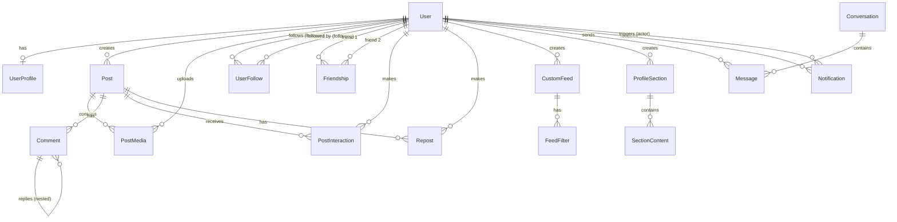

# Data Model - VRSS Social Platform Feature

**Feature-Specific Data Model Documentation**

This document highlights the data model aspects specific to the VRSS social platform feature. For complete data model documentation, see [../../DATA_MODEL.md](../../DATA_MODEL.md).

---

## Overview

The VRSS social platform feature uses a subset of the full 28-model database schema, focusing on:

- **User accounts and profiles** (authentication, profile customization)
- **Social content** (posts, media, comments)
- **Social relationships** (follows, friendships, interactions)
- **Custom feeds and discovery** (feed algorithms, filters)
- **Communication** (messages, notifications)

**Complete Reference:** See [../../DATA_MODEL.md](../../DATA_MODEL.md) for all 28 models, validation rules, triggers, and indexes.

---

## Feature-Specific Models

### Core User Models

**User & UserProfile** - User accounts with customizable profiles
- Username as primary identifier (case-insensitive, 3-30 chars)
- Email for authentication only (not public)
- Better-auth integration (Account, Session tables)
- Profile configs stored as JSONB (background, music, style, layout)
- Visibility settings (public/followers/private)

**Reference:** [../../DATA_MODEL.md#user-7-models-total](../../DATA_MODEL.md#user-7-models-total)

### Content Models

**Post** - User-generated content with multiple types
- Post types: text_short, text_long, image, image_gallery, gif, video_short, video_long, song, album
- API uses simplified types (text, image, video, song) mapped to granular DB types
- Visibility settings (public/followers/private)
- Denormalized counters (likesCount, commentsCount, repostsCount, viewsCount)
- Soft delete support (deletedAt)

**PostMedia** - Media files for posts
- Supports image, gif, video, audio, document
- S3 storage with presigned URLs for upload
- Storage quota enforcement (50MB free tier)
- Database triggers auto-update StorageUsage

**Comment** - Nested comments on posts
- Self-referential (parentCommentId for nested replies)
- Denormalized counters (likesCount, repliesCount)
- Soft delete support
- Triggers auto-update Post.commentsCount

**Reference:** [../../DATA_MODEL.md#posts--media-4-models](../../DATA_MODEL.md#posts--media-4-models)

### Social Relationship Models

**UserFollow** - Follow relationships
- followerId → followingId (one-directional)
- Unique constraint on [followerId, followingId]
- Indexed for efficient follower/following queries

**Friendship** - Mutual follow relationships
- Auto-created by database trigger when mutual follow detected
- Ordered IDs (userId1 < userId2 always)
- Enables efficient "friends" queries

**PostInteraction** - Likes, bookmarks, shares
- Type: like, bookmark, share
- Unique constraint on [userId, postId, type]
- Triggers auto-update Post.likesCount for type='like'

**Repost** - Post reposts/shares
- Optional comment on repost
- Unique constraint on [userId, postId]

**Reference:** [../../DATA_MODEL.md#social-relationships-5-models](../../DATA_MODEL.md#social-relationships-5-models)

### Feed & Discovery Models

**CustomFeed** - User-created feed algorithms
- JSONB algorithmConfig stores feed logic
- Multiple feeds per user with displayOrder
- isDefault flag for primary feed
- Name uniqueness per user

**FeedFilter** - Filters for custom feeds
- Filter types: post_type, author, tag, date_range, engagement
- Filter operators: equals, not_equals, contains, greater_than, less_than, in_range
- Logical grouping with groupId and logicalOperator (AND, OR)
- JSONB value field for flexible filter data

**Reference:** [../../DATA_MODEL.md#custom-feeds-2-models](../../DATA_MODEL.md#custom-feeds-2-models)

### Profile Customization Models

**ProfileSection** - Customizable profile sections
- Section types: feed, gallery, links, static_text, static_image, video, reposts, friends, followers, following, list
- JSONB config for section-specific settings
- displayOrder for arranging sections
- isVisible flag for hiding sections

**SectionContent** - Content items in profile sections
- Links, text, images for sections
- displayOrder for item arrangement

**Reference:** [../../DATA_MODEL.md#profile-customization-2-models](../../DATA_MODEL.md#profile-customization-2-models)

### Communication Models

**Conversation** - Direct message conversations
- PostgreSQL array type for participant IDs (ordered: [lower, higher])
- lastMessageAt for sorting inbox
- Efficient lookup with participant array

**Message** - Direct messages
- PostgreSQL array type for readBy tracking
- Soft delete support (deletedAt)
- Updates Conversation.lastMessageAt on creation

**Notification** - User notifications
- Notification types: follow, like, comment, repost, mention, message, friend_request, system
- Actor tracking (who triggered notification)
- Related entity IDs (postId, commentId)
- isRead flag and readAt timestamp

**Reference:** [../../DATA_MODEL.md#phase-4-communication-models](../../DATA_MODEL.md#phase-4-communication-models)

---

## Feature-Specific Entity Relationship Diagram



---

## Feature-Specific Validation Rules

### Username Requirements
- **Pattern:** `/^[a-zA-Z0-9_]+$/`
- **Length:** 3-30 characters
- **Uniqueness:** Case-insensitive (stored with original casing in displayUsername)
- **Use:** Primary login identifier (NOT email)

**Reference:** [../../DATA_MODEL.md#username-validation](../../DATA_MODEL.md#username-validation)

### Post Content Requirements
- **Text posts:** Max 10,000 characters
- **Media posts:** Storage quota enforced (50MB free)
- **File size limits:**
  - Images: 10MB max
  - Videos: 100MB max
  - Audio: 20MB max
  - Documents: 10MB max

### Feed Algorithm Requirements
- **Max filters per feed:** Recommended <10 for performance
- **Filter complexity:** Balanced to prevent slow queries
- **Custom feed names:** Unique per user (case-insensitive)

---

## Feature-Specific Database Triggers

### Trigger 1: Friendship Auto-Creation

**When:** UserFollow inserted creating mutual follow
**Action:** Automatically creates Friendship record
**Logic:** Uses LEAST/GREATEST to order IDs (userId1 < userId2)
**Idempotency:** ON CONFLICT DO NOTHING

**Example:**
```
User 5 follows User 10 → UserFollow created
User 10 follows User 5 → UserFollow created + Friendship auto-created
```

**Reference:** [../../DATA_MODEL.md#trigger-1-friendship-creation](../../DATA_MODEL.md#trigger-1-friendship-creation)

### Trigger 2: Post Engagement Counters

**When:** PostInteraction or Comment inserted/deleted
**Action:** Auto-update Post counters (likesCount, commentsCount)
**Functions:**
- `increment_post_likes_count()` - On PostInteraction INSERT WHERE type='like'
- `decrement_post_likes_count()` - On PostInteraction DELETE WHERE type='like'
- `increment_post_comments_count()` - On Comment INSERT
- `decrement_post_comments_count()` - On Comment DELETE

**Benefit:** Eliminates manual counter updates in application code

**Reference:** [../../DATA_MODEL.md#trigger-2-post-interaction-counters](../../DATA_MODEL.md#trigger-2-post-interaction-counters)

### Trigger 3: Storage Usage Tracking

**When:** PostMedia inserted/deleted
**Action:** Auto-update StorageUsage (usedBytes, imagesBytes, videosBytes, audioBytes, otherBytes)
**Functions:**
- `update_storage_on_media_insert()` - Increment counters by file size
- `update_storage_on_media_delete()` - Decrement counters (GREATEST(0, ...))

**Benefit:** Real-time storage quota tracking for upload enforcement

**Reference:** [../../DATA_MODEL.md#trigger-3-storage-usage-tracking](../../DATA_MODEL.md#trigger-3-storage-usage-tracking)

---

## Feature-Specific Indexes

### Critical Indexes for Performance

**User Lookups:**
- `User.username` (unique, case-insensitive) - Login and profile lookups
- `User.email` (unique) - Email verification

**Post Queries:**
- `[userId, createdAt DESC, status]` - User post feeds
- `[type, createdAt DESC]` - Posts by type
- `[likesCount DESC, createdAt DESC]` - Popular posts

**Social Queries:**
- `UserFollow [followerId, createdAt DESC]` - Following list
- `UserFollow [followingId, createdAt DESC]` - Followers list
- `Friendship [userId1, createdAt DESC]` - Friends list
- `Friendship [userId2, createdAt DESC]` - Friends list (reverse)

**Comment Queries:**
- `Comment [postId, createdAt DESC]` - Post comments
- `Comment [parentCommentId, createdAt DESC]` - Nested replies

**Feed & Discovery:**
- `CustomFeed [userId, displayOrder]` - User's feeds
- `FeedFilter [feedId, groupId, displayOrder]` - Feed filters

**Communication:**
- `Message [conversationId, createdAt DESC]` - Conversation messages
- `Notification [userId, createdAt DESC]` - User notifications
- `Notification [userId, isRead]` - Unread notifications

**Total Indexes:** 37 across all tables (see [../../DATA_MODEL.md#indexes](../../DATA_MODEL.md#indexes))

---

## Type Transformations

### BigInt ↔ String (Database ↔ API)

**Database:** All IDs are `BigInt` (auto-increment, 64-bit integers)
**API:** All IDs converted to `String` (JSON-safe, prevents precision loss)

**Example:**
```
Database: id = 1234567890123456789n (BigInt)
API:      id = "1234567890123456789" (String)
```

**Reference:** [../../DATA_MODEL.md#bigint--string-conversion](../../DATA_MODEL.md#bigint--string-conversion)

### Post Type Mapping (API ↔ Database)

**API Simplified Types (4):**
- `text` → `text_short` (database)
- `image` → `image` (database)
- `video` → `video_short` (database)
- `song` → `song` (database)

**Database Granular Types (9):**
- Text: `text_short`, `text_long`
- Image: `image`, `image_gallery`, `gif`
- Video: `video_short`, `video_long`
- Audio: `song`, `album`

**Rationale:** API simplicity for frontend, database granularity for features

**Reference:** [../../DATA_MODEL.md#post-type-mapping-api--database](../../DATA_MODEL.md#post-type-mapping-api--database)

---

## Cross-References

**Complete Data Model:** [../../DATA_MODEL.md](../../DATA_MODEL.md) - All 28 models with full details
**API Documentation:** [../../API.md](../../API.md) - RPC procedures and endpoints
**Authentication:** [../../AUTHENTICATION.md](../../AUTHENTICATION.md) - Better-auth integration
**Database:** [../../DATABASE.md](../../DATABASE.md) - Prisma schema, migrations, features
**Testing:** [TESTING.md](./TESTING.md) - Feature-specific test scenarios

---

**Document Version:** 1.0
**Last Updated:** 2025-10-21
**Phase Status:** Phase 4 Complete, Phase 5.1 In Progress
