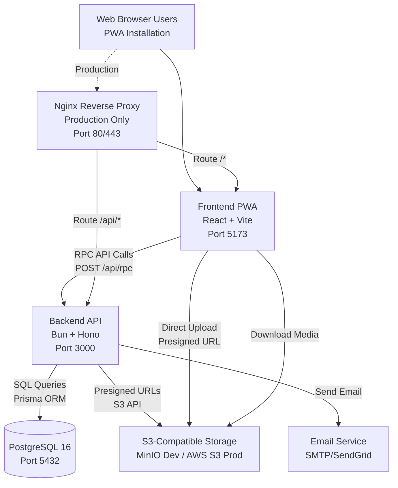
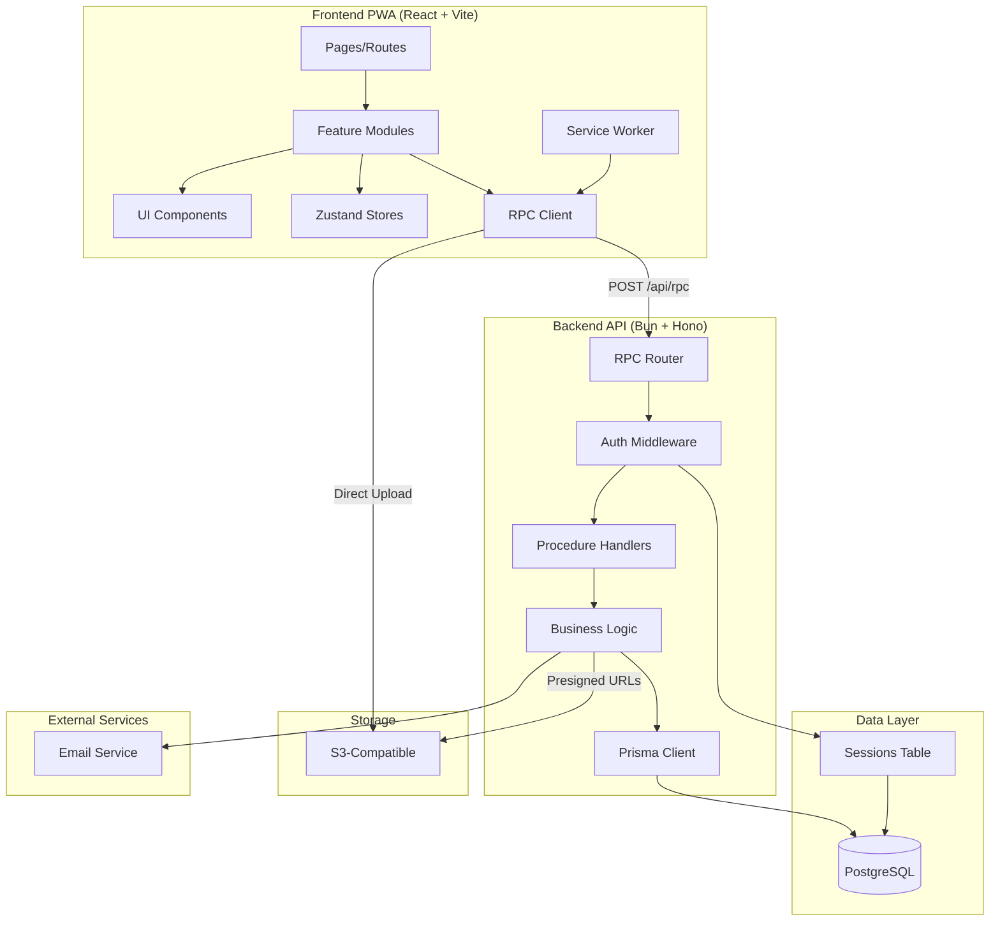

# Solution Design Document

## Validation Checklist
- [ ] Quality Goals prioritized (top 3-5 architectural quality attributes)
- [ ] Constraints documented (technical, organizational, security/compliance)
- [ ] Implementation Context complete (required sources, boundaries, external interfaces, project commands)
- [ ] Solution Strategy defined with rationale
- [ ] Building Block View complete (components, directory map, interface specifications)
- [ ] Runtime View documented (primary flow, error handling, complex logic)
- [ ] Deployment View specified (environment, configuration, dependencies, performance)
- [ ] Cross-Cutting Concepts addressed (patterns, interfaces, system-wide patterns, implementation patterns)
- [ ] Architecture Decisions captured with trade-offs
- [ ] **All Architecture Decisions confirmed by user** (no pending confirmations)
- [ ] Quality Requirements defined (performance, usability, security, reliability)
- [ ] Risks and Technical Debt identified (known issues, technical debt, implementation gotchas)
- [ ] Test Specifications complete (critical scenarios, coverage requirements)
- [ ] Glossary defined (domain and technical terms)
- [ ] No [NEEDS CLARIFICATION] markers remain

---

## Constraints

### Technical Constraints
- **Runtime**: Bun (JavaScript runtime, TypeScript-native)
- **Backend Framework**: Hono (lightweight, RPC-friendly)
- **Frontend Framework**: React 18+ with TypeScript 5.5+
- **Database**: PostgreSQL 16+ (with Prisma ORM)
- **Authentication**: Better-auth (session-based, database-backed)
- **UI Library**: Shadcn-ui (Radix UI + Tailwind CSS)
- **Build Tool**: Vite 5+ for frontend, Turborepo for monorepo
- **Container Runtime**: Docker with Docker Compose
- **Browser Support**: Modern browsers (Chrome 90+, Firefox 88+, Safari 14+, Edge 90+)
- **Mobile Support**: Progressive Web App (PWA) - no native apps for MVP
- **Performance Targets**:
  - Page load: <2 seconds (3G network)
  - Feed rendering: <50ms (initial load)
  - Custom feed execution: <100ms
  - API response time: <200ms (p95)
  - Database queries: <50ms (p95)

### Organizational Constraints
- **Team Size**: Small team (MVP development)
- **Deployment**: Self-hosted VPS or cloud (DigitalOcean, Linode, AWS)
- **Budget**: MVP optimized for $12-50/month hosting
- **Development Approach**: Test-driven, infrastructure-first, then features
- **Code Organization**: Monorepo structure with clear module boundaries
- **Documentation**: All architecture decisions documented (see `/docs/architecture/`)

### Security & Compliance Constraints
- **Authentication**: Email/password with email verification (OAuth social login future)
- **Session Management**: Database-backed sessions (7-day expiry, sliding window)
- **Data Protection**:
  - HTTPS/TLS required for all connections
  - Passwords hashed with bcrypt (10 rounds)
  - Session tokens: 256-bit random
  - Database encryption at rest
- **Authorization**: Resource ownership checks, profile visibility controls
- **Privacy**: User data export (GDPR), account deletion (30-day grace period)
- **File Upload Security**:
  - Type validation (magic bytes)
  - Size limits (50MB per file)
  - Direct S3 upload (presigned URLs)
  - Storage quotas enforced (50MB free, 1GB+ paid)
- **API Security**: Input validation (Zod), XSS prevention, CSRF protection, rate limiting
- **Compliance**: Basic GDPR compliance for MVP (data export, deletion)

## Implementation Context

**IMPORTANT**: You MUST read and analyze ALL listed context sources to understand constraints, patterns, and existing architecture.

### Required Context Sources

#### General Context

```yaml
# Internal documentation and architecture
- doc: docs/architecture/MONOLITH_ARCHITECTURE.md
  relevance: CRITICAL
  why: "Complete monolith architecture design, scalability path"

- doc: docs/architecture/VISUAL_SUMMARY.md
  relevance: HIGH
  why: "Visual diagrams of system architecture"

- doc: docs/architecture/ARCHITECTURE_DECISIONS.md
  relevance: CRITICAL
  why: "11 architecture decision records (ADRs) with rationale"

- doc: docs/specs/001-vrss-social-platform/DATABASE_SCHEMA.md
  relevance: CRITICAL
  why: "Complete PostgreSQL schema (19 tables) with indexes and migrations"

- doc: docs/specs/001-vrss-social-platform/PRD.md
  relevance: CRITICAL
  why: "Product requirements - all features must align with PRD"

- doc: PLAN.md
  relevance: CRITICAL
  why: "Source of truth for MVP requirements and tech stack"

# API and integration documentation
- doc: docs/api-architecture.md
  relevance: CRITICAL
  why: "RPC API design with 50+ procedures, type contracts, error handling"

- doc: docs/api-implementation-guide.md
  relevance: HIGH
  why: "Implementation examples and testing patterns"

- doc: docs/api-quick-reference.md
  relevance: MEDIUM
  why: "Daily reference for API usage"

# Frontend architecture
- doc: docs/frontend-architecture.md
  relevance: CRITICAL
  why: "PWA design, state management, component patterns"

- doc: docs/component-specifications.md
  relevance: HIGH
  why: "Detailed component specs (Feed Builder, Profile Editor)"

- doc: docs/frontend-implementation-guide.md
  relevance: HIGH
  why: "7-phase implementation roadmap"

# Security documentation
- doc: docs/SECURITY_DESIGN.md
  relevance: CRITICAL
  why: "Better-auth integration, security patterns, authorization"

- doc: docs/SECURITY_TESTING.md
  relevance: HIGH
  why: "Security test cases and attack scenarios"

# Testing strategy
- doc: docs/specs/001-vrss-social-platform/TESTING-STRATEGY.md
  relevance: CRITICAL
  why: "Comprehensive testing infrastructure (unit, integration, E2E)"

# Infrastructure
- doc: docs/DOCKER.md
  relevance: HIGH
  why: "Docker Compose setup, containerization strategy"

- doc: docs/INFRASTRUCTURE_SPEC.md
  relevance: HIGH
  why: "Complete infrastructure specification"

# External framework and library documentation
- url: https://bun.sh/docs
  relevance: HIGH
  sections: [runtime, test, watch]
  why: "Bun runtime features and testing framework"

- url: https://hono.dev/
  relevance: HIGH
  sections: [middleware, context, routing]
  why: "Hono framework patterns for RPC implementation"

- url: https://www.prisma.io/docs
  relevance: HIGH
  sections: [schema, migrations, client]
  why: "Prisma ORM usage and migration patterns"

- url: https://www.better-auth.com/docs
  relevance: HIGH
  sections: [session-management, email-verification]
  why: "Better-auth configuration and session handling"

- url: https://ui.shadcn.com/
  relevance: HIGH
  sections: [components, theming]
  why: "Shadcn-ui component library patterns"

- url: https://vite-pwa-org.netlify.app/
  relevance: MEDIUM
  sections: [service-worker, offline]
  why: "PWA configuration with Vite"
```

#### Component: Backend API (Bun + Hono)

```yaml
Location: /apps/api/

# Configuration files
- file: package.json
  relevance: HIGH
  why: "Dependencies (Bun, Hono, Prisma, Better-auth) and scripts"

- file: tsconfig.json
  relevance: MEDIUM
  why: "TypeScript configuration for backend"

- file: prisma/schema.prisma
  relevance: CRITICAL
  why: "Database schema definition - source of truth for data models"

# Core application structure (to be created)
- file: src/index.ts
  relevance: HIGH
  why: "Application entry point, server initialization"

- file: src/rpc/index.ts
  relevance: CRITICAL
  why: "RPC router setup and procedure registration"

- file: src/rpc/routers/*.ts
  relevance: HIGH
  why: "10 procedure routers (auth, user, post, feed, social, discovery, message, notification, media, settings)"

- file: src/middleware/auth.ts
  relevance: CRITICAL
  why: "Better-auth integration and session management"

- file: src/lib/prisma.ts
  relevance: HIGH
  why: "Prisma client initialization and connection pooling"
```

#### Component: Frontend PWA (React + Vite)

```yaml
Location: /apps/web/

# Configuration files
- file: package.json
  relevance: HIGH
  why: "Dependencies (React, Vite, Shadcn-ui, TanStack Query, Zustand) and scripts"

- file: tsconfig.json
  relevance: MEDIUM
  why: "TypeScript configuration for frontend"

- file: vite.config.ts
  relevance: HIGH
  why: "Vite build configuration, PWA plugin setup"

- file: tailwind.config.js
  relevance: MEDIUM
  why: "Tailwind CSS configuration for Shadcn-ui"

# Core application structure (to be created)
- file: src/main.tsx
  relevance: HIGH
  why: "Application entry point, React root"

- file: src/lib/api/client.ts
  relevance: CRITICAL
  why: "RPC client implementation with type safety"

- file: src/lib/api/hooks/*.ts
  relevance: HIGH
  why: "Feature-specific API hooks (useFeed, useProfile, etc.)"

- file: src/features/*/
  relevance: HIGH
  why: "Feature modules (auth, feed, profile, messages, notifications, discover)"

- file: src/stores/*.ts
  relevance: HIGH
  why: "Zustand stores for global state (auth, UI, offline queue)"
```

#### Component: Shared Packages

```yaml
Location: /packages/

# Shared type contracts
- file: api-contracts/src/index.ts
  relevance: CRITICAL
  why: "TypeScript type definitions shared between frontend and backend"

- file: api-contracts/src/procedures/*.ts
  relevance: CRITICAL
  why: "RPC procedure input/output types for type-safe API calls"

# Shared configuration
- file: config/eslint-config.js
  relevance: LOW
  why: "Shared ESLint rules across packages"

- file: config/typescript-config/
  relevance: LOW
  why: "Shared TypeScript configurations"
```

### Implementation Boundaries

This is a greenfield MVP implementation. All code will be created from scratch.

- **Must Preserve**: N/A (new implementation)
- **Can Modify**: All code and configurations (MVP development)
- **Must Not Touch**: N/A (no legacy systems)
- **Standards to Follow**:
  - Type safety enforced throughout (TypeScript strict mode)
  - Test coverage requirements (80%+ overall, 100% critical paths)
  - Security patterns from `/docs/SECURITY_DESIGN.md`
  - API contracts defined in `/docs/api-architecture.md`
  - Database schema from `/docs/specs/001-vrss-social-platform/DATABASE_SCHEMA.md`
  - Component patterns from `/docs/frontend-architecture.md`

### External Interfaces

#### System Context Diagram



#### Interface Specifications

```yaml
# Inbound Interfaces (what calls this system)
inbound:
  - name: "PWA Frontend (React + Vite)"
    type: HTTPS
    format: RPC (JSON)
    endpoint: "POST /api/rpc"
    authentication: Session (Better-auth cookies)
    doc: @docs/api-architecture.md
    data_flow: "All user actions - RPC procedure calls"
    rate_limits: "100 req/min per user, 1000 req/min per procedure"

  - name: "Service Worker (PWA Offline)"
    type: Local HTTP
    format: Cached responses
    authentication: Service Worker Cache
    doc: @docs/frontend-architecture.md
    data_flow: "Offline content access, sync queue"

# Outbound Interfaces (what this system calls)
outbound:
  - name: "S3-Compatible Storage (Media)"
    type: HTTPS
    format: S3 API
    authentication: Access Key ID + Secret
    doc: See infrastructure docs
    data_flow: "Media upload/download (images, videos, songs)"
    criticality: HIGH
    operations:
      - Generate presigned URLs (15min expiry)
      - Direct client upload to S3
      - Content-Type validation
      - Storage quota enforcement

  - name: "Email Service (SMTP/SendGrid)"
    type: SMTP/HTTPS
    format: Email/API
    authentication: SMTP credentials or API key
    doc: @docs/SECURITY_DESIGN.md
    data_flow: "Email verification, password reset notifications"
    criticality: MEDIUM
    operations:
      - Send verification emails
      - Send password reset emails
      - Future: Notification digests

# Data Interfaces
data:
  - name: "PostgreSQL 16 (Primary Database)"
    type: PostgreSQL
    connection: Prisma ORM (connection pooling)
    doc: @docs/specs/001-vrss-social-platform/DATABASE_SCHEMA.md
    data_flow: "All application data persistence"
    schema: "19 tables (users, posts, feeds, messages, etc.)"
    performance:
      - Connection pool: 10-20 connections
      - Query timeout: 30 seconds
      - 30+ optimized indexes

  - name: "Better-auth Session Store"
    type: PostgreSQL (sessions table)
    connection: Better-auth library
    doc: @docs/SECURITY_DESIGN.md
    data_flow: "User sessions (7-day expiry, sliding window)"

  - name: "S3-Compatible Storage (File System)"
    type: MinIO (dev) / AWS S3 (prod)
    connection: SDK
    doc: See infrastructure docs
    data_flow: "Media files, profile images, post attachments"
    buckets:
      - vrss-media (user uploads)
      - vrss-profile-images (avatars, backgrounds)
    quotas:
      - Free tier: 50MB per user
      - Paid tier: 1GB+ per user
```

### Cross-Component Boundaries

**Monorepo Component Organization:**
- **Backend API** (`/apps/api/`): Owns business logic, database access, auth
- **Frontend PWA** (`/apps/web/`): Owns UI, user interactions, offline capabilities
- **Shared Packages** (`/packages/`): Type contracts, shared configs

**API Contracts:**
- **RPC Procedure Types** (`/packages/api-contracts/`): Public contracts, versioned
- **Breaking Changes**: Require major version bump and migration path
- **Backwards Compatibility**: Maintain for at least one minor version

**Shared Resources:**
- **Database**: Single PostgreSQL instance shared by backend API only
- **S3 Storage**: Shared bucket accessed by backend (presigned URLs) and frontend (direct upload)
- **Session Store**: PostgreSQL sessions table managed by Better-auth

**Team Ownership** (for future scale):
- **Core Team**: All components (MVP phase)
- **Future**: Separate teams for backend, frontend, infra as team grows

**Breaking Change Policy:**
- **Database**: Prisma migrations with rollback strategy
- **API**: Version procedures (`v2.user.getProfile`) if breaking changes
- **Frontend**: Update shared types atomically with backend changes (monorepo benefit)

### Project Commands

```bash
# ============================================
# MONOREPO - ROOT LEVEL
# ============================================
Location: /

## Environment Setup (One-time)
./scripts/dev-setup.sh              # Automated setup: creates .env, generates secrets, builds containers

## Docker Infrastructure (Daily Development)
make start                          # Start all services (DB, backend, frontend, nginx)
make stop                           # Stop all services
make restart                        # Restart all services
make logs                           # View logs from all services
make logs SERVICE=api               # View logs from specific service
make health                         # Run health checks on all services
make clean                          # Stop and remove all containers, volumes, networks

## Docker - Individual Services
docker-compose up -d db             # Start only PostgreSQL
docker-compose up -d api            # Start only backend API
docker-compose up -d web            # Start only frontend
docker-compose up -d nginx          # Start only nginx (production mode)

## Monorepo Package Management
bun install                         # Install all dependencies (root + workspaces)
bun add <package> -w                # Add dependency to root workspace
turbo build                         # Build all packages in dependency order
turbo dev                           # Run dev mode for all packages
turbo test                          # Run tests for all packages
turbo clean                         # Clean all build artifacts

# ============================================
# BACKEND API (/apps/api/)
# ============================================
Location: /apps/api/

## Development
cd apps/api
bun install                         # Install backend dependencies
bun run dev                         # Start backend in watch mode (hot reload)
bun run build                       # Build backend for production
bun run start                       # Start production build

## Testing (Bun Test + Testcontainers)
bun test                            # Run all tests
bun test --watch                    # Run tests in watch mode
bun test tests/unit/                # Run only unit tests
bun test tests/integration/         # Run only integration tests
bun run test:coverage               # Run tests with coverage report
bun run test:db                     # Run database-specific tests (Testcontainers)

## Database Operations (Prisma)
bunx prisma generate                # Generate Prisma Client from schema
bunx prisma migrate dev             # Create and apply migration (development)
bunx prisma migrate deploy          # Apply pending migrations (production)
bunx prisma migrate reset           # Reset database and apply all migrations
bunx prisma db seed                 # Seed database with test data
bunx prisma studio                  # Open Prisma Studio (database GUI)
bunx prisma format                  # Format prisma/schema.prisma file

## Database Direct Access (via Docker)
make db-shell                       # Open PostgreSQL psql shell
make db-backup                      # Create database backup
make db-restore BACKUP=filename     # Restore from backup
make db-logs                        # View database logs

## Code Quality
bun run lint                        # Run ESLint
bun run lint:fix                    # Fix auto-fixable lint issues
bun run typecheck                   # Run TypeScript type checking
bun run format                      # Format code with Prettier

# ============================================
# FRONTEND PWA (/apps/web/)
# ============================================
Location: /apps/web/

## Development
cd apps/web
bun install                         # Install frontend dependencies
bun run dev                         # Start Vite dev server (HMR enabled)
bun run build                       # Build for production
bun run preview                     # Preview production build locally

## Testing (Vitest + React Testing Library + Playwright)
bun test                            # Run unit/component tests (Vitest)
bun test --watch                    # Run tests in watch mode
bun test --ui                       # Open Vitest UI
bun run test:coverage               # Run tests with coverage
bun run test:e2e                    # Run E2E tests (Playwright)
bun run test:e2e:ui                 # Run E2E tests with UI
bunx playwright codegen             # Generate Playwright tests

## PWA Testing
bun run build && bun run preview    # Test PWA in production mode
# Then open browser DevTools > Application > Service Workers

## Code Quality
bun run lint                        # Run ESLint
bun run lint:fix                    # Fix auto-fixable lint issues
bun run typecheck                   # Run TypeScript type checking
bun run format                      # Format code with Prettier

# ============================================
# SHARED PACKAGES (/packages/)
# ============================================

## API Contracts (/packages/api-contracts/)
cd packages/api-contracts
bun run build                       # Build TypeScript types
bun run typecheck                   # Type check contracts

# ============================================
# E2E TESTING (Full System)
# ============================================
Location: /

## E2E Test Execution
make test-e2e                       # Run full E2E test suite
bun run test:e2e:ci                 # Run E2E in CI mode (headless)
bunx playwright test                # Run Playwright tests
bunx playwright test --headed       # Run with browser UI
bunx playwright test --debug        # Run in debug mode
bunx playwright show-report         # View test report

# ============================================
# PRODUCTION DEPLOYMENT
# ============================================

## Build Production Images
docker-compose -f docker-compose.prod.yml build

## Deploy to Production
make prod-build                     # Build production Docker images
make prod-up                        # Start production services
make prod-logs                      # View production logs
make prod-health                    # Check production health

## Database Migrations (Production)
make prod-migrate                   # Run Prisma migrations in production
make prod-db-backup                 # Backup production database

# ============================================
# TROUBLESHOOTING & MAINTENANCE
# ============================================

## Reset Everything
make clean                          # Remove all containers and volumes
bun install                         # Reinstall dependencies
./scripts/dev-setup.sh              # Re-run setup

## View Logs
make logs                           # All services
docker-compose logs -f api          # Backend API only
docker-compose logs -f web          # Frontend only
docker-compose logs -f db           # Database only

## Database Issues
make db-shell                       # Access PostgreSQL directly
bunx prisma migrate reset           # Reset and recreate database
bunx prisma db push                 # Sync schema without migration

## Clear Caches
turbo clean                         # Clean turbo cache
rm -rf node_modules && bun install  # Fresh dependency install
docker system prune -a              # Clean Docker caches (use with caution)

# ============================================
# DEVELOPMENT WORKFLOW (Typical Day)
# ============================================

# Morning startup
make start                          # Start all services

# Work on backend
cd apps/api
bun run dev                         # Hot reload enabled
bun test --watch                    # Tests in watch mode

# Work on frontend (separate terminal)
cd apps/web
bun run dev                         # HMR enabled
bun test --watch                    # Tests in watch mode

# Run E2E tests before committing
bun run test:e2e                    # Full E2E suite

# End of day
make stop                           # Stop all services
```

## Solution Strategy

### Architecture Pattern: Monolith with Clear Module Boundaries

**Approach**: Feature-based monolithic application with containerized deployment, organized as a monorepo with clear separation between backend, frontend, and shared packages.

**Structure**:
- **Monorepo Organization**: Turborepo managing multiple apps and packages
- **Backend**: Bun runtime + Hono framework with RPC-style API
- **Frontend**: React PWA with Vite build tool
- **Database**: PostgreSQL with Prisma ORM
- **Deployment**: Multi-container Docker Compose setup

**Why Monolith for MVP**:
1. **Simplicity**: Single deployment unit, no distributed systems complexity
2. **Development Speed**: Faster iteration, no network latency between components
3. **Type Safety**: Shared types across frontend/backend in monorepo
4. **Cost-Effective**: Single server can handle MVP traffic ($12-50/month)
5. **Debugging**: Easier to trace requests through single codebase
6. **Database Transactions**: ACID guarantees without distributed transactions

**Scalability Path**: Clear module boundaries allow gradual extraction to microservices when needed (100K+ users).

### Integration Approach

**Greenfield MVP** - No existing system integration required.

**External Integrations**:
1. **S3-Compatible Storage**: MinIO (dev) / AWS S3 (prod) for media
2. **Email Service**: SMTP or SendGrid for verification emails
3. **Better-auth**: Pre-built authentication library

**Integration Pattern**:
- Backend owns all integrations
- Frontend only integrates with backend RPC API
- Direct S3 upload from frontend (via presigned URLs)

### Justification for Key Decisions

#### 1. RPC-Style API (Not REST or GraphQL)
**Why**:
- Type-safe end-to-end (shared TypeScript types)
- Single endpoint (`/api/rpc`) simplifies routing
- Procedure-based naming matches domain actions
- Less boilerplate than REST, simpler than GraphQL
- Better developer experience with autocomplete

**Trade-off**: Less standardized than REST, but gains in DX and type safety outweigh this.

#### 2. Prisma ORM (Per PLAN.md)
**Why**:
- Type-safe database queries
- Excellent migration system
- Auto-generated client with full TypeScript support
- Great developer experience
- Industry-proven with large community

**Trade-off**: Slightly heavier than raw SQL, but DX and safety worth it.

#### 3. Better-auth (Session-based)
**Why**:
- Built for Bun + Hono
- Database-backed sessions (not JWT)
- Better security than JWT for web apps
- Email verification built-in
- Extensible for future OAuth

**Trade-off**: Sessions require database lookups, but acceptable for MVP scale.

#### 4. Monorepo with Turborepo
**Why**:
- Shared types between frontend/backend (single source of truth)
- Atomic commits across both apps
- Fast builds with intelligent caching
- Better than multi-repo for small team

**Trade-off**: Slightly more complex setup, but massive DX improvement.

#### 5. PostgreSQL (Not MongoDB or graph DB)
**Why**:
- Relational model fits social graph well
- JSONB for flexible profile customization
- Excellent performance with proper indexing
- Battle-tested for production
- Graph DB can be added later if needed

**Trade-off**: More complex queries for deep graph traversal, mitigated by denormalization.

### Key Design Decisions

1. **Feature-Based Organization**: Code organized by business domain (auth, feed, profile) not technical layer
2. **Test-Driven Development**: Infrastructure and tests before features
3. **Two-Phase File Upload**: Presigned S3 URLs avoid backend bottleneck
4. **JSONB for Customization**: Profile styles and feed algorithms stored as flexible JSON
5. **Cursor-Based Pagination**: Better UX than offset pagination for feeds
6. **PWA Offline-First**: Service worker caching for offline experience
7. **Zustand for State**: Simpler than Redux, better than Context for complex state
8. **Shadcn-ui Components**: Radix UI + Tailwind, copy-paste approach vs NPM dependency

See `/docs/architecture/ARCHITECTURE_DECISIONS.md` for complete ADR documentation.

## Building Block View

### Components



**Component Interactions**:
1. **User** → **Pages** → **Feature Modules** → **RPC Client** → **Backend API**
2. **Backend API** → **Business Logic** → **Prisma** → **PostgreSQL**
3. **Frontend** → **Direct S3 Upload** (via presigned URLs)
4. **Service Worker** → **Offline Queue** → **Sync on Reconnect**

### Directory Map

**Complete Monorepo Structure** (All NEW - greenfield implementation):

```
vrss/                                    # Root monorepo
├── apps/
│   ├── api/                            # Backend API (Bun + Hono)
│   │   ├── src/
│   │   │   ├── index.ts                # Server entry point
│   │   │   ├── rpc/
│   │   │   │   ├── index.ts            # RPC router setup
│   │   │   │   └── routers/            # Procedure routers
│   │   │   │       ├── auth.ts         # Authentication procedures
│   │   │   │       ├── user.ts         # User/profile procedures
│   │   │   │       ├── post.ts         # Post CRUD procedures
│   │   │   │       ├── feed.ts         # Feed & algorithm procedures
│   │   │   │       ├── social.ts       # Follow/friend procedures
│   │   │   │       ├── discovery.ts    # Search/discovery procedures
│   │   │   │       ├── message.ts      # Messaging procedures
│   │   │   │       ├── notification.ts # Notification procedures
│   │   │   │       ├── media.ts        # Media upload procedures
│   │   │   │       └── settings.ts     # Account settings procedures
│   │   │   ├── features/               # Business logic modules
│   │   │   │   ├── auth/               # Auth domain logic
│   │   │   │   ├── user/               # User domain logic
│   │   │   │   ├── post/               # Post domain logic
│   │   │   │   ├── feed/               # Feed algorithm logic
│   │   │   │   ├── social/             # Social graph logic
│   │   │   │   ├── message/            # Messaging logic
│   │   │   │   ├── notification/       # Notification logic
│   │   │   │   └── media/              # Media/storage logic
│   │   │   ├── middleware/
│   │   │   │   ├── auth.ts             # Better-auth middleware
│   │   │   │   ├── rateLimit.ts        # Rate limiting
│   │   │   │   ├── validation.ts       # Input validation (Zod)
│   │   │   │   └── errorHandler.ts     # Global error handling
│   │   │   ├── lib/
│   │   │   │   ├── prisma.ts           # Prisma client init
│   │   │   │   ├── auth.ts             # Better-auth config
│   │   │   │   ├── s3.ts               # S3 client
│   │   │   │   └── email.ts            # Email service
│   │   │   └── utils/
│   │   │       ├── pagination.ts       # Cursor pagination
│   │   │       ├── validation.ts       # Validation helpers
│   │   │       └── errors.ts           # Error classes
│   │   ├── prisma/
│   │   │   ├── schema.prisma           # Database schema
│   │   │   ├── migrations/             # Migration files
│   │   │   └── seed.ts                 # Database seeding
│   │   ├── tests/
│   │   │   ├── unit/                   # Unit tests (Bun Test)
│   │   │   ├── integration/            # Integration tests
│   │   │   └── fixtures/               # Test data
│   │   ├── package.json
│   │   ├── tsconfig.json
│   │   └── Dockerfile
│   │
│   └── web/                            # Frontend PWA (React + Vite)
│       ├── src/
│       │   ├── main.tsx                # React entry point
│       │   ├── App.tsx                 # Root component
│       │   ├── pages/                  # Page components
│       │   │   ├── auth/
│       │   │   │   ├── LoginPage.tsx
│       │   │   │   └── RegisterPage.tsx
│       │   │   ├── home/
│       │   │   │   └── HomePage.tsx    # Feed view
│       │   │   ├── profile/
│       │   │   │   ├── ProfilePage.tsx
│       │   │   │   └── ProfileEditPage.tsx
│       │   │   ├── messages/
│       │   │   │   └── MessagesPage.tsx
│       │   │   ├── notifications/
│       │   │   │   └── NotificationsPage.tsx
│       │   │   ├── discover/
│       │   │   │   └── DiscoverPage.tsx
│       │   │   └── settings/
│       │   │       └── SettingsPage.tsx
│       │   ├── features/               # Feature modules
│       │   │   ├── auth/
│       │   │   │   ├── components/     # Auth-specific components
│       │   │   │   ├── hooks/          # useLogin, useRegister
│       │   │   │   └── stores/         # Auth state (Zustand)
│       │   │   ├── feed/
│       │   │   │   ├── components/     # FeedView, PostCard, FeedBuilder
│       │   │   │   ├── hooks/          # useFeed, useInfiniteFeed
│       │   │   │   └── stores/         # Feed state
│       │   │   ├── profile/
│       │   │   │   ├── components/     # ProfileView, ProfileEditor, StyleEditor, SectionManager
│       │   │   │   ├── hooks/          # useProfile, useProfileUpdate
│       │   │   │   └── stores/         # Profile editing state
│       │   │   ├── post/
│       │   │   │   ├── components/     # PostCreate, PostDisplay (text, image, video, song)
│       │   │   │   └── hooks/          # usePost, usePostCreate
│       │   │   ├── social/
│       │   │   │   ├── components/     # FollowButton, FriendsList
│       │   │   │   └── hooks/          # useFollow, useFriends
│       │   │   ├── messages/
│       │   │   │   ├── components/     # MessageList, MessageThread
│       │   │   │   └── hooks/          # useMessages, useConversations
│       │   │   ├── notifications/
│       │   │   │   ├── components/     # NotificationList, NotificationItem
│       │   │   │   └── hooks/          # useNotifications
│       │   │   └── discover/
│       │   │       ├── components/     # SearchBar, DiscoveryFeed, AlgorithmBuilder
│       │   │       └── hooks/          # useSearch, useDiscovery
│       │   ├── components/             # Shared UI components
│       │   │   ├── ui/                 # Shadcn-ui components
│       │   │   ├── layout/             # Layout components (Header, Nav, Footer)
│       │   │   └── common/             # Common components (Button, Input, etc.)
│       │   ├── lib/
│       │   │   ├── api/
│       │   │   │   ├── client.ts       # RPC client implementation
│       │   │   │   └── hooks/          # Generated API hooks
│       │   │   ├── utils/              # Utility functions
│       │   │   └── constants.ts        # App constants
│       │   ├── stores/                 # Global Zustand stores
│       │   │   ├── auth.ts             # Auth state
│       │   │   ├── ui.ts               # UI state (modals, drawers)
│       │   │   └── offline.ts          # Offline sync queue
│       │   ├── hooks/                  # Global React hooks
│       │   │   ├── useAuth.ts
│       │   │   └── useOffline.ts
│       │   ├── routes/                 # Routing configuration
│       │   │   └── index.tsx           # React Router setup
│       │   ├── styles/                 # Global styles
│       │   │   ├── globals.css
│       │   │   └── tailwind.css
│       │   └── public/                 # Public assets
│       │       ├── manifest.json       # PWA manifest
│       │       └── sw.js               # Service worker
│       ├── tests/
│       │   ├── unit/                   # Component tests (Vitest)
│       │   ├── integration/            # Integration tests
│       │   └── e2e/                    # E2E tests (Playwright)
│       │       ├── auth.spec.ts
│       │       ├── feed.spec.ts
│       │       ├── profile.spec.ts
│       │       └── offline.spec.ts
│       ├── package.json
│       ├── tsconfig.json
│       ├── vite.config.ts              # Vite + PWA plugin config
│       ├── tailwind.config.js
│       └── Dockerfile
│
├── packages/                           # Shared packages
│   ├── api-contracts/                  # Shared TypeScript types
│   │   ├── src/
│   │   │   ├── index.ts
│   │   │   ├── procedures/             # RPC procedure types
│   │   │   │   ├── auth.ts
│   │   │   │   ├── user.ts
│   │   │   │   ├── post.ts
│   │   │   │   ├── feed.ts
│   │   │   │   ├── social.ts
│   │   │   │   ├── discovery.ts
│   │   │   │   ├── message.ts
│   │   │   │   ├── notification.ts
│   │   │   │   ├── media.ts
│   │   │   │   └── settings.ts
│   │   │   └── types/                  # Shared domain types
│   │   │       ├── user.ts
│   │   │       ├── post.ts
│   │   │       ├── feed.ts
│   │   │       └── common.ts
│   │   ├── package.json
│   │   └── tsconfig.json
│   │
│   └── config/                         # Shared configs
│       ├── eslint-config/
│       │   └── index.js
│       └── typescript-config/
│           ├── base.json
│           ├── nextjs.json
│           └── react.json
│
├── docs/                               # Documentation (CREATED)
│   ├── architecture/                   # Architecture docs
│   ├── specs/001-vrss-social-platform/ # This spec
│   ├── api-*.md                        # API docs
│   ├── frontend-*.md                   # Frontend docs
│   └── SECURITY_*.md                   # Security docs
│
├── docker/                             # Docker configuration
│   ├── db/
│   │   ├── init/                       # Database init scripts
│   │   └── postgresql.conf
│   └── nginx/
│       └── conf.d/
│
├── scripts/                            # Utility scripts
│   ├── dev-setup.sh                    # One-command setup
│   └── health-check.sh                 # Health verification
│
├── docker-compose.yml                  # Development environment
├── docker-compose.prod.yml             # Production environment
├── Makefile                            # Development commands
├── turbo.json                          # Turborepo config
├── package.json                        # Root package.json
├── .env.example                        # Environment template
└── README.md                           # Project readme
```

**Key Directories**:
- `/apps/api/src/rpc/routers/`: **10 RPC procedure routers** (one per domain)
- `/apps/api/src/features/`: **Business logic** organized by domain
- `/apps/web/src/features/`: **Frontend features** with components, hooks, stores
- `/packages/api-contracts/`: **Shared types** for end-to-end type safety
- `/docs/`: **Complete documentation** from specialist agents

### Interface Specifications

**Note**: Interfaces can be documented by referencing external documentation files OR specified inline. Choose the approach that best fits your project's documentation structure.

#### Interface Documentation References

```yaml
# Reference existing interface documentation
interfaces:
  - name: "Database Schema"
    doc: @docs/specs/001-vrss-social-platform/DATABASE_SCHEMA.md
    relevance: CRITICAL
    sections: [all_19_tables, indexes, relationships, triggers]
    why: "Complete data model with 19 PostgreSQL tables for the platform"

  - name: "Data Storage Documentation"
    doc: @docs/specs/001-vrss-social-platform/DATA_STORAGE_DOCUMENTATION.md
    relevance: CRITICAL
    sections: [storage_architecture, application_models, quota_management, media_storage]
    why: "Application data models, storage quotas (50MB free, 1GB+ paid), and S3 integration"

  - name: "RPC API Architecture"
    doc: @docs/api-architecture.md
    relevance: CRITICAL
    sections: [all_procedures, type_contracts, error_handling, file_uploads]
    why: "Single endpoint RPC pattern with 50+ procedures across 10 routers"

  - name: "Integration Points"
    doc: @docs/INTEGRATION_POINTS.md
    relevance: CRITICAL
    sections: [component_communication, s3_uploads, better_auth_integration, data_flows]
    why: "System boundaries, inter-component communication, and external service integrations"

  - name: "Frontend Data Models"
    doc: @docs/frontend-data-models.md
    relevance: HIGH
    sections: [zustand_stores, tanstack_queries, component_interfaces, state_patterns]
    why: "Frontend state management with Zustand and TanStack Query, component prop interfaces"

  - name: "Frontend Architecture"
    doc: @docs/frontend-architecture.md
    relevance: HIGH
    sections: [pwa_setup, state_management, routing, offline_strategy]
    why: "Complete PWA architecture with React, TypeScript, and offline-first patterns"

  - name: "Security Design"
    doc: @docs/SECURITY_DESIGN.md
    relevance: CRITICAL
    sections: [authentication_flows, session_management, authorization, data_protection]
    why: "Better-auth integration with session-based authentication and security patterns"
```

#### Data Storage Changes

```yaml
# PostgreSQL 16 database with 19 tables (all NEW for MVP)
# Complete schema documented in DATABASE_SCHEMA.md

Users & Authentication:
  Table: users
    Columns: id (uuid), username (unique), email (unique), password_hash, status, created_at, updated_at
    Indexes: idx_users_username, idx_users_email, idx_users_status

  Table: user_profiles
    Columns: user_id (fk), display_name, bio, avatar_media_id, visibility, profile_config (jsonb), created_at, updated_at
    Indexes: idx_user_profiles_user_id, idx_user_profiles_visibility
    JSONB Schema: {background, music, style: {colors, fonts}, layout: {sections}}

Content:
  Table: posts
    Columns: id (uuid), author_id (fk), type (enum), content (text), media_ids (uuid[]), visibility (enum), likes_count, comments_count, reposts_count, created_at, updated_at, deleted_at
    Indexes: idx_posts_author_id, idx_posts_type, idx_posts_visibility, idx_posts_created_at (desc), idx_posts_deleted_at

  Table: post_media
    Columns: id (uuid), owner_id (fk), post_id (fk), type (enum), url (text), size_bytes (bigint), mime_type, metadata (jsonb), created_at, deleted_at
    Indexes: idx_post_media_owner_id, idx_post_media_post_id

Social Interactions:
  Table: user_follows
    Columns: follower_id (fk), following_id (fk), created_at
    Indexes: idx_user_follows_follower, idx_user_follows_following, unique_follow (follower_id, following_id)

  Table: friendships
    Columns: id (uuid), user1_id (fk), user2_id (fk), created_at
    Indexes: idx_friendships_user1, idx_friendships_user2
    Note: Auto-created on mutual follow

  Table: post_interactions
    Columns: id (uuid), user_id (fk), post_id (fk), type (enum: like/bookmark/share), created_at
    Indexes: idx_interactions_user_post, idx_interactions_post_type, unique_interaction (user_id, post_id, type)

  Table: comments
    Columns: id (uuid), post_id (fk), author_id (fk), content (text), parent_comment_id (fk, nullable), created_at, updated_at, deleted_at
    Indexes: idx_comments_post_id, idx_comments_author_id, idx_comments_parent_id

  Table: reposts
    Columns: id (uuid), user_id (fk), post_id (fk), comment (text, nullable), created_at
    Indexes: idx_reposts_user_id, idx_reposts_post_id, unique_repost (user_id, post_id)

Profile Customization:
  Table: profile_sections
    Columns: id (uuid), user_id (fk), type (enum), title (text), config (jsonb), order (int), created_at, updated_at
    Indexes: idx_profile_sections_user_id, idx_profile_sections_order

  Table: section_content
    Columns: id (uuid), section_id (fk), content_type (enum), content (jsonb), order (int)
    Indexes: idx_section_content_section_id

Custom Feeds:
  Table: custom_feeds
    Columns: id (uuid), user_id (fk), name (text), description (text), is_default (boolean), created_at, updated_at
    Indexes: idx_custom_feeds_user_id, idx_custom_feeds_is_default

  Table: feed_filters
    Columns: id (uuid), feed_id (fk), type (enum), operator (enum), value (jsonb), order (int)
    Indexes: idx_feed_filters_feed_id, idx_feed_filters_order

Messaging:
  Table: conversations
    Columns: id (uuid), participant_ids (uuid[]), last_message_at, created_at, updated_at
    Indexes: idx_conversations_participants (GIN), idx_conversations_last_message

  Table: messages
    Columns: id (uuid), conversation_id (fk), sender_id (fk), content (text), read_by (uuid[]), created_at
    Indexes: idx_messages_conversation_id, idx_messages_sender_id, idx_messages_created_at

Notifications:
  Table: notifications
    Columns: id (uuid), user_id (fk), type (enum), actor_id (fk), target_id (uuid, nullable), content (text), read (boolean), created_at
    Indexes: idx_notifications_user_id, idx_notifications_read, idx_notifications_created_at

Storage & Subscriptions:
  Table: storage_usage
    Columns: user_id (fk, pk), used_bytes (bigint), quota_bytes (bigint), last_calculated_at, updated_at
    Indexes: idx_storage_usage_user_id (unique)
    Note: Updated via database triggers on post_media operations

  Table: subscription_tiers
    Columns: id (uuid), name (text), storage_gb (int), price_cents (int), features (jsonb)
    Data: Free (50MB), Basic (1GB), Pro (5GB), Premium (10GB)

  Table: user_subscriptions
    Columns: id (uuid), user_id (fk), tier_id (fk), status (enum), started_at, expires_at, created_at
    Indexes: idx_user_subscriptions_user_id, idx_user_subscriptions_status

Lists:
  Table: user_lists
    Columns: id (uuid), user_id (fk), name (text), description (text), visibility (enum), created_at, updated_at
    Indexes: idx_user_lists_user_id, idx_user_lists_visibility

  Table: list_members
    Columns: list_id (fk), member_user_id (fk), added_at
    Indexes: idx_list_members_list_id, idx_list_members_member_id, unique_list_member (list_id, member_user_id)

# Database Triggers (auto-update counters and storage)
Triggers:
  - update_post_likes_count: ON post_interactions (AFTER INSERT/DELETE)
  - update_post_comments_count: ON comments (AFTER INSERT/DELETE)
  - update_post_reposts_count: ON reposts (AFTER INSERT/DELETE)
  - update_storage_usage: ON post_media (AFTER INSERT/DELETE)

# Storage Quota Management
Storage_Limits:
  Free_Tier: 50MB (52,428,800 bytes)
  Basic_Tier: 1GB (1,073,741,824 bytes)
  Pro_Tier: 5GB (5,368,709,120 bytes)
  Premium_Tier: 10GB (10,737,418,240 bytes)

Media_Storage:
  Provider: S3-compatible storage (AWS S3 or compatible)
  Bucket_Structure: /media/{user_id}/{media_id}/{filename}
  CDN: CloudFront for fast global delivery
  File_Types: image/*, video/*, audio/*
  Max_File_Size: 100MB per file

# Reference detailed schema documentation
schema_doc: @docs/specs/001-vrss-social-platform/DATABASE_SCHEMA.md
storage_doc: @docs/specs/001-vrss-social-platform/DATA_STORAGE_DOCUMENTATION.md
```

#### Internal API Changes

```yaml
# RPC-style API with single endpoint pattern (all NEW for MVP)
# Complete API documented in api-architecture.md

RPC Endpoint: POST /api/rpc
  Pattern: Single endpoint with procedure-based routing
  Description: All API calls routed through unified RPC endpoint using procedure names
  Authentication: Session-based via Better-auth (Cookie: vrss_session or Header: Authorization Bearer)

Request Structure:
  Format: JSON
  Schema:
    procedure: string  # e.g., "user.register", "post.create"
    input: object      # Typed input payload specific to procedure
    context:
      correlationId: string (optional)
      clientVersion: string (optional)

Response Structure (Success):
  success: true
  data: object       # Typed output specific to procedure
  metadata:
    timestamp: number
    requestId: string

Response Structure (Error):
  success: false
  error:
    code: number     # 1000-9999 range
    message: string
    details: object (optional)
    stack: string (development only)
  metadata:
    timestamp: number
    requestId: string

Procedure Routers (10 routers, 50+ procedures):
  auth: [register, login, getSession, logout]
  user: [getProfile, updateProfile, updateStyle, updateSections]
  post: [create, getById, update, delete, getComments]
  feed: [getFeed, createFeed, updateFeed]
  social: [follow, unfollow, getFollowers, getFollowing, sendFriendRequest, respondToFriendRequest]
  discovery: [searchUsers, getDiscoverFeed]
  message: [sendMessage, getConversations, getMessages]
  notification: [getNotifications, markAsRead]
  media: [initiateUpload, completeUpload, getStorageUsage, deleteMedia]
  settings: [updateAccount, updatePrivacy, deleteAccount]

Type Contracts:
  Location: /packages/api-contracts/
  Purpose: End-to-end type safety between frontend and backend
  Strategy: Shared TypeScript types with namespace pattern
  Key_Files:
    - /packages/api-contracts/src/index.ts (procedure definitions, domain entities)
    - /packages/api-contracts/src/errors.ts (error codes, RPCError class)
    - /packages/api-contracts/src/types.ts (common types)

Error Codes:
  Authentication: 1000-1099 (UNAUTHORIZED, INVALID_CREDENTIALS, SESSION_EXPIRED, INVALID_TOKEN)
  Authorization: 1100-1199 (FORBIDDEN, INSUFFICIENT_PERMISSIONS)
  Validation: 1200-1299 (VALIDATION_ERROR, INVALID_INPUT, MISSING_REQUIRED_FIELD, INVALID_FORMAT)
  Resources: 1300-1399 (NOT_FOUND, RESOURCE_NOT_FOUND, USER_NOT_FOUND, POST_NOT_FOUND)
  Conflicts: 1400-1499 (CONFLICT, DUPLICATE_USERNAME, DUPLICATE_EMAIL, ALREADY_FOLLOWING)
  Rate_Limiting: 1500-1599 (RATE_LIMIT_EXCEEDED, TOO_MANY_REQUESTS)
  Storage: 1600-1699 (STORAGE_LIMIT_EXCEEDED, INVALID_FILE_TYPE, FILE_TOO_LARGE)
  Server: 1900-1999 (INTERNAL_SERVER_ERROR, DATABASE_ERROR, EXTERNAL_SERVICE_ERROR)
  Unknown: 9999 (UNKNOWN_ERROR)

Pagination:
  Pattern: Cursor-based pagination
  Parameters: limit (default 20, max 100), cursor (opaque token)
  Response: items[], nextCursor, hasMore

Rate Limiting:
  Strategy: Per-user per-procedure limits (Redis in production)
  Limits:
    Default: 60 requests/minute
    auth.login: 5 requests/minute
    auth.register: 3 requests/hour
    post.create: 10 requests/minute
    media.initiateUpload: 10 requests/minute

File Upload Strategy:
  Pattern: Two-phase upload with S3 pre-signed URLs
  Phase_1_Initiate: Client calls media.initiateUpload → Server validates → Returns uploadUrl + mediaId
  Phase_2_Upload: Client uploads directly to S3 using pre-signed URL
  Phase_3_Complete: Client calls media.completeUpload → Server validates → Returns media record
  Allowed_Types: image/*, video/*, audio/*
  Storage_Limits: 50MB free, 1GB+ paid

Public Procedures (no auth):
  - auth.register, auth.login
  - user.getProfile, post.getById
  - discovery.searchUsers, discovery.getDiscoverFeed

# Reference comprehensive API documentation
api_doc: @docs/api-architecture.md
```

#### Application Data Models

```pseudocode
# Backend Data Models (TypeScript with Prisma ORM) - all NEW for MVP

ENTITY: User (NEW)
  FIELDS:
    id: UserId (uuid, branded type)
    username: string (unique, 3-20 chars, alphanumeric + underscore)
    email: string (unique, validated format)
    passwordHash: string (bcrypt hashed)
    status: UserStatus (active | suspended | deleted)
    createdAt: DateTime
    updatedAt: DateTime

  BEHAVIORS:
    register(username, email, password): Promise<User>
    authenticate(email, password): Promise<Session>
    updateProfile(updates): Promise<User>
    isFriend(otherUserId): Promise<boolean>
    getStorageUsage(): Promise<StorageUsage>

  VALIDATIONS:
    username: /^[a-zA-Z0-9_]{3,20}$/
    email: RFC 5322 format
    password: min 8 chars, 1 uppercase, 1 lowercase, 1 number

ENTITY: UserProfile (NEW)
  FIELDS:
    userId: UserId (fk, one-to-one)
    displayName: string
    bio: string (max 500 chars)
    avatarMediaId: MediaId (fk, nullable)
    visibility: ProfileVisibility (public | private | unlisted)
    profileConfig: JSONB {background, music, style, layout}
    createdAt: DateTime
    updatedAt: DateTime

  BEHAVIORS:
    updateStyle(style): Promise<UserProfile>
    updateLayout(sections): Promise<UserProfile>
    updateVisibility(visibility): Promise<UserProfile>

  VALIDATIONS:
    displayName: max 50 chars
    bio: max 500 chars
    visibility: enum check

ENTITY: Post (NEW)
  FIELDS:
    id: PostId (uuid, branded type)
    authorId: UserId (fk)
    type: PostType (text | image | video | song)
    content: string (max 10000 chars)
    mediaIds: MediaId[] (array of uuids)
    visibility: PostVisibility (public | followers | private)
    likesCount: number (denormalized, updated via trigger)
    commentsCount: number (denormalized, updated via trigger)
    repostsCount: number (denormalized, updated via trigger)
    createdAt: DateTime
    updatedAt: DateTime
    deletedAt: DateTime (nullable, soft delete)

  BEHAVIORS:
    create(authorId, data): Promise<Post>
    update(postId, updates): Promise<Post>
    delete(postId): Promise<void>
    like(userId): Promise<void>
    unlike(userId): Promise<void>
    comment(userId, content): Promise<Comment>

  VALIDATIONS:
    content: max 10000 chars
    type: enum check
    visibility: enum check
    mediaIds: max 10 files per post

ENTITY: PostMedia (NEW)
  FIELDS:
    id: MediaId (uuid, branded type)
    ownerId: UserId (fk)
    postId: PostId (fk, nullable until post created)
    type: MediaType (image | video | audio)
    url: string (S3 URL)
    sizeBytes: bigint
    mimeType: string
    metadata: JSONB {width, height, duration, etc.}
    createdAt: DateTime
    deletedAt: DateTime (nullable, soft delete)

  BEHAVIORS:
    initiateUpload(ownerId, metadata): Promise<{uploadUrl, mediaId}>
    completeUpload(mediaId): Promise<PostMedia>
    delete(mediaId): Promise<void>
    extractMetadata(file): Promise<Metadata>

  VALIDATIONS:
    mimeType: allowed types (image/*, video/*, audio/*)
    sizeBytes: max 100MB per file
    owner storage quota: check before upload

ENTITY: CustomFeed (NEW)
  FIELDS:
    id: FeedId (uuid, branded type)
    userId: UserId (fk)
    name: string
    description: string (nullable)
    isDefault: boolean
    filters: FeedFilter[] (related table)
    createdAt: DateTime
    updatedAt: DateTime

  BEHAVIORS:
    create(userId, name, filters): Promise<CustomFeed>
    update(feedId, updates): Promise<CustomFeed>
    delete(feedId): Promise<void>
    execute(pagination): Promise<Post[]>
    buildQuery(filters): SQL

  VALIDATIONS:
    name: max 100 chars
    filters: max 20 filters per feed

ENTITY: StorageUsage (NEW)
  FIELDS:
    userId: UserId (pk)
    usedBytes: bigint
    quotaBytes: bigint
    lastCalculatedAt: DateTime
    updatedAt: DateTime

  BEHAVIORS:
    checkQuota(userId, additionalBytes): Promise<boolean>
    recalculate(userId): Promise<StorageUsage>
    getPercentageUsed(): number
    canUpload(sizeBytes): boolean

  VALIDATIONS:
    usedBytes >= 0
    quotaBytes > 0
    usedBytes <= quotaBytes (enforced before uploads)

ENTITY: Notification (NEW)
  FIELDS:
    id: NotificationId (uuid, branded type)
    userId: UserId (fk)
    type: NotificationType (like | comment | follow | repost | mention)
    actorId: UserId (fk)
    targetId: uuid (nullable, post/comment ID)
    content: string
    read: boolean
    createdAt: DateTime

  BEHAVIORS:
    create(userId, type, actorId, targetId): Promise<Notification>
    markAsRead(notificationIds): Promise<void>
    getUnreadCount(userId): Promise<number>

  VALIDATIONS:
    type: enum check
    content: max 500 chars

# Frontend Data Models (TypeScript with Zustand + TanStack Query)

STORE: AuthStore (Zustand, NEW)
  FIELDS:
    user: User | null
    session: Session | null
    isAuthenticated: boolean

  BEHAVIORS:
    login(email, password): Promise<void>
    logout(): Promise<void>
    refreshSession(): Promise<void>
    setUser(user): void

STORE: UIStore (Zustand, NEW)
  FIELDS:
    theme: Theme (light | dark)
    sidebarOpen: boolean
    activeModal: ModalType | null
    notifications: Toast[]

  BEHAVIORS:
    toggleSidebar(): void
    openModal(type): void
    closeModal(): void
    addToast(toast): void

MODEL: Post (TanStack Query, NEW)
  QUERIES:
    useFeed(feedId, pagination): Query<Post[]>
    usePost(postId): Query<Post>
    useUserPosts(userId, pagination): Query<Post[]>

  MUTATIONS:
    createPost: Mutation<Post, CreatePostInput>
    updatePost: Mutation<Post, UpdatePostInput>
    deletePost: Mutation<void, PostId>
    likePost: Mutation<void, PostId>
    bookmarkPost: Mutation<void, PostId>

MODEL: Profile (TanStack Query, NEW)
  QUERIES:
    useProfile(username): Query<UserProfile>
    useOwnProfile(): Query<UserProfile>

  MUTATIONS:
    updateProfile: Mutation<UserProfile, UpdateProfileInput>
    updateStyle: Mutation<UserProfile, StyleInput>
    updateLayout: Mutation<UserProfile, SectionInput[]>

# Reference domain model documentation
backend_doc: @docs/specs/001-vrss-social-platform/DATA_STORAGE_DOCUMENTATION.md
frontend_doc: @docs/frontend-data-models.md
```

#### Integration Points

```yaml
# Inter-Component Communication (between VRSS components)

From: Frontend_PWA (React + Vite)
To: Backend_API (Bun + Hono)
  - protocol: HTTP/RPC (POST /api/rpc)
  - doc: @docs/api-architecture.md
  - endpoints: [procedure-based routing: user.*, post.*, feed.*, etc.]
  - data_flow: "User action → RPC call → Business logic → Database → Response → UI update"
  - authentication: "Better-auth session cookies (vrss_session)"
  - error_handling: "Structured error codes (1000-9999), user-friendly messages"
  - latency: "150-500ms total (P95)"

From: Backend_API
To: Frontend_PWA
  - protocol: HTTP Response (JSON)
  - doc: @docs/INTEGRATION_POINTS.md
  - data_flow: "Database result → Business logic → JSON response → State update → Re-render"
  - caching: "TanStack Query with stale-while-revalidate"
  - optimistic_updates: "Local state updates before server confirmation"

From: Frontend_PWA
To: Service_Worker
  - protocol: Service Worker API
  - doc: @docs/frontend-architecture.md
  - offline_support: "NetworkFirst for API, CacheFirst for static assets"
  - background_sync: "Queue failed operations for retry when online"

From: Backend_API
To: PostgreSQL
  - protocol: Prisma ORM queries (SQL)
  - doc: @docs/specs/001-vrss-social-platform/DATABASE_SCHEMA.md
  - data_flow: "Business logic → Prisma queries → PostgreSQL → Result"
  - connection_pooling: "Max 20 connections per instance"
  - transactions: "ACID guarantees for critical operations"

# External System Integration (third-party services)

S3_Compatible_Storage:
  - doc: @docs/INTEGRATION_POINTS.md
  - sections: [presigned_urls, two_phase_upload, cdn_integration]
  - integration: "Backend generates presigned URL → Frontend uploads directly to S3 → Backend validates completion"
  - critical_data: [media files (images, videos, audio), metadata (size, mime_type, dimensions)]
  - security: "No public bucket access, presigned URLs expire in 1 hour"
  - cdn: "CloudFront for global delivery with cache headers"

Better_Auth:
  - doc: @docs/SECURITY_DESIGN.md
  - sections: [authentication_flows, session_management, password_hashing]
  - integration: "Database-backed session authentication with secure HTTP-only cookies"
  - critical_data: [user sessions, password hashes (bcrypt), session tokens]
  - session_duration: "7 days with automatic refresh"
  - security: "CSRF protection, secure cookies, rate limiting"

# Data Flow Patterns

Pattern: Create_Post_With_Media
  1. Frontend: User uploads file → media.initiateUpload RPC
  2. Backend: Validate quota → Create pending media record → Generate S3 presigned URL
  3. Frontend: Upload to S3 directly using presigned URL
  4. Frontend: Confirm upload → media.completeUpload RPC
  5. Backend: Validate S3 upload → Mark media as completed → Update storage_usage
  6. Frontend: Create post with mediaIds → post.create RPC
  7. Backend: Create post record with media references
  8. Frontend: Optimistic UI update → Invalidate feed cache → Show success

Pattern: Authentication_Flow
  1. Frontend: User submits login → auth.login RPC
  2. Backend: Validate credentials → Create session → Set session cookie
  3. Frontend: Store user in AuthStore → Redirect to home
  4. Frontend: All subsequent RPC calls include session cookie automatically
  5. Backend: Middleware validates session on protected procedures

Pattern: Real-Time_Notifications (Polling)
  1. Frontend: Poll notification.getNotifications every 30 seconds
  2. Backend: Query unread notifications → Return count + recent items
  3. Frontend: Update badge count → Show toast for new notifications
  4. User clicks notification → Frontend marks as read → notification.markAsRead RPC
  5. Backend: Update read status → Return success

# Integration Documentation
integration_doc: @docs/INTEGRATION_POINTS.md
```

### Implementation Examples

**Purpose**: Provide strategic code examples to clarify complex logic, critical algorithms, or integration patterns. These examples are for guidance, not prescriptive implementation.

**Include examples for**:
- Complex business logic that needs clarification
- Critical algorithms or calculations
- Non-obvious integration patterns
- Security-sensitive implementations
- Performance-critical sections

[NEEDS CLARIFICATION: Are there complex areas that would benefit from code examples? If not, remove this section]

#### Example: [Complex Business Logic Name]

**Why this example**: [Explain why this specific example helps clarify the implementation]

```typescript
// Example: Discount calculation with multiple rules
// This demonstrates the expected logic flow, not the exact implementation
function calculateDiscount(order: Order, user: User): Discount {
  // Business rule: VIP users get additional benefits
  const baseDiscount = order.subtotal * getBaseDiscountRate(user.tier);
  
  // Complex rule: Stacking discounts with limits
  const promotionalDiscount = Math.min(
    order.promotions.reduce((sum, promo) => sum + promo.value, 0),
    order.subtotal * MAX_PROMO_PERCENTAGE
  );
  
  // Edge case: Never exceed maximum discount
  return Math.min(
    baseDiscount + promotionalDiscount,
    order.subtotal * MAX_TOTAL_DISCOUNT
  );
}
```

#### Example: [Integration Pattern Name]

**Why this example**: [Explain why this pattern is important to document]

```python
# Example: Retry pattern for external service integration
# Shows expected error handling approach
async def call_payment_service(transaction):
    """
    Demonstrates resilient integration pattern.
    Actual implementation may use circuit breaker library.
    """
    for attempt in range(MAX_RETRIES):
        try:
            response = await payment_client.process(transaction)
            if response.requires_3ds:
                # Critical: Handle 3D Secure flow
                return await handle_3ds_flow(response)
            return response
        except TransientError as e:
            if attempt == MAX_RETRIES - 1:
                # Final attempt failed, escalate
                raise PaymentServiceUnavailable(e)
            await exponential_backoff(attempt)
        except PermanentError as e:
            # Don't retry permanent failures
            raise PaymentFailed(e)
```

#### Test Examples as Interface Documentation

[NEEDS CLARIFICATION: Can unit tests serve as interface documentation?]

```javascript
// Example: Unit test as interface contract
describe('PromoCodeValidator', () => {
  it('should validate promo code format and availability', async () => {
    // This test documents expected interface behavior
    const validator = new PromoCodeValidator(mockRepository);
    
    // Valid code passes all checks
    const validResult = await validator.validate('SUMMER2024');
    expect(validResult).toEqual({
      valid: true,
      discount: { type: 'percentage', value: 20 },
      restrictions: { minOrder: 50, maxUses: 1 }
    });
    
    // Expired code returns specific error
    const expiredResult = await validator.validate('EXPIRED2023');
    expect(expiredResult).toEqual({
      valid: false,
      error: 'PROMO_EXPIRED',
      message: 'This promotional code has expired'
    });
  });
});
```

## Runtime View

**Complete Documentation**: @docs/architecture/RUNTIME_VIEW.md

### Primary Flows

**7 Core User Journeys Documented with Sequence Diagrams**:
1. **User Registration** (11 steps) - Account creation, email verification, storage quota initialization
2. **User Login** (11 steps) - Authentication, session creation, token management
3. **Create Post** (13 steps) - Post composition, validation, media attachment, feed distribution
4. **View Feed** (12 steps) - Feed loading, infinite scroll, custom filter execution, caching
5. **Follow User** (10 steps) - Follow action, friend detection, notification, feed updates
6. **Send Direct Message** (9 steps) - Message composition, permission check, delivery, read tracking
7. **Upload Media** (three-phase) - Initiate (quota check) → Upload (S3 direct) → Complete (validation)

All flows include Mermaid sequence diagrams showing PWA → API → Database → External Services interactions.

### Error Handling Strategies

**9 Error Categories with Client Handling**:
- **Validation Errors (1200-1299)**: Field-specific messages with inline error display
- **Authentication Errors (1000-1099)**: Session expiry with auto-redirect to login
- **Authorization Errors (1100-1199)**: Permission denied with actionable guidance
- **Resource Not Found (1300-1399)**: 404 handling with navigation suggestions
- **Conflict Errors (1400-1499)**: Duplicate detection with alternative suggestions
- **Rate Limiting (1500-1599)**: Countdown timers and retry-after headers
- **Storage Errors (1600-1699)**: Quota exceeded with upgrade prompts
- **Server Errors (1900-1999)**: Exponential backoff retry logic
- **Network Errors**: Offline detection and background sync queue

### Complex Algorithms

**4 Critical Algorithms Documented**:

1. **Feed Algorithm Execution** (default timeline with custom filters):
   - Load user's custom feed configuration (filters from `feed_filters` table)
   - Build dynamic SQL query from filter blocks (AND logic)
   - Apply post type filters, author filters, group filters
   - Execute paginated query with cursor-based pagination
   - Cache results in Redis (5-minute TTL) keyed by feedId + cursor
   - Return posts with metadata (like counts, author info)

2. **Storage Quota Calculation** (atomic with trigger-based updates):
   - On upload initiate: `SELECT FOR UPDATE` on `storage_usage` row
   - Calculate: used_bytes + new_file_size
   - Validate: total <= quota_bytes (reject if exceeds)
   - On upload complete: Database trigger updates used_bytes atomically
   - Nightly reconciliation: Recalculate from `SUM(post_media.size_bytes)`

3. **Friend Detection** (automatic mutual follow):
   - User A follows User B → Insert into `user_follows`
   - Database trigger checks: Does B follow A?
   - If mutual: Insert into `friendships` (both directions)
   - Friendship enables enhanced features (priority in feeds, direct messaging)

4. **Custom Feed Builder** (visual algorithm with AND/OR logic):
   - User drags filter blocks (post type, author, date range, tags)
   - Each block = row in `feed_filters` with type, operator, value (JSONB)
   - Frontend sends filter array → Backend converts to SQL WHERE clauses
   - Validate: Max 20 filters per feed, allowed operators per filter type
   - Execute with query timeout (5 seconds max)

## Deployment View

**Complete Documentation**: @docs/architecture/DEPLOYMENT_VIEW.md

### Container Architecture

**5-Service Docker Compose Setup**:
- **nginx**: Reverse proxy, SSL termination, static file serving, rate limiting (Port: 80/443)
- **api**: Bun + Hono backend with RPC procedures (Port: 3001, replicas: 1-N)
- **web**: React + Vite PWA frontend (Port: 3000, static build in production)
- **postgres**: PostgreSQL 16 database with persistence (Port: 5432)
- **minio**: S3-compatible local development storage (Port: 9000/9001, production uses AWS S3)

**Deployment Environments**:
- **Development**: Full docker-compose stack with hot-reload volumes
- **Production**: nginx + API×N + PostgreSQL + external S3 (no MinIO)

### Environment Configuration

**40+ Critical Environment Variables** by service:
- **API**: `DATABASE_URL`, `S3_*` (access key, secret, bucket, endpoint), `BETTER_AUTH_SECRET`, `SESSION_EXPIRES_IN`, `CORS_ORIGIN`, rate limits, file upload limits
- **Web**: `VITE_API_URL`, `VITE_WS_URL`, feature flags, analytics keys
- **PostgreSQL**: `POSTGRES_DB`, `POSTGRES_USER`, `POSTGRES_PASSWORD`, connection pool settings
- **NGINX**: SSL certificates, rate limiting, proxy timeouts

Complete environment variable specifications with development and production examples in DEPLOYMENT_VIEW.md.

### Service Dependencies and Startup Order

**4-Phase Startup Sequence**:
1. **Data Layer**: PostgreSQL (health: `pg_isready`)
2. **Storage Layer**: MinIO/S3 (health: `/minio/health/live`)
3. **Application Layer**: API (health: `/health/ready`, depends on PostgreSQL + S3)
4. **Frontend Layer**: Web (depends on API)
5. **Proxy Layer**: nginx (depends on API + Web)

Docker Compose `depends_on` with health check conditions ensure correct startup order.

### Performance Configuration

**Database Connection Pooling**:
```
Pool Size = ((Core Count × 2) + Effective Spindle Count)
Development: min=5, max=10
Production: min=10, max=20
```

**Caching Strategy**:
- Browser cache: Static assets (1 year), API responses (varies by endpoint)
- CDN cache: Media files via CloudFront (1 week TTL)
- Redis cache (post-MVP): Hot feed data, session store

**Resource Limits** (per container):
- Development: API (512MB/0.5 CPU), Web (256MB/0.25 CPU), PostgreSQL (1GB/1 CPU)
- Production: API (2GB/2 CPU), PostgreSQL (4GB/4 CPU), scaled horizontally

### Health Checks and Deployment Orchestration

**Health Endpoints**:
- `/health` - Liveness probe (API responding)
- `/health/ready` - Readiness probe (database + S3 connected)
- `/health/status` - Detailed status (database latency, S3 connectivity, version)

**Zero-Downtime Deployment** (Production):
1. Deploy new API container (doesn't receive traffic yet)
2. Health check passes → nginx adds to upstream pool
3. Graceful shutdown of old container (finish in-flight requests)
4. Remove old container from pool

**Rollback Strategy**: Keep previous Docker image, redeploy with `docker-compose up -d --no-deps api`

## Cross-Cutting Concepts

**Complete Documentation**: @docs/cross-cutting-concepts.md

### System-Wide Patterns

**Security**:
- Session-based authentication with Better-auth (HTTP-only cookies, 7-day expiration)
- Authorization patterns: Ownership validation, visibility enforcement, role-based access
- Data protection: bcrypt password hashing, TLS encryption, SQL injection prevention via Prisma

**Error Handling**:
- Standardized RPC error codes (1000-1999 ranges)
- Client-side error mapping with user-friendly messages
- Retry logic with exponential backoff for transient failures
- Offline queue for failed operations with background sync

**Performance**:
- Multi-layer caching: Browser (static assets) → TanStack Query (API responses) → CDN (media)
- Optimistic updates with automatic rollback on failure
- Connection pooling for database (10-20 connections)
- Virtualized lists for feed rendering

**Logging & Auditing**:
- Structured JSON logging with correlation IDs
- Audit trail for sensitive operations (account changes, admin actions)
- Request tracking through RPC calls with metadata

### Implementation Patterns (Pseudocode)

**Component Structure**:
```pseudocode
COMPONENT: Feature_Component
  ORGANIZE: By feature domain (/features/auth/, /features/feed/)
  STRUCTURE: hooks/, components/, stores/, api/
  EXPORT: Single index.ts per feature for clean imports
```

**State Management** (4 layers):
```pseudocode
LAYER_1: Server State (TanStack Query)
  - API data, cached with automatic refetch

LAYER_2: Global Client State (Zustand)
  - Auth state, UI state (theme, modals, sidebar)
  - Persisted to localStorage

LAYER_3: Feature State (Zustand per feature)
  - Feed builder state, profile editor state
  - Scoped to feature, not global

LAYER_4: Local Component State (React useState)
  - Form inputs, UI interactions, temporary state
```

**Data Processing**:
```pseudocode
FUNCTION: process_rpc_call(procedure, input)
  VALIDATE: input via Zod schema
  AUTHORIZE: session + ownership/visibility checks
  TRANSFORM: DTOs -> Domain entities
  EXECUTE: Business logic with Prisma
  RESPOND: Typed response OR error code
```

**Error Handling**:
```pseudocode
FUNCTION: handle_rpc_error(error)
  CLASSIFY: error.code (1000-1999 range)
  LOG: Error details + context
  MAP: Error code -> User-friendly message
  RESPOND: { success: false, error: { code, message, details } }
```

**Test Pattern**:
```pseudocode
TEST: "User can create post with media"
  SETUP: Authenticated user, valid media file
  EXECUTE: createPost RPC call
  VERIFY: Post created, media attached, storage updated, feed invalidated
```

### Integration Points

**Feature Integration Pattern**:
- **RPC Procedures**: Register in router (e.g., `/rpc/routers/post.ts`)
- **Stores**: Create Zustand store in feature (e.g., `/features/post/stores/postStore.ts`)
- **Event System**: Type-safe event emitter for cross-feature communication
- **Routes**: Register in React Router with lazy loading

**Data Flow** (Unidirectional with Optimistic Updates):
```
User Action → Optimistic UI Update → RPC Call → Database → Response → State Update → UI Render
             ↑ Rollback on error ↑
```

**Media Integration** (Two-Phase Upload):
```
1. Frontend: media.initiateUpload → Get presigned URL + mediaId
2. Frontend: Upload directly to S3 (no backend proxy)
3. Frontend: media.completeUpload → Backend validates S3 upload
```

## Architecture Decisions

**Reference**: Complete ADR documentation in `/docs/architecture/ARCHITECTURE_DECISIONS.md`

**Status**: All decisions below are **Pending** user confirmation before implementation.

---

### ADR-001: Monorepo with Turborepo

- [ ] **Decision**: Use monorepo with Bun workspaces managed by Turborepo
  - **Rationale**:
    - End-to-end type safety with shared TypeScript types (`/packages/api-contracts/`)
    - Atomic commits across backend and frontend (single PR updates both)
    - Simplified tooling with shared ESLint, TypeScript, Prettier configs
    - Fast builds with Turborepo intelligent caching and parallelization
    - Easy refactoring and code movement between packages
  - **Trade-offs**:
    - Slightly more complex initial setup (mitigated by Turborepo tooling)
    - All developers need full codebase access (acceptable for small MVP team)
    - Larger repository size compared to multi-repo (acceptable with proper .gitignore)
  - **Alternatives Rejected**:
    - Multi-repo: Too much coordination overhead, loses type safety benefits
    - Single repo without workspaces: No code sharing, duplicate dependencies
  - **User confirmed**: _Pending_

---

### ADR-002: Multi-Container Docker Architecture

- [ ] **Decision**: Docker Compose with separate containers for nginx, API, web, PostgreSQL, and MinIO
  - **Rationale**:
    - Clear separation of concerns with service isolation
    - Independent scaling (can scale API containers without affecting database)
    - Network isolation enforces architectural boundaries
    - Dev/prod parity (same container structure in all environments)
    - Future extraction path (easy to move container to separate host)
  - **Trade-offs**:
    - More containers to manage (mitigated by docker-compose orchestration)
    - Slight resource overhead vs single container (negligible on modern systems)
    - Network latency between containers (minimal on same host)
  - **Alternatives Rejected**:
    - Single container: Loses scalability path and clear boundaries
    - Kubernetes from start: Massive complexity overkill for MVP
    - Separate VMs: Over-engineered, high operational cost
  - **User confirmed**: _Pending_

---

### ADR-003: RPC-Style API with Hono Framework

- [ ] **Decision**: Single endpoint RPC API (`POST /api/rpc`) with procedure-based routing using Hono
  - **Rationale**:
    - End-to-end type safety with shared procedure contracts
    - Simplified routing (single endpoint, procedure-based naming)
    - Better DX with IDE autocomplete for all procedures
    - Less boilerplate than REST (no HTTP verb/URL design debates)
    - Faster than GraphQL (no query parsing, schema validation overhead)
    - Excellent Bun runtime performance
  - **Trade-offs**:
    - Less RESTful (no semantic HTTP methods on resources)
    - Requires custom client library (but provides type safety)
    - Less discoverable than GraphQL introspection (acceptable for first-party client)
  - **Alternatives Rejected**:
    - REST API: No built-in type safety, more boilerplate
    - GraphQL: Too complex for MVP, requires schema management
    - tRPC: More opinionated, tighter coupling
  - **User confirmed**: _Pending_

---

### ADR-004: PostgreSQL with Prisma ORM

- [ ] **Decision**: PostgreSQL 16 as primary database with Prisma ORM for type-safe queries
  - **Rationale**:
    - Battle-tested reliability with ACID guarantees for social features
    - JSONB support for flexible profile styles and feed algorithm storage
    - Prisma provides excellent TypeScript type generation from schema
    - Robust migration system with `prisma migrate`
    - Great developer experience with Prisma Studio for database exploration
    - Large community and ecosystem
  - **Trade-offs**:
    - Prisma has slight runtime overhead vs raw SQL (acceptable for DX gains)
    - Schema-first approach requires migrations for changes (good discipline)
    - PostgreSQL setup more complex than SQLite (but better for production)
  - **Alternatives Rejected**:
    - Drizzle ORM: Lighter but smaller ecosystem, PLAN.md specifies Prisma
    - Raw SQL: No type safety, manual migrations, error-prone
    - MongoDB: No ACID guarantees, consistency issues for social graph
    - TypeORM: Older patterns, less type-safe than Prisma
  - **User confirmed**: _Pending_

---

### ADR-005: Better-auth for Session-Based Authentication

- [ ] **Decision**: Better-auth library with database-backed sessions (not JWT)
  - **Rationale**:
    - Built for Bun + Hono stack (first-class integration)
    - Secure defaults (CSRF protection, HTTP-only cookies, bcrypt hashing)
    - Session-based auth more secure than JWT for web apps (can revoke sessions)
    - Email verification built-in
    - Extensible plugin system (future OAuth, 2FA)
    - Full TypeScript support with type inference
  - **Trade-offs**:
    - Sessions require database lookups (acceptable at MVP scale, can add Redis later)
    - Relatively new library vs NextAuth/Auth0 (but actively maintained)
    - Server-side sessions not suitable for mobile apps (will add JWT endpoints if needed)
  - **Alternatives Rejected**:
    - JWT-only: Can't revoke tokens, security risks
    - NextAuth: Next.js focused, not optimized for Hono
    - Auth0/Clerk: Vendor lock-in, cost, overkill for MVP
    - Custom auth: High security risk, reinventing the wheel
  - **User confirmed**: _Pending_

---

### ADR-006: Feature-Based Frontend Organization

- [ ] **Decision**: Organize frontend by features (`/features/auth/`, `/features/feed/`) not technical layers
  - **Rationale**:
    - Co-location of related code (components, hooks, API client stay together)
    - Feature isolation makes understanding complete flows easier
    - Scalability without structural changes (add features without refactoring)
    - Natural boundaries for code splitting and lazy loading
    - Team ownership (features can be owned by specific developers)
  - **Trade-offs**:
    - Initial setup requires more directory structure
    - Need clear boundaries for shared components (solved with `/components/ui` and `/components/common`)
    - Can have some code duplication (acceptable, prefer duplication over coupling)
  - **Alternatives Rejected**:
    - Technical layers (components/, hooks/, pages/): Doesn't scale beyond MVP
    - Domain-driven (user/, post/): Can duplicate technical concerns
  - **User confirmed**: _Pending_

---

### ADR-007: PWA with Vite and vite-plugin-pwa

- [ ] **Decision**: Vite as build tool with vite-plugin-pwa (Workbox) for PWA capabilities
  - **Rationale**:
    - Instant HMR and fast development experience
    - Modern defaults (ESM, code splitting, tree shaking)
    - vite-plugin-pwa seamlessly integrates Workbox service workers
    - Auto-generates optimized service workers with cache strategies
    - Offline support with Network First / Cache First strategies
    - Web app manifest generation for installability
  - **Trade-offs**:
    - Vite newer than Webpack (but mature, widely adopted, better DX)
    - Service worker debugging complex (standard PWA challenge, good devtools exist)
    - No SSR out of the box (acceptable, not needed for PWA)
  - **Alternatives Rejected**:
    - Create React App: Deprecated, slow, outdated
    - Next.js: Over-engineered for PWA, requires server
    - Manual Webpack: Too much configuration complexity
  - **User confirmed**: _Pending_

---

### ADR-008: Zustand + TanStack Query for State Management

- [ ] **Decision**: TanStack Query for server state, Zustand for client-only global state
  - **Rationale**:
    - TanStack Query excels at server state (caching, refetching, background sync)
    - Automatic cache invalidation and background refetching
    - Optimistic updates for instant UI feedback
    - Excellent DevTools for debugging queries
    - Zustand simpler than Redux for client state (theme, UI modals, offline queue)
    - Both work seamlessly with RPC client types
  - **Trade-offs**:
    - Two state solutions instead of one (but each optimized for its use case)
    - Learning curve for TanStack Query (but excellent documentation)
    - Most state is server state, so minimal Zustand usage
  - **Alternatives Rejected**:
    - Redux Toolkit: Too much boilerplate, not optimized for server state
    - SWR: Less features than TanStack Query, smaller ecosystem
    - Plain fetch + useState: Too much manual work, no caching
    - Apollo Client: Requires GraphQL, heavier
  - **User confirmed**: _Pending_

---

### ADR-009: Two-Phase S3 File Upload with Presigned URLs

- [ ] **Decision**: Direct client-to-S3 upload using presigned URLs (not backend proxy)
  - **Rationale**:
    - Avoids backend bottleneck (files don't pass through API server)
    - Better performance (direct upload to S3/MinIO)
    - Lower backend resource usage (no file buffering in memory)
    - Storage quota enforcement before presigned URL generation
    - Security through presigned URL expiration (1 hour)
  - **Trade-offs**:
    - Two-phase flow complexity (initiate → upload → complete)
    - Client needs S3 SDK or fetch for upload (acceptable, standard practice)
    - Failed uploads leave orphaned S3 objects (mitigated with lifecycle policies)
  - **Alternatives Rejected**:
    - Backend proxy upload: Creates bottleneck, poor scalability
    - Direct public bucket upload: Security nightmare, no quota control
  - **Implementation**:
    1. Client calls `media.initiateUpload` → Backend validates quota → Returns presigned URL + mediaId
    2. Client uploads directly to S3 using presigned URL
    3. Client calls `media.completeUpload` → Backend validates upload success
  - **User confirmed**: _Pending_

---

### ADR-010: Cursor-Based Pagination for Feeds

- [ ] **Decision**: Cursor-based pagination (not offset/limit) for all infinite scrolling feeds
  - **Rationale**:
    - Stable pagination (no duplicate/missing items when data changes)
    - Better performance (no OFFSET scanning in database)
    - Works well with infinite scroll UX
    - Compatible with real-time updates
    - Industry standard for social feeds (Twitter, Facebook use cursor pagination)
  - **Trade-offs**:
    - Can't jump to arbitrary page numbers (acceptable, feeds don't need page numbers)
    - Slightly more complex implementation than offset (but better UX)
    - Cursor tokens are opaque (users can't manipulate, which is good)
  - **Alternatives Rejected**:
    - Offset/limit: Performance degrades with large datasets, unstable during updates
    - Keyset pagination: Similar to cursor but less flexible for complex sorts
  - **API Response Format**:
    ```typescript
    {
      items: Post[],
      nextCursor: string | null,
      hasMore: boolean
    }
    ```
  - **User confirmed**: _Pending_

---

### ADR-011: JSONB for Profile Customization and Feed Algorithms

- [ ] **Decision**: Store flexible data (profile styles, feed filters) as JSONB in PostgreSQL
  - **Rationale**:
    - Profile customization requires flexible schema (colors, fonts, layout vary widely)
    - Feed algorithms are user-defined logical blocks (Apple Shortcuts-style)
    - JSONB provides structure validation while allowing schema evolution
    - PostgreSQL JSONB supports indexing and querying (better than JSON text)
    - Avoids EAV (Entity-Attribute-Value) anti-pattern
    - No need for separate tables per customization field
  - **Trade-offs**:
    - Less normalized than relational tables (acceptable for this use case)
    - Querying JSONB more complex than SQL columns (but PostgreSQL has good JSONB operators)
    - Requires Zod/JSON schema validation in application code (already doing this)
  - **Alternatives Rejected**:
    - Separate tables per field: Too many tables, complex schema
    - EAV pattern: Query nightmare, poor performance
    - NoSQL database: Don't want separate database just for this
  - **Example Schema**:
    ```typescript
    profileConfig: {
      background: { type: 'color' | 'image', value: string },
      music: { url: string, autoplay: boolean },
      style: { colors: {}, fonts: {} },
      layout: { sections: [...] }
    }
    ```
  - **User confirmed**: _Pending_

---

### ADR-012: Gradual Service Extraction Path (Monolith First)

- [ ] **Decision**: Start with monolith, extract services only when scaling demands it
  - **Rationale**:
    - YAGNI principle (don't build microservices until needed)
    - Monolith faster to develop and iterate on for MVP
    - Single deployment unit simpler to operate
    - Clear module boundaries enable future extraction
    - Proven pattern (Shopify, GitHub, Basecamp started as monoliths)
    - Can handle 100K+ users before needing services
  - **Trade-offs**:
    - Will need refactoring when extracting services (but module boundaries minimize work)
    - Scaling monolith has limits (acceptable, can add read replicas and caching first)
    - All code in single process (but containerized for some isolation)
  - **Alternatives Rejected**:
    - Microservices from day one: Massive complexity, slow MVP iteration
    - Permanent monolith: No growth path for 1M+ users
    - Serverless functions: Cold starts unsuitable for social platform
  - **Extraction Priority** (when needed at 100K+ users):
    1. **Media Service** (resource-intensive uploads/processing)
    2. **Feed Algorithm Engine** (CPU-intensive, stateless)
    3. **Notification Service** (high-throughput writes)
    4. **Messaging Service** (WebSocket connections)
  - **User confirmed**: _Pending_

---

## Summary

**Total ADRs**: 12 decisions covering technology stack, architectural patterns, data management, and scalability

**Critical Path Decisions** (Must confirm before implementation):
1. Prisma ORM (ADR-004) - Core data access layer
2. RPC API with Hono (ADR-003) - Core API architecture
3. Better-auth (ADR-005) - Security foundation
4. TanStack Query + Zustand (ADR-008) - Frontend state management

**Supporting Decisions** (Confirm but less blocking):
5. Monorepo + Turborepo (ADR-001)
6. Docker multi-container (ADR-002)
7. Feature-based frontend (ADR-006)
8. Vite PWA (ADR-007)
9. S3 presigned URLs (ADR-009)
10. Cursor pagination (ADR-010)
11. JSONB for flexibility (ADR-011)
12. Monolith-first approach (ADR-012)

**Next Steps**:
1. User reviews and confirms each ADR above
2. Any changes required? Update ADRs accordingly
3. Mark confirmed ADRs as approved
4. Update validation checklist: "All Architecture Decisions confirmed by user"
5. Proceed to implementation

## Quality Requirements

**Complete Documentation**: @docs/specs/001-vrss-social-platform/QUALITY_REQUIREMENTS.md

### Performance Requirements

**API Response Time**: P95 < 200ms
- Read operations: <100ms (user profile, post fetch)
- Write operations: <200ms (post creation, follow action)
- Complex queries: <300ms (custom feed execution, discovery algorithm)

**Page Load**: <2 seconds on 3G network
- First Contentful Paint (FCP): <1.5s
- Time to Interactive (TTI): <3.5s
- Largest Contentful Paint (LCP): <2.5s

**Feed Rendering**: <50ms for 20 posts
- Virtualized scrolling for performance
- Memoization for expensive computations
- Optimistic updates for instant feedback

**Database Performance**: P95 < 50ms
- Connection pool: min=5, max=20
- Query timeout: 30 seconds
- Index all foreign keys and frequently queried columns

**Rate Limiting**:
- Default: 60 requests/minute
- auth.login: 5 requests/minute
- post.create: 10 requests/minute
- media.initiateUpload: 10 requests/minute

### Security Requirements

**Authentication**:
- Session-based with Better-auth (7-day expiration with sliding window)
- Email verification required for new accounts
- Password: min 12 chars, complexity requirements (uppercase, lowercase, number)

**Authorization**:
- Role-based access control (user, admin)
- Resource ownership validation (can only edit own content)
- Profile visibility enforcement (PUBLIC, PRIVATE, UNLISTED)

**Data Protection**:
- Encryption at rest: Database volumes, S3 storage
- Encryption in transit: HTTPS/TLS 1.3, database SSL connections
- Password hashing: bcrypt with cost factor 12

**Input Validation**:
- Zod schemas for all RPC inputs
- File type validation by magic bytes (not just extension)
- SQL injection prevention via Prisma parameterized queries
- XSS protection: DOMPurify sanitization, output encoding, CSP headers

**File Upload Security**:
- Two-phase upload with presigned URLs (15-minute expiration)
- S3 bucket access control (no public access)
- File type whitelist: image/*, video/*, audio/*
- Max file size: 100MB per file
- Storage quota enforcement before upload

### Reliability Requirements

**Uptime Target**: 99.5% monthly (3.6 hours downtime allowed)

**Error Recovery**:
- Circuit breakers for external services
- Retry logic with exponential backoff (3 attempts max)
- Graceful degradation (offline mode, cached content)

**Data Integrity**:
- ACID transactions for critical operations (money, auth, ownership changes)
- Soft deletes with 30-day recovery window
- Foreign key constraints enforced at database level
- Audit trail for sensitive operations

**Backup Strategy**:
- Daily automated backups
- 30-day retention period
- Point-in-time recovery capability
- Recovery Time Objective (RTO): <4 hours
- Recovery Point Objective (RPO): <1 hour

### Usability Requirements

**User Experience**:
- Loading states for operations >1 second
- Feedback for all user actions (toasts, modals, inline messages)
- Confirmation dialogs for destructive actions

**Accessibility**: WCAG 2.1 Level AA compliance
- Keyboard navigation support (tab order, focus indicators)
- Screen reader support (ARIA labels, semantic HTML)
- Color contrast ≥ 4.5:1 for normal text, ≥ 3:1 for large text
- Touch targets ≥ 44x44px on mobile

**Mobile-First Design**:
- Responsive 320px-1920px
- Touch-friendly interactions
- Optimized for 3G networks

**PWA Capabilities**:
- Installable (web app manifest)
- Offline viewing (cached content)
- Background sync (queued operations)

## Risks and Technical Debt

### Known Technical Issues

**Polling Instead of WebSockets**: Notifications and messages use 30-second polling instead of WebSocket connections (higher latency, increased server load, battery drain on mobile). Polling interval may need tuning; watch for race conditions with multiple tabs.

**No Real-Time Feed Updates**: Feed content cached with TanStack Query, no live updates when new posts appear. Users must manually refresh. Need clear UI indicators for "pull to refresh".

**Basic Text Search Only**: Search uses PostgreSQL `ILIKE` and `pg_trgm` for fuzzy matching, no full-text search (limited capabilities, poor performance at scale). Consider dedicated search solution (Elasticsearch, MeiliSearch) post-MVP.

**No Content Moderation System**: No automated filtering, spam detection, or abuse reporting workflows. Platform vulnerable until manual moderation established. Must implement before public launch; GDPR/DMCA compliance required.

**S3 Eventual Consistency**: S3 provides eventual consistency for updates/deletes (users may see 404 errors briefly after upload, deleted media may remain accessible temporarily). Two-phase upload helps but doesn't eliminate race conditions.

**Session Cookie Domain Configuration**: Better-auth session cookies need careful domain configuration for subdomains. Use `.vrss.app` (with leading dot) to share cookies across subdomains. Test thoroughly in production.

### Technical Debt

**Denormalized Engagement Counters**: `likes_count`, `comments_count`, `reposts_count` stored on `posts` table, updated via database triggers. MVP decision for feed query performance. Counter drift possible if triggers fail; requires periodic reconciliation. Monitor for negative counts.

**JSONB for Profile Customization**: `user_profiles.style_config`, `background_config`, `layout_config` use JSONB instead of normalized tables. MVP decision for schema flexibility. No schema validation at database level, complex queries for nested data. Validate JSONB in application layer using Zod schemas.

**Polling for Notifications**: Frontend polls `/api/rpc` with `notification.getNotifications` every 30 seconds. MVP decision to avoid WebSocket complexity. Wastes bandwidth, delays notifications by up to 30 seconds. Tune polling interval; implement exponential backoff when inactive.

**Basic Discovery Algorithm**: Discover feed uses simple SQL: popular posts by likes_count within N-degree friend network. MVP decision to ship without ML/recommendation engine. Poor discovery experience, no personalization. Will hit performance limits at scale.

**No CDN for Media Delivery**: Media served directly from S3 origin without CloudFront initially. MVP cost optimization. Slower load times for distant users, higher S3 egress costs. Set proper Cache-Control headers even without CDN.

**Monolithic RPC API**: All 50+ procedures in single Bun+Hono application, no service separation. MVP decision for simplicity. Entire API scales as one unit. Monitor resource usage by procedure; plan extraction: media service first, feed algorithm engine second.

**Array-Based Conversation Participants**: `conversations.participant_ids` stores user IDs as PostgreSQL array instead of junction table. MVP decision for 1:1 DMs with group DM future-proofing. Works for small groups (2-10); migrate to junction table if groups scale to 100+.

### Implementation Gotchas

**JSONB Query Complexity**: Querying nested JSONB requires PostgreSQL JSON operators (`->`, `->>`, `@>`). Easy to write inefficient queries. Use `@>` for containment checks (GIN indexable), avoid `->>` for text extraction in WHERE clauses.

**Prisma N+1 Query Problem**: Fetching posts with authors in loop generates N+1 database queries (feed with 20 posts = 21 queries). Always use `include: { author: true }` in Prisma queries. Monitor slow query log for repeated identical queries.

**S3 Eventual Consistency Edge Cases**: After two-phase upload, media may not be immediately readable (user sees image briefly, then 404). Implement retry logic with exponential backoff in image loading. Consider S3 Transfer Acceleration.

**Session Cookie SameSite Attribute**: Better-auth cookies need `SameSite=Lax` or `SameSite=None; Secure` for cross-origin requests. Local development (localhost:3000 → localhost:3001) works with Lax; production with separate domains requires SameSite=None + Secure (HTTPS required).

**Feed Algorithm JSONB to SQL Translation**: `custom_feeds.algorithm_config` needs conversion to SQL WHERE clauses at runtime. Dynamic SQL generation is security-sensitive (SQL injection risk). Never concatenate user input; use parameterized queries exclusively. Validate filter types and operators; implement query timeout.

**Denormalized Counter Race Conditions**: Database triggers update `posts.likes_count` when `post_interactions` inserted, but triggers aren't atomic with external logic. Concurrent likes/unlikes can cause counter drift. Don't update counters in application code if triggers exist. Implement nightly reconciliation.

**PostgreSQL Array vs JSONB Performance**: `conversations.participant_ids` uses BIGINT[] array. Array lookups require GIN index. Query pattern: `WHERE user_id = ANY(participant_ids)` works with GIN index. PostgreSQL arrays are 1-indexed, not 0-indexed.

**Better-auth Middleware Order**: Auth middleware must run before RPC router, but body needs parsing twice. Hono's context doesn't clone request bodies automatically. RPC router must recreate Request with cached body text. Test with large file uploads.

**Soft Delete Filter Overhead**: All queries on posts/comments/messages need `WHERE deleted_at IS NULL` filter. Easy to forget, exposing soft-deleted content. Create wrapper functions that automatically add filter. Use partial indexes `WHERE deleted_at IS NULL`.

**Storage Quota Check Race Condition**: Multiple concurrent uploads can exceed quota if check isn't atomic. Use `SELECT ... FOR UPDATE` to lock `storage_usage` row during upload transaction. Handle lock timeout gracefully; lock order matters to prevent deadlocks.

## Test Specifications

**Complete Documentation**: @docs/specs/001-vrss-social-platform/TEST-SPECIFICATIONS.md

### Critical Test Scenarios (10 Gherkin Scenarios)

**1. User Registration - Happy Path** (P0 Critical)
```gherkin
Given: User is on registration page
And: Valid email and password are prepared
When: User submits registration form with username "john_doe", email "john@example.com", password "SecurePass123!"
Then: Account is created in database with hashed password
And: Email verification sent to john@example.com
And: User redirected to email verification page
And: Storage quota initialized to 50MB free tier
```

**2. User Login - Validation Error** (P0 Critical)
```gherkin
Given: User has existing account
When: User submits login with incorrect password
Then: Error message "Invalid email or password" displayed
And: Failed login attempt logged for security monitoring
And: Rate limiting applied (5 attempts per minute)
And: User session not created
```

**3. Post Creation with File Upload - Happy Path** (P0 Critical)
```gherkin
Given: Authenticated user with 10MB storage used (40MB remaining)
When: User uploads 5MB image and creates post with content "Beautiful sunset! 🌅"
Then: media.initiateUpload checks quota (10MB + 5MB = 15MB < 50MB)
And: Presigned S3 URL generated with 1-hour expiry
And: Frontend uploads directly to S3
And: media.completeUpload validates S3 upload success
And: Post created with mediaIds reference
And: Storage usage updated to 15MB
And: Post appears in user's profile and followers' feeds
```

**4. Storage Quota Limit Enforcement - Edge Case** (P1 High)
```gherkin
Given: User has 49MB of 50MB quota used
When: User attempts to upload 2MB file
Then: media.initiateUpload rejects with error code 1600 (STORAGE_LIMIT_EXCEEDED)
And: Error message displays "Storage limit exceeded. You have 1MB remaining."
And: Upgrade prompt shown with subscription options
And: No presigned URL generated
And: Storage usage remains at 49MB
```

**5. Feed Viewing with Custom Filters - Happy Path** (P1 High)
```gherkin
Given: User has created custom feed "Music Only"
And: Feed has filters: postType=song, authors=[user123, user456]
When: User selects "Music Only" feed
Then: Feed algorithm executes with filters applied
And: Only song posts from specified authors returned
And: Results paginated with cursor (limit=20)
And: Feed cached in Redis for 5 minutes
And: Infinite scroll loads more posts using nextCursor
```

**6. Social Following and Notifications - Happy Path** (P1 High)
```gherkin
Given: User A and User B are not connected
When: User A follows User B
Then: Row inserted into user_follows table
And: User B's posts appear in User A's feed
And: Notification created for User B (type: follow, actor: User A)
When: User B follows User A back
Then: Database trigger detects mutual follow
And: Friendship record created in friendships table
And: Enhanced features enabled (priority in feeds, direct messaging)
```

**7. Profile Customization - Happy Path** (P1 High)
```gherkin
Given: User is on profile customization page
When: User updates background color to "#1a1a2e"
And: User sets font to "Inter"
And: User adds profile section (type: gallery, title: "My Photos")
Then: profile_config JSONB updated with style changes
And: profile_sections row inserted with gallery configuration
And: Changes visible immediately on profile (optimistic update)
And: Profile renders correctly on mobile and desktop
```

**8. Authentication Session Management - Security** (P0 Critical)
```gherkin
Given: User logged in 6 days ago (session expires in 7 days)
When: User makes API request
Then: Session validated from database
And: Sliding window extends session by 7 days
And: Request proceeds successfully
When: Session expires (7 days with no activity)
Then: Next API request returns error code 1002 (SESSION_EXPIRED)
And: User redirected to login page
And: Session removed from database
```

**9. Direct Messaging - Happy Path** (P2 Medium)
```gherkin
Given: User A and User B are friends (mutual follow)
When: User A sends message "Hey, how are you?" to User B
Then: Message saved to messages table
And: Conversation created/updated in conversations table
And: User B's unread message count incremented
And: Notification sent to User B (type: message, actor: User A)
When: User B views conversation
Then: Message marked as read (read_by array updated)
And: User A sees "Read" status on message
```

**10. Search and Discovery - Happy Path** (P1 High)
```gherkin
Given: User on discovery page
When: User searches for "john"
Then: Search query uses PostgreSQL pg_trgm fuzzy matching
And: Results include users with matching usernames or display names
And: Results sorted by relevance (exact matches first)
When: User views default discovery feed
Then: Algorithm shows popular posts within 2-degree friend network
And: Posts sorted by likes_count (descending)
And: Results paginated with cursor
```

### Test Coverage Requirements

**Business Logic Coverage** (90%+ target):
- Authentication and authorization flows
- Storage quota calculations and enforcement
- Feed algorithm execution with custom filters
- Post validation rules (content length, media limits, visibility)
- Notification creation and delivery logic

**UI Interaction Coverage** (80%+ target):
- All authentication forms (login, register, password reset)
- Post creation flow (text, image, video, song posts)
- Feed builder with drag-and-drop filter blocks
- Profile customization (styles, layout, sections)
- Navigation and routing
- Accessibility (keyboard navigation, screen readers)

**Integration Point Coverage** (85%+ target):
- All 50+ RPC procedures (success and error scenarios)
- Database operations (CRUD, transactions, triggers)
- S3 file upload (two-phase pattern, presigned URLs)
- Better-auth integration (session management, password hashing)

**Edge Case Coverage**:
- Boundary conditions (storage limits, text lengths, pagination limits)
- Input validation (username format, email format, password strength)
- Concurrency (simultaneous follows, storage quota races)
- Error recovery (network failures, S3 timeouts, database errors)

**Performance Testing**:
- API response times (p50 and p95 for all endpoints)
- Feed rendering under load (20 posts, 100 posts, 1000 posts)
- Database query performance (complex joins, JSONB queries)
- Load testing (1000 concurrent users)

## Glossary

### Domain Terms

| Term | Definition | Context |
|------|------------|---------|
| **Profile Customization** | User ability to customize profile appearance (background, fonts, colors) and layout sections | Used in profile editing features; stored as JSONB in `user_profiles.background_config` and `style_config` |
| **Custom Feed** | User-created filtered view of posts using configurable algorithms (post type, author, group filters) | Users can create multiple feeds and switch between them; stored in `custom_feeds` and `feed_filters` tables |
| **Feed Algorithm** | Series of logical filter blocks determining which posts appear in a feed (Apple Shortcuts-style) | Implemented in Feed Builder component; executed via `feed.getFeed` RPC procedure |
| **Profile Section** | Modular content blocks users add to profiles (feed, gallery, links, static text, image, video, reposts, friends, lists) | Managed in Profile Layout Editor; stored in `profile_sections` with type, config, and order |
| **Storage Quota** | Amount of media storage allocated to each user (50MB free, 1GB+ paid tiers) | Enforced before file uploads; tracked in `storage_usage` table with database triggers |
| **Post Type** | Category of content: text (short/long), image (single/gallery/gif), video (short/long), or song (single/album) | Determines post rendering component and validation rules; stored as enum in `posts.type` |
| **Visibility Level** | Access control for profiles and posts: public (anyone), followers (following only), private (user only), unlisted (hidden) | Used for authorization checks; stored in `user_profiles.visibility` and `posts.visibility` |
| **Discovery Algorithm** | Customizable transparent algorithm for search/ForYou page (default: popular posts within 2-degree friend network) | Implemented as configurable algorithm builder; used in `discovery.getDiscoverFeed` procedure |
| **Friend Network** | Mutual follow relationships that automatically create friendships; supports N-degree traversal (^2 for friends-of-friends) | Created automatically via database trigger when mutual follow detected; used in discovery algorithms |
| **Repost** | User sharing another user's post to their own profile with optional commentary | Creates entry in `reposts` table; increments `posts.reposts_count` via trigger |
| **Two-Degree Network** | Social connections up to friends-of-friends (^2 notation) | Used in default discovery algorithm for relevant content; requires graph traversal queries |

### Technical Terms

| Term | Definition | Context |
|------|------------|---------|
| **RPC (Remote Procedure Call)** | API pattern where all requests go through single endpoint (`/api/rpc`) with procedure-based routing | All frontend-backend communication uses RPC; enables end-to-end type safety with shared TypeScript contracts |
| **Procedure** | Named operation in RPC API with typed input and output (e.g., `user.register`, `post.create`, `feed.getFeed`) | 50+ procedures organized into 10 routers; defined in `/packages/api-contracts/` for type safety |
| **Presigned URL** | Time-limited S3 URL allowing direct client-to-storage uploads without backend proxy | Generated by `media.initiateUpload` with 1-hour expiry; used in two-phase upload pattern |
| **Cursor-Based Pagination** | Pagination using opaque tokens (cursors) instead of offset/page numbers for stable infinite scroll | Used in all feed queries; returns `nextCursor` and `hasMore`; better performance than offset pagination |
| **Soft Delete** | Marking records deleted with `deleted_at` timestamp instead of physical deletion for 30-day recovery | Used for posts, media, accounts with 30-day grace period; queries filter `deleted_at IS NULL` |
| **JSONB** | PostgreSQL binary JSON data type allowing flexible schema storage with indexing and querying | Used for profile styles, feed filters, section configs; enables customization without schema migrations |
| **Branded Type** | TypeScript nominal typing pattern using `string & { __brand: 'TypeName' }` to prevent ID confusion | Used for `UserId`, `PostId`, `MediaId`, `FeedId` to ensure type safety |
| **Optimistic Update** | UI pattern where local state updates immediately before server confirmation for perceived performance | Used in TanStack Query mutations; rolled back on error; applied to likes, follows, post creation |
| **Service Worker** | Browser background script enabling offline functionality and caching for PWA | Implements NetworkFirst for API calls, CacheFirst for static assets; handles background sync queue |
| **Monorepo** | Single repository containing multiple apps (`/apps/api`, `/apps/web`) and shared packages (`/packages/api-contracts`) managed by Turborepo | Enables atomic commits, shared types, coordinated deployments |
| **Procedure Router** | Namespace grouping related RPC procedures (e.g., `auth.*`, `user.*`, `post.*`) | 10 routers in `/apps/api/src/rpc/routers/`; maps procedure names to handler functions |
| **Session Cookie** | HTTP-only secure cookie storing session token (`vrss_session`) for authentication | Set by Better-auth on login; validated by auth middleware on protected procedures; prevents XSS attacks |
| **Database Trigger** | PostgreSQL function automatically executed on table operations (INSERT/UPDATE/DELETE) | Used to update denormalized counts (`likes_count`, `comments_count`) and `storage_usage` atomically |

### API/Interface Terms

| Term | Definition | Context |
|------|------------|---------|
| **RPC Endpoint** | Single API endpoint (`POST /api/rpc`) routing all procedure calls based on request body | All client requests POST to this endpoint with `{ procedure, input, context }` structure |
| **Procedure Input** | Typed parameter object for RPC procedure call validated with Zod schemas | Defined in `/packages/api-contracts/src/procedures/`; auto-completed in frontend with TypeScript |
| **Procedure Output** | Typed return value from successful RPC procedure wrapped in `{ success: true, data }` | Type-safe on frontend via shared contracts; enables autocomplete and compile-time validation |
| **Error Code** | Standardized numeric code (1000-9999) identifying specific error conditions | Ranges: Auth (1000-1099), Authorization (1100-1199), Validation (1200-1299), Resources (1300-1399), Conflicts (1400-1499), Rate Limiting (1500-1599), Storage (1600-1699), Server (1900-1999) |
| **Two-Phase Upload** | File upload pattern: 1) `media.initiateUpload` gets presigned URL, 2) client uploads to S3, 3) `media.completeUpload` validates | Avoids backend bottleneck; validates quota before upload; checks S3 upload success in completion phase |
| **Type Contract** | Shared TypeScript interface defining procedure input/output types in `/packages/api-contracts/` | Single source of truth for API types; imported by both frontend and backend for end-to-end type safety |
| **Protected Procedure** | RPC procedure requiring valid session authentication via middleware | Most procedures except public ones (`auth.register`, `auth.login`, `user.getProfile` for public profiles) |
| **Pagination Response** | Standard response format with `items[]`, `nextCursor`, and `hasMore` for paginated data | Used by feed queries, message lists, notification lists; supports infinite scroll with cursor tokens |
| **Session Token** | 256-bit random token stored in database and HTTP-only cookie for session identification | Generated by Better-auth on login; validated on each protected procedure call; expires after 7 days |
| **Correlation ID** | Optional request identifier passed in RPC context for distributed tracing and debugging | Links frontend request to backend logs and database queries; useful for troubleshooting user issues |
