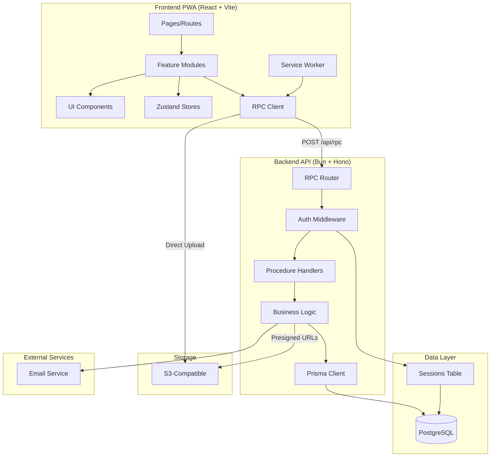

# Building Block View

## Components



**Component Interactions**:
1. **User** → **Pages** → **Feature Modules** → **RPC Client** → **Backend API**
2. **Backend API** → **Business Logic** → **Prisma** → **PostgreSQL**
3. **Frontend** → **Direct S3 Upload** (via presigned URLs)
4. **Service Worker** → **Offline Queue** → **Sync on Reconnect**

## Directory Map

**Complete Monorepo Structure** (All NEW - greenfield implementation):

```
vrss/                                    # Root monorepo
├── apps/
│   ├── api/                            # Backend API (Bun + Hono)
│   │   ├── src/
│   │   │   ├── index.ts                # Server entry point
│   │   │   ├── rpc/
│   │   │   │   ├── index.ts            # RPC router setup
│   │   │   │   └── routers/            # Procedure routers
│   │   │   │       ├── auth.ts         # Authentication procedures
│   │   │   │       ├── user.ts         # User/profile procedures
│   │   │   │       ├── post.ts         # Post CRUD procedures
│   │   │   │       ├── feed.ts         # Feed & algorithm procedures
│   │   │   │       ├── social.ts       # Follow/friend procedures
│   │   │   │       ├── discovery.ts    # Search/discovery procedures
│   │   │   │       ├── message.ts      # Messaging procedures
│   │   │   │       ├── notification.ts # Notification procedures
│   │   │   │       ├── media.ts        # Media upload procedures
│   │   │   │       └── settings.ts     # Account settings procedures
│   │   │   ├── features/               # Business logic modules
│   │   │   │   ├── auth/               # Auth domain logic
│   │   │   │   ├── user/               # User domain logic
│   │   │   │   ├── post/               # Post domain logic
│   │   │   │   ├── feed/               # Feed algorithm logic
│   │   │   │   ├── social/             # Social graph logic
│   │   │   │   ├── message/            # Messaging logic
│   │   │   │   ├── notification/       # Notification logic
│   │   │   │   └── media/              # Media/storage logic
│   │   │   ├── middleware/
│   │   │   │   ├── auth.ts             # Better-auth middleware
│   │   │   │   ├── rateLimit.ts        # Rate limiting
│   │   │   │   ├── validation.ts       # Input validation (Zod)
│   │   │   │   └── errorHandler.ts     # Global error handling
│   │   │   ├── lib/
│   │   │   │   ├── prisma.ts           # Prisma client init
│   │   │   │   ├── auth.ts             # Better-auth config
│   │   │   │   ├── s3.ts               # S3 client
│   │   │   │   └── email.ts            # Email service
│   │   │   └── utils/
│   │   │       ├── pagination.ts       # Cursor pagination
│   │   │       ├── validation.ts       # Validation helpers
│   │   │       └── errors.ts           # Error classes
│   │   ├── prisma/
│   │   │   ├── schema.prisma           # Database schema
│   │   │   ├── migrations/             # Migration files
│   │   │   └── seed.ts                 # Database seeding
│   │   ├── tests/
│   │   │   ├── unit/                   # Unit tests (Bun Test)
│   │   │   ├── integration/            # Integration tests
│   │   │   └── fixtures/               # Test data
│   │   ├── package.json
│   │   ├── tsconfig.json
│   │   └── Dockerfile
│   │
│   └── web/                            # Frontend PWA (React + Vite)
│       ├── src/
│       │   ├── main.tsx                # React entry point
│       │   ├── App.tsx                 # Root component
│       │   ├── pages/                  # Page components
│       │   │   ├── auth/
│       │   │   │   ├── LoginPage.tsx
│       │   │   │   └── RegisterPage.tsx
│       │   │   ├── home/
│       │   │   │   └── HomePage.tsx    # Feed view
│       │   │   ├── profile/
│       │   │   │   ├── ProfilePage.tsx
│       │   │   │   └── ProfileEditPage.tsx
│       │   │   ├── messages/
│       │   │   │   └── MessagesPage.tsx
│       │   │   ├── notifications/
│       │   │   │   └── NotificationsPage.tsx
│       │   │   ├── discover/
│       │   │   │   └── DiscoverPage.tsx
│       │   │   └── settings/
│       │   │       └── SettingsPage.tsx
│       │   ├── features/               # Feature modules
│       │   │   ├── auth/
│       │   │   │   ├── components/     # Auth-specific components
│       │   │   │   ├── hooks/          # useLogin, useRegister
│       │   │   │   └── stores/         # Auth state (Zustand)
│       │   │   ├── feed/
│       │   │   │   ├── components/     # FeedView, PostCard, FeedBuilder
│       │   │   │   ├── hooks/          # useFeed, useInfiniteFeed
│       │   │   │   └── stores/         # Feed state
│       │   │   ├── profile/
│       │   │   │   ├── components/     # ProfileView, ProfileEditor, StyleEditor, SectionManager
│       │   │   │   ├── hooks/          # useProfile, useProfileUpdate
│       │   │   │   └── stores/         # Profile editing state
│       │   │   ├── post/
│       │   │   │   ├── components/     # PostCreate, PostDisplay (text, image, video, song)
│       │   │   │   └── hooks/          # usePost, usePostCreate
│       │   │   ├── social/
│       │   │   │   ├── components/     # FollowButton, FriendsList
│       │   │   │   └── hooks/          # useFollow, useFriends
│       │   │   ├── messages/
│       │   │   │   ├── components/     # MessageList, MessageThread
│       │   │   │   └── hooks/          # useMessages, useConversations
│       │   │   ├── notifications/
│       │   │   │   ├── components/     # NotificationList, NotificationItem
│       │   │   │   └── hooks/          # useNotifications
│       │   │   └── discover/
│       │   │       ├── components/     # SearchBar, DiscoveryFeed, AlgorithmBuilder
│       │   │       └── hooks/          # useSearch, useDiscovery
│       │   ├── components/             # Shared UI components
│       │   │   ├── ui/                 # Shadcn-ui components
│       │   │   ├── layout/             # Layout components (Header, Nav, Footer)
│       │   │   └── common/             # Common components (Button, Input, etc.)
│       │   ├── lib/
│       │   │   ├── api/
│       │   │   │   ├── client.ts       # RPC client implementation
│       │   │   │   └── hooks/          # Generated API hooks
│       │   │   ├── utils/              # Utility functions
│       │   │   └── constants.ts        # App constants
│       │   ├── stores/                 # Global Zustand stores
│       │   │   ├── auth.ts             # Auth state
│       │   │   ├── ui.ts               # UI state (modals, drawers)
│       │   │   └── offline.ts          # Offline sync queue
│       │   ├── hooks/                  # Global React hooks
│       │   │   ├── useAuth.ts
│       │   │   └── useOffline.ts
│       │   ├── routes/                 # Routing configuration
│       │   │   └── index.tsx           # React Router setup
│       │   ├── styles/                 # Global styles
│       │   │   ├── globals.css
│       │   │   └── tailwind.css
│       │   └── public/                 # Public assets
│       │       ├── manifest.json       # PWA manifest
│       │       └── sw.js               # Service worker
│       ├── tests/
│       │   ├── unit/                   # Component tests (Vitest)
│       │   ├── integration/            # Integration tests
│       │   └── e2e/                    # E2E tests (Playwright)
│       │       ├── auth.spec.ts
│       │       ├── feed.spec.ts
│       │       ├── profile.spec.ts
│       │       └── offline.spec.ts
│       ├── package.json
│       ├── tsconfig.json
│       ├── vite.config.ts              # Vite + PWA plugin config
│       ├── tailwind.config.js
│       └── Dockerfile
│
├── packages/                           # Shared packages
│   ├── api-contracts/                  # Shared TypeScript types
│   │   ├── src/
│   │   │   ├── index.ts
│   │   │   ├── procedures/             # RPC procedure types
│   │   │   │   ├── auth.ts
│   │   │   │   ├── user.ts
│   │   │   │   ├── post.ts
│   │   │   │   ├── feed.ts
│   │   │   │   ├── social.ts
│   │   │   │   ├── discovery.ts
│   │   │   │   ├── message.ts
│   │   │   │   ├── notification.ts
│   │   │   │   ├── media.ts
│   │   │   │   └── settings.ts
│   │   │   └── types/                  # Shared domain types
│   │   │       ├── user.ts
│   │   │       ├── post.ts
│   │   │       ├── feed.ts
│   │   │       └── common.ts
│   │   ├── package.json
│   │   └── tsconfig.json
│   │
│   └── config/                         # Shared configs
│       ├── eslint-config/
│       │   └── index.js
│       └── typescript-config/
│           ├── base.json
│           ├── nextjs.json
│           └── react.json
│
├── docs/                               # Documentation (CREATED)
│   ├── architecture/                   # Architecture docs
│   ├── specs/001-vrss-social-platform/ # This spec
│   ├── api-*.md                        # API docs
│   ├── frontend-*.md                   # Frontend docs
│   └── SECURITY_*.md                   # Security docs
│
├── docker/                             # Docker configuration
│   ├── db/
│   │   ├── init/                       # Database init scripts
│   │   └── postgresql.conf
│   └── nginx/
│       └── conf.d/
│
├── scripts/                            # Utility scripts
│   ├── dev-setup.sh                    # One-command setup
│   └── health-check.sh                 # Health verification
│
├── docker-compose.yml                  # Development environment
├── docker-compose.prod.yml             # Production environment
├── Makefile                            # Development commands
├── turbo.json                          # Turborepo config
├── package.json                        # Root package.json
├── .env.example                        # Environment template
└── README.md                           # Project readme
```

**Key Directories**:
- `/apps/api/src/rpc/routers/`: **10 RPC procedure routers** (one per domain)
- `/apps/api/src/features/`: **Business logic** organized by domain
- `/apps/web/src/features/`: **Frontend features** with components, hooks, stores
- `/packages/api-contracts/`: **Shared types** for end-to-end type safety
- `/docs/`: **Complete documentation** from specialist agents

## Interface Specifications

**Note**: Interfaces can be documented by referencing external documentation files OR specified inline. Choose the approach that best fits your project's documentation structure.

### Interface Documentation References

```yaml
# Reference existing interface documentation
interfaces:
  - name: "Database Schema"
    doc: @docs/specs/001-vrss-social-platform/DATABASE_SCHEMA.md
    relevance: CRITICAL
    sections: [all_19_tables, indexes, relationships, triggers]
    why: "Complete data model with 19 PostgreSQL tables for the platform"

  - name: "Data Storage Documentation"
    doc: @docs/specs/001-vrss-social-platform/DATA_STORAGE_DOCUMENTATION.md
    relevance: CRITICAL
    sections: [storage_architecture, application_models, quota_management, media_storage]
    why: "Application data models, storage quotas (50MB free, 1GB+ paid), and S3 integration"

  - name: "RPC API Architecture"
    doc: @docs/API.md
    relevance: CRITICAL
    sections: [all_procedures, type_contracts, error_handling, file_uploads]
    why: "Single endpoint RPC pattern with 50+ procedures across 10 routers"

  - name: "Integration Points"
    doc: @docs/ARCHITECTURE.md
    relevance: CRITICAL
    sections: [component_communication, s3_uploads, better_auth_integration, data_flows]
    why: "System boundaries, inter-component communication, and external service integrations"

  - name: "Frontend Data Models"
    doc: @docs/DATA_MODEL.md
    relevance: HIGH
    sections: [zustand_stores, tanstack_queries, component_interfaces, state_patterns]
    why: "Frontend state management with Zustand and TanStack Query, component prop interfaces"

  - name: "Frontend Architecture"
    doc: @docs/FRONTEND.md
    relevance: HIGH
    sections: [pwa_setup, state_management, routing, offline_strategy]
    why: "Complete PWA architecture with React, TypeScript, and offline-first patterns"

  - name: "Security Design"
    doc: @docs/AUTHENTICATION.md
    relevance: CRITICAL
    sections: [authentication_flows, session_management, authorization, data_protection]
    why: "Better-auth integration with session-based authentication and security patterns"
```

### Data Storage Changes

```yaml
# PostgreSQL 16 database with 19 tables (all NEW for MVP)
# Complete schema documented in DATABASE_SCHEMA.md

Users & Authentication:
  Table: users
    Columns: id (uuid), username (unique), email (unique), password_hash, status, created_at, updated_at
    Indexes: idx_users_username, idx_users_email, idx_users_status

  Table: user_profiles
    Columns: user_id (fk), display_name, bio, avatar_media_id, visibility, profile_config (jsonb), created_at, updated_at
    Indexes: idx_user_profiles_user_id, idx_user_profiles_visibility
    JSONB Schema: {background, music, style: {colors, fonts}, layout: {sections}}

Content:
  Table: posts
    Columns: id (uuid), author_id (fk), type (enum), content (text), media_ids (uuid[]), visibility (enum), likes_count, comments_count, reposts_count, created_at, updated_at, deleted_at
    Indexes: idx_posts_author_id, idx_posts_type, idx_posts_visibility, idx_posts_created_at (desc), idx_posts_deleted_at

  Table: post_media
    Columns: id (uuid), owner_id (fk), post_id (fk), type (enum), url (text), size_bytes (bigint), mime_type, metadata (jsonb), created_at, deleted_at
    Indexes: idx_post_media_owner_id, idx_post_media_post_id

Social Interactions:
  Table: user_follows
    Columns: follower_id (fk), following_id (fk), created_at
    Indexes: idx_user_follows_follower, idx_user_follows_following, unique_follow (follower_id, following_id)

  Table: friendships
    Columns: id (uuid), user1_id (fk), user2_id (fk), created_at
    Indexes: idx_friendships_user1, idx_friendships_user2
    Note: Auto-created on mutual follow

  Table: post_interactions
    Columns: id (uuid), user_id (fk), post_id (fk), type (enum: like/bookmark/share), created_at
    Indexes: idx_interactions_user_post, idx_interactions_post_type, unique_interaction (user_id, post_id, type)

  Table: comments
    Columns: id (uuid), post_id (fk), author_id (fk), content (text), parent_comment_id (fk, nullable), created_at, updated_at, deleted_at
    Indexes: idx_comments_post_id, idx_comments_author_id, idx_comments_parent_id

  Table: reposts
    Columns: id (uuid), user_id (fk), post_id (fk), comment (text, nullable), created_at
    Indexes: idx_reposts_user_id, idx_reposts_post_id, unique_repost (user_id, post_id)

Profile Customization:
  Table: profile_sections
    Columns: id (uuid), user_id (fk), type (enum), title (text), config (jsonb), order (int), created_at, updated_at
    Indexes: idx_profile_sections_user_id, idx_profile_sections_order

  Table: section_content
    Columns: id (uuid), section_id (fk), content_type (enum), content (jsonb), order (int)
    Indexes: idx_section_content_section_id

Custom Feeds:
  Table: custom_feeds
    Columns: id (uuid), user_id (fk), name (text), description (text), is_default (boolean), created_at, updated_at
    Indexes: idx_custom_feeds_user_id, idx_custom_feeds_is_default

  Table: feed_filters
    Columns: id (uuid), feed_id (fk), type (enum), operator (enum), value (jsonb), order (int)
    Indexes: idx_feed_filters_feed_id, idx_feed_filters_order

Messaging:
  Table: conversations
    Columns: id (uuid), participant_ids (uuid[]), last_message_at, created_at, updated_at
    Indexes: idx_conversations_participants (GIN), idx_conversations_last_message

  Table: messages
    Columns: id (uuid), conversation_id (fk), sender_id (fk), content (text), read_by (uuid[]), created_at
    Indexes: idx_messages_conversation_id, idx_messages_sender_id, idx_messages_created_at

Notifications:
  Table: notifications
    Columns: id (uuid), user_id (fk), type (enum), actor_id (fk), target_id (uuid, nullable), content (text), read (boolean), created_at
    Indexes: idx_notifications_user_id, idx_notifications_read, idx_notifications_created_at

Storage & Subscriptions:
  Table: storage_usage
    Columns: user_id (fk, pk), used_bytes (bigint), quota_bytes (bigint), last_calculated_at, updated_at
    Indexes: idx_storage_usage_user_id (unique)
    Note: Updated via database triggers on post_media operations

  Table: subscription_tiers
    Columns: id (uuid), name (text), storage_gb (int), price_cents (int), features (jsonb)
    Data: Free (50MB), Basic (1GB), Pro (5GB), Premium (10GB)

  Table: user_subscriptions
    Columns: id (uuid), user_id (fk), tier_id (fk), status (enum), started_at, expires_at, created_at
    Indexes: idx_user_subscriptions_user_id, idx_user_subscriptions_status

Lists:
  Table: user_lists
    Columns: id (uuid), user_id (fk), name (text), description (text), visibility (enum), created_at, updated_at
    Indexes: idx_user_lists_user_id, idx_user_lists_visibility

  Table: list_members
    Columns: list_id (fk), member_user_id (fk), added_at
    Indexes: idx_list_members_list_id, idx_list_members_member_id, unique_list_member (list_id, member_user_id)

# Database Triggers (auto-update counters and storage)
Triggers:
  - update_post_likes_count: ON post_interactions (AFTER INSERT/DELETE)
  - update_post_comments_count: ON comments (AFTER INSERT/DELETE)
  - update_post_reposts_count: ON reposts (AFTER INSERT/DELETE)
  - update_storage_usage: ON post_media (AFTER INSERT/DELETE)

# Storage Quota Management
Storage_Limits:
  Free_Tier: 50MB (52,428,800 bytes)
  Basic_Tier: 1GB (1,073,741,824 bytes)
  Pro_Tier: 5GB (5,368,709,120 bytes)
  Premium_Tier: 10GB (10,737,418,240 bytes)

Media_Storage:
  Provider: S3-compatible storage (AWS S3 or compatible)
  Bucket_Structure: /media/{user_id}/{media_id}/{filename}
  CDN: CloudFront for fast global delivery
  File_Types: image/*, video/*, audio/*
  Max_File_Size: 100MB per file

# Reference detailed schema documentation
schema_doc: @docs/specs/001-vrss-social-platform/DATABASE_SCHEMA.md
storage_doc: @docs/specs/001-vrss-social-platform/DATA_STORAGE_DOCUMENTATION.md
```

### Internal API Changes

```yaml
# RPC-style API with single endpoint pattern (all NEW for MVP)
# Complete API documented in api-architecture.md

RPC Endpoint: POST /api/rpc
  Pattern: Single endpoint with procedure-based routing
  Description: All API calls routed through unified RPC endpoint using procedure names
  Authentication: Session-based via Better-auth (Cookie: vrss_session or Header: Authorization Bearer)

Request Structure:
  Format: JSON
  Schema:
    procedure: string  # e.g., "user.register", "post.create"
    input: object      # Typed input payload specific to procedure
    context:
      correlationId: string (optional)
      clientVersion: string (optional)

Response Structure (Success):
  success: true
  data: object       # Typed output specific to procedure
  metadata:
    timestamp: number
    requestId: string

Response Structure (Error):
  success: false
  error:
    code: number     # 1000-9999 range
    message: string
    details: object (optional)
    stack: string (development only)
  metadata:
    timestamp: number
    requestId: string

Procedure Routers (10 routers, 50+ procedures):
  auth: [register, login, getSession, logout]
  user: [getProfile, updateProfile, updateStyle, updateSections]
  post: [create, getById, update, delete, getComments]
  feed: [getFeed, createFeed, updateFeed]
  social: [follow, unfollow, getFollowers, getFollowing, sendFriendRequest, respondToFriendRequest]
  discovery: [searchUsers, getDiscoverFeed]
  message: [sendMessage, getConversations, getMessages]
  notification: [getNotifications, markAsRead]
  media: [initiateUpload, completeUpload, getStorageUsage, deleteMedia]
  settings: [updateAccount, updatePrivacy, deleteAccount]

Type Contracts:
  Location: /packages/api-contracts/
  Purpose: End-to-end type safety between frontend and backend
  Strategy: Shared TypeScript types with namespace pattern
  Key_Files:
    - /packages/api-contracts/src/index.ts (procedure definitions, domain entities)
    - /packages/api-contracts/src/errors.ts (error codes, RPCError class)
    - /packages/api-contracts/src/types.ts (common types)

Error Codes:
  Authentication: 1000-1099 (UNAUTHORIZED, INVALID_CREDENTIALS, SESSION_EXPIRED, INVALID_TOKEN)
  Authorization: 1100-1199 (FORBIDDEN, INSUFFICIENT_PERMISSIONS)
  Validation: 1200-1299 (VALIDATION_ERROR, INVALID_INPUT, MISSING_REQUIRED_FIELD, INVALID_FORMAT)
  Resources: 1300-1399 (NOT_FOUND, RESOURCE_NOT_FOUND, USER_NOT_FOUND, POST_NOT_FOUND)
  Conflicts: 1400-1499 (CONFLICT, DUPLICATE_USERNAME, DUPLICATE_EMAIL, ALREADY_FOLLOWING)
  Rate_Limiting: 1500-1599 (RATE_LIMIT_EXCEEDED, TOO_MANY_REQUESTS)
  Storage: 1600-1699 (STORAGE_LIMIT_EXCEEDED, INVALID_FILE_TYPE, FILE_TOO_LARGE)
  Server: 1900-1999 (INTERNAL_SERVER_ERROR, DATABASE_ERROR, EXTERNAL_SERVICE_ERROR)
  Unknown: 9999 (UNKNOWN_ERROR)

Pagination:
  Pattern: Cursor-based pagination
  Parameters: limit (default 20, max 100), cursor (opaque token)
  Response: items[], nextCursor, hasMore

Rate Limiting:
  Strategy: Per-user per-procedure limits (Redis in production)
  Limits:
    Default: 60 requests/minute
    auth.login: 5 requests/minute
    auth.register: 3 requests/hour
    post.create: 10 requests/minute
    media.initiateUpload: 10 requests/minute

File Upload Strategy:
  Pattern: Two-phase upload with S3 pre-signed URLs
  Phase_1_Initiate: Client calls media.initiateUpload → Server validates → Returns uploadUrl + mediaId
  Phase_2_Upload: Client uploads directly to S3 using pre-signed URL
  Phase_3_Complete: Client calls media.completeUpload → Server validates → Returns media record
  Allowed_Types: image/*, video/*, audio/*
  Storage_Limits: 50MB free, 1GB+ paid

Public Procedures (no auth):
  - auth.register, auth.login
  - user.getProfile, post.getById
  - discovery.searchUsers, discovery.getDiscoverFeed

# Reference comprehensive API documentation
api_doc: @docs/API.md
```

### Application Data Models

```pseudocode
# Backend Data Models (TypeScript with Prisma ORM) - all NEW for MVP

ENTITY: User (NEW)
  FIELDS:
    id: UserId (uuid, branded type)
    username: string (unique, 3-20 chars, alphanumeric + underscore)
    email: string (unique, validated format)
    passwordHash: string (bcrypt hashed)
    status: UserStatus (active | suspended | deleted)
    createdAt: DateTime
    updatedAt: DateTime

  BEHAVIORS:
    register(username, email, password): Promise<User>
    authenticate(email, password): Promise<Session>
    updateProfile(updates): Promise<User>
    isFriend(otherUserId): Promise<boolean>
    getStorageUsage(): Promise<StorageUsage>

  VALIDATIONS:
    username: /^[a-zA-Z0-9_]{3,20}$/
    email: RFC 5322 format
    password: min 8 chars, 1 uppercase, 1 lowercase, 1 number

ENTITY: UserProfile (NEW)
  FIELDS:
    userId: UserId (fk, one-to-one)
    displayName: string
    bio: string (max 500 chars)
    avatarMediaId: MediaId (fk, nullable)
    visibility: ProfileVisibility (public | private | unlisted)
    profileConfig: JSONB {background, music, style, layout}
    createdAt: DateTime
    updatedAt: DateTime

  BEHAVIORS:
    updateStyle(style): Promise<UserProfile>
    updateLayout(sections): Promise<UserProfile>
    updateVisibility(visibility): Promise<UserProfile>

  VALIDATIONS:
    displayName: max 50 chars
    bio: max 500 chars
    visibility: enum check

ENTITY: Post (NEW)
  FIELDS:
    id: PostId (uuid, branded type)
    authorId: UserId (fk)
    type: PostType (text | image | video | song)
    content: string (max 10000 chars)
    mediaIds: MediaId[] (array of uuids)
    visibility: PostVisibility (public | followers | private)
    likesCount: number (denormalized, updated via trigger)
    commentsCount: number (denormalized, updated via trigger)
    repostsCount: number (denormalized, updated via trigger)
    createdAt: DateTime
    updatedAt: DateTime
    deletedAt: DateTime (nullable, soft delete)

  BEHAVIORS:
    create(authorId, data): Promise<Post>
    update(postId, updates): Promise<Post>
    delete(postId): Promise<void>
    like(userId): Promise<void>
    unlike(userId): Promise<void>
    comment(userId, content): Promise<Comment>

  VALIDATIONS:
    content: max 10000 chars
    type: enum check
    visibility: enum check
    mediaIds: max 10 files per post

ENTITY: PostMedia (NEW)
  FIELDS:
    id: MediaId (uuid, branded type)
    ownerId: UserId (fk)
    postId: PostId (fk, nullable until post created)
    type: MediaType (image | video | audio)
    url: string (S3 URL)
    sizeBytes: bigint
    mimeType: string
    metadata: JSONB {width, height, duration, etc.}
    createdAt: DateTime
    deletedAt: DateTime (nullable, soft delete)

  BEHAVIORS:
    initiateUpload(ownerId, metadata): Promise<{uploadUrl, mediaId}>
    completeUpload(mediaId): Promise<PostMedia>
    delete(mediaId): Promise<void>
    extractMetadata(file): Promise<Metadata>

  VALIDATIONS:
    mimeType: allowed types (image/*, video/*, audio/*)
    sizeBytes: max 100MB per file
    owner storage quota: check before upload

ENTITY: CustomFeed (NEW)
  FIELDS:
    id: FeedId (uuid, branded type)
    userId: UserId (fk)
    name: string
    description: string (nullable)
    isDefault: boolean
    filters: FeedFilter[] (related table)
    createdAt: DateTime
    updatedAt: DateTime

  BEHAVIORS:
    create(userId, name, filters): Promise<CustomFeed>
    update(feedId, updates): Promise<CustomFeed>
    delete(feedId): Promise<void>
    execute(pagination): Promise<Post[]>
    buildQuery(filters): SQL

  VALIDATIONS:
    name: max 100 chars
    filters: max 20 filters per feed

ENTITY: StorageUsage (NEW)
  FIELDS:
    userId: UserId (pk)
    usedBytes: bigint
    quotaBytes: bigint
    lastCalculatedAt: DateTime
    updatedAt: DateTime

  BEHAVIORS:
    checkQuota(userId, additionalBytes): Promise<boolean>
    recalculate(userId): Promise<StorageUsage>
    getPercentageUsed(): number
    canUpload(sizeBytes): boolean

  VALIDATIONS:
    usedBytes >= 0
    quotaBytes > 0
    usedBytes <= quotaBytes (enforced before uploads)

ENTITY: Notification (NEW)
  FIELDS:
    id: NotificationId (uuid, branded type)
    userId: UserId (fk)
    type: NotificationType (like | comment | follow | repost | mention)
    actorId: UserId (fk)
    targetId: uuid (nullable, post/comment ID)
    content: string
    read: boolean
    createdAt: DateTime

  BEHAVIORS:
    create(userId, type, actorId, targetId): Promise<Notification>
    markAsRead(notificationIds): Promise<void>
    getUnreadCount(userId): Promise<number>

  VALIDATIONS:
    type: enum check
    content: max 500 chars

# Frontend Data Models (TypeScript with Zustand + TanStack Query)

STORE: AuthStore (Zustand, NEW)
  FIELDS:
    user: User | null
    session: Session | null
    isAuthenticated: boolean

  BEHAVIORS:
    login(email, password): Promise<void>
    logout(): Promise<void>
    refreshSession(): Promise<void>
    setUser(user): void

STORE: UIStore (Zustand, NEW)
  FIELDS:
    theme: Theme (light | dark)
    sidebarOpen: boolean
    activeModal: ModalType | null
    notifications: Toast[]

  BEHAVIORS:
    toggleSidebar(): void
    openModal(type): void
    closeModal(): void
    addToast(toast): void

MODEL: Post (TanStack Query, NEW)
  QUERIES:
    useFeed(feedId, pagination): Query<Post[]>
    usePost(postId): Query<Post>
    useUserPosts(userId, pagination): Query<Post[]>

  MUTATIONS:
    createPost: Mutation<Post, CreatePostInput>
    updatePost: Mutation<Post, UpdatePostInput>
    deletePost: Mutation<void, PostId>
    likePost: Mutation<void, PostId>
    bookmarkPost: Mutation<void, PostId>

MODEL: Profile (TanStack Query, NEW)
  QUERIES:
    useProfile(username): Query<UserProfile>
    useOwnProfile(): Query<UserProfile>

  MUTATIONS:
    updateProfile: Mutation<UserProfile, UpdateProfileInput>
    updateStyle: Mutation<UserProfile, StyleInput>
    updateLayout: Mutation<UserProfile, SectionInput[]>

# Reference domain model documentation
backend_doc: @docs/specs/001-vrss-social-platform/DATA_STORAGE_DOCUMENTATION.md
frontend_doc: @docs/DATA_MODEL.md
```

### Integration Points

```yaml
# Inter-Component Communication (between VRSS components)

From: Frontend_PWA (React + Vite)
To: Backend_API (Bun + Hono)
  - protocol: HTTP/RPC (POST /api/rpc)
  - doc: @docs/api-architecture.md
  - endpoints: [procedure-based routing: user.*, post.*, feed.*, etc.]
  - data_flow: "User action → RPC call → Business logic → Database → Response → UI update"
  - authentication: "Better-auth session cookies (vrss_session)"
  - error_handling: "Structured error codes (1000-9999), user-friendly messages"
  - latency: "150-500ms total (P95)"

From: Backend_API
To: Frontend_PWA
  - protocol: HTTP Response (JSON)
  - doc: @docs/ARCHITECTURE.md
  - data_flow: "Database result → Business logic → JSON response → State update → Re-render"
  - caching: "TanStack Query with stale-while-revalidate"
  - optimistic_updates: "Local state updates before server confirmation"

From: Frontend_PWA
To: Service_Worker
  - protocol: Service Worker API
  - doc: @docs/FRONTEND.md
  - offline_support: "NetworkFirst for API, CacheFirst for static assets"
  - background_sync: "Queue failed operations for retry when online"

From: Backend_API
To: PostgreSQL
  - protocol: Prisma ORM queries (SQL)
  - doc: @docs/specs/001-vrss-social-platform/DATABASE_SCHEMA.md
  - data_flow: "Business logic → Prisma queries → PostgreSQL → Result"
  - connection_pooling: "Max 20 connections per instance"
  - transactions: "ACID guarantees for critical operations"

# External System Integration (third-party services)

S3_Compatible_Storage:
  - doc: @docs/ARCHITECTURE.md
  - sections: [presigned_urls, two_phase_upload, cdn_integration]
  - integration: "Backend generates presigned URL → Frontend uploads directly to S3 → Backend validates completion"
  - critical_data: [media files (images, videos, audio), metadata (size, mime_type, dimensions)]
  - security: "No public bucket access, presigned URLs expire in 1 hour"
  - cdn: "CloudFront for global delivery with cache headers"

Better_Auth:
  - doc: @docs/AUTHENTICATION.md
  - sections: [authentication_flows, session_management, password_hashing]
  - integration: "Database-backed session authentication with secure HTTP-only cookies"
  - critical_data: [user sessions, password hashes (bcrypt), session tokens]
  - session_duration: "7 days with automatic refresh"
  - security: "CSRF protection, secure cookies, rate limiting"

# Data Flow Patterns

Pattern: Create_Post_With_Media
  1. Frontend: User uploads file → media.initiateUpload RPC
  2. Backend: Validate quota → Create pending media record → Generate S3 presigned URL
  3. Frontend: Upload to S3 directly using presigned URL
  4. Frontend: Confirm upload → media.completeUpload RPC
  5. Backend: Validate S3 upload → Mark media as completed → Update storage_usage
  6. Frontend: Create post with mediaIds → post.create RPC
  7. Backend: Create post record with media references
  8. Frontend: Optimistic UI update → Invalidate feed cache → Show success

Pattern: Authentication_Flow
  1. Frontend: User submits login → auth.login RPC
  2. Backend: Validate credentials → Create session → Set session cookie
  3. Frontend: Store user in AuthStore → Redirect to home
  4. Frontend: All subsequent RPC calls include session cookie automatically
  5. Backend: Middleware validates session on protected procedures

Pattern: Real-Time_Notifications (Polling)
  1. Frontend: Poll notification.getNotifications every 30 seconds
  2. Backend: Query unread notifications → Return count + recent items
  3. Frontend: Update badge count → Show toast for new notifications
  4. User clicks notification → Frontend marks as read → notification.markAsRead RPC
  5. Backend: Update read status → Return success

# Integration Documentation
integration_doc: @docs/ARCHITECTURE.md
```

## Implementation Examples

**Purpose**: Provide strategic code examples to clarify complex logic, critical algorithms, or integration patterns. These examples are for guidance, not prescriptive implementation.

**Include examples for**:
- Complex business logic that needs clarification
- Critical algorithms or calculations
- Non-obvious integration patterns
- Security-sensitive implementations
- Performance-critical sections

[NEEDS CLARIFICATION: Are there complex areas that would benefit from code examples? If not, remove this section]

### Example: [Complex Business Logic Name]

**Why this example**: [Explain why this specific example helps clarify the implementation]

```typescript
// Example: Discount calculation with multiple rules
// This demonstrates the expected logic flow, not the exact implementation
function calculateDiscount(order: Order, user: User): Discount {
  // Business rule: VIP users get additional benefits
  const baseDiscount = order.subtotal * getBaseDiscountRate(user.tier);
  
  // Complex rule: Stacking discounts with limits
  const promotionalDiscount = Math.min(
    order.promotions.reduce((sum, promo) => sum + promo.value, 0),
    order.subtotal * MAX_PROMO_PERCENTAGE
  );
  
  // Edge case: Never exceed maximum discount
  return Math.min(
    baseDiscount + promotionalDiscount,
    order.subtotal * MAX_TOTAL_DISCOUNT
  );
}
```

### Example: [Integration Pattern Name]

**Why this example**: [Explain why this pattern is important to document]

```python
# Example: Retry pattern for external service integration
# Shows expected error handling approach
async def call_payment_service(transaction):
    """
    Demonstrates resilient integration pattern.
    Actual implementation may use circuit breaker library.
    """
    for attempt in range(MAX_RETRIES):
        try:
            response = await payment_client.process(transaction)
            if response.requires_3ds:
                # Critical: Handle 3D Secure flow
                return await handle_3ds_flow(response)
            return response
        except TransientError as e:
            if attempt == MAX_RETRIES - 1:
                # Final attempt failed, escalate
                raise PaymentServiceUnavailable(e)
            await exponential_backoff(attempt)
        except PermanentError as e:
            # Don't retry permanent failures
            raise PaymentFailed(e)
```

### Test Examples as Interface Documentation

[NEEDS CLARIFICATION: Can unit tests serve as interface documentation?]

```javascript
// Example: Unit test as interface contract
describe('PromoCodeValidator', () => {
  it('should validate promo code format and availability', async () => {
    // This test documents expected interface behavior
    const validator = new PromoCodeValidator(mockRepository);
    
    // Valid code passes all checks
    const validResult = await validator.validate('SUMMER2024');
    expect(validResult).toEqual({
      valid: true,
      discount: { type: 'percentage', value: 20 },
      restrictions: { minOrder: 50, maxUses: 1 }
    });
    
    // Expired code returns specific error
    const expiredResult = await validator.validate('EXPIRED2023');
    expect(expiredResult).toEqual({
      valid: false,
      error: 'PROMO_EXPIRED',
      message: 'This promotional code has expired'
    });
  });
});
```
