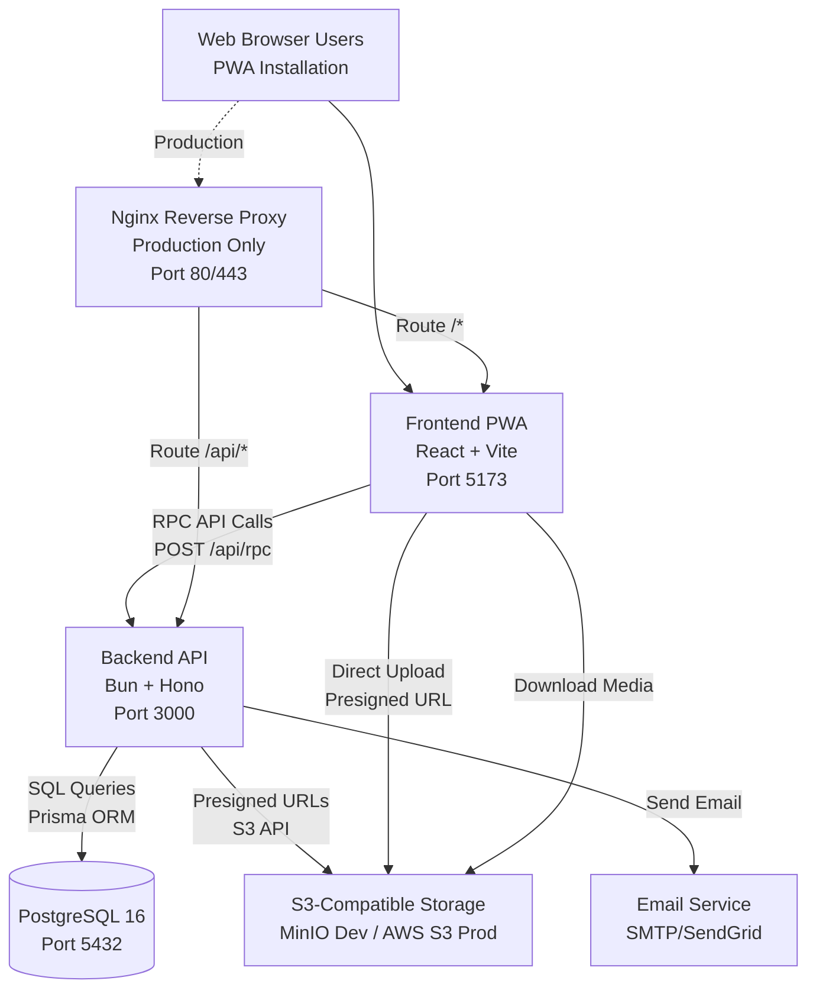

# Implementation Context

**IMPORTANT**: You MUST read and analyze ALL listed context sources to understand constraints, patterns, and existing architecture.

## Required Context Sources

### General Context

```yaml
# Internal documentation and architecture
- doc: docs/architecture/MONOLITH_ARCHITECTURE.md
  relevance: CRITICAL
  why: "Complete monolith architecture design, scalability path"

- doc: docs/architecture/VISUAL_SUMMARY.md
  relevance: HIGH
  why: "Visual diagrams of system architecture"

- doc: docs/architecture/ARCHITECTURE_DECISIONS.md
  relevance: CRITICAL
  why: "11 architecture decision records (ADRs) with rationale"

- doc: docs/specs/001-vrss-social-platform/DATABASE_SCHEMA.md
  relevance: CRITICAL
  why: "Complete PostgreSQL schema (19 tables) with indexes and migrations"

- doc: docs/specs/001-vrss-social-platform/PRD.md
  relevance: CRITICAL
  why: "Product requirements - all features must align with PRD"

- doc: PLAN.md
  relevance: CRITICAL
  why: "Source of truth for MVP requirements and tech stack"

# API and integration documentation
- doc: docs/API.md
  relevance: CRITICAL
  why: "RPC API design with 50+ procedures, type contracts, error handling"

- doc: docs/API.md
  relevance: HIGH
  why: "Implementation examples and testing patterns, daily reference for API usage"

# Frontend architecture
- doc: docs/FRONTEND.md
  relevance: CRITICAL
  why: "PWA design, state management, component patterns"

- doc: docs/FRONTEND.md
  relevance: HIGH
  why: "Detailed component specs, implementation roadmap"

# Security documentation
- doc: docs/AUTHENTICATION.md
  relevance: CRITICAL
  why: "Better-auth integration, security patterns, authorization"

- doc: docs/TESTING.md
  relevance: HIGH
  why: "Security test cases and attack scenarios"

# Testing strategy
- doc: docs/specs/001-vrss-social-platform/TESTING-STRATEGY.md
  relevance: CRITICAL
  why: "Comprehensive testing infrastructure (unit, integration, E2E)"

# Infrastructure
- doc: docs/DOCKER.md
  relevance: HIGH
  why: "Docker Compose setup, containerization strategy"

- doc: docs/INFRASTRUCTURE.md
  relevance: HIGH
  why: "Complete infrastructure specification"

# External framework and library documentation
- url: https://bun.sh/docs
  relevance: HIGH
  sections: [runtime, test, watch]
  why: "Bun runtime features and testing framework"

- url: https://hono.dev/
  relevance: HIGH
  sections: [middleware, context, routing]
  why: "Hono framework patterns for RPC implementation"

- url: https://www.prisma.io/docs
  relevance: HIGH
  sections: [schema, migrations, client]
  why: "Prisma ORM usage and migration patterns"

- url: https://www.better-auth.com/docs
  relevance: HIGH
  sections: [session-management, email-verification]
  why: "Better-auth configuration and session handling"

- url: https://ui.shadcn.com/
  relevance: HIGH
  sections: [components, theming]
  why: "Shadcn-ui component library patterns"

- url: https://vite-pwa-org.netlify.app/
  relevance: MEDIUM
  sections: [service-worker, offline]
  why: "PWA configuration with Vite"
```

### Component: Backend API (Bun + Hono)

```yaml
Location: /apps/api/

# Configuration files
- file: package.json
  relevance: HIGH
  why: "Dependencies (Bun, Hono, Prisma, Better-auth) and scripts"

- file: tsconfig.json
  relevance: MEDIUM
  why: "TypeScript configuration for backend"

- file: prisma/schema.prisma
  relevance: CRITICAL
  why: "Database schema definition - source of truth for data models"

# Core application structure (to be created)
- file: src/index.ts
  relevance: HIGH
  why: "Application entry point, server initialization"

- file: src/rpc/index.ts
  relevance: CRITICAL
  why: "RPC router setup and procedure registration"

- file: src/rpc/routers/*.ts
  relevance: HIGH
  why: "10 procedure routers (auth, user, post, feed, social, discovery, message, notification, media, settings)"

- file: src/middleware/auth.ts
  relevance: CRITICAL
  why: "Better-auth integration and session management"

- file: src/lib/prisma.ts
  relevance: HIGH
  why: "Prisma client initialization and connection pooling"
```

### Component: Frontend PWA (React + Vite)

```yaml
Location: /apps/web/

# Configuration files
- file: package.json
  relevance: HIGH
  why: "Dependencies (React, Vite, Shadcn-ui, TanStack Query, Zustand) and scripts"

- file: tsconfig.json
  relevance: MEDIUM
  why: "TypeScript configuration for frontend"

- file: vite.config.ts
  relevance: HIGH
  why: "Vite build configuration, PWA plugin setup"

- file: tailwind.config.js
  relevance: MEDIUM
  why: "Tailwind CSS configuration for Shadcn-ui"

# Core application structure (to be created)
- file: src/main.tsx
  relevance: HIGH
  why: "Application entry point, React root"

- file: src/lib/api/client.ts
  relevance: CRITICAL
  why: "RPC client implementation with type safety"

- file: src/lib/api/hooks/*.ts
  relevance: HIGH
  why: "Feature-specific API hooks (useFeed, useProfile, etc.)"

- file: src/features/*/
  relevance: HIGH
  why: "Feature modules (auth, feed, profile, messages, notifications, discover)"

- file: src/stores/*.ts
  relevance: HIGH
  why: "Zustand stores for global state (auth, UI, offline queue)"
```

### Component: Shared Packages

```yaml
Location: /packages/

# Shared type contracts
- file: api-contracts/src/index.ts
  relevance: CRITICAL
  why: "TypeScript type definitions shared between frontend and backend"

- file: api-contracts/src/procedures/*.ts
  relevance: CRITICAL
  why: "RPC procedure input/output types for type-safe API calls"

# Shared configuration
- file: config/eslint-config.js
  relevance: LOW
  why: "Shared ESLint rules across packages"

- file: config/typescript-config/
  relevance: LOW
  why: "Shared TypeScript configurations"
```

## Implementation Boundaries

This is a greenfield MVP implementation. All code will be created from scratch.

- **Must Preserve**: N/A (new implementation)
- **Can Modify**: All code and configurations (MVP development)
- **Must Not Touch**: N/A (no legacy systems)
- **Standards to Follow**:
  - Type safety enforced throughout (TypeScript strict mode)
  - Test coverage requirements (80%+ overall, 100% critical paths)
  - Security patterns from `/docs/AUTHENTICATION.md`
  - API contracts defined in `/docs/API.md`
  - Database schema from `/docs/specs/001-vrss-social-platform/DATABASE_SCHEMA.md`
  - Component patterns from `/docs/FRONTEND.md`

## External Interfaces

### System Context Diagram



### Interface Specifications

```yaml
# Inbound Interfaces (what calls this system)
inbound:
  - name: "PWA Frontend (React + Vite)"
    type: HTTPS
    format: RPC (JSON)
    endpoint: "POST /api/rpc"
    authentication: Session (Better-auth cookies)
    doc: @docs/API.md
    data_flow: "All user actions - RPC procedure calls"
    rate_limits: "100 req/min per user, 1000 req/min per procedure"

  - name: "Service Worker (PWA Offline)"
    type: Local HTTP
    format: Cached responses
    authentication: Service Worker Cache
    doc: @docs/FRONTEND.md
    data_flow: "Offline content access, sync queue"

# Outbound Interfaces (what this system calls)
outbound:
  - name: "S3-Compatible Storage (Media)"
    type: HTTPS
    format: S3 API
    authentication: Access Key ID + Secret
    doc: See infrastructure docs
    data_flow: "Media upload/download (images, videos, songs)"
    criticality: HIGH
    operations:
      - Generate presigned URLs (15min expiry)
      - Direct client upload to S3
      - Content-Type validation
      - Storage quota enforcement

  - name: "Email Service (SMTP/SendGrid)"
    type: SMTP/HTTPS
    format: Email/API
    authentication: SMTP credentials or API key
    doc: @docs/AUTHENTICATION.md
    data_flow: "Email verification, password reset notifications"
    criticality: MEDIUM
    operations:
      - Send verification emails
      - Send password reset emails
      - Future: Notification digests

# Data Interfaces
data:
  - name: "PostgreSQL 16 (Primary Database)"
    type: PostgreSQL
    connection: Prisma ORM (connection pooling)
    doc: @docs/specs/001-vrss-social-platform/DATABASE_SCHEMA.md
    data_flow: "All application data persistence"
    schema: "19 tables (users, posts, feeds, messages, etc.)"
    performance:
      - Connection pool: 10-20 connections
      - Query timeout: 30 seconds
      - 30+ optimized indexes

  - name: "Better-auth Session Store"
    type: PostgreSQL (sessions table)
    connection: Better-auth library
    doc: @docs/AUTHENTICATION.md
    data_flow: "User sessions (7-day expiry, sliding window)"

  - name: "S3-Compatible Storage (File System)"
    type: MinIO (dev) / AWS S3 (prod)
    connection: SDK
    doc: See infrastructure docs
    data_flow: "Media files, profile images, post attachments"
    buckets:
      - vrss-media (user uploads)
      - vrss-profile-images (avatars, backgrounds)
    quotas:
      - Free tier: 50MB per user
      - Paid tier: 1GB+ per user
```

## Cross-Component Boundaries

**Monorepo Component Organization:**
- **Backend API** (`/apps/api/`): Owns business logic, database access, auth
- **Frontend PWA** (`/apps/web/`): Owns UI, user interactions, offline capabilities
- **Shared Packages** (`/packages/`): Type contracts, shared configs

**API Contracts:**
- **RPC Procedure Types** (`/packages/api-contracts/`): Public contracts, versioned
- **Breaking Changes**: Require major version bump and migration path
- **Backwards Compatibility**: Maintain for at least one minor version

**Shared Resources:**
- **Database**: Single PostgreSQL instance shared by backend API only
- **S3 Storage**: Shared bucket accessed by backend (presigned URLs) and frontend (direct upload)
- **Session Store**: PostgreSQL sessions table managed by Better-auth

**Team Ownership** (for future scale):
- **Core Team**: All components (MVP phase)
- **Future**: Separate teams for backend, frontend, infra as team grows

**Breaking Change Policy:**
- **Database**: Prisma migrations with rollback strategy
- **API**: Version procedures (`v2.user.getProfile`) if breaking changes
- **Frontend**: Update shared types atomically with backend changes (monorepo benefit)

## Project Commands

```bash
# ============================================
# MONOREPO - ROOT LEVEL
# ============================================
Location: /

# Environment Setup (One-time)
./scripts/dev-setup.sh              # Automated setup: creates .env, generates secrets, builds containers

# Docker Infrastructure (Daily Development)
make start                          # Start all services (DB, backend, frontend, nginx)
make stop                           # Stop all services
make restart                        # Restart all services
make logs                           # View logs from all services
make logs SERVICE=api               # View logs from specific service
make health                         # Run health checks on all services
make clean                          # Stop and remove all containers, volumes, networks

# Docker - Individual Services
docker-compose up -d db             # Start only PostgreSQL
docker-compose up -d api            # Start only backend API
docker-compose up -d web            # Start only frontend
docker-compose up -d nginx          # Start only nginx (production mode)

# Monorepo Package Management
bun install                         # Install all dependencies (root + workspaces)
bun add <package> -w                # Add dependency to root workspace
turbo build                         # Build all packages in dependency order
turbo dev                           # Run dev mode for all packages
turbo test                          # Run tests for all packages
turbo clean                         # Clean all build artifacts

# ============================================
# BACKEND API (/apps/api/)
# ============================================
Location: /apps/api/

# Development
cd apps/api
bun install                         # Install backend dependencies
bun run dev                         # Start backend in watch mode (hot reload)
bun run build                       # Build backend for production
bun run start                       # Start production build

# Testing (Bun Test + Testcontainers)
bun test                            # Run all tests
bun test --watch                    # Run tests in watch mode
bun test tests/unit/                # Run only unit tests
bun test tests/integration/         # Run only integration tests
bun run test:coverage               # Run tests with coverage report
bun run test:db                     # Run database-specific tests (Testcontainers)

# Database Operations (Prisma)
bunx prisma generate                # Generate Prisma Client from schema
bunx prisma migrate dev             # Create and apply migration (development)
bunx prisma migrate deploy          # Apply pending migrations (production)
bunx prisma migrate reset           # Reset database and apply all migrations
bunx prisma db seed                 # Seed database with test data
bunx prisma studio                  # Open Prisma Studio (database GUI)
bunx prisma format                  # Format prisma/schema.prisma file

# Database Direct Access (via Docker)
make db-shell                       # Open PostgreSQL psql shell
make db-backup                      # Create database backup
make db-restore BACKUP=filename     # Restore from backup
make db-logs                        # View database logs

# Code Quality
bun run lint                        # Run ESLint
bun run lint:fix                    # Fix auto-fixable lint issues
bun run typecheck                   # Run TypeScript type checking
bun run format                      # Format code with Prettier

# ============================================
# FRONTEND PWA (/apps/web/)
# ============================================
Location: /apps/web/

# Development
cd apps/web
bun install                         # Install frontend dependencies
bun run dev                         # Start Vite dev server (HMR enabled)
bun run build                       # Build for production
bun run preview                     # Preview production build locally

# Testing (Vitest + React Testing Library + Playwright)
bun test                            # Run unit/component tests (Vitest)
bun test --watch                    # Run tests in watch mode
bun test --ui                       # Open Vitest UI
bun run test:coverage               # Run tests with coverage
bun run test:e2e                    # Run E2E tests (Playwright)
bun run test:e2e:ui                 # Run E2E tests with UI
bunx playwright codegen             # Generate Playwright tests

# PWA Testing
bun run build && bun run preview    # Test PWA in production mode
# Then open browser DevTools > Application > Service Workers

# Code Quality
bun run lint                        # Run ESLint
bun run lint:fix                    # Fix auto-fixable lint issues
bun run typecheck                   # Run TypeScript type checking
bun run format                      # Format code with Prettier

# ============================================
# SHARED PACKAGES (/packages/)
# ============================================

# API Contracts (/packages/api-contracts/)
cd packages/api-contracts
bun run build                       # Build TypeScript types
bun run typecheck                   # Type check contracts

# ============================================
# E2E TESTING (Full System)
# ============================================
Location: /

# E2E Test Execution
make test-e2e                       # Run full E2E test suite
bun run test:e2e:ci                 # Run E2E in CI mode (headless)
bunx playwright test                # Run Playwright tests
bunx playwright test --headed       # Run with browser UI
bunx playwright test --debug        # Run in debug mode
bunx playwright show-report         # View test report

# ============================================
# PRODUCTION DEPLOYMENT
# ============================================

# Build Production Images
docker-compose -f docker-compose.prod.yml build

# Deploy to Production
make prod-build                     # Build production Docker images
make prod-up                        # Start production services
make prod-logs                      # View production logs
make prod-health                    # Check production health

# Database Migrations (Production)
make prod-migrate                   # Run Prisma migrations in production
make prod-db-backup                 # Backup production database

# ============================================
# TROUBLESHOOTING & MAINTENANCE
# ============================================

# Reset Everything
make clean                          # Remove all containers and volumes
bun install                         # Reinstall dependencies
./scripts/dev-setup.sh              # Re-run setup

# View Logs
make logs                           # All services
docker-compose logs -f api          # Backend API only
docker-compose logs -f web          # Frontend only
docker-compose logs -f db           # Database only

# Database Issues
make db-shell                       # Access PostgreSQL directly
bunx prisma migrate reset           # Reset and recreate database
bunx prisma db push                 # Sync schema without migration

# Clear Caches
turbo clean                         # Clean turbo cache
rm -rf node_modules && bun install  # Fresh dependency install
docker system prune -a              # Clean Docker caches (use with caution)

# ============================================
# DEVELOPMENT WORKFLOW (Typical Day)
# ============================================

# Morning startup
make start                          # Start all services

# Work on backend
cd apps/api
bun run dev                         # Hot reload enabled
bun test --watch                    # Tests in watch mode

# Work on frontend (separate terminal)
cd apps/web
bun run dev                         # HMR enabled
bun test --watch                    # Tests in watch mode

# Run E2E tests before committing
bun run test:e2e                    # Full E2E suite

# End of day
make stop                           # Stop all services
```
